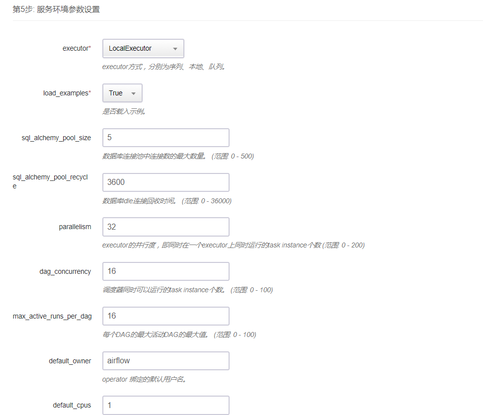
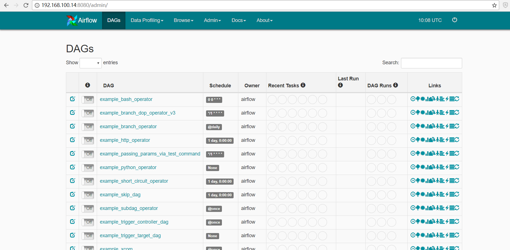

# Airflow on QingCloud 用户手册  

<extoc></extoc>

## 1.描述  

`Airflow on QingCloud` 将 Airflow 通过云应用的形式在 QingCloud AppCenter 部署，具有如下特性：

- 目前提供单机版和集群版（后续开发中）2个版本，分别满足不同作业数量级别的需求。  
- 单机版提供本地执行器，采用伪分布模式，通过在本地用 python 的多进程库从而达到以多进程的方式调度和运行作业的效果。如果只有适量的作业数量，可以采取这种方式。    
- 集群版提供分布式执行器，采用分布式模式，集群按照计划和负载均衡调度作业，并在作业集群上接收和运行作业。  
作为高度可伸缩的分布式架构，集群版适合作业数量大系统负载重的需求。
- Airflow on QingCloud 支持 Airflow v1.8.0版本。
- 提供实时监控、健康检查、日志自动清理等功能，方便用户运维。
- 一键部署，开箱即用。

## 2.简介  

- [Airflow](https://airflow.apache.org/project.html) 是Airbnb开源的data pipeline调度和监控工作流的平台，用于用来创建、监控和调整data pipeline（ETL）。   
- Airflow是一个任务调度的工具，通过python来编写DAG来描述配置工作流，airflow就会根据配置,定时的执行任务。
- 这个平台拥有和 Hive、Presto、MySQL、HDFS、Postgres和S3交互的能力，并且提供了钩子使得系统拥有很好地扩展性。
- 除了一个命令行界面，该工具还提供了一个基于Web的用户界面让您可以可视化管道的依赖关系、监控进度、触发任务等。   
- 不同于其它调度器使用XML或者text文件方式定义工作流,airflow通过python文件定义工作流，用户可以通过代码完全自定义自己的工作流。   
类似的产品有：Azkaban (LinkedIn)、 Luigui (Spotify) 和 Oozie (Yahoo)


## 3.部署

目前 `Airflow on QingCloud` 提供单机版版本，后续会尽快推出集群版：

- 单机版版本号为： Airflow1.8.0-Standalone-V1.0.0  

对于单机版，对 Airflow 进行一个适度的安装，包括如下组件：  
Airflow Web服务器  
Airflow 调度器  
元数据库（Postgresql DB）  
上述两个组件（Web服务器和调度器）运行于一个单机上，而数据库运行在一个共享数据库实例中。  

对于集群版（开发中），用于可扩展的生产环境中，Airflow 含有以下组件：  
一个元数据库（MySQL或Postgres）  
一组Airflow工作节点  
一个调节器（RabbitMQ）  
一个Airflow Web服务器    

两个版本的创建步骤类似，以下以单机版为例具体说明创建步骤。

### 第1步：基本设置  


根据自己的需求填写 `应用名称` 和 `应用描述`，选择`版本`为单机版（Airflow1.8.0-Standalone-V1.0.0）。

### 第2步：Airflow节点设置  


CPU，内存，节点类型，磁盘大小根据自己实际需求进行选择即可，生产环境建议磁盘使用超高性能型。

### 第3步：网络设置  


出于安全考虑，所有的集群都需要部署在私有网络中，选择自己创建的网络中。

### 第4步：依赖服务设置  


Airflow 的 metadata存储在 postgresql 数据库中,需要选择依赖的数据库服务器集群。

### 第5步：Airflow 参数设置  


界面提供的参数大部分和 Airflow 性能相关，如果需要调整相关参数，可以按照自己的实际需求配置和调整相关参数，修改部分参数会导致 Airflow 服务重启，具体可以参考参数说明。
>对于executor参数设置的说明:  
单机版可以用于测试开发环境，需要设置executor为SequentialExecutor，表示单进程顺序执行DAG中的任务，通常只用于测试。   
当单机版中参数executor设置为LocalExecutor，表示多进程本地执行，可用于适量作业的生产环境。  
集群版中参数executor设置为CeleryExecutor，表示使用 celery 作为执行器，可以分布式地多机跑任务，可用于作业数量大的生产环境。  


#### 第6步: 用户协议  

阅读并同意青云 AppCenter 用户协议之后即可开始部署应用。

## 4.集群使用

### 4.1查看集群信息  

在集群创建完毕后，可以在控制台 `Appcenter -> 集群列表` 标签下看到目前已经创建的集群信息。

 集群列表


 集群的详细信息


 集群基础资源监控信息
   

### 4.2 修改配置参数  

  点击`配置参数`可以修改 Airflow 参数，修改参数会导致 Airflow 服务重启，参数具体含义可以参考 Airflow 参数说明。
  

### 4.3 扩容集群  

  点击 `扩容集群` ， 可以在集群性能不足时提高集群的配置：
  

## 5.Airflow 的使用  

### 5.1 登录 Airflow web UI

Airflow提供了一个基于Web的用户界面让用户可以可视化管道的依赖关系、监控进度、触发任务等信息。  
部署好`Airflow on QingCloud`之后，连入内网，输入如下 url 进入 Airflow web UI 界面。  
http://[airflow所在的IP地址]:8080/admin/   
   

默认的用户名密码是admin/admin，登录之后的界面如下所示。
   


### 5.2 Dag的开发测试
在 `Airflow on QingCloud` 开发测试环境下完成DAG文件的开发测试步骤如下。
- 写任务脚本(.py)
- 测试任务脚本(command)
- WebUI 自查

DAG (Directed Acyclic Graph)有向非循环图，表示的是一些任务的集合，描述了任务之间的依赖关系，以及整个 DAG 的一些属性， 比如起止时间，执行周期，重试策略等等。  
airflow 采用 Python 定义 DAG,通常一个.py 文件就是一个 DAG 。

在部署的时候，如果参数是否载入示例选择是，在web界面会出现airflow内置的示例dag，通过学习这些dag的源码可掌握operator、调度、任务依赖等知识，能快速入门。

 `Airflow on QingCloud`中，DAGS文件存放的目录是/data/airflow/dags目录，为了方便用户使用，初始化的时候在该目录下放置了一个 hello_world.py 的示例Dag文件。  

 在该目录下编写自己的DAG文件定义自己的数据流逻辑代码，编码完成后，airflow 提供一系列的命令支持开发测试。

```
#进入DAGS目录
root@i-gpp3y0no:/data/airflow/dags# cd /
root@i-gpp3y0no:/# cd /data/airflow/dags
root@i-gpp3y0no:/data/airflow/dags#
root@i-gpp3y0no:/data/airflow/dags# ls
hello_world.py  hello_world.pyc

#测试 python 代码的正确性
root@i-gpp3y0no:/data/airflow/dags# python hello_world.py

#查看 DAG 是否成功加载
root@i-gpp3y0no:/data/airflow/dags# airflow list_dags

#查看 DAG 的下 task 的树形结构是否正确
root@i-gpp3y0no:/data/airflow/dags# airflow list_tasks hello_world_dag --tree
<Task(PythonOperator): hello_task>
    <Task(BashOperator): date_task>
<Task(BashOperator): sleep_task>
    <Task(BashOperator): date_task>

#测试 DAG 的下 task 运行是否正确，不需要依赖满足
root@i-gpp3y0no:/data/airflow/dags# airflow test hello_world_dag hello_task 20180111
root@i-gpp3y0no:/data/airflow/dags# airflow test hello_world_dag sleep_task 20180111
root@i-gpp3y0no:/data/airflow/dags# airflow test hello_world_dag date_task 20180111

# 对dag进行某段时间内的完整测试，会自动解析依赖关系，按依赖顺序执行
root@i-gpp3y0no:/data/airflow/dags# airflow backfill hello_world_dag -s 2018-01-01 -e 2018-01-11

```
关于 Airflow 的 DAG 开发请参考官方文档获取更多相关知识。

### 5.3 Dag的运维管理

如果开发的 DAG 通过测试，就可以在生产环境下运行自定义的DAG了。    
在开发测试环境下准备好 DAG 文件之后，需要把开发好的 DAG 文件上传到生产环境下的 DAGS目录。    
`Airflow on QingCloud` 默认开启了 FTP 服务，用户名是dags，密码是dags.2018!(可以使用 ftp 图形化工具方便上传下载文件)。  
使用FTP工具登录之后，可以上传开发好的 DAG 文件到 ftp目录下的/dags目录。

```
#登录ftp server
ftp 192.168.100.16
dags/dags.2018!
ls
exit

ftp> !    
ls  -- 显示当前目录下的文件
cd dags
touch testdag
exit  -- 退出终端，返回FTP命令行

ftp> lcd
Local directory now /root
ftp> put testdag tesetdag
```

上传之后，重启集群，然后再刷新 Airflow web UI 界面，就可以看到新加的 DAG 文件已经被加载成功了。


为了启动DAG Run，首先打开工作流(off键)，然后单击Trigger Dag按钮(Links 第一个按钮)，最后单击Graph View按钮(Links 第三个按钮)以查看运行进度:


点击 Airflow 的树形图（Tree View）迅速进掌握运行的状态。在下面的图片中，垂直列着的方格表示的是一个DAG在一天里运行的所有任务。所有的方块都是绿色表示运行全部成功！


完成后，你可以单击hello_task，然后单击View Log查看日志。如果一切都按预期工作，日志应该显示一些行。

关于 Airflow 的运维管理请参考官方文档获取更多相关操作。

### 5.4 日志管理

`Airflow on QingCloud` 默认保存用户一周的日志，默认开启了 FTP 服务，您可以通过 FTP 来获取 Airflow 的日志，用户名是dags，密码是dags.2018!(可以使用 ftp 图形化工具方便上传下载文件)。  
日志路径是 ftp 目录下 logs 目录。

```
#登录ftp server
ftp 192.168.100.16
dags/dags.2018!
ls
exit

#wget日志文件
wget ftp://192.168.100.16//data/airflow/logs/airflow-scheduler.out.log --ftp-user=dags --ftp-password=dags.2018!
wget ftp://192.168.100.16//data/airflow/logs/airflowapp.log --ftp-user=dags --ftp-password=dags.2018!

#删除日志文件
ftp 192.168.100.16
ls
cd logs
delete airflowapp.log
mdelete a*
```

关于 `Airflow on QingCloud` 的介绍就到这里
，希望您在 Qingcloud 上使用愉快！
