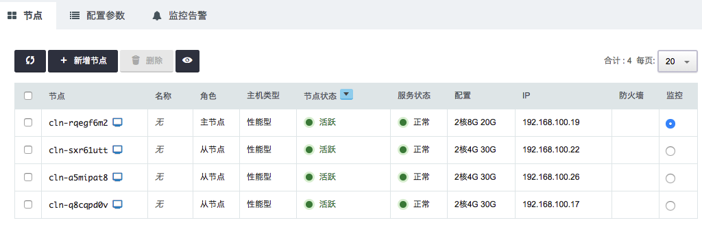
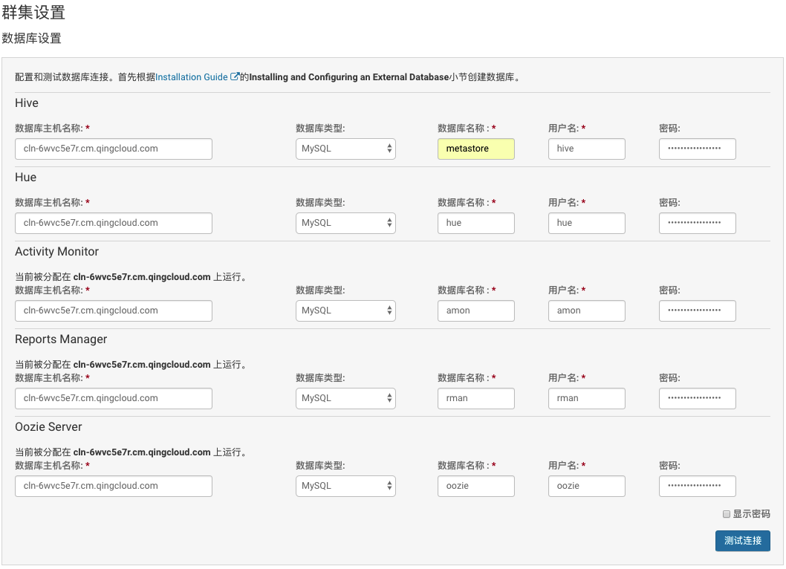

# CDH on QingCloud AppCenter 用户指南

## 简介

CDH(*Cloudera's Distribution Including Apache Hadoop*)是Cloudera公司的Hadoop发行版。CDH提供了Hadoop生态圈很多重要开源产品及组件如Hadoop, Spark, HBase, Hive, Pig, Hue, Oozie, Kafka, Zookeeper, Kudu, Accumulo, Flume, Sqoop, Sentry等。CDH还提供了用于CDH集群管理的Cloudera Manager以及用于数据管理的Cloudera Navigator 。

安装配置CDH集群是一项十分复杂的工作，涉及到操作系统环境配置、特定版本JDK的安装、数据库的安装及配置、Cloudera Manager server及agent的安装及配置、各个大数据组件的安装及配置等，并且安装过程中需要联网下载众多比较大的安装包，会使得整个集群的安装过程复杂、缓慢并且容易出错。

*CDH on QingCloud* 将安装CDH需要的操作系统环境的配置、各个依赖产品/组件的安装及配置等众多纷繁复杂的工作自动化，提前下载好了各个组件的安装包并做了相关分发配置，使得整个CDH集群的安装配置过程可以在十分钟左右快速完成，并可以很方便的横向及纵向扩展集群，极大地方便了用户的使用。

>目前支持的CDH版本是与CentOS 7.3兼容的 *CDH 5.13.0*
>
>CDH某些服务需要license才可以使用，用户可以自行获取license


## 创建部署CDH所需集群

### 第1步：基本设置


填写服务`名称`和`描述`，选择版本

### 第2步：Cloudera Manager 主节点设置


填写 Cloudera Manager 主节点 CPU、内存、节点类型、数据盘类型及大小等配置信息。

> Cloudera Manager 主节点运行了诸多服务，需要比较大的内存空间，8G以下的内存配置仅供测试。

### 第3步：从节点设置


填写 从节点 CPU、内存、节点类型、数据盘类型及大小等配置信息。

> 从节点如需安装除了HDFS data node，YARN NodeManager之外的其他服务如kafka，则至少需要8G内存。

> Cloudera Manager 主节点及从节点均为用户可访问的节点，可通过用户名root，初始密码为p12cHANgepwD 进行访问。

### 第4步：网络设置


出于安全考虑，所有的集群都需要部署在私有网络中，选择自己创建的已连接路由器的私有网络。

> 更多细节详见[网络资源配置](http://appcenter-docs.qingcloud.com/user-guide/apps/docs/network-config/)

### 第5步：服务环境参数设置


由于从节点上通常保存有集群数据，并运行着相关服务，因此默认是不允许删除从节点的。如需删除从节点，请将该节点上的数据及服务妥善处理后，设置配置参数「允许横向缩容」为true, 再进行相关操作。

操作完成后请将「允许横向缩容」设回false以避免误操作导致数据丢失。


### 第6步: 用户协议

阅读并同意青云 APP Center 用户协议之后即可开始创建部署CDH所需集群。

创建完成后点击集群列表页面相应集群即可查看集群详情：




## CDH安装部署

### 登录Cloudera Manager

集群创建成功后，Cloudera Manager服务将会部署到Cloudera Manager主节点中，待各节点服务状态均变为正常后，即可通过访问 `http://<Cloudera Manager主节点ip>:7180` 开始部署CDH组件到整个集群。

> 默认用户名及密码admin/admin


### 接受许可条款和条件


### 选择版本


### 安装组件列表


### 指定安装主机

输入创建好集群的各节点ip，点击搜索列出需要安装CDH的主机列表并全部选中


### 选择配置安装包

- 选择默认安装方法为`「使用Parcel」`
- 选择默认CDH版本为`「CDH-5.13.0-1.cdh5.13.0.p0.29」`
- 选择其他需要安装组件的Parcel包，比如Kafka

>    如需安装Accumulo请选择已经提前下载好的1.7.2版


- 点击`「使用Parcel」`旁边的`更多选项`进入`Parcel 存储库设置` 

  


与 CentOS 7.3 兼容的 CDH 5.13.0 各组件已经提前下载并存储到Cloudera Manager主节点，包括cdh5, Kafka, kudu, accumulo-c5, spark2和sqoop 。因此需要将这几个组件的`远程Parcel存储库URL`配置为Cloudera Manager主节点相应路径。假设Cloudera Manager主节点ip为192.168.100.19 ，则各组件到`远程Parcel存储库URL`需按如下url进行配置


```shell
http://192.168.100.19/cdh5/parcels/5.13.0/

http://192.168.100.19/kafka/parcels/3.0.0/

http://192.168.100.19/kudu/parcels/1.4.0/

http://192.168.100.19/accumulo-c5/parcels/1.7.2/

http://192.168.100.19/spark2/parcels/2.1.0/

http://192.168.100.19/sqoop/sqoop-connectors/

```


如下为配置好本地parcel存储库url后的效果：


### JDK安装


### 单用户模式

<font color=red>不要选择</font>「单用户模式」，直接点击继续：


### 安装身份验证

- 选择以root用户「登录到所有主机」
- 选择身份验证方法为「所有主机接受相同密码」
- 输入密码 p12cHANgepwD
- 点击继续后，即开始集群安装


### 集群安装

- 开始 Cloudera Manager Agent 安装


- Cloudera Manager Agent 安装完成后点击继续


- 组件安装包分发与激活

  

  ​    组件安装包激活后点击继续

  

- 安装环境检查

  


- 全部可安装组件列表

  

- ​

  


### 选择需要安装的服务

> Impala和Solr没有与CentOS 7.3相兼容的版本，因此预定义或自定义安装不能选择包含Impala或Solr的组合

- 选择安装预定义的服务组合

  

  ​

- 选择安装自定义的服务组合

  


### 自定义角色分配

选择好服务组合，点击下一步将进入角色分配页面。

- 用户可以选择将指定服务运行在指定主机上，可选的服务未分配主机。

  


- 点击某服务下的主机或「选择主机」，将进入为服务选择主机页面

  

### 数据库设置

为服务选定主机后，点击下一步将进入数据库设置页面。

各服务需要输入的数据库名称和用户名如下图所示，密码均为`CDH@qingcloud2017`




### 集群服务配置

数据库配置完成后将进入服务参数配置页面，用户基本不需要改动任何配置。

尤其不要改动目录相关设置，否则可能会出现磁盘空间不足的情况。


### 服务安装


### 安装完成


点击完成将看到Cloudera Manager管理界面


点击左侧相应组件将可以预览服务详情


## 在线伸缩

### 增加节点


### 删除节点


### 纵向伸缩

CDH允许分别对各种角色的节点进行纵向的扩容及缩容。


## 监控告警

### 资源级别的监控与告警

我们对CDH集群的每个节点提供了资源级别的监控和告警服务，包括 CPU 使用率、内存使用率、硬盘使用率等。

## 配置参数


### 修改配置参数

在 CDH 详情页，点击 `配置参数` Tab 页，点击 `修改属性`，修改完后，需要进行 "保存"。如图所示：


