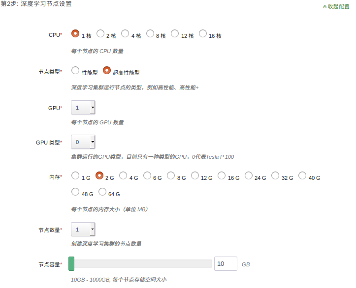

# DeepLearning on QingCloud AppCenter 用户指南
## 深度学习简介
2016年AlphaGo战胜李世石，预示我们进入了AI时代。深度学习是AI的核心技术，在图像分类，自然语言处理，无人驾驶等众多领域显示出了强大的能力，各大巨头纷纷投入巨资研发。语音助手，人脸识别，外文翻译等等，AI已融入到了我们生活的方方面面，极大了促进了社会的发展。其中Caffe，TensorFlow，Keras，PyTorch是主流的深度学习框架，拥有强大的社区支持，是实践深度学习不可或缺的工具。  
### Caffe
Caffe是一个被广泛使用的深度学习框架，由BVLC开发。Caffe容易上手，训练速度快，组件模块化，并拥有大量训练好的经典模型。Caffe在GPU上训练的性能很好，但只能支持单机多GPU的训练，不支持分布式多机训练。
### TensorFlow
TensorFlow由Google大脑主导开发，是一个分布式系统上的大规模深度学习框架。移植性好，可以运行在移动设备上，并支持分布式多机多卡训练，支持多种深度学习模型。TensorFlow还有功能强大的可视化组件TensorBoard，能可视化网络结构和训练过程，对于观察复杂的网络结构和监控长时间、大规模的训练很有帮助。
### PyTorch
PyTorch从Torch发展而来，并经过了大量改进，由FaceBook AI团队主导开发。不同于TensorFlow，PyTorch采用动态计算图的方式，并提供良好的python接口，代码简单灵活，使用起来非常方便。内存分配也经过了优化，能支持分布式多机训练。
### Keras
Keras是一个高层神经网络API，由Python编写，通过调用其他深度学习框架来进行计算，如Tensorflow、Theano以及CNTK。Keras高度模块化，能快速搭建神经网络，并且非常容易上手。
# 青云深度学习平台
基于青云提供的NVIDIA Tesla P100 GPU，青云深度学习平台配置了CUDA8.0和cuDNN5，并安装了流行的深度学习框架，如Caffe(BVLC)，TensorFlow(1.2.1)，Keras(2.0.9)，PyTorch(0.2.0_4)，省去了用户搭建环境的麻烦，提高开发效率。用户无需修改代码，即可把本地的代码运行在云上，还能动态扩展所需资源。

## 部署 DeepLearning 服务

### 第1步：基本设置


- 填写服务名称和描述，选择版本。

### 第2步：计算节点设置



- 填写节点CPU、GPU、内存、节点类型、节点个数、数据盘大小等配置信息。

### 第3步：网络设置


- 出于安全考虑，所有的集群都需要部署在私有网络中，选择自己创建的已连接路由器的私有网络中。

### 第4步：环境设置


- DeepLearning app与QingStor命令行工具集成，[配置](https://docs.qingcloud.com/qingstor/command_line_tools/qsctl.html)
QingStor相关参数，可以方便的从QingStor拉取数据。如果QingStor选用false，access_key和secret_key则无需填写。

## DeepLearning 测试
### 测试环境
深度学习平台使用miniconda2来管理python环境，python的版本为2.7，并装有numpy，scipy，pandas，matplotlib，nltk，scikit-learn，jupyter notebook等常用工具包。  
以MNIST数据集为例，分别测试Caffe，TensorFlow，PyTorch，Keras。MNIST数据集包含0-9 10个数字，
训练数据集包含60，000 个样本，测试数据集包含10，000 样本，数据集中的每张图片由28x28个像素点构成。
> Deep Learning 训练往往需要大量的数据，数据存储经常占用很大的空间。青云QingStor可以存储海量数据，
用户可以方便的把数据放在QingStor，再使用QingStor命令行工具快速的下载到本地。如果在环境设置中配置好了QingStor(如果没有也可在本地[配置](https://docs.qingcloud.com/qingstor/command_line_tools/qsctl.html))，从QingStor获取数据：  
```shell
cd /home/ubuntu/tensorflow  
mkdir data   
qsctl cp -r qs://mydata/ data/
```

### Caffe 测试示例
Caffe支持python接口，用户也可以根据需要重新配置编译，目前不支持多机分布式训练。[Caffe文档](http://caffe.berkeleyvision.org)  
**Caffe预先用GPU版本进行编译，如果选择的GPU的个数为0，需修改配置文件，重新编译。**

#### 单机
单机示例：  
```shell
cd /home/ubuntu/caffe  
./build/tools/caffe train --solver=examples/mnist/lenet_solver.prototxt
```
caffe 训练过程  
  
caffe 训练结果  

> 查看GPU使用情况，可以使用如下命令。  
```shell
nvidia-smi  
```

GPU 使用情况  

### TensorFlow 测试示例 
[Tensorflow文档](http://tensorflow.org)  
#### 单机：
```shell
cd /home/ubuntu/tensorflow  
python mnist.py
```
tensorflow 训练结果  
  

#### 分布式：
增加节点，在线扩容：在详情页点击 `新增节点` 按钮，可以对每个新增节点指定IP或选择自动分配。  
tensorflow 增加节点  
  
Tensorflow 分布式训练需要指定parameter server 和 worker的IP地址和端口号（根据自己的IP进行修改）  
下面是一个parameter server 和两个 worker 进行分布式训练：  
节点1：  
- 启动parameter server
```shell
cd /home/ubuntu/tensorflow  
python mnist_dist.py --ps_hosts=192.168.1.6:2221 --worker_hosts=192.168.1.6:2223,192.168.1.7:2223 --job_name=ps --task_index=0  
```
- 启动第一个worker  
```shell
python mnist_dist.py --ps_hosts=192.168.1.6:2221 --worker_hosts=192.168.1.6:2223,192.168.1.7:2223 --job_name=worker --task_index=0  
```
节点2：  
- 启动第二个worker  
```shell
cd /home/ubuntu/tensorflow  
python mnist_dist.py --ps_hosts=192.168.1.6:2221 --worker_hosts=192.168.1.6:2223,192.168.1.7:2223 --job_name=worker --task_index=1
```
tensorflow 分布式训练结果  
  

TensorFlow中的tensorboard提供了训练过程中丰富的信息，默认端口号为`6066`。
> 如果需要通过公网访问这些信息您需要先申请一个公网IP绑定在路由器上，在路由器上设置端口转发，同时打开防火墙相应的下行端口。为了方便查看tensorboard UI，也可参考[VPN 隧道指南](https://docs.qingcloud.com/guide/vpn.html) 配置VPN。  

开启tensorboard服务
```shell
tensorboard --logdir=./tflog/
```
tensorboard展示结果  

### PyTorch 测试示例
[PyTorch文档](http://pytorch.org/)  
#### 单机 
```shell
cd /home/ubuntu/pytorch  
python mnist.py
```
pytorch 训练结果  

#### 分布式  
**pytorch分布式训练时，由于现在版本的pytoch自身的一些缺陷，每个节点的GPU个数应该大于1个，否则容易出现错误。**  
节点1：  
```shell
cd /home/ubuntu/pytorch   
python mnist_dist.py  
```
节点2：
```shell
cd /home/ubuntu/pytorch   
python mnist_dist.py
```
pytorch 分布式训练结果  

### Keras 测试示例  
Keras默认使用Tensorflow来计算，目前青云平台上也只支持Tensorflow作为其计算框架。[Keras文档](https://keras.io)  
#### 单机 
```shell
cd /home/ubuntu/keras  
python mnist.py
```
keras 训练结果  
  
为了方便开发，环境中配有jupyter notebook，用户可以交互式编程，并能直观展现实时计算结果。  
jupyter notebook启动命令  
```shell
cd /home/ubuntu/keras
jupyter notebook
```
jupyter noetbook默认端口号为`8888`。
> 如果需要通过公网访问这些信息您需要先申请一个公网IP绑定在路由器上，在路由器上设置端口转发，同时打开防火墙相应的下行端口。为了方便使用jupyter notebook，也可参考[VPN 隧道指南](https://docs.qingcloud.com/guide/vpn.html) 配置VPN。  

jupyter notebook 开发环境   

