# SparkMR on QingCloud AppCenter 用户指南

## 简介

*SparkMR on QingCloud AppCenter* 将 *Apache Hadoop* 和 *Apache Spark* 集成到同一个集群服务中，以AppCenter云应用的形式交付给用户使用。
>目前支持的Hadoop和Spark版本分别是 *Apache Hadoop 2.7.3* 和 *Apache Spark 2.2.0*  。


### *SparkMR* 的主要功能

- *Apache Hadoop*  提供的MapReduce、YARN、HDFS等功能
- *Apache Spark* 提供的Spark streaming、Spark SQL、DataFrame and DataSet、Structed Streaming、MLlib、GraphX、SparkR等功能
- 同时支持Spark Standalone和Spark on YARN两种模式。

>用户可以选择是否开启Spark Standalone模式（默认开启）。开启后用户可以以Spark Standalone模式提交Spark应用；关闭后用户可以Spark on YARN模式提交Spark应用。如仅以Spark on YARN模式提交Spark应用或者仅使用hadoop相关功能，则可以选择关闭Spark Standalone模式以释放资源。

- 为了方便用户提交Python Spark应用，提供了Anaconda发行版的Python 2.7.13和Python 3.6.1 。用户可以选择Python Spark应用的运行环境，支持在Python2和Python3之间进行切换。
- 为了方便用户开发Python Spark机器学习类的应用， 分别在Anaconda发行版的Python2和Python3内提供了Anaconda发行版的数据科学包numpy, scikit-learn, scipy, Pandas, NLTK and Matplotlib 。
- 为了方便用户开发Spark R应用，提供了R语言运行时。
- 支持上传自定义的Spark应用内调度器Fair Schudeler，并支持spark应用内调度模式在FIFO和FAIR切换
- 支持上传自定义的YARN调度器CapacityScheduler和FairScheduler，并支持在CapacityScheduler和FairScheduler之间进行切换
- 支持用户选择YARN调度器中用于计量资源的ResourceCalculator。默认的DefaultResourseCalculator在分配资源时只考虑内存，而DominantResourceCalculator则利用Dominant-resource来综合考量多维度的资源如内存，CPU等。
- 配置参数增加到近60个，定制服务更方便
- 针对HDFS、YARN和Spark服务级别的监控告警、健康检查与服务自动恢复
- Hadoop、Spark与QingStor集成
- 指定依赖服务，自动添加依赖服务中的所有节点到SparkMR所有节点的hosts文件中
- 支持水平与垂直扩容
- 可选Client节点（为了使用上述全部功能，建议Client节点为必选），全自动配置无需任何手动操作。

## 部署SparkMR服务

### 第1步：基本设置

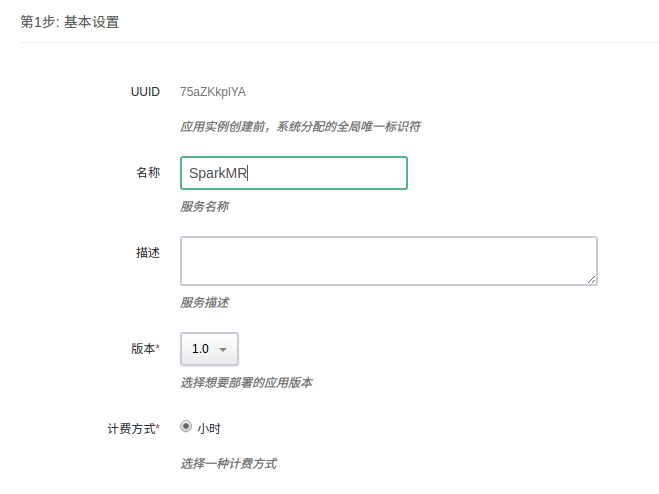

填写服务`名称`和`描述`，选择版本

### 第2步：HDFS主节点设置


填写 HDFS主节点 CPU、内存、节点类型、数据盘类型及大小等配置信息。

### 第3步：YARN主节点设置

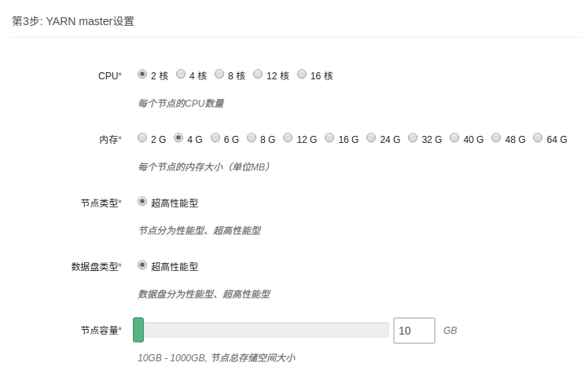

填写 YARN主节点 CPU、内存、节点类型、数据盘类型及大小等配置信息。

### 第4步：从节点设置


填写 从节点 CPU、内存、节点类型、数据盘类型及大小等配置信息。

### 第5步：Client节点设置

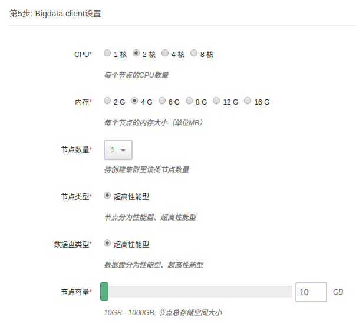

填写Client节点 CPU、内存、节点类型、数据盘类型及大小等配置信息。Client节点为可选，如不需要可设置`节点数量`为0。建议选配Client节点，否则某些功能无法使用（除非手动下载相关软件包并配置好）。
> Client节点为用户可访问的节点，可以用它来访问HDFS，和集群交互如提交job等。该节点用户名为ubuntu，初始密码为p12cHANgepwD 。

### 第6步：网络设置


出于安全考虑，所有的集群都需要部署在私有网络中，选择自己创建的已连接路由器的私有网络中。

### 第7步：依赖服务设置


选择所依赖的服务可以将其中所有节点加入本服务所有节点的hosts文件中

### 第8步：服务环境参数设置

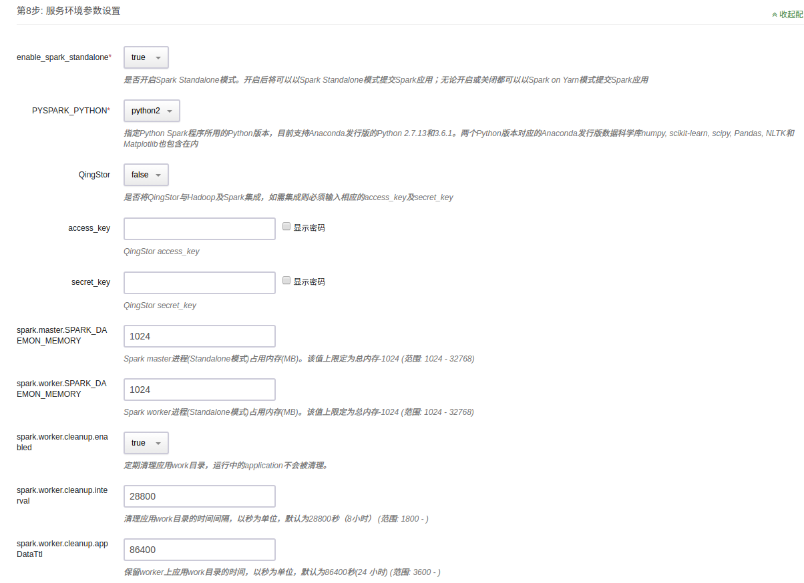

提供了近60个服务环境参数可以配置，默认仅显示其中两个。可以点击`展开配置`对所有配置项进行修改，也可使用默认值并在集群创建后按需进行修改。

### 第9步: 用户协议

阅读并同意青云 APP Center 用户协议之后即可开始部署应用。

## SparkMR使用场景

## 查看服务详情

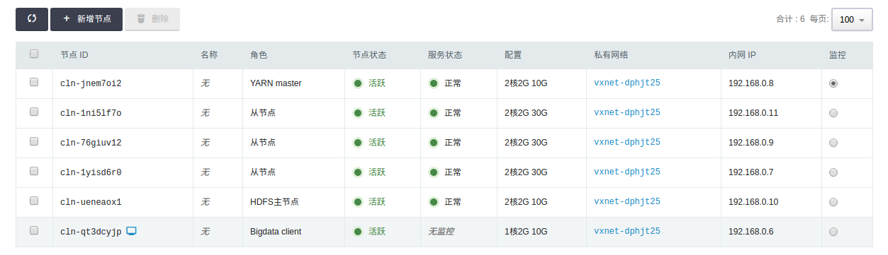

创建成功后，点击集群列表页面相应集群可查看集群详情。可以看到集群分为HDFS主节点、YARN主节点、从节点和Client节点四种角色。其中用户可以直接访问client节点，并通过该节点与集群交互如提交Hadoop/Spark job、查看/上传/下载HDFS文件等。

> 下属场景均在root用户下测试通过

## 场景一、以Spark-shell模式运行Spark job

- Scala

```shell
cd /opt/spark	
bin/spark-shell --master spark://192.168.0.8:7077

val textFile = spark.read.textFile("/opt/spark/README.md")
textFile.count()
textFile.filter(line => line.contains("Spark")).count()
```

- Python

```shell
cd /opt/spark
bin/pyspark --master spark://192.168.0.8:7077

textFile = spark.read.text("/opt/spark/README.md")
textFile.count()
textFile.filter(textFile.value.contains("Spark")).count()
```

- R

```shell
cd /opt/spark
bin/sparkR --master spark://192.168.0.8:7077

df <- as.DataFrame(faithful)
head(df)
people <- read.df("./examples/src/main/resources/people.json", "json")
printSchema(people)
```

## 场景二、以Spark Standalone模式运行Spark job

- Scala

```shell
cd /opt/spark	

bin/spark-submit --class org.apache.spark.examples.SparkPi --master spark://192.168.0.8:7077 examples/jars/spark-examples_2.11-2.2.0.jar 100
```

- Python

```shell
cd /opt/spark

bin/spark-submit --master spark://192.168.0.8:7077 examples/src/main/python/pi.py 100
```

可以在配置参数页面切换Python版本


- R

```shell
cd /opt/spark

bin/spark-submit --master spark://192.168.0.8:7077 examples/src/main/r/data-manipulation.R examples/src/main/resources/people.txt
```

## 场景三、以Spark on YARN模式运行Spark job

- Scala

```shell
cd /opt/spark

bin/spark-submit --class org.apache.spark.examples.SparkPi --master yarn --deploy-mode cluster --num-executors 3 --executor-cores 1 --executor-memory 1g examples/jars/spark-examples_2.11-2.2.0.jar 100
```

- Python

```shell
cd /opt/spark

bin/spark-submit --master yarn --deploy-mode client examples/src/main/python/pi.py 100
```

- R

```shell
cd /opt/spark

bin/spark-submit --master yarn --deploy-mode cluster /opt/spark/examples/src/main/r/ml/kmeans.R
```

## 场景四、运行hadoop测试程序，统计文件中单词出现的次数

```shell
cd /opt/hadoop
bin/hdfs dfs -mkdir /input
bin/hdfs dfs -put etc/hadoop/* /input
bin/hdfs dfs -ls /input

bin/hadoop jar share/hadoop/mapreduce/hadoop-mapreduce-examples-2.7.3.jar wordcount /input /output
bin/hdfs dfs -cat /output/part-r-00000
```

## 场景五、Hadoop 官方的 Benchmark 性能基准测试，测试的是 HDFS 分布式I/O读写的速度/吞吐率，依次执行下列命令

```shell
cd /opt/hadoop

# 使用6个 Map 任务并行向 HDFS 里6个文件里分别写入 1GB 的数据
bin/hadoop jar share/hadoop/mapreduce/hadoop-mapreduce-client-jobclient-2.7.3-tests.jar TestDFSIO -write -nrFiles 6 -size 1GB

# 使用6个 Map 任务并行从 HDFS 里6个文件里分别读取 1GB 的数据
bin/hadoop jar share/hadoop/mapreduce/hadoop-mapreduce-client-jobclient-2.7.3-tests.jar TestDFSIO -read -nrFiles 6 -size 1GB

# 清除以上生成的数据
bin/hadoop jar share/hadoop/mapreduce/hadoop-mapreduce-client-jobclient-2.7.3-tests.jar TestDFSIO -clean

您能看到 HDFS 每秒读写文件速度，以及吞吐量的具体数值。
```

## 场景六、Hadoop 官方的 Benchmark 性能基准测试，测试的是大文件内容的排序，依次执行下列命令：

```shell
cd /opt/hadoop

# 生成1000万行数据到 /teraInput 路径中
bin/hadoop jar share/hadoop/mapreduce/hadoop-mapreduce-examples-2.7.3.jar teragen 10000000 /teraInput

# 将/teraInput 中生成的1000万行数据排序后存入到 /teraOutput 路径中
bin/hadoop jar share/hadoop/mapreduce/hadoop-mapreduce-examples-2.7.3.jar terasort /teraInput /teraOutput

# 针对已排序的 /teraOutput 中的数据，验证每一行的数值要小于下一行
bin/hadoop jar share/hadoop/mapreduce/hadoop-mapreduce-examples-2.7.3.jar teravalidate -D mapred.reduce.tasks=8 /teraOutput /teraValidate

# 查看验证的结果
bin/hdfs dfs -cat /teraValidate/part-r-00000
```

## 场景七、SparkMR与QingStor集成

QingStor 对象存储为用户提供可无限扩展的通用数据存储服务，具有安全可靠、简单易用、高性能、低成本等特点。用户可将数据上传至 QingStor 对象存储中，以供数据分析。由于 QingStor 对象存储兼容 AWS S3 API，因此 Spark与Hadoop都可以通过 AWS S3 API 与 QingStor 对象存储高效集成，以满足更多的大数据计算和存储场景。有关 QingStor 的更多内容，请参考[QingStor 对象存储用户指南] (https://docs.qingcloud.com/qingstor/guide/index.html)
>目前QingStor 对象存储的开放了sh1a 和 pek3a两个区，后续将开放更多的分区，敬请期待。

如需与QingStor对象存储集成，需要首先在配置参数页面填写如下信息：


>有两种方式可以启动 Spark job： 通过 spark-shell 交互式运行和通过 spark-submit 提交 job 到 Spark集群运行，这两种方式都需要通过选项 "--jars $SPARK_S3" 来指定使用 S3 API相关的 jar 包。

假设您在 QingStor 上的 bucket 为 my-bucket, 下面以 spark-shell 为例， 列出常见的 Spark 与 QingStor 集成场景。

- 在 Spark 中读取到 HDFS 上的文件后将其存储到 QingStor 中

```shell
# 首先需要将本地的一个测试文件上传到spark集群的HDFS存储节点上：
cd /opt/hadoop
bin/hdfs dfs -mkdir /input
bin/hdfs dfs -put /opt/spark/README.md /input/

# 然后启动 spark-shell, 输入并执行如下代码将会读取 HDFS 上的 README.md 文件, 然后将其存为QingStor中"my-bucket"下的 test 文件：
cd /opt/spark
bin/spark-shell --master spark://<yarn-master-ip>:7077 --jars $SPARK_S3

val qs_file = sc.textFile("hdfs://<hdfs-master-ip>:9000/input/README.md")
qs_file.saveAsTextFile("s3a://my-bucket/test")
```

- 在 Spark 中读取 QingStor 上的文件，处理过后再存储到 HDFS 文件系统中

```shell
val qs_file = sc.textFile("s3a://my-bucket/test")
qs_file.count()
qs_file.saveAsTextFile("hdfs://<hdfs-master-ip>:9000/output/")
```

- 在 Spark 中读取 QingStor 上的文件， 经过处理后将结果存回 QingStor

```shell
#如下代码将会读取 QingStor 中 my-bucket 下的 test 文件， 从中选出包含字符串 "Spark" 的行， 最后将结果存储到 my-bucket 下的 qingstor-output 文件中
val qs_file = sc.textFile("s3a://my-bucket/test").filter(line => line.contains("Spark"))
qs_file.saveAsTextFile("s3a://my-bucket/output1")
```

- 在 Spark 中创建元素值为 1 到 1000 的数组， 找出其中的奇数并对其求平方， 最后将结果存储到 QingStor 上的文件中

```shell
val data = for (i <- 1 to 1000) yield i
sc.parallelize(data).filter(_%2 != 0).map(x=>x*x).saveAsTextFile("s3a://my-bucket/output2")
```

- 本地文件和对象存储之间的上传下载

```shell
cd /usr/opt/hadoop
# 从Client 主机本地上传文件到 QingStor 对象存储
bin/hdfs dfs -put LICENSE.txt s3a://your_bucket/
 
# 将文件从 QingStor 对象存储下载到Client 主机本地
bin/hdfs dfs -get s3a://your_bucket/LICENSE.txt
```

- HDFS文件系统和对象存储之间的数据传输

```shell
cd /usr/opt/hadoop
# 将文件从 QingStor 对象存储拷贝到 HDFS 文件系统
bin/hadoop distcp -libjars $HADOOP_S3 s3a://your_bucket/LICENSE.txt /LICENSE.txt
 
# 将文件从 HDFS 文件系统拷贝到 QingStor 对象存储存储空间中
bin/hadoop distcp -libjars $HADOOP_S3 /LICENSE.txt s3a://your_bucket/your_folder/
```

- 将对象存储作为MapReduce job的输入/输出

```shell
cd /usr/opt/hadoop
 
# 将 QingStor 对象存储中的文件作为 MapReduce 的输入，计算结果输出到 HDFS 文件系统中
bin/hadoop jar share/hadoop/mapreduce/hadoop-mapreduce-examples-2.7.3.jar wordcount -libjars $HADOOP_S3 s3a://your_bucket/LICENSE.txt /test_output

# 将 QingStor 对象存储中的文件作为 MapReduce 的输入，计算结果依然输出到 QingStor 对象存储的存储空间中
bin/hadoop jar share/hadoop/mapreduce/hadoop-mapreduce-examples-2.7.3.jar wordcount -libjars $HADOOP_S3 s3a://your_bucket/LICENSE.txt s3a://your_bucket/your_folder/

# 将 HDFS 中的文件作为 MapReduce 的输入，计算结果输出到 QingStor 对象存储的存储空间中
bin/hadoop jar share/hadoop/mapreduce/hadoop-mapreduce-examples-2.7.3.jar wordcount -libjars $HADOOP_S3 /LICENSE.txt s3a://your_bucket/

```

## 场景八、更新自定义YARN调度器

YARN支持两种调度器CapacityScheduler（默认）和FairScheduler。
为了支持用户更多自定义调度器的需求，SparkMR支持用户上传自定义调度器，步骤如下：

1. 自定义CapacityScheduler capacity-scheduler.xml或者FairScheduler fair-scheduler.xml（文件名必须为capacity-scheduler.xml或者fair-scheduler.xml）
2. 将这两个自定义调度器上传至HDFS的/tmp/hadoop-yarn/目录
3. 右键点击集群，选择`自定义服务`，点击`更新调度器`，选择`YARN主节点`，点击`提交`

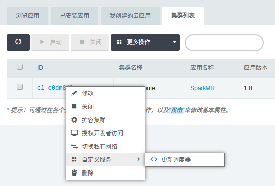


4. 在配置参数页面切换到相应调度器


> 注：如果更新的自定义调度器和配置参数里yarn.resourcemanager.scheduler.class类型一致，则需要切换到另一种类型的调度器，保存设置后，再切换回来重新保存以达到重启集群使新的自定义调度器生效的目的。

## 场景九、更新自定义Spark应用内调度器

Spark支持两种应用内调度器FIFO（默认）和FAIR。
为了支持用户自定义Spark应用内FAIR调度器的需求，SparkMR支持用户上传自定义的FAIR调度器，步骤如下：

1. 自定义Spark应用内FAIR调度器spark-fair-scheduler.xml（文件名必须为spark-fair-scheduler.xml）
2. 将这两个自定义调度器上传至HDFS的/tmp/hadoop-yarn/目录
3. 右键点击集群，选择`自定义服务`，点击`更新调度器`，选择`YARN主节点`，点击`提交`
4. 在配置参数页面切换到相应调度器


## 场景十、选择Resource Calculator

SparkMR支持用户选择YARN调度器中用于计量资源的ResourceCalculator。默认的DefaultResourseCalculator在分配资源时只考虑内存，而DominantResourceCalculator则利用Dominant-resource来综合考量多维度的资源如内存，CPU等。可在配置参数页面选择：
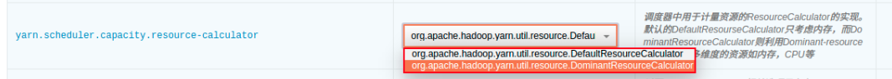

## 场景十一、开启/关闭 Spark Standalone模式

用户可以选择是否开启Spark Standalone模式（默认开启）。

- 开启后用户可以以Spark Standalone模式提交Spark应用
- 关闭后用户可以以Spark on YARN模式提交Spark应用
- 如仅以Spark on YARN模式提交Spark应用或者仅使用hadoop相关功能，则可以选择关闭Spark Standalone模式以释放资源。


## 场景十二、控制Spark、HDFS、YARN占用的内存

- Spark Standalone模式的Spark master进程和YARN ResourceManager进程都运行在YARN主节点上。
- Spark Standalone模式的Spark worker进程和HDFS datanode以及YARN NodeManager进程都运行在从节点上
- 可通过如下参数配置各个进程最大占用的内存：

Spark进程最大占用内存
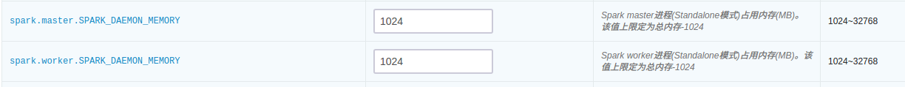

YARN及HDFS进程最大占用内存
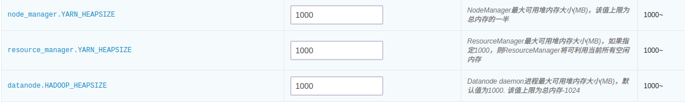

## 场景十三、配置Hadoop代理用户

可通过如下配置参数配置Hadoop代理用户及其所能代理的hosts和groups：
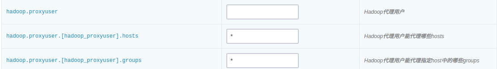

## 场景十四、YARN log收集

SparkMR支持将YARN log收集到HDFS指定目录，并可指定保持时间、保持目录等，可在配置参数页面配置：


## 场景十五、Spark log清理

可通过如下配置参数控制Spark Standalone模式下Spark worker节点的log清理设置：


## 在线伸缩

### 增加节点

可以在SparkMR详情页点击 `新增节点` 按钮增加 `从节点` 或 `Client节点`，可以对每个新增节点指定 IP 或选择自动分配。
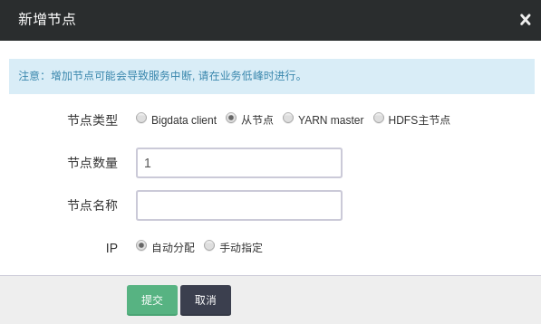

### 删除节点

可以在 SparkMR 详情页选中需要删除的节点，然后点击 `删除` 按钮，只能一次删除一个，并且必须等到上个节点删除后且 decommission 结束才能删除下一个节点，否则数据会丢失。删除节点过程中会锁定SparkMR集群不让对其进行其它生命周期操作。

- HDFS的decommission状态可以从 HDFS Name Node 的 50070 端口提供的监控信息观察到。Decommission 是在复制即将删除节点上的数据到别的节点上，如果您的数据量比较大，这个过程会比较长。因为青云的 HDFS 副本因子默认为 2，所以当您的SparkMR从节点数为2的时候就不能再删除节点。同时要预先知道其它节点的总硬盘空间足够拷贝删除节点的内容，才能进行删除。

- YARN的decommission会相对较快，删除节点后会在比较短的时间内在YARN主节点的8088端口观察到集群的CPU及内存资源的下降

> `YARN主节点` 和 `HDFS 主节点` 不允许删除，一次删除多个 `从节点` 相关操作会失败，右上角会有提示。


### 纵向伸缩

SparkMR允许分别对各种角色的节点进行纵向的扩容及缩容。
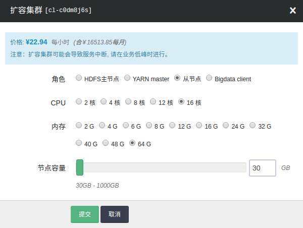

## 监控告警

### 资源级别的监控与告警

我们对SparkMR集群的每个节点提供了资源级别的监控和告警服务，包括 CPU 使用率、内存使用率、硬盘使用率等。

### Hadoop和Spark原生的监控

YARN、HDFS和Spark提供了丰富的监控信息。如果需要通过公网访问这些信息您需要先申请一个公网 IP 绑定在路由器上，在路由器上设置端口转发，同时打开防火墙相应的下行端口。

`YARN主节点` 默认端口 `8088` ， `HDFS 主节点` 默认端口是 `50070`，Spark主节点和YARN主节点是同一个，其默认端口是`8080` 。

为方便查看 SparkMR UI，请参考 [VPN 隧道指南](https://docs.qingcloud.com/guide/vpn.html) 配置VPN，VPN 建立后可查看下述界面。

- http://< YARN-MASTER-IP >:8088

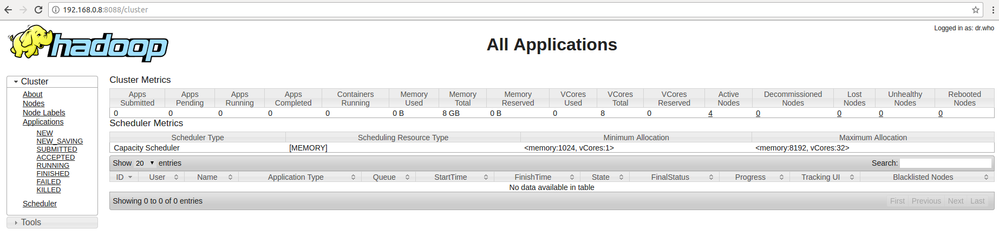

- http://< HDFS-MASTER-IP >:50070


- http://< YARN-MASTER-IP >:8080


### 服务级别分角色的监控与告警

为了帮助用户更好的管理和维护SparkMR集群，我们提供了部分针对 YARN、 HDFS以及Spark服务级别分角色的监控：

- YARN服务监控，包括YARN管理的各NodeManager节点状态、运行中的YARN应用、YARN应用状态、YARN集群总内存、YARN集群virtual cores、YARN containers、NodeManger节点内存等。

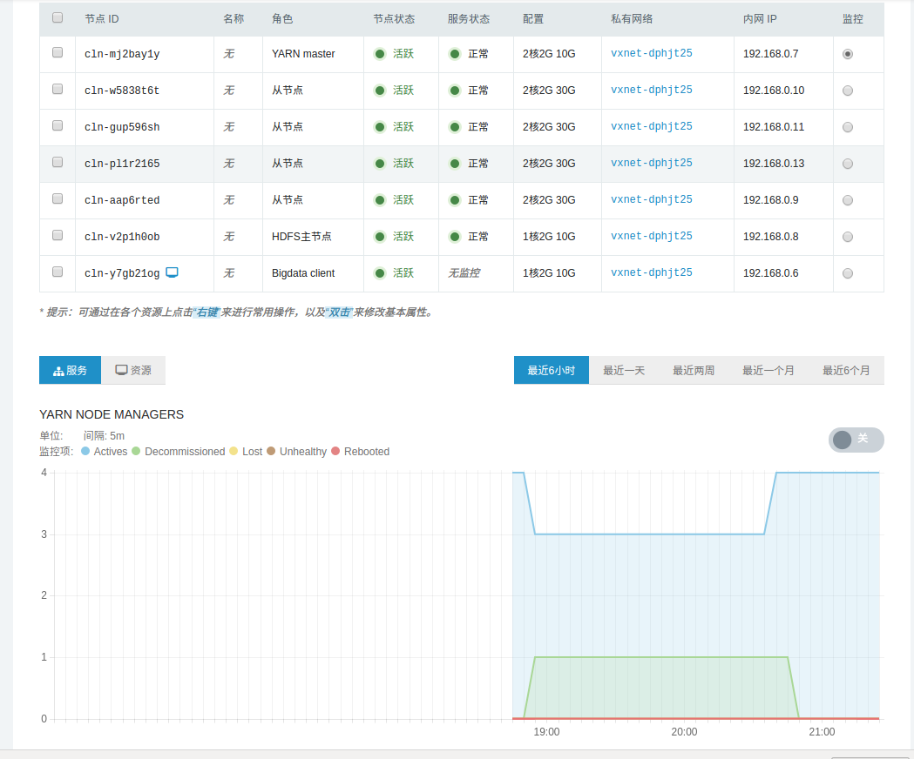


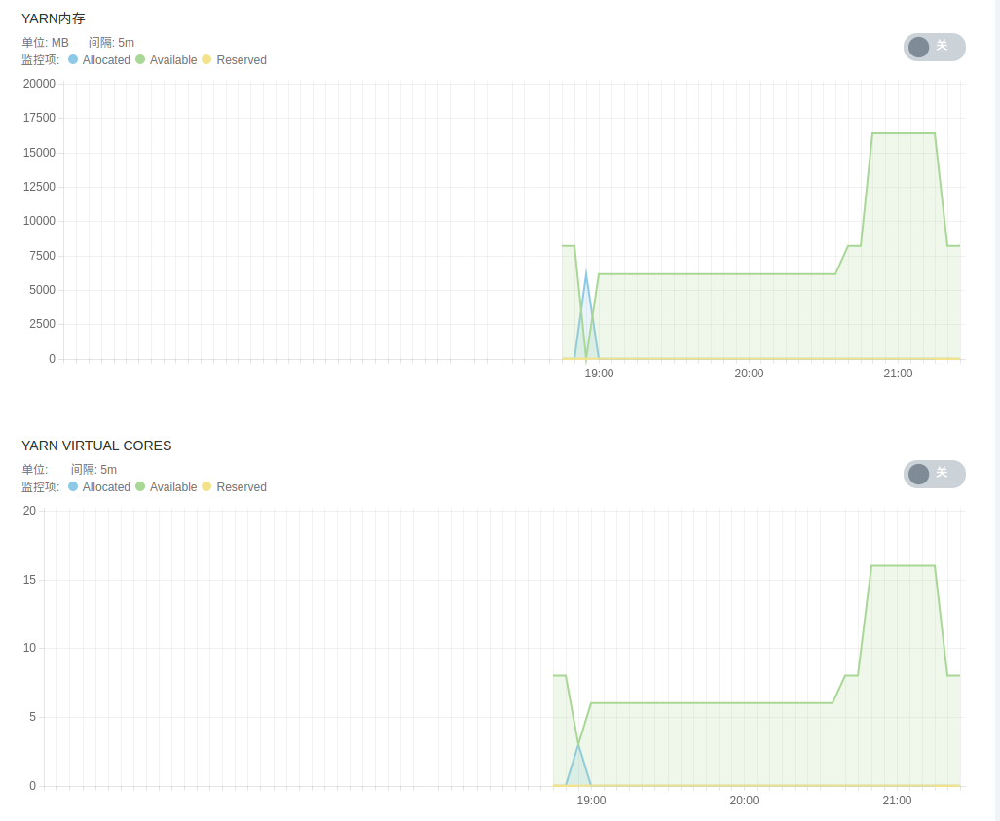

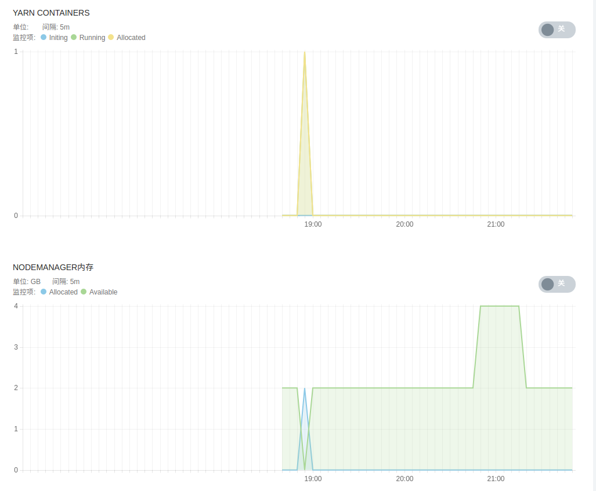

- HDFS服务监控，包括DFS文件状态、DFS空间占比、DFS容量、各DataNode状态、HDFS存储空间、DFS块及垃圾回收信息等。


- Spark服务监控，包括Spark Standalone模式下worker节点状态、spark applications状态、各worker节点计算及存储资源等。


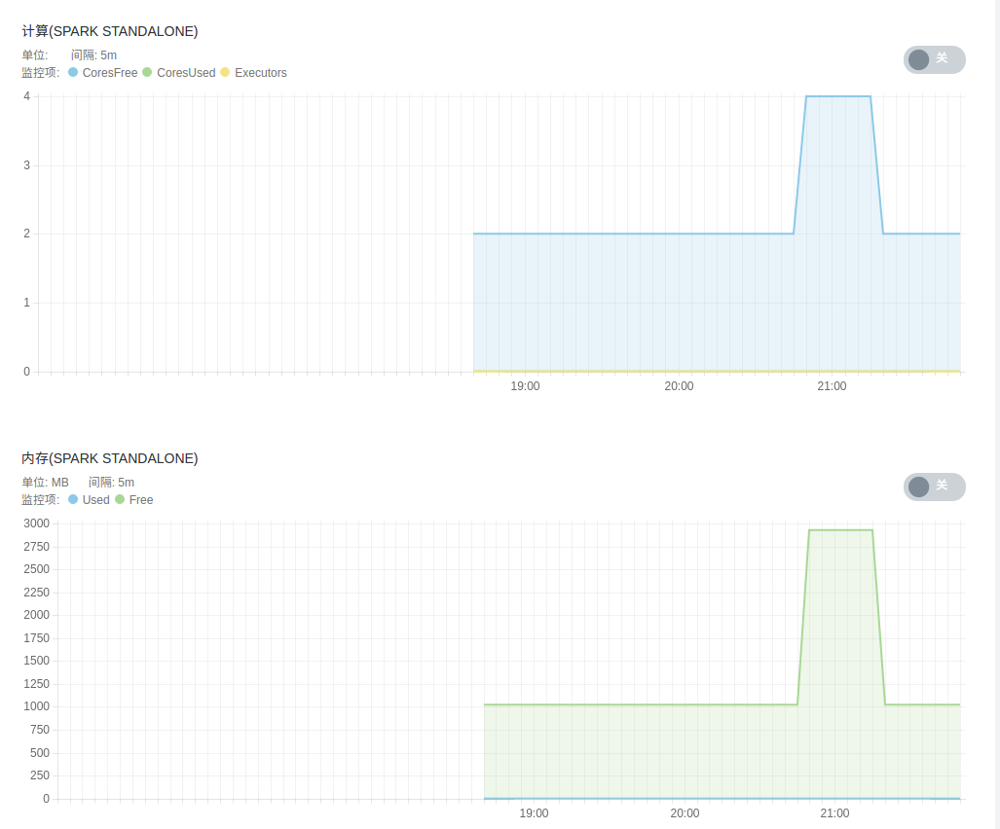

## 配置参数

SparkMR提供了60个左右的配置参数，可以通过 `配置参数` 来定制个性化的SparkMR服务并进行调优。

### 修改配置参数

在 SparkMR 详情页，点击 `配置参数` Tab 页，点击 `修改属性`，修改完后，需要进行 "保存"。如图所示：

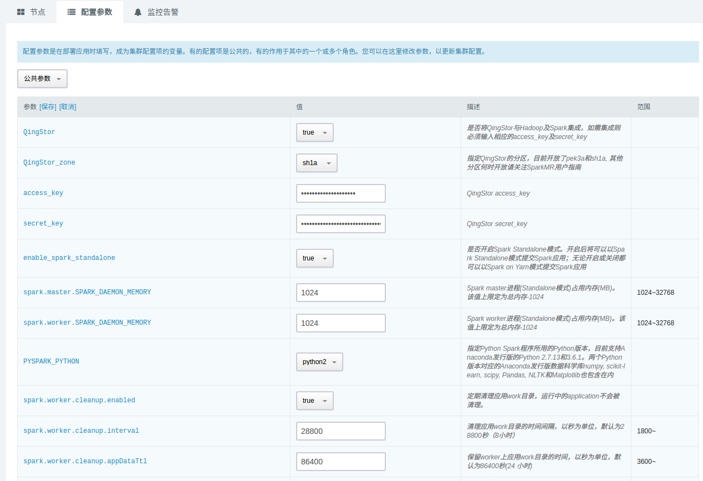

### 常用配置项

- **QingStor**: 是否将QingStor与Hadoop及Spark集成，如需集成则必须输入相应的access_key及secret_key。
- **QingStor_zone**: 指定QingStor的分区，目前开放了pek3a和sh1a。 其他分区何时开放请关注SparkMR用户指南。
- **access_key**: 指定QingStor的access_key。
- **secret_key**: 指定QingStor的secret_key。
- **enable_spark_standalone**: 是否开启Spark Standalone模式。开启后将可以以Spark Standalone模式提交Spark应用；无论开启或关闭都可以以Spark on Yarn模式提交Spark应用。
- **spark.master.SPARK_DAEMON_MEMORY**: Spark master进程(Standalone模式)占用内存(MB)。该值上限定为总内存-1024。
- **spark.worker.SPARK_DAEMON_MEMORY**: Spark worker进程(Standalone模式)占用内存(MB)。该值上限定为总内存-1024。
- **PYSPARK_PYTHON**: 指定Python Spark程序所用的Python版本，目前支持Anaconda发行版的Python 2.7.13和3.6.1。两个Python版本对应的Anaconda发行版数据科学库numpy, scikit-learn, scipy, Pandas, NLTK和Matplotlib也包含在内。
- **spark.worker.cleanup.enabled**: 定期清理应用work目录，运行中的application不会被清理。。
- **spark.worker.cleanup.interval**: 清理应用work目录的时间间隔，以秒为单位，默认为28800秒（8小时）。
- **spark.worker.cleanup.appDataTtl**: 保留worker上应用work目录的时间，以秒为单位，默认为86400秒(24 小时)。
- **spark.scheduler.mode**: Spark应用内调度模式，针对Spark应用内不同线程提交的可同时运行的任务。
- **hadoop.proxyuser**: Hadoop代理用户。
- **hadoop.proxyuser.hosts**: Hadoop代理用户能代理哪些hosts。
- **hadoop.proxyuser.groups**: Hadoop代理用户能代理指定host中的哪些groups。
- **resource_manager.YARN_HEAPSIZE**: ResourceManager最大可用堆内存大小(MB)，如果指定1000，则ResourceManager将可利用当前所有空闲内存。
- **node_manager.YARN_HEAPSIZE**: NodeManager最大可用堆内存大小(MB)，该值上限为总内存的一半。
- **datanode.HADOOP_HEAPSIZE**: Datanode daemon进程最大可用堆内存大小(MB)，默认值为1000. 该值上限为总内存-1024。
- **dfs.namenode.handler.count**: Name node节点服务线程数。
- **dfs.datanode.handler.count**: Data node节点服务线程数。
- **dfs.replication**: HDFS副本数。
- **fs.trash.interval**: 控制Trash检查点目录过多少分钟后被删除。
- **yarn.resourcemanager.scheduler.class**: YARN ResourceManager调度器，默认为CapacityScheduler，可选FairScheduler。如果选择FairScheduler，需要上传自定义的fair-scheduler.xml到HDFS的/tmp/hadoop-yarn/目录，然后右键点击集群选择更新调度器。如需对CapacityScheduler的默认行为进行更改，同样需要上传自定义的capacity-scheduler.xml到HDFS的/tmp/hadoop-yarn/目录，然后更新调度器。
- **yarn.resourcemanager.client.thread-count**: 处理applications manager请求的线程数。
- **yarn.resourcemanager.amlauncher.thread-count**: 启动/清理ApplicationMaster的线程数。
- **yarn.resourcemanager.scheduler.client.thread-count**: 处理scheduler接口请求的线程数。
- **yarn.resourcemanager.resource-tracker.client.thread-count**: 处理resource tracker请求的线程数。
- **yarn.resourcemanager.admin.client.thread-count**: 处理ResourceManager管理接口请求的线程数。
- **yarn.nodemanager.container-manager.thread-count**: 分配给Container Manager用的线程数。
- **yarn.nodemanager.delete.thread-count**: 用于清理工作的线程数。
- **yarn.nodemanager.localizer.client.thread-count**: 用于处理localization请求的线程数。
- **yarn.nodemanager.localizer.fetch.thread-count**: 用于处理localization fetching请求的线程数。
- **yarn.nodemanager.pmem-check-enabled**: 是否需要为container检查物理内存限制。
- **yarn.nodemanager.vmem-check-enabled**: 是否需要为container检查虚拟内存限制。
- **yarn.nodemanager.vmem-pmem-ratio**: NodeManager中虚拟内存与物理内存的比率。
- **yarn.scheduler.minimum-allocation-mb**: ResourceManager中针对每个container请求内存的最小分配值(MB). 低于该值的内存请求将会抛出InvalidResourceRequestException异常。
- **yarn.scheduler.maximum-allocation-mb**: ResourceManager中针对每个container请求内存的最大分配值(MB). 高于该值的内存请求将会抛出InvalidResourceRequestException异常。
- **yarn.scheduler.minimum-allocation-vcores**:ResourceManager中针对每个container请求virtual CPU cores的最小分配值。 低于该值的请求将会抛出InvalidResourceRequestException异常。
- **yarn.scheduler.maximum-allocation-vcores**: ResourceManager中针对每个container请求virtual CPU cores的最大分配值。 高于该值的请求将会抛出InvalidResourceRequestException异常。
- **yarn.scheduler.capacity.maximum-applications**: 可同时处在活跃状态(包括running和pending)的应用的最大数量。
- **yarn.scheduler.capacity.maximum-am-resource-percent**: ApplicationMaster进程的最大百分比。
- **yarn.scheduler.capacity.resource-calculator**: 调度器中用于计量资源的ResourceCalculator的实现。默认的DefaultResourseCalculator只考虑内存，而DominantResourceCalculator则利用Dominant-resource来综合考量多维度的资源如内存，CPU等。
- **yarn.scheduler.fair.user-as-default-queue**: 以下yarn.scheduler.fair.*相关选项只有在FairScheduler被使用时才生效。在资源请求中没有指定队列名字的时候，是否使用username作为默认的队列名。如果此选项被设置为false或者未设置，所有job都将共享一个名为default的队列。
- **yarn.scheduler.fair.preemption**: 是否应用preemption。
- **yarn.scheduler.fair.preemption.cluster-utilization-threshold**: 超过指定集群资源利用率后将会激活preemption. 资源利用率是已用资源与资源容量的比率。
- **yarn.scheduler.fair.sizebasedweight**: 是否根据应用的大小分配资源，而不是对所有应用无视大小分配同样的资源。
- **yarn.scheduler.fair.assignmultiple**: 是否允许在一次心跳中指定多个container。
- **yarn.scheduler.fair.max.assign**: 如果assignmultiple为true，在一次心跳中可指定的最大container数量。设置为-1表示无限制。
- **yarn.scheduler.fair.locality.threshold.node**: 对于请求某特定节点上container的应用，设定该值指定一个可错失的得到别的节点中container的机会。错失次数超过该值，该请求将得到别的节点的container. 以集群大小百分比的形式指定，-1表示不错失任何调度机会。
- **yarn.scheduler.fair.locality.threshold.rack**: 对于请求某特定rack上container的应用，设定该值指定一个可错失的得到别的rack中container的机会。错失次数超过该值，该请求将得到别的rack的container. 以集群大小百分比的形式指定，-1表示不错失任何调度机会。
- **yarn.scheduler.fair.allow-undeclared-pools**: 如果该值设置为true,每次应用提交后都会创建一个新的队列。如果设置为false，当某应用没有在分配分请求中指定队列的时候，该应用都会被放到default队列中。如果在请求中制定了队列分配策略，则该属性将被忽略。
- **yarn.scheduler.fair.update-interval-ms**: 重新锁住调度器重新计算fair shares和请求以及检查是否有资源可以被用于preemption的时间间隔。
- **yarn.log-aggregation-enable**: 是否开启YARN log的集中存储。
- **yarn.log-aggregation.retain-seconds**: 集中存储的log将被保存多久（秒）。
- **yarn.log-aggregation.retain-check-interval-seconds**: 多长时间（秒）检查一次集中存储的log是否到期可以清理。如果设置为0或负数，则该值将会被设置为yarn.log-aggregation.retain-seconds的十分之一。如果该值过小可能会导致频繁想name node发送请求。
- **yarn.nodemanager.remote-app-log-dir**: 集中存储的log将被保存在那，默认为HDFS的/tmp/logs目录。
- **yarn.nodemanager.remote-app-log-dir-suffix**: 集中存储的log将会被放在{yarn.nodemanager.remote-app-log-dir}/${user}/{本参数}中。
