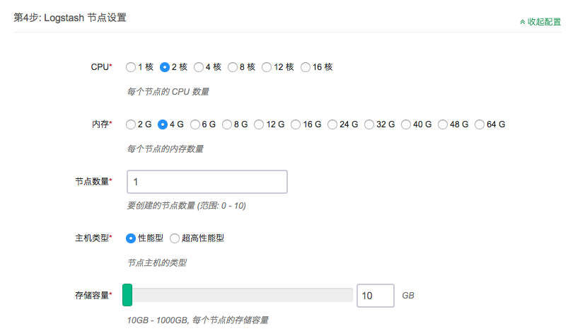
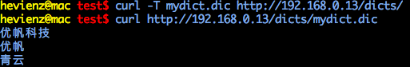
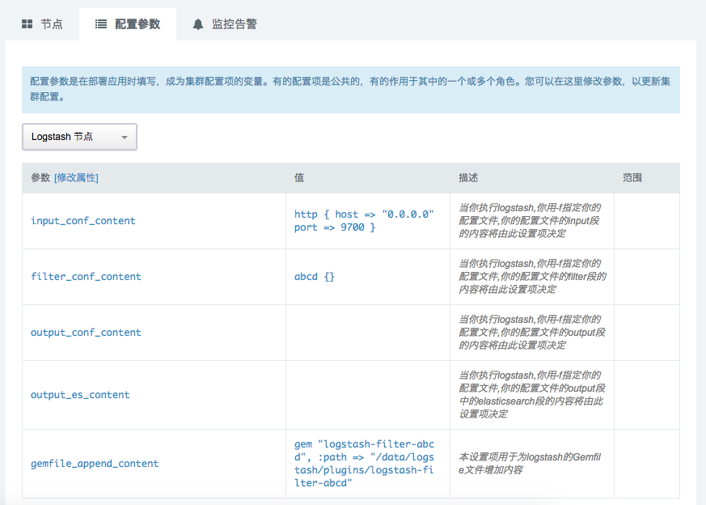
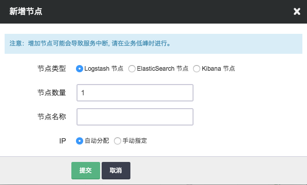
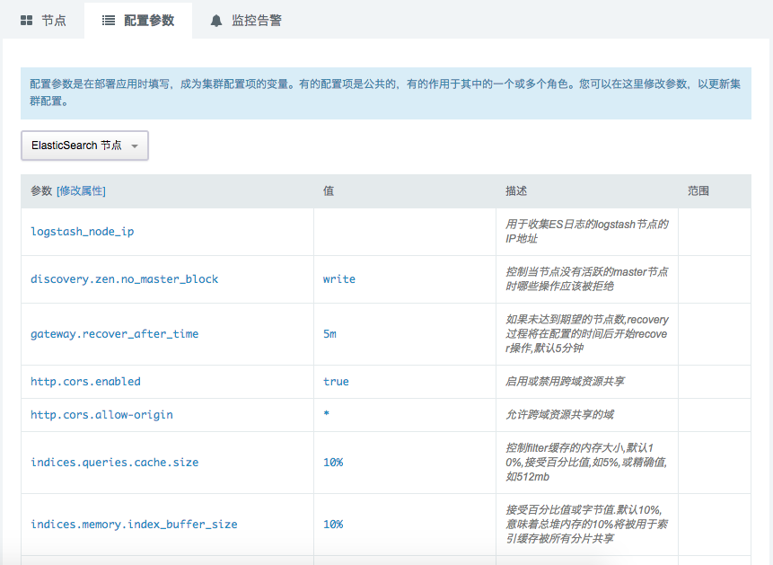

# ELK on QingCloud AppCenter 用户指南

## 简介

_ELK_ 是 _ElasticSearch_ 、 _Kibana_ 和 _Logstash_ 这三个软件集合的简称, _ElasticSearch_ 是一个实时分布式搜索和分析引擎， _Kibana_ 则为 _ElasticSearch_ 提供了强大的可视化界面， _Logstash_ 为用户提供数据采集、转换、优化和输出的能力。 _ELK_ 目前被广泛应用于实时日志处理、全文搜索和数据分析等领域。

_ELK on QingCloud_ 将 _ElasticSearch_ 、_Kibana_ 和 _Logstash_ 集成到同一个集群服务中，以AppCenter云应用的形式交付给用户使用。

> 目前 _ELK on QingCloud_ 支持 _ElasticSearch 5.5.1_ 、_Kibana 5.5.1_ 和 _Logstash 5.4.3_

### ELK on QingCloud 的特点

* 一键集群安装部署
* 支持节点横向和纵向扩容
* ElasticSearch集成了IK Analysis中文分词插件，并为该插件提供了结巴分词的词库和IK自带的搜狗词库，同时还支持用户上传自定义词典
* ElasticSearch集成官方S3存储仓库插件支持，可通过标准S3接口与青云对象存储QingStor集成
* Logstash集成青云对象存储QingStor的input插件
* Logstash提供自定义插件能力
* Kibana集成Caddy，提供ElasticSearch节点失效时的故障转移能力
* 提供ES Head，ElasticHD可视化插件，方便用户通过浏览器使用ES
* 集群关键指标监控

## 部署ELK服务

### 第1步：基本设置


填写服务`名称`和`描述`，选择版本

### 第2步：ElasticSearch节点设置


填写 ElasticSearch 节点CPU、内存、节点数量、主机类型及数据盘大小等配置信息。

### 第3步：Kibana节点设置


填写 Kibana 节点CPU、内存、节点数量及主机类型等配置信息。

### 第4步：Logstash节点设置



填写 Logstash 节点CPU、内存、节点数量、主机类型及数据盘大小等配置信息。

### 第5步：网络设置


出于安全考虑，所有的集群都需要部署在私有网络中，请选择自己创建的已连接路由器的私有网络

### 第6步：服务环境参数设置


提供了近20个服务环境参数可以配置。可以点击`展开配置`对所有配置项进行修改，也可使用默认值并在集群创建后按需进行修改。

### 第7步: 用户协议

阅读并同意青云 APP Center 用户协议之后即可开始部署应用。

## ELK on QingCloud 使用简介

### 查看服务详情


创建成功后，点击集群列表页面相应集群可查看集群详情。可以看到集群分为ElasticSearch节点、Kibana节点和Logstash节点三种角色。其中ElasticSearch节点为集群化部署方式，节点数至少为3，默认为3节点；Logstash节点可通过增加节点数的方式来满足上层应用的故障转移需求。ElasticSearch节点可提供远程扩展字典及热更新，Logstash节点提供用户自定义插件能力，具体使用方法将在下文中详述。

### 场景一：ElasticSearch中文自定义分词使用方法

第一步，在集群详情页面找到任意Logstash节点的IP地址。

第二步，通过`curl -T <字典文件> http://<Logstash节点IP>/dicts/`命令上传用户自定义字典。上传成功后可通过访问`http://<Logstash节点IP>/dicts/`来查看字典文件。



第二步，在集群详情页面中切换到配置参数标签页，选择"ElasticSearch节点"进行参数配置，设置remote\_ext\_dict设置项为用户自定义字典的可访问url (如示例中为http://192.168.0.13/dicts/mydict.dic) 后保存,然后重启集群中的ElasticSearch节点。

第三步，测试中文分词功能。

使用如下bash脚本测试中文分词功能，请将192.168.0.10替换为集群中任意ElasticSearch节点的IP地址。

```bash
HOST=192.168.0.10

# 创建 index 索引
curl -XPUT http://$HOST:9200/index

# 创建 mapping
curl -XPOST http://$HOST:9200/index/fulltext/_mapping -d'
{
        "properties": {
            "content": {
                "type": "text",
                "analyzer": "ik_max_word",
                "search_analyzer": "ik_max_word"
            }
        }
}'

# 索引 一些 文档
curl -XPOST http://$HOST:9200/index/fulltext/1 -d'
{"content":"美国留给伊拉克的是个烂摊子吗"}
'

curl -XPOST http://$HOST:9200/index/fulltext/2 -d'
{"content":"公安部：各地校车将享最高路权"}
'

curl -XPOST http://$HOST:9200/index/fulltext/3 -d'
{"content":"中韩渔警冲突调查：韩警平均每天扣1艘中国渔船"}
'

curl -XPOST http://$HOST:9200/index/fulltext/4 -d'
{"content":"中国驻洛杉矶领事馆遭亚裔男子枪击 嫌犯已自首"}
'

curl -XPOST http://$HOST:9200/index/fulltext/5 -d'
{"content":"北京优帆科技有限公司于2012年4月正式成立，是全球首家实现资源秒级响应并按秒计量的基础云服务商"}
'

curl -XPOST http://$HOST:9200/index/fulltext/6 -d'
{"content":"青云的12字决：从初创企业到云生态的蜕变"}
'

printf "\n\n"

# 高亮 查询
curl -XPOST http://$HOST:9200/index/fulltext/_search  -d'
{
    "query" : { "match" : { "content" : "中国" }},
    "highlight" : {
        "pre_tags" : ["<tag1>", "<tag2>"],
        "post_tags" : ["</tag1>", "</tag2>"],
        "fields" : {
            "content" : {}
        }
    }
}
'

printf "\n\n"

curl -XPOST http://$HOST:9200/index/fulltext/_search -d'
{
    "query" : { "match" : { "content" : "青云" }},
    "highlight" : {
        "pre_tags" : ["<tag1>", "<tag2>"],
        "post_tags" : ["</tag1>", "</tag2>"],
        "fields" : {
            "content" : {}
        }
    }
}
'

printf "\n\n"

curl -XPOST http://$HOST:9200/index/fulltext/_search  -d'
{
    "query" : { "match" : { "content" : "优帆科技" }},
    "highlight" : {
        "pre_tags" : ["<tag1>", "<tag2>"],
        "post_tags" : ["</tag1>", "</tag2>"],
        "fields" : {
            "content" : {}
        }
    }
}
'

printf "\n\n"
```

第四步，查看中文分词结果，结果如下图红色部分所示既为成功。即"中国"、"青云"、"优帆科技"被当做固定的中文分词表示。


第五步，更新用户自定义字典，ElasticSearch会自动检测http响应头中的Last-Modified和ETag的变化，来进行分词字典的热更新。

> 更多细节请关注[IK Analysis plugin](https://github.com/medcl/elasticsearch-analysis-ik)

### 场景二：ElasticSearch Snapshot 与 QingStor 对象存储集成

QingStor对象存储为用户提供了云端可无限扩展的通用数据存储服务，具有安全可靠、简单易用、高性能、低成本等特点。 用户可以将数据、日志、静态资源等多种文件类型，通过多种方式上传至QingStor对象存储中，以满足日常数据存储、归档、分析等需求。 为了更好的满足用户的需求，青云提供了ElasticSearch、Logstash等与QingStor对象存储的集成功能。

Elasticsearch可以通过快照（snapshot）将指定index甚至整个cluster的数据存储到某远端仓库（repository）, 并能从该远端仓库存储的快照中恢复数据。 因Elasticsearch可以指定Amazon S3作为远程仓库，而QingStor又兼容AWS S3 API, 所以青云提供的Elasticsearch服务可以通过AWS Cloud Plugin与QingStor对象存储集成以便生成快照将数据存储到到QingStor中，并可以在必要时从中恢复。

一、要在Elasticsearch中创建snapshot，首先要创建一个repository

```bash
curl -XPUT 'http://192.168.0.10:9200/_snapshot/my_es_repos/' -d'
{
  "type": "s3",
  "settings": {
    "endpoint": "s3.pek3a.qingstor.com",
    "access_key": "<YourAccessKey>",
    "secret_key": "<YourSecretKey>",
    "bucket": "my_qingstor_bucket"
  }
}
'
```

上述命令必须指定的几个关键参数包括：

```
集群节点地址           192.168.0.10
repository            my_es_repos
endpoint              s3.pek3a.qingstor.com (以北京3区为例，其他区需将pek3a改为相应名称如sh1a，gd1等)
access_key            青云账号关联的access_key
secret_key            青云账号关联的secret_key
bucket                QingStor上bucket名称my_qingstor_bucket（如果不存在将创建出来）
```

二、创建了repository后，可通过如下命令获取、删除repository：

```bash
获取指定repository信息
curl -XGET 'http://192.168.0.10:9200/_snapshot/my_es_repos/'

获取满足特定条件的repository信息
curl -XGET 'http://192.168.0.10:9200/_snapshot/repo*,*backup*'

获取所有repository信息
curl -XGET 'http://192.168.0.10:9200/_snapshot/_all/'

删除repository
curl -XDELETE 'http://192.168.0.10:9200/_snapshot/my_es_repos'
```

三、创建了repository后，用如下命令即可创建名为snapshot1的快照（该快照将会存放在之前指定的QingStor的bucket my_qingstor_bucket中）：

```bash
创建包含集群所有index的snapshot
curl -XPUT 'http://192.168.0.10:9200/_snapshot/my_es_repos/snapshot1?wait_for_completion=true'

创建包含集群指定index(此处为index_1,index_2)的snapshot
curl -XPUT 'http://192.168.0.10:9200/_snapshot/s3_repos_es_1/snapshot1?wait_for_completion=true' -d'
{
  "indices": "index_1,index_2",
  "ignore_unavailable": true,
  "include_global_state": false
}
'
wait_for_completion为true，该命令将会在快照创建完成返回
wait_for_completion为false，该命令将会在快照初始化完成就返回
```

四、创建了快照后，可以通过如下命令查看、删除快照

```bash
查看指定repository中某snapshot信息
curl -XGET 'http://192.168.0.10:9200/_snapshot/my_es_repos/snapshot1'

查看指定repository中所有snapshot信息
curl -XGET 'http://192.168.0.10:9200/_snapshot/my_es_repos/_all'

删除snapshot
curl -XDELETE 'http://192.168.0.10:9200/_snapshot/my_es_repos/snapshot1'
```

五、可以通过如下命令恢复存储的在QingStor的快照到Elasticsearch集群：

```bash
恢复包含集群所有index的snapshot
curl -XPOST 'http://192.168.0.10:9200/_snapshot/s3_repos_es_1/snapshot1/_restore'

恢复包含集群指定index(此处为index_1,index_2)的snapshot
curl -XPOST 'http://192.168.0.10:9200/_snapshot/s3_repos_es_1/snapshot1/_restore' -d'
{
  "indices": "index_1,index_2",
  "ignore_unavailable": true,
  "include_global_state": false,
  "rename_pattern": "index_(.+)",
  "rename_replacement": "restored_index_$1"
}
'
要恢复的index必须是集群中处于关闭状态的index, 处于打开状态的index将会提示无法恢复
```

六、恢复快照到另一个不同的集群，用户可以用这种方法在不同集群之间通过QingStor导入导出数据：

```bash
存储在snapshot中的信息不是和某个具体的集群或集群名字绑定的，因此可以把在一个集群中产生的快照恢复到另一个集群中去。

恢复到一个新集群前需要做的是在新的集群中生成和老的集群同样repository（必须使用同样的参数，具体方法请参考第一小节）。 需要注意的是，新集群的版本必须和老集群一致或者更新。

在新的集群创建好与老集群相同的repository后，就可以通过第五节中提到的命令（需要把ip地址192.168.0.10改成新集群里节点的地址）将老集群的数据恢复到新集群上去。
```

> 注解 更详细的有关集群快照的生成和恢复的信息请参考[Elasticsearch官方文档](https://www.elastic.co/guide/en/elasticsearch/reference/5.5/modules-snapshots.html)

### 场景三：ElasticSearch集群日志查看

第一步，在集群列表页面，在ELK集群上点击右键选择 **自定义服务** > **收集ES日志**，然后选择 **ElasticSearch节点** 点击提交。

第二步，任务执行成功后可通过浏览器访问`http://<Logstash节点IP>/logs/`查看对应ES节点的日志。

> 注解 如存在多个Logstash节点请在集群详情页面切换到参数配置界面，配置ElasticSearch节点的logstash_node_ip配置项。

### 场景四：Logstash-input-qingstor插件使用方式

ELK on QingCloud 的 Logstash 默认集成了 Logstash-input-qingstor 插件，用户只需要简单的配置即可使用。用插件之前请先在 青云控制台 申请 [Access Key](https://console.qingcloud.com/access_keys/) 和  [创建Bucket](https://docs.qingcloud.com/qingstor/guide/index.html#id2)。

第一步，在集群详情页面，切换到参数配置页面，选择Logstash节点，修改`input_conf_content`配置项为如下，点击保存。

```
qingstor {
    access_key_id => "your_access_key_id"
    secret_access_key => "your_secret_access_key"
    bucket => "bucket_name"
    region => "pek3a"
}
```

> 请根据您的具体配置替换上面的配置，其他配置参数详情请参见[手册](https://github.com/yunify/logstash-output-qingstor/blob/master/docs/index.asciidoc)

第二步，保存成功后请在您配置的bucket上上传日志文件。

第三步，使用浏览器打开`http://<Logstash节点IP>:5601/`，配置index pattern后，既可在Discover查看到导入的日志。

### 场景五：Logstash插件安装使用方法

> 此处以logstash-output-influxdb插件的安装为例，其他插件安装方式类似

第一步，在集群列表页面的Logstash节点上点击节点ID右侧的显示器图标，打开Web终端。输入默认用户名\(ubuntu\)、密码\(p12cHANgepwD\)，进入shell。

第二步，进入`/data/logstash/plugins`目录，运行`git clone https://github.com/logstash-plugins/logstash-output-influxdb.git`下载logstash-output-influxdb插件。

第三步，在集群详情页面，切换到参数配置页面，选择Logstash节点，修改`gemfile_append_content`配置项为如下，点击保存。

```
gem "logstash-output-influxdb", :path => "/data/logstash/plugins/logstash-output-influxdb"
```

第四步，打开之前的Web终端，执行`sudo docker exec -it <b8b0db543f98> logstash-plugin install --no-verify`

> 请将`<b8b0db543f98>`替换为您的logstash的容器ID，可通过命令`sudo docker ps`查看

第五步，在集群详情页面，切换到参数配置页面，选择Logstash节点，修改`output_conf_content`配置项为如下，点击保存。

```
influxdb {
        data_points => {
          "duration" => "%{data.event.duration}"
        }
        host => '192.168.0.7'
        password => ''
        user => ''
        db => 'elk'
}
```

> 请参考相关插件的配置参数进行必要的修改，logstash-output-influxdb相关的配置参数请参考其[文档](https://www.elastic.co/guide/en/logstash/5.5/plugins-outputs-influxdb.html)

> 如您有多个Logstash节点，请在所有Logstash节点上执行第1、2、4步骤。

第六步，重启Logstash节点。

在集群列表页面右键点击您的ELK集群，点击重启，选择Logstash节点，点击提交，此时Logstash节点将会重启。

第七步，测试插件是否如预期工作，Logstash节点默认配置了http input插件，可通过此插件开启的9700端口进行测试，执行`curl -d "qingcloud" 127.0.0.1:9700`将一条日志发往Logstash，如成功，则influxdb中将新增一条point，说明插件配置生效，如发现influxdb中没有新增point，请查看logstash日志，位置为`/data/logstash/logs`。

### 场景六：Logstash自定义插件支持

第一步，在集群列表页面的Logstash节点上点击节点ID右侧的显示器图标，打开Web终端。输入默认用户名\(ubuntu\)、密码\(p12cHANgepwD\)，进入shell。

第二步，在shell中执行`sudo docker ps`，查看Logstash的Container ID，然后执行`sudo docker exec -it <c9c0b43c6847> logstash-plugin generate --type <filter> --name <abcd> --path /data/logstash/plugins`，其中将`<c9c0b43c6847>`替换为您的 Logstash的Container ID，`<filter>`替换为您想要定制的插件的类型，类型包括`{input, filter, codec, output}`，`<abcd>`替换为您要开发的插件的名称。执行成功后显示如图所示。


第三步，进入`/data/logstash/plugins`目录，找到新生成的插件目录，修改插件以符合用户的业务需求。

第四步，在集群列表页面中切换到配置参数标签页，选择"Logstash节点"进行参数配置，点击"修改属性"，根据您的插件类型及参数修改相应的配置项，如示例中，将`filter_conf_content`修改为`abcd {}`，根据您插件所在位置修改`gemfile_append_content`，插件位置前缀必须是`/data/logstash/plugins`，如示例中，将`gemfile_append_content`修改为`gem "logstash-filter-abcd", :path => "/data/logstash/plugins/logstash-filter-abcd"`，修改后保存即可，如下图为示例中配置的展示。

> 如您有多个Logstash节点，请在所有Logstash节点上执行第1、2、3步骤。



第五步，测试插件是否如预期工作，Logstash节点默认配置了http input插件，可通过此插件开启的9700端口进行测试，执行`curl -d "qingcloud" 127.0.0.1:9700`将一条日志发往Logstash，在浏览器中访问Kibana节点提供的Web界面，默认进入配置索引模式界面，如图，直接点击Create即可，点击左侧的Discover菜单项，显示近期接收到的日志，如图，示例中的`logstash_filter_abcd`成功将原消息中的`qingcloud`替换为了`Hello World!`，说明插件配置生效。


### 场景七：Logstash 自定义启动配置文件

默认情况下，logstash的启动配置文件会根据 **配置参数** 中 **Logstash节点** 的 input_conf_content、filter_conf_content、output_conf_content配置项自动生成，生成后存放在Logstash节点的`/data/logstash/config/logstash.conf.sample`，在logstash启动前，将logstash.conf.sample拷贝成logstash.conf。如果用户想自定义logstash.conf配置文件，只需要在`/data/logstash/config/`目录创建logstash.conf.lock文件，此时logstash.conf.sample依然会根据 **配置参数** 来生成，但并不会在启动前，用logstash.conf.sample文件覆盖logstash.conf文件。

用户通过上述方法修改logstash.conf配置文件后，需通过以下命令重启logstash服务。

```
sudo docker exec -it <b8b0db543f98> restart.sh
```

> 请将`<b8b0db543f98>`替换为您的logstash的容器ID，可通过命令`sudo docker ps`查看

如显示`[=[Restart]=] Can't lock the file.`，则表示其他操作正在执行，请稍后再次尝试重启命令。

### 场景八：Kibana简要使用说明

在浏览器中打开`http://<Kibana节点IP>:5601/`，首先会提示创建index pattern，默认情况下，Kibana 认为您要访问的是通过 Logstash 导入 Elasticsearch 的数据。这时候您可以用默认的 logstash-* 作为您的 index pattern。

> 如果显示 "Unable to fetch mapping. Do you have indices matching the pattern?"，可通过Logstash节点上默认开启http插件发送一条日志，命令如下`curl -d "ELK on QingCloud" http://<Logstash节点IP>:9700/`

Index pattern创建成功后可点击Discover查看导入的日志。

> 关于Kibana更多的使用方式，请参考[官方文档](https://www.elastic.co/guide/en/kibana/5.5/index.html)

### 场景九：集群组件说明

_ELK on QingCloud_ 为用户提供了以下组件，用以服务集群其他组件或直接为用户提供服务。

* [head](http://mobz.github.io/elasticsearch-head/) 提供一个Elasticsearch cluster的web控制台，用户可以在这个控制台里很方便的查看集群拓扑架构、监控集群状态，进行节点和索引级别的各种操作，以及进行数据的浏览、查询、分析等。在浏览器输入网址 `http://<Kibana节点IP>:9100/` 即可使用该插件提供的集群控制台。进入后请输入`http://<任意ElasticSearch节点IP>:9200/`后，点击连接即可查看ElasticSearch集群状态。
* [ElasticHD](https://github.com/farmerx/ElasticHD) Elasticsearch是一个ElasticSearch可视化管理工具, 支持ES监控、实时搜索，Index template快捷替换修改，索引列表信息查看，SQL converts to DSL等功能。在浏览器输入网址 `http://<Kibana节点IP>:9800/` 即可使用该插件提供的集群控制台。
* [Caddy](https://caddyserver.com/) Caddy 是一个支持 HTTP/2 的跨平台 Web 服务器，使用和配置都非常简单。 _ELK on QingCloud_ 使用Caddy是为Kibana提供ElasticSearch节点失效时的故障转移能力，并且为在Logstash节点上上传字典提供便利，同时使得ElasticSearch的日志查看变得更加方便。集群中Caddy运行在Kibana节点的9200端口和Logstash节点的80端口。

## 在线伸缩

### 增加节点

可以在ELK详情页点击 `新增节点` 按钮可以增加 `ElasticSearch 节点`、`Kibana 节点` 或 `Logstash 节点`的数量，可以对每个新增节点指定 IP 或选择自动分配。


### 删除节点

可以在 ELK 详情页选中需要删除的节点，然后点击 `删除` 按钮，只能一次删除一个，并且必须等到上个节点删除后且ElasticSearch集群完成recover操作后才能删除下一个节点，否则数据可能会丢失。删除节点过程中会锁定ELK集群不让对其进行其它生命周期操作。

> 删除集群中的ElasticSearch节点需等待集群recover操作完成，集群恢复到Green状态，可通过访问任意ElasticSearch节点的9200端口来获得集群状态，示例命令为`curl http://192.168.0.5:9200/_cluster/stats`，请将192.168.0.5替换为您的ELK集群中的任意ElasticSearch节点IP。也可以通过浏览器访问Kibana节点的9100端口提供的ES Head界面或Kibana节点的9800端口提供的ElasticHD界面来查看集群状态。

### 纵向伸缩

ELK允许分别对各种角色的节点进行纵向的扩容及缩容。


## 监控告警

### 资源级别的监控与告警

我们对ELK集群的每个节点提供了资源级别的监控和告警服务，包括 CPU 使用率、内存使用率、硬盘使用率等。

### ElasticSearch 集群监控

为了帮助用户更好的管理和维护ELK集群，我们提供了部分针对ElasticSearch集群的监控，可通过点击任意ElasticSearch节点右侧的监控按钮来查看。


## 配置参数

ELK提供了近20个配置参数，可以通过 `配置参数` 来定制个性化的ELK服务并进行调优。

### 修改配置参数

在 ELK 详情页，点击 `配置参数` Tab 页，切换到`ElasticSearch节点`或`Logstash节点`，点击 `修改属性`，修改完后，需要进行 "保存"。如图所示：



## 注意事项
使用 Elasticsearch 需要注意的一些事项

### 安全

Elasticsearch 本身的 API 没有提供安全机制，同时 Elasticsearch 的 API 的功能非常强大，所以强烈不建议通过公网将 Elasticsearch 直接暴露出去，Elasticsearch 需要在应用或者 API 网关后面。 针对Elasticsearch的攻击频发，因此建议用户通过VPN的方式而不是端口转发的方式访问集群节点，配置青云VPN的方法详见 [用户指南](https://docs.qingcloud.com/guide/vpn.html) 。