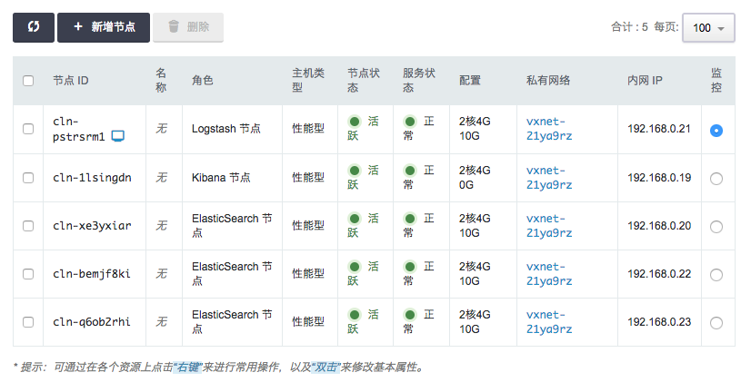
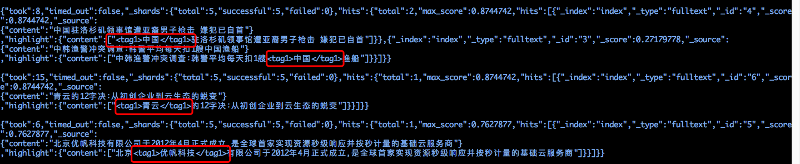

# ELK on QingCloud AppCenter 用户指南


## 简介


*ELK* 是 *ElasticSearch* 、 *Kibana* 和 *Logstash* 这三个软件集合的简称, *ElasticSearch* 是一个实时分布式搜索和分析引擎， *Kibana* 则为 *ElasticSearch*提供了强大的可视化界面， *Logstash* 为用户提供数据采集、转换、优化和输出的能力。 *ELK* 目前被广泛应用于实时日志处理、全文搜索和数据分析等领域。


*ELK on QingCloud* 将 *ElasticSearch* 、*Kibana* 和 *Logstash* 集成到同一个集群服务中，以AppCenter云应用的形式交付给用户使用。
>目前 *ELK on QingCloud* 支持的 *ElasticSearch* 、*Kibana* 和 *Logstash* 版本是 5.5.1


### ELK on QingCloud 的特点


* 一键集群安装部署
* 支持节点横向和纵向扩容
* ES集成官方S3、HDFS存储仓库插件支持
* ES集成官方Python、JavaScript脚本插件支持
* ES集成IK Analysis中文分词插件，并提供远程自定义词典
* Kibana集成Caddy，提供ES节点失效时的故障转移能力
* Logstash提供自定义插件能力
* 提供ES Head，ElasticHD节点，方便用户通过浏览器使用ES
* 集群关键指标监控


## 部署ELK服务

### 第1步：基本设置


填写服务`名称`和`描述`，选择版本

### 第2步：ElasticSearch节点设置


填写 ElasticSearch 节点CPU、内存、节点数量、主机类型及数据盘大小等配置信息。

### 第3步：Kibana节点设置


填写 Kibana 节点CPU、内存、节点数量及主机类型等配置信息。

### 第4步：Logstash节点设置


填写 Logstash 节点CPU、内存、节点数量、主机类型及数据盘大小等配置信息。

### 第5步：ES Head节点设置


填写 ES Head 节点CPU、内存、节点数量及主机类型等配置信息。

### 第6步：ElasticHD节点设置


填写 ElasticHD 节点CPU、内存、节点数量及主机类型等配置信息。

### 第7步：网络设置


出于安全考虑，所有的集群都需要部署在私有网络中，请选择自己创建的已连接路由器的私有网络

### 第8步：服务环境参数设置


提供了近20个服务环境参数可以配置。可以点击`展开配置`对所有配置项进行修改，也可使用默认值并在集群创建后按需进行修改。

### 第9步: 用户协议

阅读并同意青云 APP Center 用户协议之后即可开始部署应用。

## ELK on QingCloud 使用简介

### 查看服务详情



创建成功后，点击集群列表页面相应集群可查看集群详情。可以看到集群分为ElasticSearch节点、Kibana节点、Logstash节点、ES Head节点和ElasticHD节点五种角色。其中ElasticSearch节点为集群化部署方式，节点数至少为3，默认为3节点；其他节点可通过增加节点数的方式来满足上层应用的故障转移需求。ElasticSearch节点可提供远程扩展字典及热更新，Logstash节点提供用户自定义插件能力，具体使用方法将在下文中详述。

### 场景一：ElasticSearch中文自定义分词使用方法

第一步，在ELK集群所在私有网络中创建一台用于提供http文件下载服务的主机（或任意ElasticSearch节点可访问到的主机），在其上安装nginx等可用于提供http文件下载功能的软件，将用户自定义扩展字典放入其中，确保用户可通过url下载到相应的字典文件。

VPC部署示意图如下：


访问字典文件示意图如下：


第二步，在集群列表页面中切换到配置参数标签页，选择"ElasticSearch节点"进行参数配置，设置remote_ext_dict设置项为用户自定义字典的可访问url（如示例中为http://192.168.0.7/custom.dic）后保存,然后重启集群中的ElasticSearch节点。

第三步，测试中文分词功能。

使用如下bash脚本测试中文分词功能，请将192.168.0.14替换为集群中任意ElasticSearch节点的IP地址。

```bash
HOST=192.168.0.14

# 创建 index 索引
curl -XPUT http://$HOST:9200/index

# 创建 mapping
curl -XPOST http://$HOST:9200/index/fulltext/_mapping -d'
{
        "properties": {
            "content": {
                "type": "text",
                "analyzer": "ik_max_word",
                "search_analyzer": "ik_max_word"
            }
        }
}'

# 索引 一些 文档
curl -XPOST http://$HOST:9200/index/fulltext/1 -d'
{"content":"美国留给伊拉克的是个烂摊子吗"}
'

curl -XPOST http://$HOST:9200/index/fulltext/2 -d'
{"content":"公安部：各地校车将享最高路权"}
'

curl -XPOST http://$HOST:9200/index/fulltext/3 -d'
{"content":"中韩渔警冲突调查：韩警平均每天扣1艘中国渔船"}
'

curl -XPOST http://$HOST:9200/index/fulltext/4 -d'
{"content":"中国驻洛杉矶领事馆遭亚裔男子枪击 嫌犯已自首"}
'

curl -XPOST http://$HOST:9200/index/fulltext/5 -d'
{"content":"北京优帆科技有限公司于2012年4月正式成立，是全球首家实现资源秒级响应并按秒计量的基础云服务商"}
'

curl -XPOST http://$HOST:9200/index/fulltext/6 -d'
{"content":"青云的12字决：从初创企业到云生态的蜕变"}
'

printf "\n\n"

# 高亮 查询
curl -XPOST http://$HOST:9200/index/fulltext/_search  -d'
{
    "query" : { "match" : { "content" : "中国" }},
    "highlight" : {
        "pre_tags" : ["<tag1>", "<tag2>"],
        "post_tags" : ["</tag1>", "</tag2>"],
        "fields" : {
            "content" : {}
        }
    }
}
'

printf "\n\n"

curl -XPOST http://$HOST:9200/index/fulltext/_search -d'
{
    "query" : { "match" : { "content" : "青云" }},
    "highlight" : {
        "pre_tags" : ["<tag1>", "<tag2>"],
        "post_tags" : ["</tag1>", "</tag2>"],
        "fields" : {
            "content" : {}
        }
    }
}
'

printf "\n\n"

curl -XPOST http://$HOST:9200/index/fulltext/_search  -d'
{
    "query" : { "match" : { "content" : "优帆科技" }},
    "highlight" : {
        "pre_tags" : ["<tag1>", "<tag2>"],
        "post_tags" : ["</tag1>", "</tag2>"],
        "fields" : {
            "content" : {}
        }
    }
}
'

printf "\n\n"

```

第四步，查看中文分词结果，结果如下图红色部分所示既为成功。即"中国"、"青云"、"优帆科技"被当做固定的中文分词表示。



第五步，更新用户自定义字典，ElasticSearch会自动检测http响应头中的Last-Modified和ETag的变化，来进行分词字典的热更新。

### 场景二：ElasticSearch集群慢索引、慢搜索日志查看

第一步，在集群列表页面的ElasticSearch节点上点击节点ID右侧的显示器图标，打开Web终端。输入默认用户名(ubuntu)、密码(p12cHANgepwD)，进入shell。

第二步，进入`/data/elasticsearch/logs`目录，形如`<cl-z3pj0axe>_index_indexing_slowlog.log`的日志为慢索引日志，形如`<cl-z3pj0axe>_index_search_slowlog.log`的日志为慢搜索日志，用户需将`<cl-z3pj0axe>`替换为自己的集群ID。

### 场景三：Logstash自定义插件支持

第一步，在集群列表页面的Logstash节点上点击节点ID右侧的显示器图标，打开Web终端。输入默认用户名(ubuntu)、密码(p12cHANgepwD)，进入shell。

第二步，在shell中执行`sudo docker ps`，查看Logstash的Container ID，然后执行`sudo docker exec -it <c9c0b43c6847> logstash-plugin generate --type <filter> --name <abcd> --path /data/logstash/plugins`，其中将`<c9c0b43c6847>`替换为你的 Logstash的Container ID，`<filter>`替换为你想要定制的插件的类型，类型包括`{input, filter, codec, output}`，`<abcd>`替换为你要开发的插件的名称。执行成功后显示如图所示。


第三步，进入`/data/logstash/plugins`目录，找到新生成的插件目录，修改插件以符合用户的业务需求。

第四步，在集群列表页面中切换到配置参数标签页，选择"Logstash节点"进行参数配置，点击"修改属性"，根据你的插件类型及参数修改相应的配置项，如示例中，将`filter_conf_content`修改为`	abcd {}`，根据你插件所在位置修改`gemfile_append_content`，插件位置前缀必须是`/data/logstash/plugins`，如示例中，将`gemfile_append_content`修改为`gem "logstash-filter-abcd", :path => "/data/logstash/plugins/logstash-filter-abcd"`，修改后保存即可，如下图为示例中配置的展示。


第五步，测试插件是否如预期工作，Logstash节点默认配置了http input插件，可通过此插件开启的9700端口进行测试，执行`curl -d "qingcloud" 127.0.0.1:9700`将一条日志发往Logstash，在浏览器中访问Kibana节点提供的Web界面，默认进入配置索引模式界面，如图，直接点击Create即可，点击左侧的Discover菜单项，显示近期接收到的日志，如图，示例中的`logstash_filter_abcd`成功将原消息中的`qingcloud`替换为了`Hello World!`，说明插件配置生效。


## 在线伸缩

### 增加节点

可以在ELK详情页点击 `新增节点` 按钮可以增加 `ElasticSearch 节点`、`Kibana 节点`、`Logstash 节点`、`ES Head 节点` 或 `ElasticHD 节点`的数量，可以对每个新增节点指定 IP 或选择自动分配。


### 删除节点

可以在 ELK 详情页选中需要删除的节点，然后点击 `删除` 按钮，只能一次删除一个，并且必须等到上个节点删除后且ElasticSearch集群完成recover操作后才能删除下一个节点，否则数据可能会丢失。删除节点过程中会锁定ELK集群不让对其进行其它生命周期操作。

> 删除集群中的ElasticSearch节点需等待集群recover操作完成，集群恢复到Green状态，可通过访问任意ElasticSearch节点的9200端口来获得集群状态，示例命令为`curl http://192.168.0.5:9200/_cluster/stats`，请将192.168.0.5替换为你的ELK集群中的任意ElasticSearch节点IP。也可以通过浏览器访问ES Head节点的9100端口或ElasticHD节点的9800端口来查看集群状态。

### 纵向伸缩

SparkMR允许分别对各种角色的节点进行纵向的扩容及缩容。


## 监控告警

### 资源级别的监控与告警

我们对ELK集群的每个节点提供了资源级别的监控和告警服务，包括 CPU 使用率、内存使用率、硬盘使用率等。

### ElasticSearch 集群监控

为了帮助用户更好的管理和维护ELK集群，我们提供了部分针对ElasticSearch集群的监控，可通过点击任意ElasticSearch节点右侧的监控按钮来查看。

## 配置参数

ELK提供了近20个配置参数，可以通过 `配置参数` 来定制个性化的ELK服务并进行调优。

### 修改配置参数

在 ELK 详情页，点击 `配置参数` Tab 页，切换到`ElasticSearch节点`或`Logstash节点`，点击 `修改属性`，修改完后，需要进行 "保存"。如图所示：


