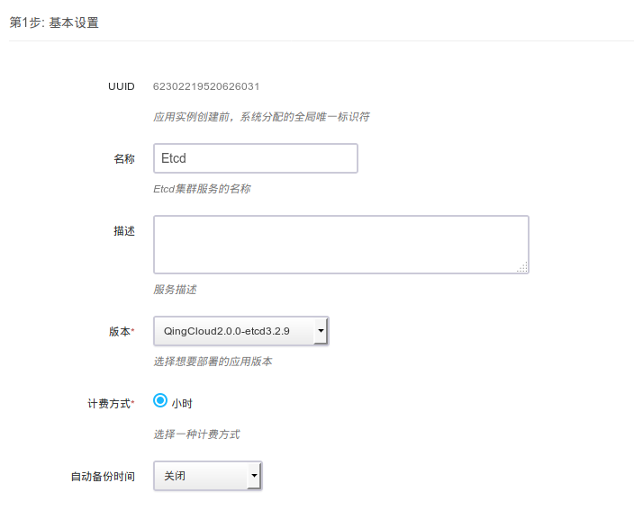
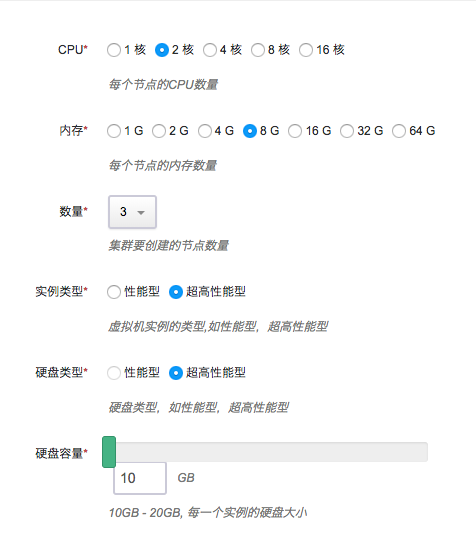
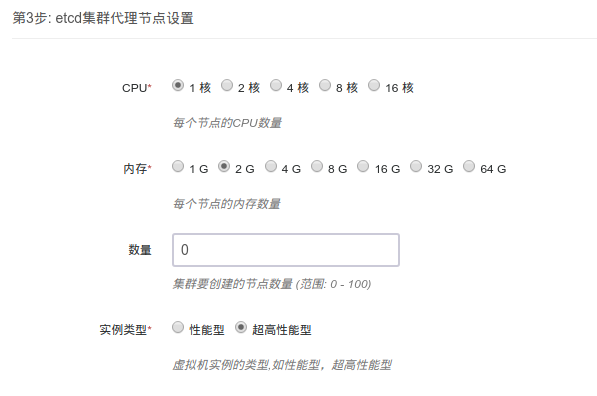
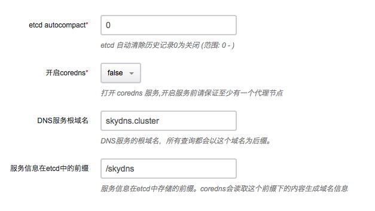
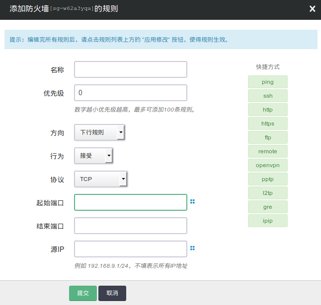
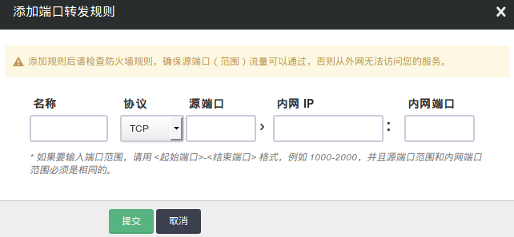

# etcd on QingCloud AppCenter 用户指南

## 简介

青云QingCloud etcd 服务提供的是原生 [CoreOS etcd](https://coreos.com/etcd/) 云服务，etcd 是一个为分布式系统设计的分布式可靠的键值存储服务，应用程序可以从etcd中读取写入数据，监控数据变化。它主要用来提供注册服务，配置服务等功能。本应用方便用户在青云平台搭建 etcd 集群。应用借助 appcenter 提供的能力可以进行集群的动态扩容，备份恢复，健康检查和监控.并集成 coredns 方便用户通过 dns 进行服务发现。

## 创建 etcd 集群

> etcd 集群需要运行在受管私有网络中。所以在创建一个 etcd 集群之前，需要创建一个 [VPC](https://docs.qingcloud.com/guide/compute_network/vpc.html#id3) 和一个[受管私有网络](https://docs.qingcloud.com/guide/compute_network/vpc.html#id5)，受管私有网络需要加入 VPC，并开启 DHCP 服务（默认开启）。
除使用代理节点外，用户也可以使用青云的负载均衡器访问etcd服务。这里需要创建一个监听2379端口的监听器，具体请参考[这里
](https://docs.qingcloud.com/guide/compute_network/loadbalancer.html#tcp)

### 第一步：选择基本配置

1. 选择集群名称，描述，版本和计费方式
1. 设置自动备份时间

  

1. 选择etcd节点机器配置

  

  推荐使用超高性能型机器，建议硬盘大小为20G

1. 选择etcd代理节点配置

  

  这里没有推荐设置，coredns服务器会部署在代理节点上，如果需要dns功能，请部署此类型节点。

1. 设置集群所在私有网络

1. 配置集群需要的参数

  

+ etcd autocompact

    etcd 历史记录自动清除

+ 开启coredns

    打开coredns服务，会在代理节点上53端口启动dns服务器。

+ DNS服务根域名

    dns服务器服务的域名后缀，这里定义的后缀会在本服务器处理，其他的后缀会交给8.8.8.8

+ 服务信息在etcd中的前缀

    服务信息在etcd中的前缀，coredns会读取etcd中这个前缀下的数据，并形成记录。

> 目前集群中etcd节点的数量支持3、5、7. etcd代理节点没有数量限制。

### 第二步：创建成功

当 etcd 创建完成之后，您可以查看每个节点的运行状态。当节点的服务状态显示为“正常”状态，表示该节点启动正常。 当每个节点都启动正常后 etcd 集群显示为“活跃”状态，表示您已经可以正常使用 etcd 服务了。

如需使用coredns服务，请在vpc中添加端口转发规则，将udp53端口转发到etcd代理节点的udp53端口，并在防火墙中添加udp协议端口53下行规则。

如需使用etcd服务的负载均衡器，并在防火墙中添加tcp协议端口2379下行规则。

1. 添加防火墙规则

  

  起始端口设置为目标端口，协议根据需求选择（udp/tcp)。

  ** 要点击应用修改将设置同步，否则不会生效 **

1. 添加端口转发规则

  

  点击添加规则

  

  源端口选择协议，端口，然后填入私网ip的地址，协议和端口。

  ** 要点击应用修改将设置同步，否则不会生效 **

## 测试 etcd

etcd 创建完成之后可以进行连接测试。访问 [etcd](https://github.com/coreos/etcd/releases/tag/v3.2.9) 下载 etcd 并解压，您可以在 etcd 同一私有网络或跨网络的客户端上测试。现假设客户端和 etcd 在同一私有网络，etcd 集群有三个节点，IP 地址分别为192.168.100.10,192.168.100.11,192.168.100.12， 您可以通过如下命令连接 etcd：

```shell
etcdctl --endpoints http://192.168.100.10:2379,http://192.168.100.11:2379,http://192.168.100.12:2379 cluster-health
```

同时该应用也提供了REST接口，详情请参考 [官方文档](https://coreos.com/etcd/docs/latest/getting-started-with-etcd.html#reading-and-writing-to-etcd)

测试coredns

通过vpn连接vpc,然后使用dig访问coredns，并返回结果

```shell
dig www.baidu.com@192.168.0.3
```

> 192.168.0.3为etcd 代理节点ip地址

## 在线伸缩

### 增加节点

当 etcd 需增加节点以应付客户端逐步增多带来的压力，您可以在 etcd 详细页点击“新增节点”按钮。 最好保持节点数量为单数。需注意的是，增加节点会影响 etcd 的性能，因为每个节点上需要进行数据同步。增加 etcd 代理节点时可以同时添加，添加成功详情页会显示服务状态为活跃。


### 删除节点

当客户端连接并不多的时候您也可以在 etcd 详细页选中需要删除的节点，然后点“删除”按钮删除节点，以节省资源和费用。 同样，删除节点数只能为偶数，删除代理节点可以同时删除。

## 注意事项

1. 建议保持节点数量为单数，这样便于节点选举过程的进行。代理节点数量不限，目前支持最多7个。
1. 节点监控界面中 etcd_server_has_leader表示当前节点是否有leader领导，处于无leader状态的节点是不能提供服务的。节点会自动重新选举。
1. 具体使用方法请参考 [官方文档](https://coreos.com/etcd/)
