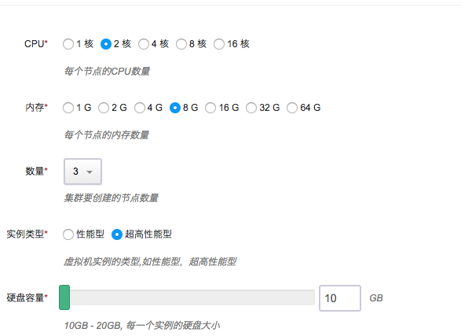

# etcd on QingCloud AppCenter 用户指南

<extoc></extoc>

## 简介

青云QingCloud etcd 服务提供的是原生 [CoreOS etcd](https://coreos.com/etcd/) 云服务，etcd 是一个为分布式系统设计的分布式可靠的键值存储服务，应用程序可以从etcd中读取写入数据，监控数据变化。它主要用来提供注册服务，配置服务等功能。本应用方便用户在青云平台搭建 etcd 集群。应用借助 appcenter 提供的能力可以进行集群的动态扩容，备份恢复，健康检查和监控.并集成 coredns 方便用户通过 dns 进行服务发现。

## 创建 etcd 集群

> etcd 集群需要运行在受管私有网络中。所以在创建一个 etcd 集群之前，需要创建一个 [VPC](https://appcenter-docs.qingcloud.com/user-guide/apps/docs/network-config/create_vxnet.html#1-创建-vpc-网络) 和一个[受管私有网络](https://appcenter-docs.qingcloud.com/user-guide/apps/docs/network-config/create_vxnet.html#2创建私有网络)，受管私有网络需要加入 VPC，并开启 DHCP 服务（默认开启）。
除使用代理节点外，用户也可以使用青云的负载均衡器访问etcd服务。这里需要创建一个监听2379端口的监听器，具体请参考[这里
](https://appcenter-docs.qingcloud.com/user-guide/apps/docs/network-config/public_loadbalancer.html#3为负载均衡器添加监听器)。

### 第一步：选择基本配置

1. 选择集群名称，描述，版本和计费方式
1. 设置自动备份时间

  

1. 选择etcd节点机器配置

  

  推荐使用超高性能型机器，建议硬盘大小为 20G

1. 选择 etcd 代理节点配置

  

  这里没有推荐设置，coredns 服务器会部署在代理节点上，如果需要 DNS 功能，请部署此类型节点。

1. 设置集群所在私有网络

1. 配置集群需要的参数

  

+ etcd autocompact

    etcd 历史记录自动清除

+ 开启coredns

    打开 coredns 服务，会在代理节点上 53 端口启动 DNS 服务器。如果启用 coredns 服务，请一定要创建代理节点。

+ DNS 服务根域名

    DNS 服务器服务的域名后缀，这里定义的后缀会在本服务器处理，其他的后缀会交给 8.8.8.8

+ 服务信息在 etcd 中的前缀

    服务信息在 etcd 中的前缀，coredns 会读取 etcd 中这个前缀下的数据，并形成记录。

> 目前集群中 etcd 节点的数量支持 3、5、7. etcd 代理节点没有数量限制。

### 第二步：创建成功

当 etcd 创建完成之后，您可以查看每个节点的运行状态。当节点的服务状态显示为“正常”状态，表示该节点启动正常。 当每个节点都启动正常后 etcd 集群显示为“活跃”状态，表示您已经可以正常使用 etcd 服务了。

如需使用 coredns 服务，请在 VPC 中添加端口转发规则，将 UDP 53 端口转发到 etcd 代理节点的 UDP 53 端口，并在防火墙中添加 UDP 协议端口 53 下行规则。

如需使用 etcd 服务的负载均衡器，并在防火墙中添加 TCP 协议端口 2379 下行规则。

1. 添加防火墙规则

  

  起始端口设置为目标端口，协议根据需求选择（UDP/TCP)。

  ** 要点击应用修改将设置同步，否则不会生效 **

1. 添加端口转发规则

  

  点击添加规则

  

  源端口选择协议，端口，然后填入私网 IP 的地址，协议和端口。

  ** 要点击应用修改将设置同步，否则不会生效 **

## 测试 etcd

etcd 创建完成之后可以进行连接测试。访问 [etcd](https://github.com/coreos/etcd/releases/tag/v3.2.9) 下载 etcd 并解压，您可以在 etcd 同一私有网络或跨网络的客户端上测试。现假设客户端和 etcd 在同一私有网络，etcd 集群有三个节点，IP 地址分别为192.168.100.10,192.168.100.11,192.168.100.12， 您可以通过如下命令连接 etcd：

```shell
etcdctl --endpoints http://192.168.100.10:2379,http://192.168.100.11:2379,http://192.168.100.12:2379 cluster-health
```

同时该应用也提供了 REST 接口，详情请参考 [官方文档](https://coreos.com/etcd/docs/latest/getting-started-with-etcd.html#reading-and-writing-to-etcd)。

测试 coredns

通过 VPN 连接 VPC,然后使用 dig 访问 coredns

```shell
dig www.baidu.com @192.168.0.3
; <<>> DiG 9.9.7-P3 <<>> www.baidu.com
;; global options: +cmd
;; Got answer:
;; ->>HEADER<<- opcode: QUERY, status: NOERROR, id: 58199
;; flags: qr rd ra; QUERY: 1, ANSWER: 3, AUTHORITY: 0, ADDITIONAL: 0

;; QUESTION SECTION:
;www.baidu.com.			IN	A

;; ANSWER SECTION:
www.baidu.com.		890	IN	CNAME	www.a.shifen.com.
www.a.shifen.com.	234	IN	A	61.135.169.121
www.a.shifen.com.	234	IN	A	61.135.169.125

;; Query time: 46 msec
;; SERVER: 202.106.0.20#53(202.106.0.20)
;; WHEN: Fri Oct 27 15:46:16 CST 2017
;; MSG SIZE  rcvd: 90
```

```shell
curl http://192.168.0.3/v2/keys/skydns/cluster/skydns/domain/test/ -d {"host":"192.168.0.5","port"}
dig test.domain.skydns.cluster @192.168.0.3
```

返回了地址记录

> 192.168.0.3 为 etcd 代理节点 IP 地址

## 在线伸缩

### 增加节点

当 etcd 需增加节点以应付客户端逐步增多带来的压力，您可以在 etcd 详细页点击“新增节点”按钮。 最好保持节点数量为单数。需注意的是，增加节点会影响 etcd 的性能，因为每个节点上需要进行数据同步。增加 etcd 代理节点时可以同时添加，添加成功详情页会显示服务状态为活跃。


### 删除节点

当客户端连接并不多的时候您也可以在 etcd 详细页选中需要删除的节点，然后点“删除”按钮删除节点，以节省资源和费用。 同样，删除节点数只能为偶数，删除代理节点可以同时删除。

## 注意事项

1. 建议保持节点数量为单数，这样便于节点选举过程的进行。代理节点数量不限，目前支持最多 7 个。
1. 节点监控界面中 etcd_server_has_leader 表示当前节点是否有 leader 领导，处于无 leader 状态的节点是不能提供服务的。节点会自动重新选举。
1. 具体使用方法请参考 [官方文档](https://coreos.com/etcd/)。
