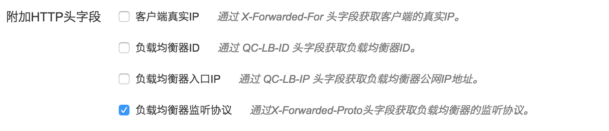

# Harbor on QingCloud AppCenter 用户手册

<extoc></extoc>

## 描述

[Harbor](https://github.com/vmware/harbor/) 是一个开源的企业级私有 Docker 镜像仓库方案，用于存储和分发 Docker 镜像，并提供基于角色的权限控制、仓库间 Image 异步复制、LDAP/AD 支持、图形界面等功能。

Harbor on QingCloud 将 Harbor 制作成了 App，能直接在 AppCenter 进行一键部署，并提供了一个高可用、高安全、高性能的解决方案，具有如下特性：

* 镜像存储集成 QingStor —— 通用的海量非结构化数据存储服务，由青云QingCloud 提供，具有安全可靠、简单易用、高性能、低成本等特点
* 支持应用节点横向和纵向伸缩
* 高可用
* 一键部署

## 部署镜像仓库

### 准备

在部署 App 之前，您需要创建一个 VPC 网络、一个负载均衡器和一个 QingStor 的 Bucket。

* 创建 VPC 和关联一个 Vxnet 私有网络，详情见 ([VPC 指南](https://docs.qingcloud.com/guide/vpc.html))
* 创建负载均衡器
    * 创建一个监听器为 HTTP，端口为80的负载均衡器，用于 Harbor HTTP 服务的访问入口，负载均衡器前端可为 HTTP 或 HTTPs 协议( HTTPs 协议请在负载均衡器的 HTTPs 监听器里勾选 “负载均衡器监听协议通过X-Forwarded-Proto头字段获取负载均衡器的监听协议” )，并可支持私有或公有负载均衡器，如果为私有则只能用于内网访问，详情见([负载均衡器指南](https://docs.qingcloud.com/guide/loadbalancer.html))。
* 配置防火墙规则，允许下行规则 80/TCP 或 443/TCP 端口。
* 创建 QingStor Bucket
    * Harbor on QingCloud 使用 QingStor 存储镜像文件，Bucket 为 QingStor 用于存储的容器单位，详情见([创建 Bucket](https://docs.qingcloud.com/qingstor/guide/index.html))

### 创建 Harbor App

#### 基本设置

填写集群基本信息，包括名称和描述。

#### 主服务节点设置

填写主服务节点 CPU、内存等配置信息，配置节点数量（默认为2个），关联负载均衡器。

#### 数据库节点设置

填写数据库节点 CPU、内存、磁盘大小等配置信息，数据库用于 Harbor 业务数据的存储。

#### 缓存节点设置

填写缓存节点 CPU、内存等配置信息，缓存用于 Harbor 的 Session 和镜像 Manifest 的存储。

#### 镜像复制服务节点设置

填写镜像复制服务节点 CPU、内存等配置信息，复制服务 (Jobservice) 主要用于 Harbor 与其他 Harbor 仓库间镜像异步复制的功能，如果您暂时不需要仓库间的复制功能，则保持默认值，即集群个数为0，“复制”功能将会失效，您可以通过增加`镜像复制服务`节点开启这个服务。

#### 日志节点设置

填写日志节点 CPU、内存等配置信息，日志节点记录 Harbor 服务中所有组件的日志信息，日志文件存储于目录 `/var/log/harbor/yyyy-MM-dd/`下。

#### 网络设置

选择服务部署的私有网络,可以选择之前创建的任意网络。

#### 服务环境参数设置

* **Harbor 地址**: 服务地址，用户访问的 Web 和 docker login/push/pull 使用的地址，这个地址必须与负载均衡器前端地址和协议保持一致，如果地址是 Domain 域名，则填写对应的域名，如果为HTTPs，则对应访问地址也为 https://
* ** Access_Key_ID & Secret_Access_Key & Zone**: Harbor on QingCloud 使用 QingStor 服务来存储镜像文件，这里填写可用于访问 QingStor 服务的Access密钥信息和区域，access_key_id 和 secret_access_key 是青云提供给用户的授权密钥，可以在 [API密钥](https://console.qingcloud.com/access_keys/) 中创建
* **QingStor Bucket & RootDirecotry**: 配置存储镜像数据在 QingStor 的 Bucket 名称和根目录，设置好后，镜像数据会存于这个 Bucket 和 RootDirecotry 之下，用户需要事先创建好
* **Registry 只读模式**: 是否设置只读模式，配置后只允许 docker 进行 pull 操作，一般用于在清理镜像的时候操作。

#### 用户协议

阅读并同意青云 AppCenter 用户协议之后即可开始部署应用。

### 集群信息

在集群创建完毕后，可以在控制台 AppCenter -> 云应用 标签下看到目前已经创建的集群，点击集群 ID 可以查看该集群的详细信息：
 
 
 
#### 配置参数

点击`配置参数`可以修改参数。

#### 横向扩容

点击 新增节点 可以增加相应角色的节点

点击`删除`可以删除选中的节点

#### 纵向扩容

点击`扩容集群`，可以在集群性能不足时提高集群的配置：

## 使用镜像仓库

### Console 访问

通过浏览器访问 Harbor 镜像仓库，地址为之前填写的`Harbor 地址`,如这里的 http://139.198.1.46

初始账户密码为: admin/Harbor12345

详情参考 [Harbor 用户手册](https://github.com/vmware/harbor/blob/master/docs/user_guide.md)，镜像复制功能请参考 [https://github.com/vmware/harbor/blob/master/docs/user_guide.md#replicating-images](https://github.com/vmware/harbor/blob/master/docs/user_guide.md#replicating-images)。

### Docker 访问

* 修改 Docker 的 --insecure-registry 配置，用于支持 Self-signed Certificate 或 HTTP 协议，详见[文档](https://docs.docker.com/registry/insecure/)

* 重启 docker service 服务`systemctl restart docker`。

#### Login

`docker login -u [username] -p [password] yourhub.domain.com`

#### Push & Pull

`docker [push|pull] yourhub.domain.com/project/repo:tag`

## Garbage Collect 清理 Blob

Registry 提供一个标记清理 Image Blob 机制，通过 Registry 本身的 Garbage-Collect 参数进行 GC 回收操作，在清理 Image 之前，需要停止写操作，通过配置参数 ReadOnly 切换成只读模式。

* 设置只读模式，保存更新

* 在 Console 的管理菜单中选择“清理镜像”

* 去除只读模式，保存更新

## FAQ

* VNC 登陆账户和密码是多少？
  用户账号 ubuntu，密码 p12cHANgepwD，拥有 sudo 能力。

* 如何查看日志？
  登陆“日志节点”的 VNC，日志文件在`/var/log/harbor`下面，以天为单位。

* 使用 HTTPs 超时了？
  确认前端负载均衡器的 https 监听器中 “负载均衡器监听协议通过X-Forwarded-Proto头字段获取负载均衡器的监听协议” 已勾选。
  

