# Apache HBase on QingCloud AppCenter 用户手册

## 简介

HBase 是一个开源的、分布式的、数据多版本的，列式存储的nosql数据库。依托 Hadoop 的分布式文件系统 HDFS 作为底层存储, 能够为数十亿行数百万列的海量数据表提供随机、实时的读写访问。
`HBase on QingCloud AppCenter` 集群服务包含：HBase 数据库服务、HDFS 分布式文件系统、Phoenix 查询引擎。压缩格式方面支持 GZIP、BZIP2、LZO、SNAPPY，可自行在应用中指定。
关于 HBase 更多的详细信息，可参阅 [HBase 官方文档](http://hbase.apache.org/book.html)，关于 Phoenix 查询引擎的详细信息，可参阅
[Phoenix 官方网站](http://phoenix.apache.org/)
。

## 系统部署架构

HBase 集群采用的是 master/slave 架构，`HBase on QingCloud AppCenter` 集群服务还包括在线伸缩、监控告警、配置修改等功能，帮助您更好地管理集群。
如下图所示，`HBase on QingCloud AppCenter` 集群分三种节点类型：主节点 (HBase Master 和 HDFS NameNode)，从节点 (HBase RegionServer 和 HDFS DataNode) 和客户端节点 (HBase Client)。
用户在HBase 客户端可通过HBase Shell、Java API（本地或MapReduce）、Rest API、Thrift API 或其他工具来访问HBase。

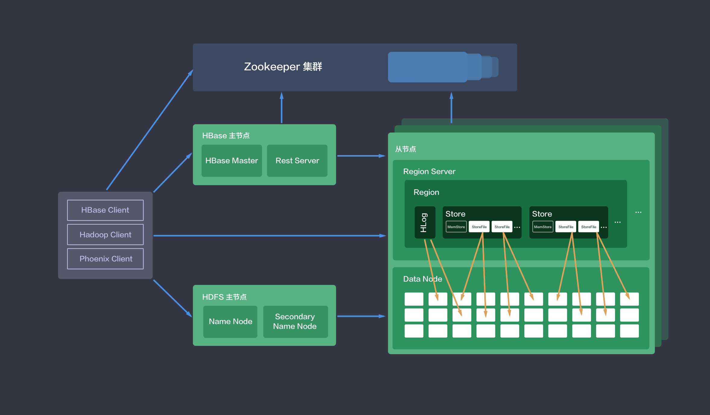

## 创建 HBase 集群

大数据平台包括 HBase 的运维是非常繁琐的，而在青云上，您可以在２到３分钟创建一个 HBase 集群，集群支持横向与纵向在线伸缩，还提供了监控告警等功能，使得管理集群非常方便。
集群将运行于 100% 二层隔离的私有网络内，结合青云提供的高性能硬盘，在保障高性能的同时兼顾您的数据安全。

> 为了保障数据安全, HBase 集群需要运行在受管私有网络中，同时由于 HBase 依赖于 ZooKeeper，所以在创建一个 HBase 集群之前，您至少需要一个路由器和一个与路由器连接的受管私有网络以及在该网络中创建一个 [ZooKeeper on QingCloud AppCenter](https://appcenter.qingcloud.com/apps/app-tg3lbp0a) 集群，并开启 DHCP 服务（默认开启）。

在创建的对话框中，您需要填写名称（可选），描述（可选），选择 HBase 版本号、CPU及内存配置，主机和磁盘类型，节点存储大小和数量，私有网络等。

### 第1步：基本设置

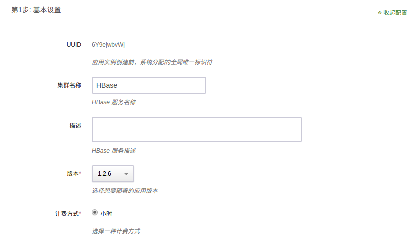

根据自己的需求填写 `名称` 和 `描述`，不影响集群的功能，版本一般建议选择最新版本。

### 第2步：HBase 客户端设置

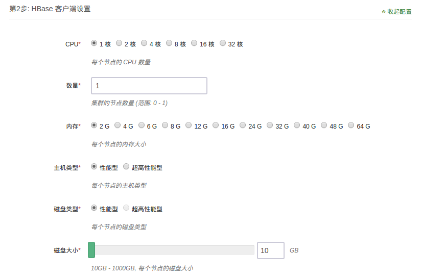

填写 HBase 客户端节点 CPU、内存、磁盘大小等配置信息，如不需要使用可设置 `数量` 为 0。

> 该节点自动配好连接 HBase 集群所需环境变量，可直接连接使用，用户名：ubuntu，密码：hbase。

### 第3步：HBase 主节点设置

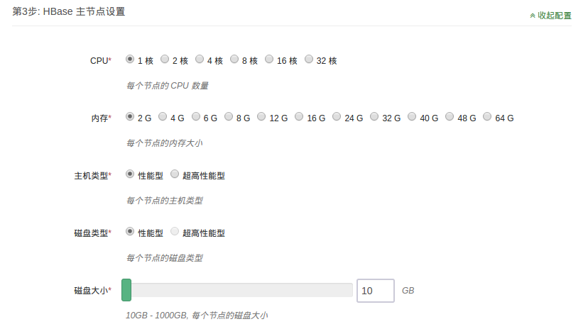

填写 HBase 主节点 CPU、内存、磁盘大小等配置信息。

### 第4步：HDFS 主节点设置

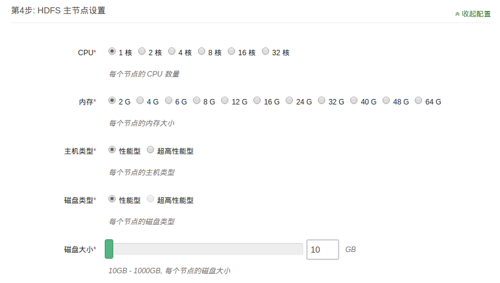

填写 HDFS 主节点 CPU、内存、磁盘大小等配置信息。

### 第5步：HBase 从节点设置

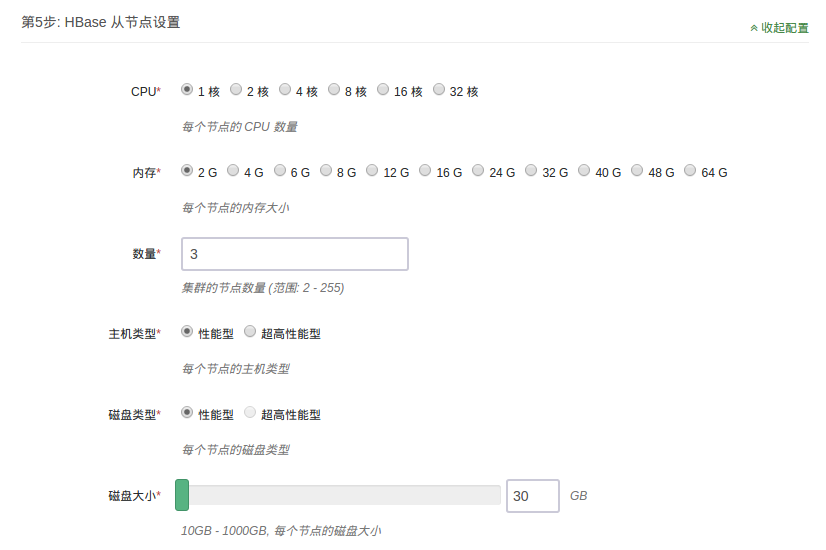

填写 HBase 从节点 CPU、内存、磁盘大小等配置信息。

### 第6步：网络设置


出于安全考虑，所有的集群都需要部署在私有网络中，选择自己创建的已连接路由器的私有网络中。

### 第7步：依赖服务设置


选择您所依赖的 [ZooKeeper on QingCloud AppCenter](https://appcenter.qingcloud.com/apps/app-tg3lbp0a) 集群。

### 第8步：服务环境参数设置


该步骤中配置默认折叠，如需修改，可点击右侧 `展开配置` 进行修改，亦可以使用默认值。

### 第9步: 用户协议

阅读并同意青云 APP Center 用户协议之后即可开始部署应用。

### 创建成功

当 HBase 创建完成之后，您可以查看每个节点的节点状态和服务状态。
如图所示，当节点状态显示为“活跃”状态，表示该节点启动正常。
当每个节点都启动正常后 HBase 集群显示为“活跃”状态，服务状态会由“获取中”变为“活跃”状态，
表示您已经可以正常使用 HBase 服务了。

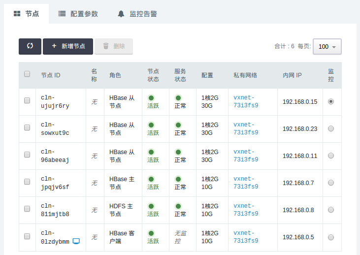

## 测试 HBase 集群

HBase 创建完成之后可以测试其可用性，由于 `HBase 客户端` 节点已自动完成相关配置，可通过 `Web 终端` 登录直接使用，用户名：ubuntu，密码：hbase。

> 测试需创建 `HBase 客户端` 节点，如创建集群时未创建该类型节点，可通过 `新增节点` 增加该节点

### 测试1

这个测试是通过HBase Shell 命令来完成一个 HBase 表的创建、插入、查找、删除操作。

```shell
  $ cd /opt/hbase

  $ bin/hbase shell

  hbase(main):001:0> create 'test', 'cf'
  0 row(s) in 1.2130 seconds

  => Hbase::Table - test
  hbase(main):002:0> list 'test'
  TABLE
  test
  1 row(s) in 0.0180 seconds

  => ["test"]

  hbase(main):003:0> put 'test', 'row1', 'cf:a', 'value1'
  0 row(s) in 0.0850 seconds

  hbase(main):004:0> put 'test', 'row2', 'cf:b', 'value2'
  0 row(s) in 0.0110 seconds

  hbase(main):005:0> put 'test', 'row3', 'cf:c', 'value3'
  0 row(s) in 0.0100 seconds

  hbase(main):006:0> scan 'test'
  ROW                                      COLUMN+CELL
   row1                                    column=cf:a, timestamp=1469163844008, value=value1
   row2                                    column=cf:b, timestamp=1469163862005, value=value2
   row3                                    column=cf:c, timestamp=1469163899601, value=value3
  3 row(s) in 0.0230 seconds

  hbase(main):007:0> get 'test', 'row1'
  COLUMN                                   CELL
   cf:a                                    timestamp=1469094709015, value=value1
  1 row(s) in 0.0350 seconds

  hbase(main):008:0> disable 'test'
  0 row(s) in 1.1820 seconds

  hbase(main):009:0> drop 'test'
  0 row(s) in 0.1370 seconds
```

### 测试2

这个测试是通过 HBase 自带的性能测试工具 PerformanceEvaluation 来测试 HBase 集群的随机写、顺序写、increment、append、随机读、顺序读、scan等操作的性能情况。测试过程中需要先写后读保证测试表中有数据。
测试结果中会有每个线程操作的耗时。

```shell
  $ cd /opt/hbase

  # 测试随机写，预分区10个 region，使用多线程代替 MapReduce 的方式来并发随机写操作，10个线程，每个线程写10000行。
  $ bin/hbase pe --nomapred --rows=10000 --presplit=10 randomWrite 10

  # 测试顺序写，预分区10个 region，使用多线程代替 MapReduce 的方式来并发顺序写操作，10个线程，每个线程写10000行。
  $ bin/hbase pe --nomapred --rows=10000 --presplit=10 sequentialWrite 10

  # 测试基于 row    的自增操作，使用多线程代替 MapReduce 的方式来并发自增操作，10个线程，每个线程 increment 10000次。
  $ bin/hbase pe --rows=10000 --nomapred increment 10

  # 测试基于row的追加操作，使用多线程代替 MapReduce 的方式来并发追加操作，10个线程，每个线程 append 10000次。
  $ bin/hbase pe --rows=10000 --nomapred append 10

  # 测试随机读，使用多线程代替 MapReduce 的方式来并发随机读操作，10个线程，每个线程读10000行
  $ bin/hbase pe --nomapred --rows=10000 randomRead 10

  # 测试顺序读，使用多线程代替 MapReduce 的方式来并发顺序读操作，10个线程，每个线程读10000行
  $ bin/hbase pe --nomapred --rows=10000 sequentialRead 10

  # 测试范围scan操作，使用多线程代替 MapReduce 的方式来并发范围 scan 操作，10个线程，每个线程 scan 10000次，每次范围返回最大100行。
  $ bin/hbase pe --rows=10000 --nomapred scanRange100 10
```

### 测试3

这个测试是通过 MapReduce 服务来批量导入 HDFS 中数据到 HBase

> 已创建 Hadoop 集群并在 `HBase 客户端` 中在 /opt/hadoop 目录下完成 MapReduce 服务配置。

可通过 DistCp 命令来拷贝不同 HDFS 中的数据，关于 DistCp 更多的详细信息，可参阅 [DistCp](http://hadoop.apache.org/docs/r2.7.3/hadoop-distcp/DistCp.html)

使用 MapReduce 导入数据有三种方案：

  - 一、直接书写 MapReduce 使用 HBase 提供的 JAVA API 从 HDFS 导入到 HBase 表。

  - 二、书写 MapReduce 将 HDFS 中数据转化为 HFile 格式，再使用 HBase 的 BulkLoad 工具导入到 HBase 表。

  - 三、使用 HBase ImportTsv 工具将格式化的 HDFS 数据导入到 HBase 表。

> 三种方案各有优缺点，方案一只需要一步操作，可自由规整数据，更为简单灵活，但直接写入 HBase 表会对线上服务有一定的性能影响。方案二和方案三则将导入步骤一分为二，耗时工作提前做好，确保对线上服务影响做到最小。
若要导入的数据已经是格式化的数据（有固定的分隔符），不需要自己实现 MapReduce 做进一步数据清洗，直接采用方案三；若数据并未格式化仍需规整则采用方案二。

以下方案中均使用 HBase 表 test_import，包含一个column family：content，可通过 HBase Shell 预先建好表

```shell
  $ cd /opt/hbase

  $ bin/hbase shell

  hbase(main):001:0> create 'test_import', 'content'
  0 row(s) in 1.2130 seconds

  => Hbase::Table - test_import
```

项目若使用mvn构建，pom.xml 中增加如下内容：

```shell
  <properties>
    <hbase.version>1.2.6</hbase.version>
  </properties>

  <dependencies>
    <dependency>
      <groupId>org.apache.hbase</groupId>
      <artifactId>hbase-server</artifactId>
      <version>${hbase.version}</version>
    </dependency>
  </dependencies>
```

方案一 MapReduce 代码如下，先创建表，在 Map 中完成数据解析，在 Reduce 中完成入库。Reduce的个数相当于入库线程数。

> 可自行修改 job.setNumReduceTasks() 中 Reduce 数目

```java
  package com.qingcloud.hbase

  import org.apache.hadoop.conf.Configuration;
  import org.apache.hadoop.fs.Path;
  import org.apache.hadoop.hbase.HBaseConfiguration;
  import org.apache.hadoop.hbase.HColumnDescriptor;
  import org.apache.hadoop.hbase.HTableDescriptor;
  import org.apache.hadoop.hbase.TableName;
  import org.apache.hadoop.hbase.client.*;
  import org.apache.hadoop.hbase.mapreduce.TableMapReduceUtil;
  import org.apache.hadoop.hbase.mapreduce.TableReducer;
  import org.apache.hadoop.io.LongWritable;
  import org.apache.hadoop.io.Text;
  import org.apache.hadoop.mapreduce.Job;
  import org.apache.hadoop.mapreduce.Mapper;
  import org.apache.hadoop.mapreduce.lib.input.FileInputFormat;
  import org.apache.hadoop.util.GenericOptionsParser;
  import org.apache.hadoop.hbase.io.ImmutableBytesWritable;

  import java.io.File;
  import java.io.FileInputStream;
  import java.io.IOException;

  public class ImportByMR {

      private static String table = "test_import";

      private static class ImportByMRMapper extends Mapper<LongWritable, Text, Text, Text> {

          @Override
          public void map(LongWritable key, Text value, Context context) throws IOException, InterruptedException {
              String[] sp = value.toString().split(" ");
              if (sp.length < 2) {
                  return;
              }
              context.write(new Text(sp[0]), new Text(sp[1]));
          }
      }

      private static class ImportByMRReducer extends TableReducer<Text, Text, ImmutableBytesWritable> {

          @Override
          public void reduce(Text key, Iterable<Text> value, Context context) throws IOException, InterruptedException {
              byte[] bRowKey = key.toString().getBytes();
              ImmutableBytesWritable rowKey = new ImmutableBytesWritable(bRowKey);

              for (Text t : value) {
                  Put p = new Put(bRowKey);
                  p.setDurability(Durability.SKIP_WAL);
                  p.addColumn("content".getBytes(), "a".getBytes(), t.toString().getBytes());
                  context.write(rowKey, p);
              }
          }
      }

      private static void createTable(Configuration conf) throws IOException {
          TableName tableName = TableName.valueOf(table);
          Connection connection = ConnectionFactory.createConnection(conf);
          Admin admin = connection.getAdmin();
          if (admin.tableExists(tableName)) {
              System.out.println("table exists!recreating.......");
              admin.disableTable(tableName);
              admin.deleteTable(tableName);
          }
          HTableDescriptor htd = new HTableDescriptor(tableName);
          HColumnDescriptor tcd = new HColumnDescriptor("content");
          htd.addFamily(tcd);
          admin.createTable(htd);
      }

      public static void main(String[] argv) throws IOException, ClassNotFoundException, InterruptedException {
          Configuration conf = HBaseConfiguration.create();
          File file = new File("/opt/hbase/conf/hbase-site.xml");
          FileInputStream in = new FileInputStream(file);
          conf.addResource(in);
          createTable(conf);
          GenericOptionsParser optionParser = new GenericOptionsParser(conf, argv);
          String[] remainingArgs = optionParser.getRemainingArgs();

          Job job = Job.getInstance(conf, ImportByMR.class.getSimpleName());
          job.setJarByClass(ImportByMR.class);
          job.setMapperClass(ImportByMRMapper.class);
          TableMapReduceUtil.initTableReducerJob(table, ImportByMRReducer.class, job);
          job.setMapOutputKeyClass(Text.class);
          job.setMapOutputValueClass(Text.class);
          job.setOutputKeyClass(ImmutableBytesWritable.class);
          job.setOutputValueClass(Mutation.class);
          job.setNumReduceTasks(1);
          FileInputFormat.addInputPath(job, new Path(remainingArgs[0]));
          System.exit(job.waitForCompletion(true) ? 0 : 1);
      }
  }
```

hbase-tools-1.0.0.jar 是将上述代码打成的jar包，APP_HOME 是 jar 包所放置的目录，/user/inputPath 下是需要导入到HBase中的数据。
数据格式为 rowkey value，两列空格分隔。需自行准备后通过 bin/hdfs dfs -put 到 HDFS 的 /user/inputPath 目录。
依次执行下述命令：

```shell
  $ cd /opt/hadoop

  $ bin/hadoop jar $APP_HOME/hbase-tools-1.0.0.jar com.qingcloud.hbase.ImportByMR /user/inputPath
```

执行成功后可简单通过测试一中的 HBase Shell 来验证数据。

方案二 MapReduce 代码如下，Map 对数据做进一步处理，Reduce 无需指定，会根据 Map 的 outputValue 自动选择实现。

```java
  package com.qingcloud.hbase

  import org.apache.hadoop.conf.Configuration;
  import org.apache.hadoop.fs.Path;
  import org.apache.hadoop.hbase.*;
  import org.apache.hadoop.hbase.client.*;
  import org.apache.hadoop.hbase.io.ImmutableBytesWritable;
  import org.apache.hadoop.hbase.mapreduce.HFileOutputFormat2;
  import org.apache.hadoop.io.LongWritable;
  import org.apache.hadoop.io.Text;
  import org.apache.hadoop.mapreduce.Job;
  import org.apache.hadoop.mapreduce.Mapper;
  import org.apache.hadoop.mapreduce.lib.input.FileInputFormat;
  import org.apache.hadoop.util.GenericOptionsParser;

  import java.io.File;
  import java.io.FileInputStream;
  import java.io.IOException;

  public class ImportByBulkLoad {

      private static String myTable = "test_import";

      private static class ImportByBulkLoadMapper extends Mapper<LongWritable, Text, ImmutableBytesWritable, Put> {

          @Override
          public void map(LongWritable key, Text value, Context context) throws IOException, InterruptedException {
              String[] sp = value.toString().split(" ");
              if (sp.length < 2) {
                  return;
              }
              byte[] bRowKey = sp[0].getBytes();
              ImmutableBytesWritable rowKey = new ImmutableBytesWritable(bRowKey);
              Put p = new Put(bRowKey);
              p.setDurability(Durability.SKIP_WAL);
              p.addColumn("content".getBytes(), "a".getBytes(), sp[1].getBytes());
              context.write(rowKey, p);
          }
      }

      public static void main(String[] argv) throws IOException, ClassNotFoundException, InterruptedException {
          Configuration conf = HBaseConfiguration.create();
          File file = new File("/opt/hbase/conf/hbase-site.xml");
          FileInputStream in = new FileInputStream(file);
          conf.addResource(in);
          GenericOptionsParser optionParser = new GenericOptionsParser(conf, argv);
          String[] remainingArgs = optionParser.getRemainingArgs();
          Job job = Job.getInstance(conf, ImportByBulkLoad.class.getSimpleName());
          job.setJarByClass(ImportByBulkLoad.class);
          job.setMapperClass(ImportByBulkLoadMapper.class);
          job.setMapOutputKeyClass(ImmutableBytesWritable.class);
          job.setMapOutputValueClass(Put.class);
          FileInputFormat.addInputPath(job, new Path(remainingArgs[0]));
          HFileOutputFormat2.setOutputPath(job, new Path(remainingArgs[1]));
          TableName tableName = TableName.valueOf(myTable);
          Connection connection = ConnectionFactory.createConnection(conf);
          Table table = connection.getTable(tableName);
          RegionLocator regionLocator = connection.getRegionLocator(tableName);
          HFileOutputFormat2.configureIncrementalLoad(job, table, regionLocator);
          System.exit(job.waitForCompletion(true) ? 0 : 1);
      }
  }
```

hbase-tools-1.0.0.jar 是将上述代码打成的 jar 包，APP_HOME 是 jar 包所放置的目录，/user/inputPath 下是需要导入到HBase中的数据。数据格式为 rowkey value，两列空格分隔。
需自行准备后通过 bin/hdfs dfs -put 到 HDFS 的 /user/inputPath 目录。
/user/outputPath 是 MapReduce 生成的 HFile 格式的结果。test_import 是 HBase 表名。依次执行下述命令：

```shell
  $ cd /opt/hadoop

  $ bin/hdfs dfs -rmr /user/outputPath

  $ export HADOOP_CLASSPATH=`/opt/hbase/bin/hbase classpath`

  $ bin/hadoop jar $APP_HOME/hbase-tools-1.0.0.jar com.qingcloud.hbase.ImportByBulkLoad /user/inputPath /user/outputPath

  $ bin/hadoop jar /opt/hbase/lib/hbase-server-<VERSION>.jar completebulkload /user/outputPath test_import
```

执行成功后可简单通过测试一中的 HBase Shell 来验证数据。

方案三无需书写代码，/user/inputPath 下是需要导入到 HBase 中的数据。数据格式为 rowkey value，两列空格分隔。需自行准备后通过 bin/hdfs dfs -put 到 HDFS 的 /user/inputPath 目录。
/user/outputPath 是 HFile 格式的暂存结果。test_import是HBase表名。依次执行下述命令：

```shell
  $ cd /opt/hadoop

  $ bin/hdfs dfs -rmr /user/outputPath

  $ export HADOOP_CLASSPATH=`/opt/hbase/bin/hbase classpath`

  $ bin/hadoop jar /opt/hbase/lib/hbase-server-<VERSION>.jar importtsv -Dimporttsv.columns=HBASE_ROW_KEY,content:a -Dimporttsv.bulk.output=/user/outputPath test_import /user/inputPath
```

或

```shell
  $ cd /opt/hadoop

  $ bin/hdfs dfs -rmr /user/outputPath

  $ cd /opt/hbase

  $ bin/hbase org.apache.hadoop.hbase.mapreduce.ImportTsv -Dimporttsv.columns=HBASE_ROW_KEY,content:a -Dimporttsv.bulk.output=/user/outputPath test_import /user/inputPath
```

执行成功后可简单通过测试一中的 HBase Shell 来验证数据。

### 测试4

测试 Phoenix 查询引擎的支持，包括：sql语句、ACID事务。

> HBase 集群默认不支持 Phoenix 查询引擎，如要使用，请通过修改配置参数的方式开启，修改：qingcloud.phoenix.on.hbase.enable 为 true。
如要开启 Phoenix 事务支持，修改：phoenix.transactions.enabled 为 true，保存。

测试简单的 sql

```shell
  $ cd /opt/phoenix

  # 测试时需手动填写 Zookeeper 连接，该地址可通过 HBase 详情页左侧基本属性列表中获得，去掉端口
  $ bin/psql.py 192.168.0.4,192.168.0.3,192.168.0.2:/hbase/cl-r2t3jzjo examples/WEB_STAT.sql examples/WEB_STAT.csv examples/WEB_STAT_QUERIES.sql
```

测试 ACID 事务，该测试需要开启两个终端按时间交互式执行，在commit之前另一终端是无法select得到新修改的数据的：

终端一

```shell
  $ cd /opt/phoenix

  $ bin/sqlline.py 192.168.0.4,192.168.0.3,192.168.0.2:/hbase/cl-r2t3jzjo

  0: jdbc:phoenix:> CREATE TABLE my_table (k BIGINT PRIMARY KEY, v VARCHAR) TRANSACTIONAL=true;
  No rows affected (1.506 seconds)
  0: jdbc:phoenix:> UPSERT INTO my_table VALUES (1,'A');
  1 row affected (0.099 seconds)
  0: jdbc:phoenix:> UPSERT INTO my_table VALUES (2,'B');
  1 row affected (0.016 seconds)
  0: jdbc:phoenix:> SELECT * FROM my_table;
  +----+----+
  | K  | V  |
  +----+----+
  | 1  | A  |
  | 2  | B  |
  +----+----+
  2 rows selected (0.092 seconds)
  0: jdbc:phoenix:> !commit
  Operation requires that autocommit be turned off.
  0: jdbc:phoenix:> !autocommit off
  Autocommit status: false
  0: jdbc:phoenix:> !commit
  Commit complete (0 seconds)
  0: jdbc:phoenix:> UPSERT INTO my_table VALUES (2,'C');
  1 row affected (0 seconds)
  0: jdbc:phoenix:> SELECT * FROM my_table;
  +----+----+
  | K  | V  |
  +----+----+
  | 1  | A  |
  | 2  | C  |
  +----+----+
  2 rows selected (0.034 seconds)
```

开启终端二

```shell
  $ cd /opt/phoenix

  $ bin/sqlline.py

  0: jdbc:phoenix:> SELECT * FROM my_table;
  +----+----+
  | K  | V  |
  +----+----+
  | 1  | A  |
  | 2  | B  |
  +----+----+
  2 rows selected (1.15 seconds)
  0: jdbc:phoenix:> !commit
  Operation requires that autocommit be turned off.
  0: jdbc:phoenix:> !autocommit off
  Autocommit status: false
  0: jdbc:phoenix:> !commit
```

终端一内继续执行

```shell
  0: jdbc:phoenix:> !commit
  Commit complete (0.006 seconds)
  0: jdbc:phoenix:> SELECT * FROM my_table;
  +----+----+
  | K  | V  |
  +----+----+
  | 1  | A  |
  | 2  | C  |
  +----+----+
  2 rows selected (0.035 seconds)
  0: jdbc:phoenix:> !quit
```

终端二内继续执行

```shell
  0: jdbc:phoenix:> SELECT * FROM my_table;
  +----+----+
  | K  | V  |
  +----+----+
  | 1  | A  |
  | 2  | C  |
  +----+----+
  2 rows selected (0.038 seconds)
  0: jdbc:phoenix:> drop table my_table;
  No rows affected (2.668 seconds)
  0: jdbc:phoenix:> !quit
```

## 在线伸缩

### 增加节点

您可以在 HBase 详情页点击 `新增节点` 按钮增加 `HBase 从节点` 或 `HBase 客户端`，可以对每个新增节点指定 IP 或选择自动分配。

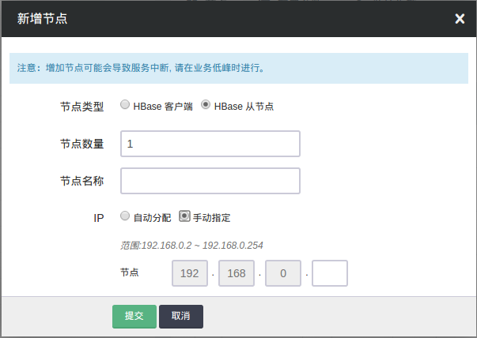

### 删除节点

您可以在 HBase 详情页选中需要删除的节点，然后点击 `删除` 按钮，只能一次删除一个，并且必须等到上个节点删除后且 decommission 结束才能删除下一个节点，否则数据会丢失。
删除节点过程中会锁定 HBase 集群不让对其进行其它生命周期操作，同时这个 decommission
状态可以从 HDFS Name Node 的 50070 端口提供的监控信息观察到。Decommission 是在复制即将删除节点上的数据到别的节点上，如果您的数据量比较大，这个过程会比较长。
因为青云的 HDFS 副本因子默认为 2，所以当您 HBase 的从节点数为 2 的时候就不能再删除节点。同时要预先知道其它节点的总硬盘空间足够拷贝删除节点的内容，才能进行删除。

> `HBase 主节点` 和 `HDFS 主节点` 不允许删除，一次删除多个 `HBase 从节点` 相关操作会失败，右上角会有提示。

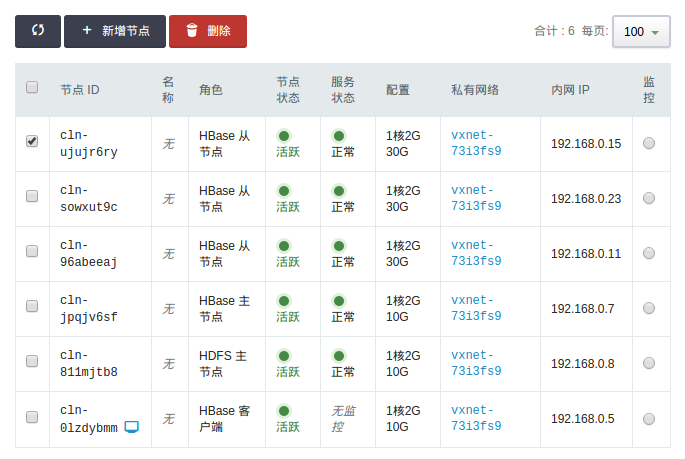

> 对集成 HDFS 的 HBase，删除节点是一个比较危险的操作，要仔细阅读上面的指南。

### 纵向伸缩

由于不同类节点压力并不同，所以 `HBase on QingCloud AppCenter` 支持对 `HBase 主节点` 、 `HDFS 主节点` 、 `HBase 从节点` 和 `HBase 客户端` 分别进行纵向伸缩。

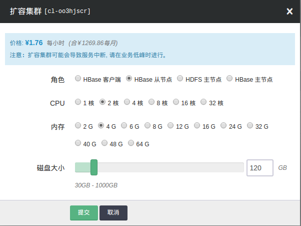

## 监控告警

我们对 HBase 集群的每个节点提供了资源的监控和告警服务，包括 CPU 使用率、内存使用率、硬盘使用率等。
同时，HBase 和 HDFS 提供了丰富的监控信息。如果需要通过公网访问这些信息您需要先申请一个公网 IP 绑定在路由器上，在路由器上设置端口转发，同时打开防火墙相应的下行端口。
`HBase 主节点` 默认端口 `16010` ， `HDFS 主节点` 默认端口是 `50070` 。为方便查看 HBase UI，请参考 [VPN 隧道指南](https://docs.qingcloud.com/guide/vpn.html) 配置VPN，VPN 建立后可查看下述界面。

* http://<HBase Master Node private IP>:16010
* http://<HDFS Master Node private IP>:50070

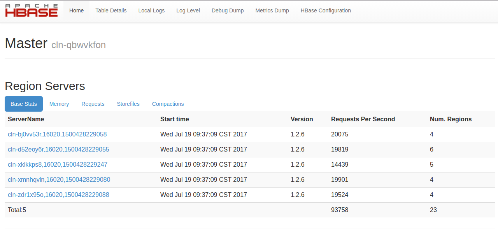

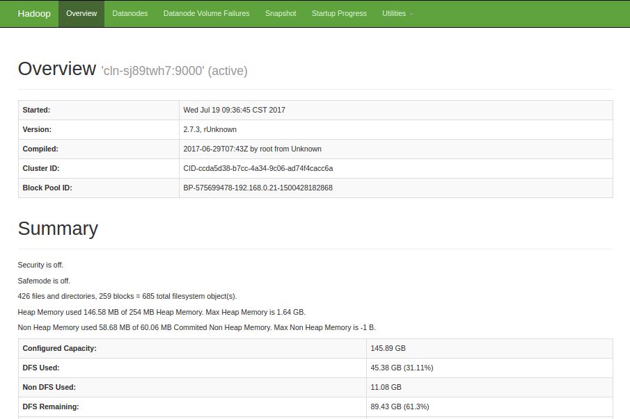

为了帮助用户更好的管理和维护 HBase 集群，我们提供了部分针对 HBase 和 HDFS 服务的监控，包括：

- **集群Region 迁移监控**： 集群中 Region 处于迁移状态的数量
- **RegionServer 读、写QPS监控**： RegionServer 每秒读、写操作数
- **RegionServer BlockCache 命中数监控**： RegionServer BlockCache 命中数
- **RegionServer BlockCache 命中率监控**： RegionServer BlockCache 命中率
- **RegionServer 慢操作数监控**： RegionSever 慢 Delete,Increment,Get,Append,Put 数量
- **RegionServer CMS GC 时间监控**： RegionSever CMS GC 消耗 ms 数
- **HDFS 集群文件监控**： 总文件数、Created 文件数、Appended 文件数、Renamed 文件数、Deleted 文件数
- **HDFS 文件系统使用百分比监控**: 使用、剩余
- **HDFS 文件系统使用监控**: 使用、剩余
- **HDFS DATANODE 监控**: 存活的 DataNode 数、死亡的 DataNode 数、退役的存活 DataNode 数、退役的死亡 DataNode 数、退役中的 Datanode 数


## 配置参数

我们通过 `配置参数` 来管理 HBase 服务的配置。

### 修改配置参数

在 HBase 详情页，点击 `配置参数` Tab 页，点击 `修改属性`，修改完后，我们需要进行 "保存"。如图所示：

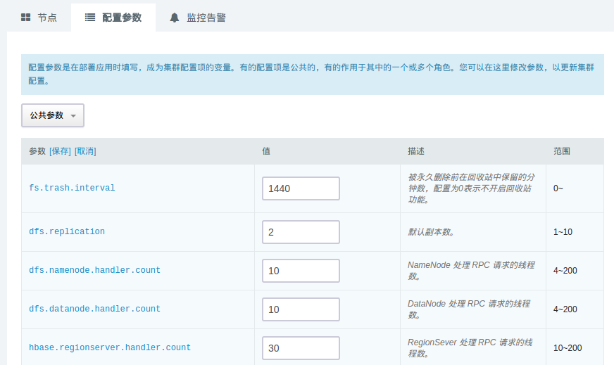

> 当配置发生变化时，将会重启对应的 HBase 服务。由于在线滚动重启耗时较长，目前版本尚未支持在线滚动重启。


### 常用配置项

- **fs.trash.interval**: 被永久删除前在回收站中保留的分钟数，配置为0表示不开启回收站功能。
- **dfs.replication**: 默认副本数。
- **fs.trash.interval**: 被永久删除前在回收站中保留的分钟数，配置为0表示不开启回收站功能。
- **dfs.namenode.handler.count**: NameNode 处理 RPC 请求的线程数。
- **dfs.datanode.handler.count**: DataNode 处理 RPC 请求的线程数。
- **hbase.regionserver.handler.count**: RegionSever 处理 RPC 请求的线程数。
- **hbase.master.handler.count**: Master 处理 RPC 请求的线程数。
- **zookeeper.session.timeout**: HBase 连接 Zookeeper 的 session timeout 时间。
- **hbase.hregion.majorcompaction**: 两次自动 Major Compaction 的时间间隔，设为0则禁用自动 Compaction。
- **hbase.hstore.blockingStoreFiles**: 当一个 Store 中的 StoreFiles 达到该值时，会 block 写入，进行 Compaction。
- **hbase.regionserver.optionalcacheflushinterval**: 一个 edit 版本在内存中 cache 的最长时间，超过该时间则自动 flush 到磁盘，设为0则禁用自动 flush。
- **hfile.block.cache.size**: 读缓存 BlockCache 占用的堆内存比例，读多于写可适当增大该值。注：hbase.regionserver.global.memstore.size + hfile.block.cache.size <= 0.8
- **hbase.regionserver.global.memstore.size**: 一台 RegionServer 上所有 MemStores 占用的堆内存比例， 写多于读可适当增大该值。注：hbase.regionserver.global.memstore.size + hfile.block.cache.size <= 0.8
- **hfile.index.block.max.size**: HFile 索引块大小。索引块越小，需要的索引块越多，索引的层级越深；索引块过大，对索引块本身的扫描时间会显著的增加。
- **hbase.hregion.max.filesize**: Region split 触发阈值。当一个 Region 里的所有 HFile 大小超过该值，region 自动 split。
- **hbase.master.logcleaner.ttl**: 预写log（WAL）过期时间，超过这个时间 Master 会将该 WAL 删除。
- **hbase.ipc.server.callqueue.handler.factor**: 调用队列个数因子，设为0表示所有的handler共用一个队列，设为1表示每个handler拥有自己的队列。
- **hbase.ipc.server.callqueue.read.ratio**: 调用 read 请求队列个数因子，设为0表示不去分读写请求的队列，小于0.5表示读请求队列少于写请求队列，设为1表示只有1个写请求队列,其他都是读请求。
- **hbase.ipc.server.callqueue.scan.ratio**: 调用 scan 请求队列个数因子，设为0和1表示在读请求队列中不区分 long-read 和 small-read, 小于0.5表示 long-read 数小于 small-read 数。
- **hbase.regionserver.msginterval**: ResionServer 给 Master 发送消息的时间间隔，心跳间隔。
- **hbase.regionserver.logroll.period**: HBase 预写log（WAL） roll 的时间间隔，便于后期删除过期 log。
- **hbase.regionserver.regionSplitLimit**: 一个 RegionServer 上的 region 数达到这个 limit 后不再 split。
- **hbase.balancer.period**: Master 每隔多久做一次 balance 操作。
- **hbase.regions.slop**: Rebalance 操作的前提条件，如果有 regionserver 上的 region 数超过 average + (average * slop) 则进行 Rebalance
- **io.storefile.bloom.block.size**: 布隆过滤器块大小。
- **hbase.rpc.timeout**: HBase client 应用 rpc 超时时间。
- **hbase.column.max.version**: 新创建列簇的最大版本数。
- **hbase.security.authorization**: 是否开启安全认证机制。
- **qingcloud.hbase.major.compact.hour**: 设置每天手动 Major Compaction 的整点时间，设为-1则取消手动 Compaction。
- **qingcloud.phoenix.on.hbase.enable**: 是否开启 Phoenix 查询引擎功能	。
- **phoenix.functions.allowUserDefinedFunctions**: 是否开启 Phoenix UDF。
- **phoenix.transactions.enabled**: 是否开启 Phoenix ACID 事务。

配置项的详细解释请参见 [HBase 官方配置文档](http://hbase.apache.org/book.html#config.files)

