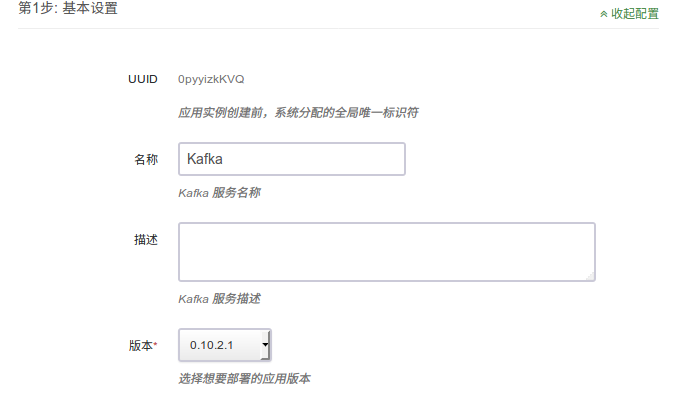
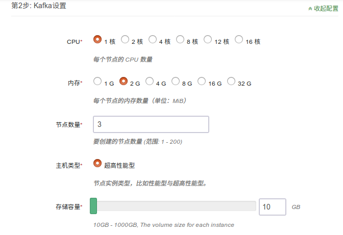
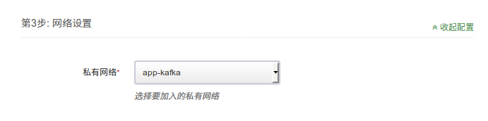
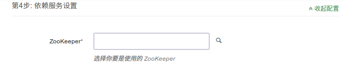
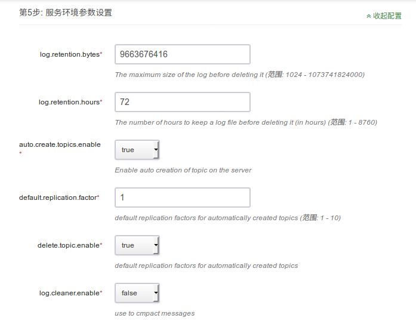
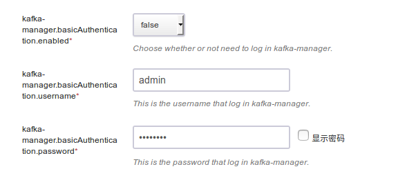
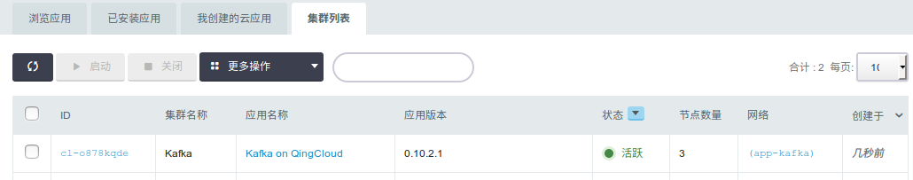
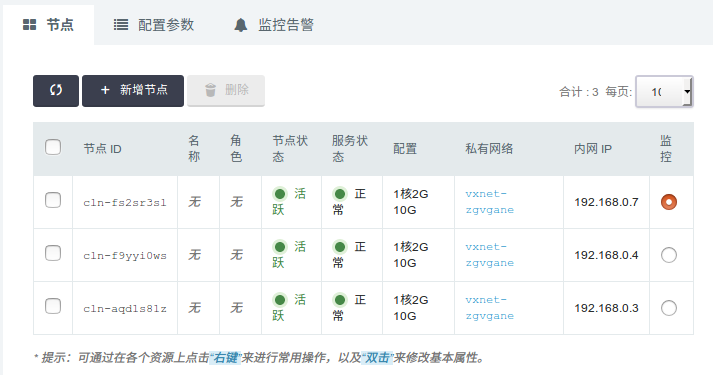
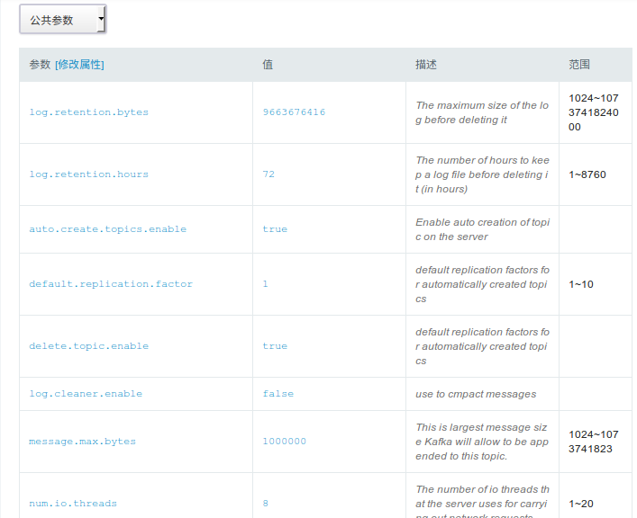
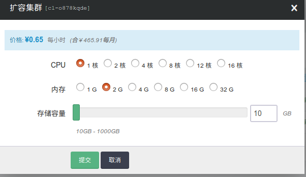

# Apache Kafka on QingCloud AppCenter 用户手册

## 简介

[Kafka](http://kafka.apache.org/) 是一种高吞吐、低延迟、高可靠的分布式发布订阅消息系统。

`Kafka on QingCloud AppCenter` 将 Kafka 通过云应用的形式在 QingCloud AppCenter 部署，具有如下特性:

-  支持横向与纵向扩容
- 系统自动运维，降低企业使用成本
- 提供了监控告警功能更好的管理集群
- 节点上安装了 Kafka-manager，可以管理和监控对多个 Kafka 集群

## 创建 Kafka

创建 Kafka 集群前，您需要先创建一个 VPC 网络和 Zookeeper 集群,建议 Kafka 与 Zookeeper 在一个私有网络中。

> 为了保障数据安全, Kafka 集群需要运行在受管私有网络中。所以在创建一个 Kafka 集群之前，需要创建一个 VPC 和一个受管私有网络，受管私有网络需要加入 VPC，并开启 DHCP 服务（默认开启）。

### 第一步：基本设置

根据自己的需求填写 `名称` 和 `描述`，不影响集群的功能，版本一般建议选择最新版本。

### 第二步：节点设置

CPU，内存，节点数量，主机类型和磁盘大小根据自己实际需求进行选择即可，生产环境建议使用至少3个节点。

### 第三步：网络设置

出于安全考虑，所有的集群都需要部署在私有网络中，选择自己创建的网络中。

### 第四步：依赖服务设置

选择您所依赖的 Zookeeper 集群。

### 第五步：参数设置

按照自己的实际需求配置 Kafka 参数，同时也可以配置 Kafka-manager 是否需要登陆,登录帐号与密码和端口参数。

### 第六步: 用户协议

阅读并同意青云 APP Center 用户协议之后即可开始部署应用。

### 第七步：Kafka-manager 配置

#### 自动添加集群配置到 Kafka-manager

Kafka 创建完后，会自动把相关配置加载到 Kafka-manager，可以直接通过集群 id 点击进入集群。

#### 同时也可以手动添加集群配置到 Kafka-manager  

如图所示

#### 具体步骤说明

 1. 浏览器上输入 http://任意节点IP:port/，默认端口为9000
 2. 如果配置时指定需要登录，请使用配置的帐号登录
 3. 选择 Cluster，Add Cluster
 4. 自定义一个名字,填写所连接的 Kafka 集群地址，青云提供的 Kafka 服务对应的命名空间路径为： zkhost1:port,zkhost2:port...,zkhost/kafka/集群ID,例如 Kafka 集群 id 为 cl-j0yf8y1l ， Zookeeper 地址：192.168.0.1:2181,192.168.0.2:2181,192.168.0.3:2181，则填写 192.168.0.1:2181,192.168.0.2:2181,192.168.0.3:2181/kafka/cl-j0yf8y1
 5. 选择 Kafka 对应的版本 ，对应到大版本即可，例如 Kafka 版本为0.10.2,可以选择 0.10.* ,勾选jmx配置
 6. 更改基本配置，save 后可以使用 kafka-manger 来管理和监控 Kafka 集群了

## 集群使用

### 集群信息
在集群创建完毕后，可以在控制台 `Appcenter -> 集群列表` 标签下看到目前已经创建的集群信息：

 集群列表

 点击集群 ID 可以查看该集群的详细信息：

 集群基础资源监控信息：

  

 集群节点监控信息：

### 配置参数

  点击 `配置参数` 可以修改 `Kafka 参数`， `Kafka-manager 参数`。

  

### 扩容集群

  点击 `扩容集群` ， 可以在集群性能不足时提高集群的配置：

  

### kafka-manager 创建 topic

点击 `topic` ， 点击 `Create`,若不单独给 topic 配置参数，会使用集群级别默认参数：

### kafka-manager 管理 topic

点击 `topic` ， 可以在 `List` 里找到 topic 进行管理，修改 topic 参数：

### kafka-manager 平衡分区 leader

点击 `Preferred Replica Election` 通过 Run 执行：

至此，`Kafka on QingCloud AppCenter` 的介绍到这里就告一个段落了。

在使用过程中如果遇到问题可以通过 `提交工单` 来获取帮助，我们将竭诚为您服务。

Have a nice day on QingCloud AppCenter !
