# Apache Kafka on QingCloud AppCenter 用户手册

<extoc></extoc>

## 简介

[Kafka](http://kafka.apache.org/) 是一种高吞吐量、低延迟、高可靠的分布式发布订阅消息系统。被广泛应用于网站活动追踪、日志监控、流式计算、事件采集、数据存储等应用场景。

`Kafka on QingCloud AppCenter` 将 Kafka 通过云应用的形式在 QingCloud AppCenter 部署，具有如下特性:

- 开箱即用，支持横向与纵向在线伸缩
- 系统自动健康检查，系统自动运维，降低企业使用成本
- 提供了监控告警功能更好的管理集群
- 节点上安装了 Kafka-manager，可以管理和监控多个 Kafka 集群

>注意：Kafka 1.0.0-QingCloud1.1.4 及后续新版本提供的 Kafka-manager 安装在客户端节点上。客户端节点用户名：root，密码：kafka 。Kafka-manager 显示的版本并非实际 Kafka 版本，我们以创建 Kafka 实际版本为主，并不会影响到您使用 Kafka 和 Kafka-manager 。

## 创建 Kafka

创建 Kafka 集群前，您需要先创建一个 VPC 网络，并在 QingCloud AppCenter 中创建一个 Zookeeper 集群,其他地方创建的 Zookeeper 集群识别不出来， 建议 Kafka 与 Zookeeper 在一个私有网络中。

> 为了保障数据安全, Kafka 集群需要运行在受管私有网络中。所以在创建一个 Kafka 集群之前，需要创建一个 VPC 和一个受管私有网络，受管私有网络需要加入 VPC，并开启 DHCP 服务（默认开启）。

### 第一步：基本设置

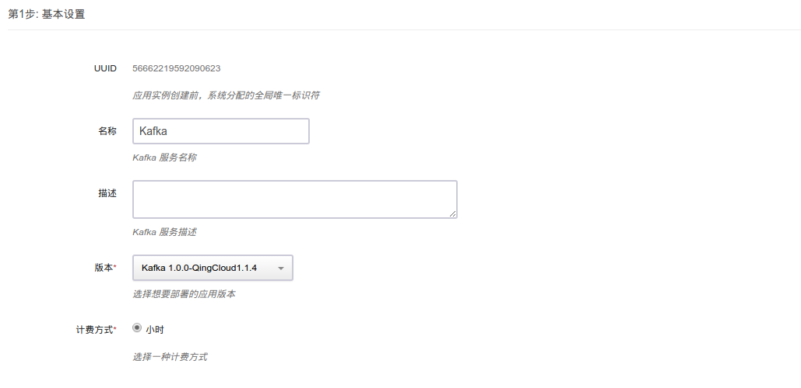

根据自己的需求填写 `名称` 和 `描述`，不影响集群的功能，版本一般建议选择最新版本。

### 第二步：Kafka 节点设置

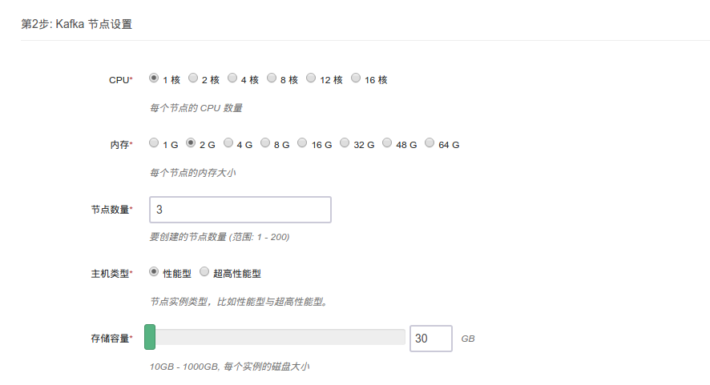

CPU，内存，节点数量，主机类型和磁盘大小根据自己实际需求进行选择即可，生产环境建议使用至少3个节点。

### 第三步：客户端节点设置

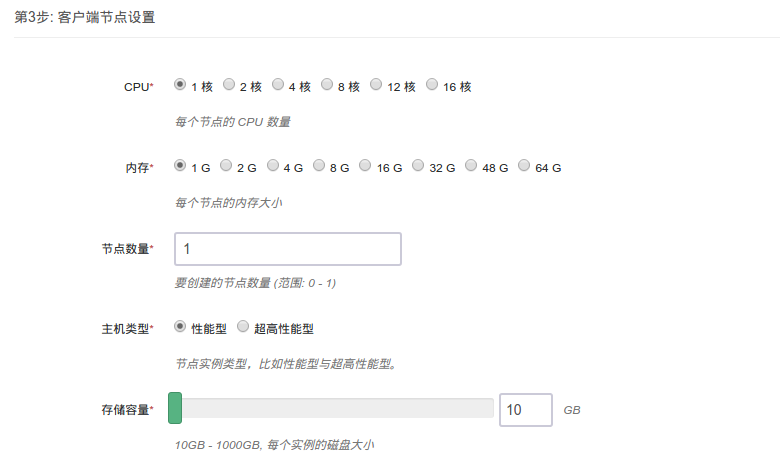

### 第四步：网络设置

出于安全考虑，所有的集群都需要部署在私有网络中，选择自己创建的网络中。

### 第五步：依赖服务设置

选择您所依赖的 Zookeeper 集群。

### 第六步：参数设置

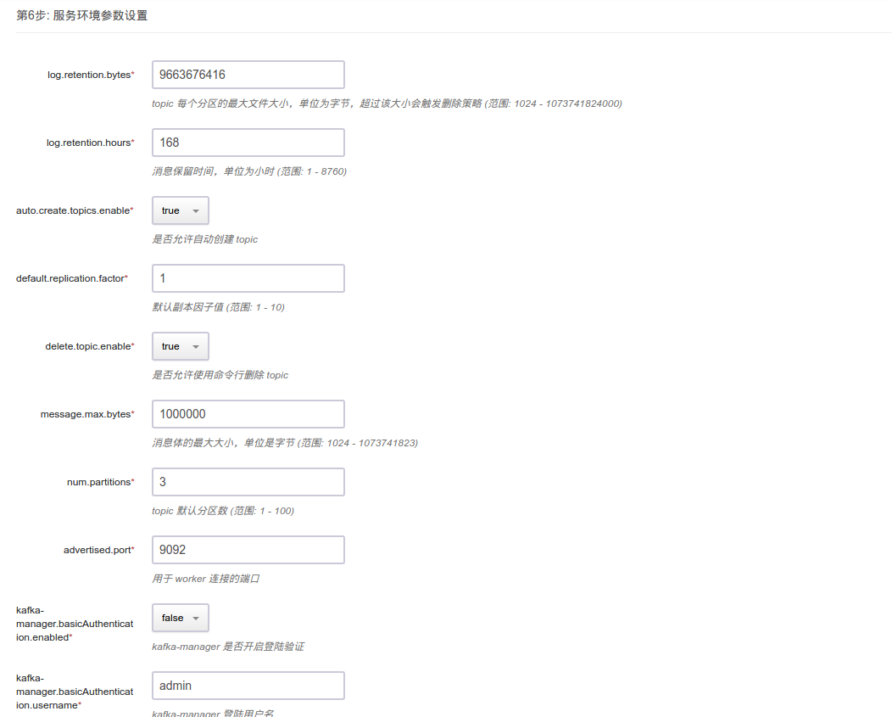

按照自己的实际需求配置 Kafka 参数，同时也可以配置 Kafka-manager 是否需要登陆,登录帐号与密码和端口参数。

### 第七步: 用户协议

阅读并同意青云 APP Center 用户协议之后即可开始部署应用。

### 第八步：Kafka-manager 配置

#### 自动添加集群配置到 Kafka-manager

Kafka 创建完后，`Kafka on QingCloud AppCenter` 会自动把相关配置加载到 Kafka-manager，可以直接通过集群 id 点击进入集群。

#### 同时也可以手动添加集群配置到 Kafka-manager  

如图所示

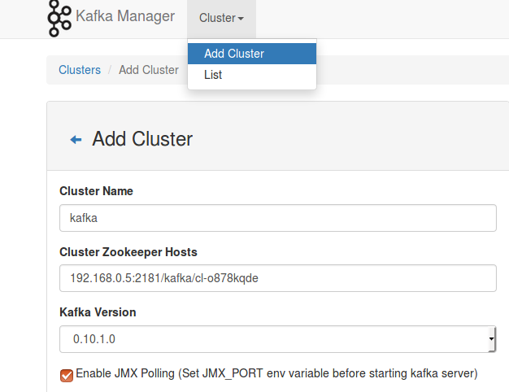

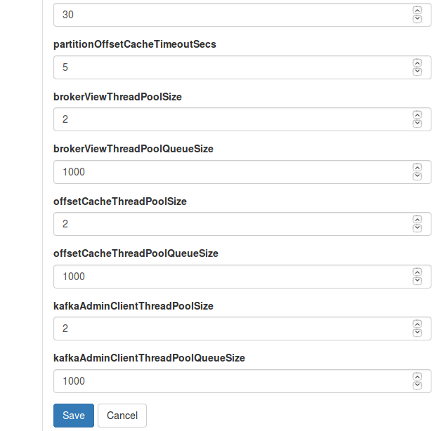

#### 具体步骤说明

 <ol>
 <li>浏览器上输入: http://任意节点IP:port  默认端口为9000</li>
 <li>如果配置时指定需要登录，请使用配置的帐号登录</li>
 <li>选择 Cluster，Add Cluster</li>
 <li>自定义一个名字,填写所连接的 Kafka 集群地址，青云提供的 Kafka 服务对应的命名空间路径为： zkhost1:port,zkhost2:port...,zkhost/kafka/集群ID,例如 Kafka 集群 id 为 cl-j0yf8y1l ， Zookeeper 地址：192.168.0.1:2181,192.168.0.2:2181,192.168.0.3:2181，则填写 192.168.0.1:2181,192.168.0.2:2181,192.168.0.3:2181/kafka/cl-j0yf8y1</li>
 <li>选择 Kafka 对应的版本，例如 Kafka 版本为0.10.2,可以选择 0.10.* ,勾选jmx配置</li>
 <li>更改基本配置，save 后可以使用 kafka-manger 来管理和监控 Kafka 集群了</li>
 </ol>

## 集群使用

### 集群信息

在集群创建完毕后，可以在控制台 `Appcenter -> 集群列表` 标签下看到目前已经创建的集群信息：

 集群列表

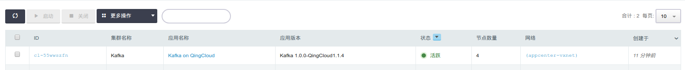

 点击集群 ID 可以查看该集群的详细信息：

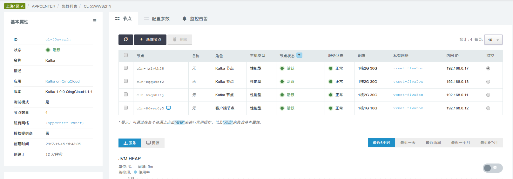

 集群基础资源监控信息：

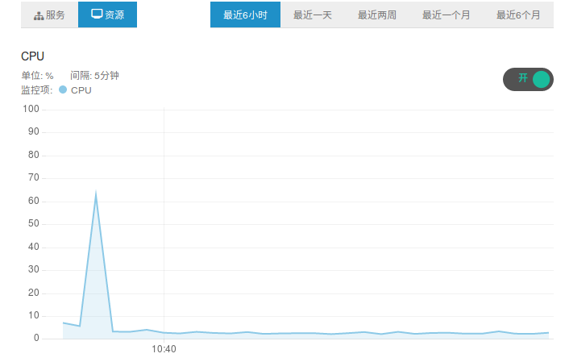  

 集群节点监控信息：

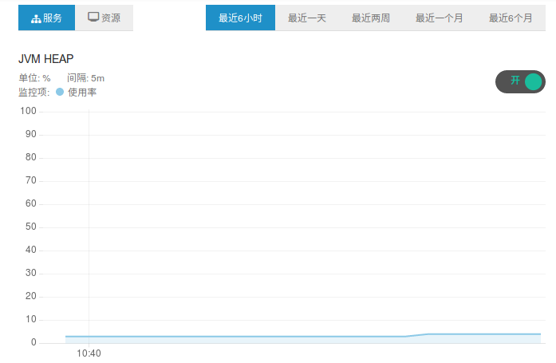

### 配置参数

  点击 `配置参数` 可以修改 `Kafka 参数`， `Kafka-manager 参数`。

  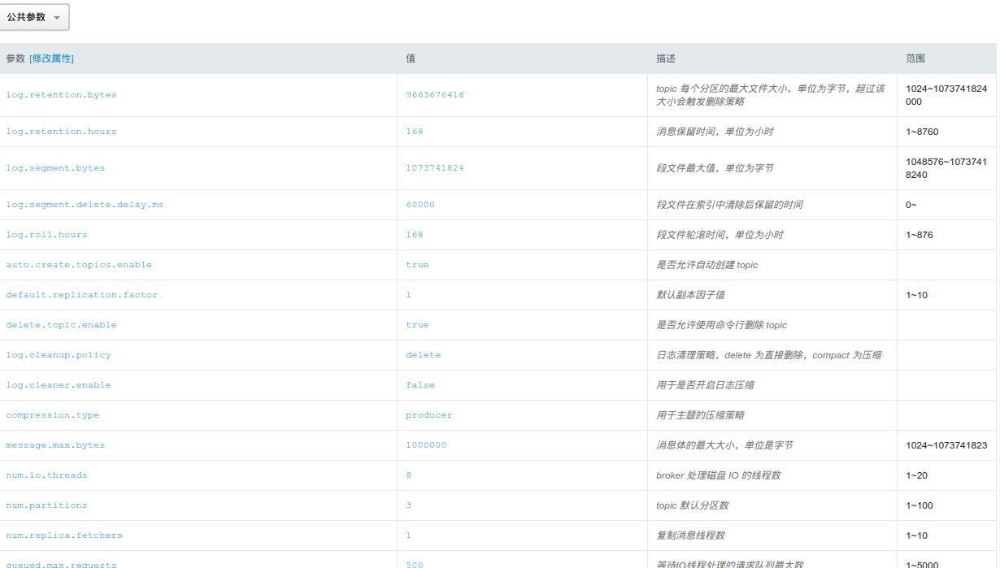

### 扩容集群

  点击 `扩容集群` ， 可以在集群性能不足时提高集群的配置：

  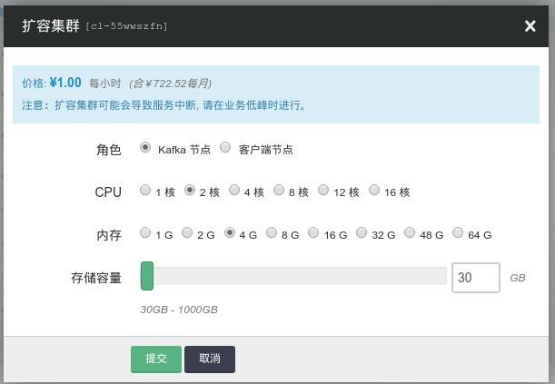

### 跨网访问

青云提供灵活的网络配置， Kafka 在实际使用中会出现 producer，consumer 与 broker 都不在一个网段之中， 这个时候需要在 broker 所在的路由器上配置端口转发，并且需要修改 broker 的 advertised host 与 advertised port 为路由器转发的源地址和源端口。这是因为 Kafka 各节点(broker, producer, consumer) 之间是靠 advertised host 与 advertised port 通讯的。假设路由器的 IP 地址是 207.226.141.61，端口9080转发到 Kafka broker 192.168.0.10端口9092， 点击`配置参数`，`修改属性`， 修改 `advertised.host.name` 为 207.226.141.61，修改 `advertised.port` 为9080 ：

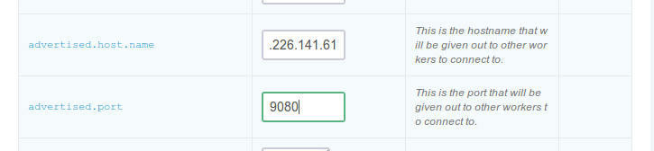

### kafka-manager 创建 topic

点击 `topic` ， 点击 `Create`,若不单独给 topic 配置参数，会使用集群级别默认参数：

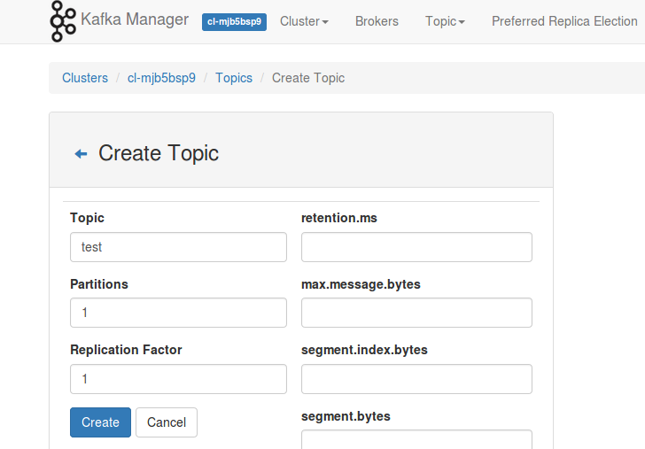

### kafka-manager 管理 topic

点击 `topic` ， 可以在 `List` 里找到 topic 进行管理，修改 topic 参数：

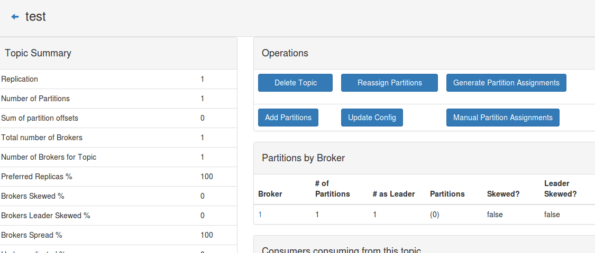

### kafka-manager 平衡分区 leader

点击 `Preferred Replica Election` 通过 Run 执行：

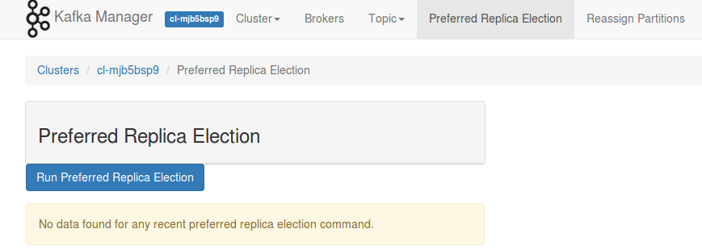

## kafka 客户端命令行示例简介

>使用 Kafka 1.0.0-QingCloud1.1.4及后续版本，建议使用青云为您创建客户端节点，用户名：root，密码：kafka

### 创建 topic

 创建一个 topic 为 test ，该 topic 分区为3，副本为1

> kafka-topics.sh  --create --zookeeper 192.168.0.6:2181,192.168.0.8:2181,192.168.0.7:2181/kafka/cl-zom1un35 --replication-factor 1 --partitions 3 --topic test

### 查看 topic

 查看集群所有 topic

> kafka-topics.sh --list --zookeeper 192.168.0.6:2181,192.168.0.8:2181,192.168.0.7:2181/kafka/cl-zom1un35

### 向 topic 发送消息

 向 test 发送消息

> kafka-console-producer.sh --broker-list 192.168.0.3:9092,192.168.0.4:9092,192.168.0.9:9092 --topic test

### 消费 topic 消息

 消费 test 消息（若没有使用 --from-beginning ， 则从最新的开始消费）

> kafka-console-consumer.sh --bootstrap-server 192.168.0.3:9092,192.168.0.4:9092,192.168.0.9:9092 --topic test --from-beginning

### 查看 topic 消息分布情况

  查看 test 消息分布情况

>kafka-topics.sh --describe --zookeeper 192.168.0.6:2181,192.168.0.8:2181,192.168.0.7:2181/kafka/cl-zom1un35 --topic test

### 修改 topic

  修改分区

>kafka-topics.sh -zookeeper 192.168.0.6:2181,192.168.0.8:2181,192.168.0.7:2181/kafka/cl-zom1un35 --alter --topic test  partitions 2

删除 topic

>kafka-topics.sh -zookeeper 192.168.0.6:2181,192.168.0.8:2181,192.168.0.7:2181/kafka/cl-zom1un35 --delete --topic test

### 平衡 topic

平衡 topic 分区 leader

>kafka-preferred-replica-election.sh -zookeeper 192.168.0.6:2181,192.168.0.8:2181,192.168.0.7:2181/kafka/cl-zom1un35

### 查看消费者消费情况

检查 topic 消费者消费情况

>kafka-consumer-offset-checker.sh  --zookeeper 192.168.0.6:2181,192.168.0.8:2181,192.168.0.7:2181/kafka/cl-zom1un35 --topic test --group test_group

### 更改 topic 配置参数

更改 topic 配置参数(也可以在创建的时候指定，例如创建时候最后跟上 --config a=b --config x=y)

>kafka-configs.sh --zookeeper 192.168.0.6:2181,192.168.0.8:2181,192.168.0.7:2181/kafka/cl-zom1un35 --entity-type topics --entity-name test  --alter --add-config max.message.bytes=128000

## 注意事项

- 青云提供 Kafka 在 zookeeper 上注册路径格式如下：zk1:2181,zk2:2181,zk3:2181/kafka/cluster_id,cluster_id 是创建集群时候生成的集群 ID
- 请尽量合理选择和预留存储资源，合理配置数据存储周期和大小，尽量避免因为磁盘写满而造成的线上故障
- 开发的时候客户端尽量选择与服务端对应的版本
- 可以使用 kafka-manager 管理和修改 topic 配置，监控集群，同时您也可以自己安装客户端，使用命令行形式管理和使用集群

至此，`Kafka on QingCloud AppCenter` 的介绍到这里就告一个段落了。

在使用过程中如果遇到问题可以通过 `提交工单` 来获取帮助，我们将竭诚为您服务。

Have a nice day on QingCloud AppCenter !
