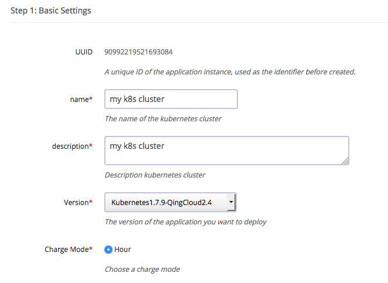
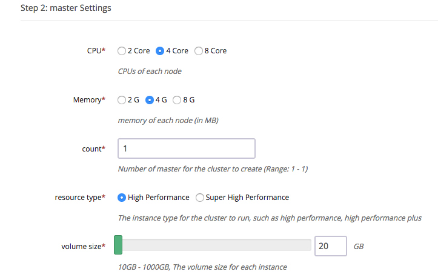
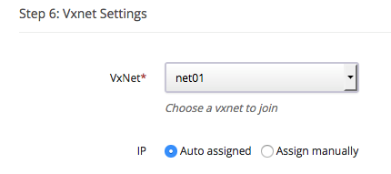
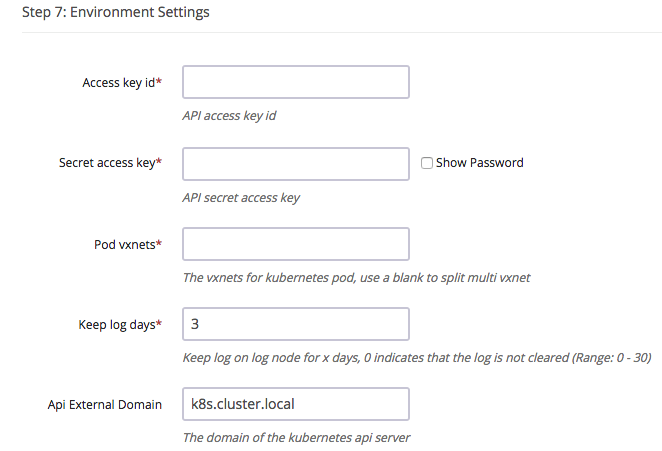
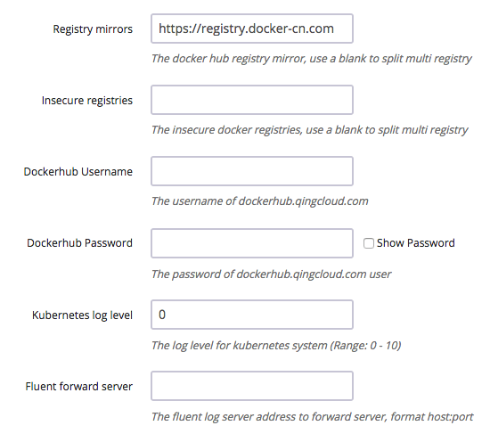
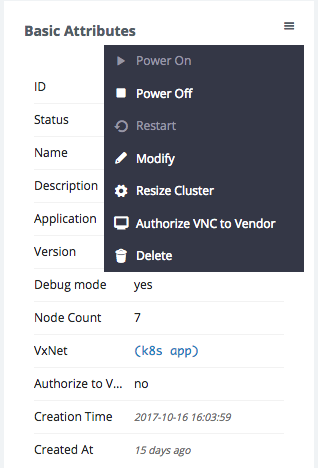
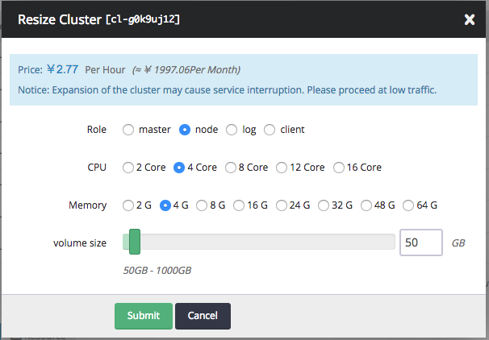

# Kubernetes on QingCloud AppCenter Usage Instruction

## Summary

Kubernetes is an open-source orchestration system for automating deployment, scaling and management of containerized applications, which aims to provide a "platform for automating deployment, scaling, and operations of application containers across clusters of hosts. The goal of Kubernetes on QingCloud AppCenter is to help end users to easily setup a Kubernetes cluster in several minutes.

## Create Kubernetes cluster

Through QingCloud AppCenter, creating and managing a Kubuerntes cluster is very easy, and also the cluster supports scaling horizontal/vertical, self diagnosis(displaying nodes' real-time status), and customizing thresholds/alarms. The cluster runs in the private network(vxnet), attached with high performance hard disk provided by QingCloud platform, which will ensure end users' data security and I/O performance.

### Prerequisite

To ensure data security, Kubernetes cluster should be better run in the private network, so creating a VPC and managed vxnet is necessary before creating Kubernetes cluster, then assign(join) vxnet to VPC and enable DHCP service(enabled as default). Please don't specify VPC network range to 172.17.0.0/16, which is consumed by docker as default, at same time, <font color=red>**assigning a public IP(EIP) to VPC**</font> is must-have, which is required for accessing QingCloud IaaS API and pulling docker images.

### Step 1: Select and configure IaaS resource

After clicking 'Deploy on QingCloud' button and selecting specific zone, it is asked to input Kubernetes cluster name, description and version choose charge mode  

  
Please choose CPU/Memory, nodes count and other configuration based on requirement for different types of Kubernetes nodes, snapshot below is from master node as example. All nodes should use same resource type   

  
Assign vxnet, which should be created before deploying this cluster  

  
Input other parameters for Kubernetes cluster  

  

* Kubernetes on QingCloud AppCenter integrates with QingCloud IaaS platform and could operate resources like volume, vxnet...etc, to do that, end user needs to request and generate API access key to call QingCloud IaaS API [Access Key](https://console.qingcloud.com/access_keys/).  

* Kubernetes App uses SDN2.0 provided by QingCloud, every pod will be binded with a NIC and assigned with a private IP address. End user should create vxnets in advance and input their IDs to cluster parameter 'Pod vxnets', like vxnet-xxxxxxx. Our suggestion is that the vxnets specified in cluster parameter should be better only used for Pods in this Kubernetes cluster, every vxnet could contains 200+ IP addresses, creating and specifying more vxnet if you have the requirement for large amount of Pods, separate them by blank character. <font color=red>**Please don't input the vxnet which is consumed by Kubernetes cluster and also all these vxnets should be in same VPC where cluster's vxnet resides in**</font>。

* Kubernetes App supports the feature of customizing log monitor, end user could search and query all the log resource managed by Kubernetes. The log will be deleted on schedule to save disk space, this schedule could be configured in cluster parameter 'Keep log days'

* Configure the domain name for Kubernetes API, which is used to generate ca certification of API server  



* Registry mirrors The mirror address for Docker hub registry, the default value is official docker hub mirror address for China.  
* Insecure registries Kubernetes App supports private docker registry. To help end users using their own internal registry, QingCloud also provide [harbor App](https://appcenter.qingcloud.com/apps/app-2mhyb1ui), which could be deployed easily. Specify corresponding IP address if the private registry doesn't support https or doesn't use 80 port(the format is ip:port).  
* Kubernetes cluster needs to pull necessary images customized by QingCloud from dockerhub.qingcloud.com, so end user needs to input user name and password of docherhub.qingcloud.com. Kubernetes App already binds guest account to pull images on public repositories from dockerhub.qingcloud.com. Please submit help ticket if you need to create and use your own repository.  
* Set the log level of Kubernetes cluster, manage log through Kibana console.
* Specify fluentd server address if end user want to use his own log server.

### Step 2: Finish Deployment

After deploying Kubernetes cluster, end user could check every node's status, 'Healthy' under 'Service status' means this node starts successfully. Cluster's status will become to 'Active' after every node become healthy, which means end user could use Kubernetes services.  


## Test Kubernetes

### Use client node

To test Kubernetes cluster, end user could access client node, click 'vnc' icon on client node  

  
Login as root/k8s and run commands as below:

```shell
kubectl get pods --all-namespaces
```

which will return all Pods with status to show if the cluster runs normally.

```shell
kubectl get service --all-namespaces

NAMESPACE     NAME                    CLUSTER-IP      EXTERNAL-IP   PORT(S)         AGE
default       kubernetes              10.96.0.1       <none>        443/TCP         1m
kube-system   elasticsearch-logging   10.96.0.11      <none>        9200/TCP        1m
kube-system   fluentbit-logging       10.96.195.104   <none>        24224/TCP       1m
kube-system   heapster                10.96.132.130   <none>        80/TCP          1m
kube-system   kibana-logging          10.96.18.90     <none>        5601/TCP        1m
kube-system   kube-dns                10.96.0.10      <none>        53/UDP,53/TCP   1m
kube-system   kubernetes-dashboard    10.96.70.70     <none>        80/TCP          1m
```

which will return all services with status, these services could be accessed by cluster-ip or service name.  

```shell
curl 10.96.0.11:9200/_cluster/health
curl elasticsearch-logging.kube-system:9200/_cluster/health
```

On client node, the default dns search domain is 'default.svc.cluster.local svc.cluster.local cluster.local', so to access the services under non default namespace, end user should add namespace suffix. For more detail about Kubernetes dns support, please refer to [Kubernetes Official Document about DNS Pods and Services](https://kubernetes.io/docs/concepts/services-networking/dns-pod-service/).

### Check cluster status through browser

Kubernetes cluster on QingCloud integate heapster and dashboard components provided by Kubernetes and also binds with an elasticsearch kibana cluster, end user could check monitor and log data easily.  

Login client node and run command as below:  

```shell
nohup kubectl proxy --address='0.0.0.0' --accept-hosts='.*' --disable-filter=true --accept-paths="^.*" &
```

Enable VPN service of VPC and connect this VPN through VPN client, then open the URL on browser: http://client node ip:8001/ui，this will open dashboard console as below:


Kibana console for log management could be visited by URL like: http://client-node-ip:8001/api/v1/proxy/namespaces/kube-system/services/kibana-logging/


End user could find out proxy address for other service by command below:  

```shell
kubectl cluster-info
```

End user needs to import below indexes on Kibana console to get corresponding log data. All these data is based on timestamp, input the index name with pattern and timestamp then select field name through drop-down list.  

| index                 | timestamp                  |
| --------------------- | -------------------------- |
| heapster-cpu-*        | CpuMetricsTimestamp        |
| heapster-memory-*     | MemoryMetricsTimestamp     |
| heapster-filesystem-* | FilesystemMetricsTimestamp |
| heapster-network-*    | NetworkMetricsTimestamp    |
| logstash-*            | @timestamp                 |


Refer to [Official Document](https://www.elastic.co/guide/en/kibana/current/discover.html)

To get the data structure of heapster, please visit http://client-node-ip:8001/api/v1/proxy/namespaces/kube-system/services/elasticsearch-logging/_cat/indices  

Some pre-defined templates are provided by QingCloud, which could be downloaded from [here](screenshot/export.json)  

The main timeline query is as below:  

```Text
.es(index='heapster-cpu-*',q="MetricsTags.type:node",split='MetricsTags.host_id:10',timefield='CpuMetricsTimestamp',kibana=true,metric="max:Metrics.cpu/node_utilization.value")
```

'heapster-cpu-' is the alias name of 'heapster-', which could be identified by adding '_type'.  
'MetricsTags.type:node' is the tag for different types of instances, like pod, node...etc.  
End user could find out the data under same type at first then build up query based on requirement and charts.

## Scale horizontal/vertical

### Add node

Click 'Add Nodes' button to solve the performance issue when more and more services are deployed in Kubernetes cluster, the newly added node's status could be found in cluster detail page.  


### Delete node

Click 'Delete' button to remove unnecessary nodes when there are less connections and services, which will save resource and cost for end user.  

### Scale Up/Down(Resize cluster)

Resize cluster if end user want to enhance or reduce node configuration.  



Adjust the capacity for different roles' nodes on the pop-up page.  



## Kubernetes integrates with QingCloud IaaS

### LoadBalancer

Kubernetes on QingCloud supports to integrate Kubernetes internal services with loadbalancer from QingCloud IaaS platform, these services could be accessed from outside of cluster through loadbalancer.  

Set Service type to LoadBalance, then add below annotations in metadata:

1. service.beta.kubernetes.io/qingcloud-load-balancer-type: this annotation will set the loadbalancer type, corresponding to loadbalancer_type attribute of QingCloud IaaS API [create_loadbalancer](https://docs.qingcloud.com/api/lb/create_loadbalancer.html).  
2. service.beta.kubernetes.io/qingcloud-load-balancer-eip-ids: this annotation will bind eips to loadbalancer(these eips should be created on QingCloud console at first and not accupied by other services), then input their ID for this annotation, which supports 4 eip IDs at most. With this annotation, the loadbalancer of Intenet type will be created automactically.  
3. service.beta.kubernetes.io/qingcloud-load-balancer-vxnet-id: this annotation will assign created loadbalancer of vxnet type to some vxnet(this vxnet should be created on QingCloud console at first).  

As described above, specifying annotation as qingcloud-load-balancer-eip-ids or qingcloud-load-balancer-vxnet-id will create loadbalancer with Internet or vxnet type. If just specifying LoadBalancer service type but not set any annotations or no more detail attributes under annotations spec, a loadbalancer with vxnet type will be created and assigned to the vxnet where Kubernetes cluster resides in.  

Completed example as below: 

```yaml
apiVersion: v1
kind: Service
metadata:
  name: helloworld
  annotations:
    service.beta.kubernetes.io/qingcloud-load-balancer-eip-ids: "eip-xxxx"
    service.beta.kubernetes.io/qingcloud-load-balancer-type: "0"
spec:
  ports:
    - port: 80
      targetPort: 80
  selector:
    app: helloworld
  type: LoadBalancer
---
apiVersion: v1
kind: Service
metadata:
  name: helloworld-internal
spec:
  ports:
    - port: 80
      targetPort: 80
  selector:
    app: helloworld
  type: LoadBalancer
```

As no qingcloud-load-balancer-eip-ids or qingcloud-load-balancer-vxnet-id specified for helloworld-internal service, a loadbalancer with vxnet type will be created and assigned to the vxnet where Kubernetes cluster resides in.  

Check the service status through kubectl command:  

```shell
kubectl get service

NAME                  CLUSTER-IP     EXTERNAL-IP     PORT(S)        AGE
helloworld            10.96.146.44   139.198.0.55    80:30760/TCP   3d
helloworld-internal   10.96.145.22   192.168.0.5     80:30221/TCP   3d
```

EXTERNAL-IP column will show the IP address of EIP for loadbalancer of Internet type and private IP address in vxnet for loadbalancer of vxnet type.  
Please set name attribute if more than one ports are set in configuration file, otherwise service will fail to deploy because of specification validation error.  

### Storage

Kubernetes on QingCloud support to attach volumes to pod as PersistentVolume, these volumes will also be migrated to the nodes where the pods are scheduled and migrated to.  

Set qingCloudStore specification when defining PersistentVolume, which has two attributes:  

1. volumeID the volume ID which is created on QingCloud console in advance. 
2. fsType the type of file system after volume is attached. 

Completed example as below:  

```yaml
kind: PersistentVolume
apiVersion: v1
metadata:
  name: qingcloud-pv
  labels:
    type: qingcloud
spec:
  capacity:
    storage: 10Gi
  accessModes:
    - ReadWriteOnce
  qingCloudStore:
        volumeID: vol-xxxxx
        fsType: ext4
```

Example in pod of Kubernetes1.5:  

```yaml
apiVersion: v1
kind: Pod
metadata:
  name: test-pd
spec:
  containers:
  - image: dockerhub.qingcloud.com/docker/nginx
    name: test-container
    volumeMounts:
    - name: html-volume
      mountPath: "/usr/share/nginx/html"
  volumes:
  - name: html-volume
    qingCloudStore:
      volumeID: vol-xxxxx
      fsType: ext4
```

Example in pod of Kubernetes1.7+:  

```yaml
apiVersion: v1
kind: Pod
metadata:
  name: test-pd
spec:
  containers:
  - image: dockerhub.qingcloud.com/docker/nginx
    name: test-container
    volumeMounts:
    - name: html-volume
      mountPath: "/usr/share/nginx/html"
  volumes:
  - name: html-volume
    flexVolume:
      driver: "qingcloud/flex-volume"
      fsType: "ext4"
      options:
        volumeID: "vol-xxxx"
```

#### Use PersistentVolumeClaim

The examples above show that, to use PersistentVolume, the volume should be created at first, then input volume ID in configuration file and bind it to specified service, it is very hard for resource migration. To solve this limitation, Kubernetes provides PersistentVolumeClaim, which just needs to define the requirement of volume, creation and destruction will be handled by Kubernetes automatically.  

Define StorageClass:  

```yaml
kind: StorageClass
apiVersion: storage.k8s.io/v1beta1
metadata:
  name: qingcloud-storageclass
  labels:
      addonmanager.kubernetes.io/mode: EnsureExists
  annotations:
      storageclass.beta.kubernetes.io/is-default-class: "true"
provisioner: kubernetes.io/qingcloud-volume
```

Define PersistentVolumeClaim:  

```yaml
kind: PersistentVolumeClaim
apiVersion: v1
metadata:
  name: qingcloud-pvc
  annotations:
    volume.beta.kubernetes.io/storage-class: qingcloud-storageclass
spec:
  accessModes:
    - ReadWriteOnce
  resources:
    requests:
      storage: 10Gi
```

QingCloud develop related plugin to support PersistentVolumeClaim, qingcloud-storageclass already is already integrated into Kubernetes App on QingCloud, end users don't need additional configuration, and qingcloud-storageclass is the default storageclass, so end users could skip setting annotations 'volume.beta.kubernetes.io/storage-class: qingcloud-storageclass' in PersistentVolumeClaim specification. Please refer to the example of wordpress below for more detail.  

qingcloud-storageclass supports high performance and super high performance volume device, which depends on the volume type of cluster nodes when deploying, the storage plugin will create corresponding volumes automatically based on the resource type of host instances, that's why Kubernetes App ask to use same resource type when deploying.  

To use capacity volume, specify storage-class as qingcloud-storageclass-capacity.  
Run command as below:

```shell
kubectl get storageclass

NAME                               TYPE
qingcloud-storageclass (default)   kubernetes.io/qingcloud-volume
qingcloud-storageclass-capacity    kubernetes.io/qingcloud-volume
```

it will return all supported storageclass in cluster, end users could also define their own storageclass.  

>Note: no matter the volume is high perforamnce or capacity, its acccessModes must be **ReadWriteOnce**  

### Network

Kubernetes App on QingCloud uses SDN Passthrough solution for container network, IP assigned to every pod is under same VPC where host instance resides in. Information message about attaching NIC will be shown on QingCloud console when deploying containers. By this solution, Pods and host instances will locate in same layer of network, which will bring less network loss, but there are some limitations:  

1. Every host instance supports 64 NICs at most, so Kubernetes App on QingCloud restrict the number of pods on each node to 60.  
2. Private network(vxnet) is class C subnet, which only supports more than 200 IP addresses, so to support more Pods deployment, please specify more vxnet ID when creating cluster.  

## Tutorial

1. [Use QingCloud LoadBalancer to deploy Helloworld Service](tutorials/helloworld-en-US.md)
2. [Use QingCloud LoadBalancer and PersistentVolumeClaim to deploy Wordpress](tutorials/wordpress-en-US.md)

### More examples

Please find more examples related to the configuration files of QingCloud volume and Loadbalancer from [Kubernetes on QingCloud github repository](https://github.com/QingCloudAppcenter/kubernetes/tree/master/sample).  

    kubectl apply -f xxxx.yaml


## Note

1. Please don't set network range to 172.17.0.0/16 in VPC, which is occupied by docker as default.  
2. Use same resource type for all kinds of nodes.  
3. The number of Pods and containers displays on node monitor page.  
4. Make sure vxnet could access intenet for the needs of calling QingCloud IaaS API and pulling images(**bind EIP to VPC**).  
5. Choose vxnet which is in same VPC where cluster's vxnet resides in and don't reuse the vxnet occupied by pod.  
6. Please refer to [ Kubernetes Official Document](https://kubernetes.io/docs/home/) for more usage about Kubernetes.  

## FAQ

### How to visit services outside of Kubernetes cluster  

There're two options

1. Expose loadbalancer through service, and use the loadbalancer of vxnet for the private network case. This is the commonly accepted option, which could be used in official scenarios. 
2. Create a router rule which redirects the packages, which are sent to cluster-ip, to some node(like master node) in the cluster. This solution will treat this node as gateway to transmit packages. Please configure dns if end uses still use domain name to access service. This option is just work-around.  

```shell
    ip route add 10.96.0.0/16 via $cluster_node_ip
```

```reStructuredText
   	nameserver 10.96.0.10
    search default.svc.cluster.local svc.cluster.local cluster.local
```


### Why my cluster fails to startup or gets timeout  

1. Make sure to bind EIP to VPC. 
2. Make sure the API key is correct. 

Please submit ticket if all these are correct. 

### Why LoadBalancer doesn't work properly  

1. Make sure the Service could be accessed by Cluster IP. 

2. Make sure the Service could be accessed by NodePort. 

3. Do not reuse the vxnets where Pods are using if this loadbalancer is in private network. 

4. Make sure the account get verified(getting ICP license could be better ) if end user uses 80 port. 

### How to use log of json format and indexed in Elasticsearch by fields  

fluent-bit service in Kubernetes App On QingCloud already enable the detection of json data, so if the output of log is in json format, it will be added to Elasticsearch index and resolved as json. 

Note:

1. The whole line of log must be in json format. Some log libaries will append extra information, like timestamps, which will make the log data incompleted. Please handle the log and print the output to console by programming. 
2. Please refer to [example of helloworld](tutorials/helloworld-en-US.md) for more detail about log output. 

### How to customize the logs in Kubernetes  

Kubernetes App On QingCloud collect logs and save them in Elasticsearch, end user could manage the log on Kibana console, but sometimes end users want to manage logs by themselves, for this case, they could set their own log server in environment when deploying cluster, currently Kubernetes App On QingCloud supports [Fluent or Fluent-bit](http://fluentbit.io/documentation/0.12/output/forward.html), and please refer to [example of fluent-bit](https://github.com/QingCloudAppcenter/kubernetes/tree/k8s-1.7/sample/fluentbit), run commands below as reference:  

1. Logon to client node, start fluent-bit forward server  

  ```console
  		cd /opt/kubernetes/sample/fluentbit/
  		sh run.sh
  ```

2. Modify the 'Fluent forward server' parameter to clientip:24224 in cluster environment parameters and save it. 
  fluent-bit agent will be restarted one by one and corresponding log will be shown on console later. 

Note: Make sure log forward service could work correctly if this configuration is enabled, otherwise fluent-bit agent will fail to collect log. 

### Why log can't be collected  

fluent-bit agent may meet some problem if the expected log is not collected by embedded Elasticsearch service or personal log forward service, run command below to delete fluent-bit daemonset, kubernetes will re-deploy corresponding log service. 


```  console
kubectl delete ds/fluent-bit -n kube-system
```

### How to use private registry  

 Kubernetes App on QingCloud support to configure private registry

1. If private registry doesn't enable https，please set 'Insecure registries' in environment parameter with value as ip:port of private registry. 

2. Kubernetes App on QingCloud doesn't support username/password authentication on private registry but end users could create corresponding secret token on Kubernetes to manage his own registry account. 

Detail steps as below:  

1. Create secret, modify myregistrykey and myregistryserver

   ```console
   kubectl create secret docker-registry myregistrykey --docker-username=username --docker-password=password --docker-email=email --docker-server=myregistryserver.com
   ```

2. Configure imagePullSecrets and use the secret created

  ```yaml
  apiVersion: v1
  kind: Pod
  metadata:
      name: private-reg
    spec:
      containers:
        - name: private-reg-container
      image: <your-private-image>
      imagePullSecrets:
        - name: myregistrykey
  ```


