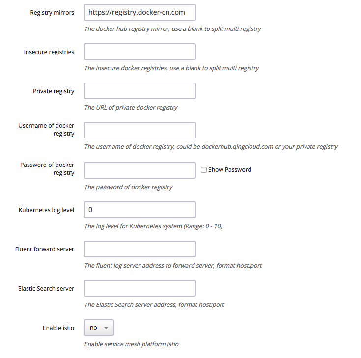

# Kubernetes on QingCloud AppCenter User Guide



<extoc></extoc>

## Abstract

[Kubernetes](https://kubernetes.io) is an open-source orchestration system to provide a platform for automating deployment, scaling, and operations of containerized applications across clusters of hosts. The goal of [Kubernetes on QingCloud AppCenter](https://appcenter.qingcloud.com/apps/app-u0llx5j8) is to help end users easily set up a Kubernetes cluster in several minutes. It also supports cluster horizontal/vertical scaling, node monitoring and alarming etc. In addition, the cluster is integrated with QingCloud storage, network and load balancer and so on. In another words, Kubernetes on QingCloud ensures end users data security and provides high disk/network I/O performance as well.

----

## Prerequisites

To ensure high security, Kubernetes cluster must run in a private network, so creating a VPC and managed vxnets is necessary before creating Kubernetes cluster. Also join the vxnets to the VPC and enable DHCP service (enabled by default). In addition, <font color=red>**associate a public IP (EIP) to the VPC**</font>, which is required for accessing QingCloud IaaS API and pulling docker images from internet.

### Create an EIP

Since the Kubernetes you are going to create must be accessible to internet, you need to create an EIP first. Please go to `Networks & CDN -> Elastic EIPs`, click 'Create' button. 

### Create VxNets 
 
Go to `Networks & CDN -> VxNets`, click 'Create' button.  

  

You need to create two kinds of VxNet, one of which is for Kubernetes cluster itself called 'cluster vxnet'. The other one is called 'Pod vxnets' which are for applications deployed onto the cluster. You might create multiple Pod vxnets since one VxNet only supports 253 private IPs (Pods).

### Create a VPC  

As shown below, through the left navigation tree on QingCloud console, go to `Networks & CDN -> VPC Networks`, click 'Create VPC Network' button. Please **don't specify VPC Network Range to 172.17.0.0/16**, which is used by docker by default.  

  

### Join VxNets to VPC

Once you created the VxNets and the VPC, you need to join the VxNets to the VPC through one of the following ways.

* Please go back to the page of `VPC Networks`, click the VPC into its detailed page. In this page, associate the EIP you created above with it, and join the created VxNets including cluster VxNet and Pod VxNets to it. 

 

>**Note:** <font color=red>After all settings are saved, please make sure to click 'Apply Changes' button on top right of the page.</font>  

* Please go back to the page of `VxNets`, right click it, then select 'Join VPC Network' and choose the VPC you created to join.

  

### Create API Access Key  

Your Kubernetes cluster will manage your resource from QingCloud platform, so API access key is required by the Kubernetes in terms of security. Please go to `Access Keys` page through left navigation tree, click 'Create' button, then input the name and description of the key and click 'Submit' button, a popup panel of generated key will be shown and download this key file to your local machine, and then you could get the detailed content of this key.  

  

----

## Create Kubernetes cluster

After all prerequisites described above are created, you are ready to create Kubernetes.

Please go to [Kubernetes on QingCloud AppCenter](https://appcenter.qingcloud.com/apps/app-u0llx5j8), click 'Deploy on QingCloud' button and select specific zone, and input the cluster info such as name, description, version, node CPU/Memory, how many nodes (nodes count) etc. 

  
  

Please add exteranl ELK app in step 7 or specify Elastic Search server address in environment setting if setting log node count to zero.  

  

Choose the cluster VxNet for the Kubernetes. **Note:** choose cluster VxNet, not Pod VxNet. 

  

EFK service is deployed on log nodes to collect and manage log data, you could also choose to rely on [ELK App on QingCloud](https://appcenter.qingcloud.com/apps/app-p6au3oyq) outside of Kubernetes cluster.  
**Note:** log node count should be zero, ELK cluster should be deployed at first and located in same VPC network as Kubernetes cluster.  

  

Specify other parameters for Kubernetes cluster. The following are some of the important parameters you need to be aware of.  

  

* Kubernetes on QingCloud AppCenter integrates with QingCloud IaaS platform and could manage resource such as volume, VxNet etc. From the aspect of security, end user needs to use her/his own API access key to call QingCloud IaaS API [Access Key](https://console.qingcloud.com/access_keys/).  

* The Kubernetes cluster uses QingCloud SDN (software defined network) to provide network for Pods. Every pod will be bound with a NIC and assigned with a private IP address. End user should create vxnets in advance and input the vxnet IDs starting with _vxnet-_ to the parameter 'Pod vxnets'. The Pod vxnets are recommended to be only used for Pods in this Kubernetes cluster. Each vxnet contains up to 253 IP addresses, so create multiple vxnets if you have large amount of Pods. Please separate them by blank character in the Environment Settings. <font color=red>**Please don't include cluster vxnet in the Environment Settings. Also all these Pod vxnets should be in the same VPC as the cluster vxnet.**</font>  

* Enable hostnic: enable hostnic plugin for better network performance with a few limitations. hostnic plugin assigned a nic on host to container and the standalone nic would provide better performance. But the total number of nics that are available on single host is up to 64. So the total number of pod on host can not exceed 64. if you choose to disable hostnic, there would be no such limitation.  

* The Kubernetes cluster supports the feature of customizing log monitor. End user can search and query all the log resource managed by the Kubernetes. The log will be deleted on a scheduled time to save disk space. It is configurable by the cluster parameter 'Keep log days'.  

* Configure the domain name for Kubernetes API, which is used to generate ca certification of API server.  

The following parameters are optional.



* **Registry mirrors:** The mirror address for Docker hub registry, the default value is official docker hub mirror address for China.  
* **Insecure registries:** The Kubernetes cluster supports private docker registry. To help end users using their own internal registry, QingCloud provides [Harbor App](https://appcenter.qingcloud.com/apps/app-2mhyb1ui), which is deployed within a few minutes. Specify corresponding IP address if the private registry doesn't support https or doesn't use 80 port(the format is ip:port).  
* **Private registry:** specify the address of private docker registry, will bind the authenticaton data to docker runtime during cluster deployment, then end user could pull images directly from his own registry server. <font color=red>**Make sure the private registry server locates in same VPC with Kubernetes cluster. If end user wants to use domain name to access it, please add corresponding dns data through VPC -> DNS Service, then deploy Kubernetes cluster**</font>  
* **Username & Password of docker registry:** The Kubernetes cluster needs to pull necessary images from dockerhub.qingcloud.com or some private docker registry server, so end user needs to input user name and password for authentication. The cluster already binds guest account to pull images on public repositories from dockerhub.qingcloud.com. Please go to QingCloud console, `Container Platform -> Docker Hub` to manage your own repositories if choosing to use QingCloud dockerhub.  
* **Kubernetes log level:** Set the log level of Kubernetes cluster. You can view log through Kibana console.  
* **Fluent forward server:** Specify fluentd server address if end user wants to use her/his own log server.  
* **Elastic Search server:** Specify Elastic Search server address if end user wants to use her/his own ES service, the format is ip:port, make sure the ip and port are accessible.  
* **Enable Istio:** <font color=red>Istio is an experimental function to connect, manage and secure microservices. We do not recommend you to enable it in production environment before an stable version of istio is released, which can guarantee the quality and performance.</font> Currently we use Istio 0.3.0 without Istio-Initializer, and istioctl has been deployed on client node. More details see[Istio](https://istio.io/).

After deploying Kubernetes cluster, end user may check every node's status in the detailed page of the cluster. 'Healthy' under 'Service status' means this node starts successfully. Cluster's status will become to 'Active' after every node becomes healthy, which means end user can use Kubernetes services now.  

----

## Test Kubernetes

### Log in the cluster

In order to avoid operation trouble, we only open client node to end user currently which pre-configured everything for user to manage the cluster. Please click 'vnc' icon on client node as shown below. 

  

Log in as root/k8s and run commands as below:

```shell
# kubectl get pods --all-namespaces
```

which returns all Pods with status to show if the cluster runs normally.

```shell
# kubectl get service --all-namespaces

NAMESPACE     NAME                    CLUSTER-IP      EXTERNAL-IP   PORT(S)         AGE
default       kubernetes              10.96.0.1       <none>        443/TCP         1m
kube-system   elasticsearch-logging   10.96.0.11      <none>        9200/TCP        1m
kube-system   fluentbit-logging       10.96.195.104   <none>        24224/TCP       1m
kube-system   heapster                10.96.132.130   <none>        80/TCP          1m
kube-system   kibana-logging          10.96.18.90     <none>        5601/TCP        1m
kube-system   kube-dns                10.96.0.10      <none>        53/UDP,53/TCP   1m
kube-system   kubernetes-dashboard    10.96.70.70     <none>        80/TCP          1m
```

which returns all services with status. These services are accessable by cluster-ip or service name.  

```shell
# curl 10.96.0.11:9200/_cluster/health
# curl elasticsearch-logging.kube-system:9200/_cluster/health
```

On client node, the default DNS search domain is _default.svc.cluster.local svc.cluster.local cluster.local_. Therefore, to access the services from non default namespace, end user should add namespace suffix. For more details about Kubernetes DNS support, please refer to Kubernetes Official Document about [DNS Pods and Services](https://kubernetes.io/docs/concepts/services-networking/dns-pod-service/).

### Check cluster status through browser

Kubernetes cluster on QingCloud integates heapster and dashboard components provided by Kubernetes and an elasticsearch kibana cluster. End user can check monitor and log data easily via those components.  

Log in client node and run command as below:  

```shell
# nohup kubectl proxy --address='0.0.0.0' --accept-hosts='.*' --disable-filter=true --accept-paths="^.*" &
```

You also can enable VPN service of VPC and connect this VPN through VPN client, then open the URL on browser: http://\<client node ip\>:8001/ui. The dashboard console is as below:


You can visit Kibana console for log management at http://\<client node ip\>:8001/api/v1/proxy/namespaces/kube-system/services/kibana-logging/


End user could find out proxy address for other service by running the command below:  

```shell
# kubectl cluster-info
```

End user needs to import the following indexes on Kibana console to get corresponding log data. All these data is based on timestamp. So input the index name with pattern and timestamp then select field name through drop-down list.  

| index                 | timestamp                  |
| --------------------- | -------------------------- |
| heapster-cpu-*        | CpuMetricsTimestamp        |
| heapster-memory-*     | MemoryMetricsTimestamp     |
| heapster-filesystem-* | FilesystemMetricsTimestamp |
| heapster-network-*    | NetworkMetricsTimestamp    |
| logstash-*            | @timestamp                 |


For deatails please refer to the [Official Document](https://www.elastic.co/guide/en/kibana/current/discover.html).

To get the data structure of heapster, please visit http://\<client node ip\>:8001/api/v1/proxy/namespaces/kube-system/services/elasticsearch-logging/_cat/indices  

Some pre-defined templates are provided by QingCloud, which could be downloaded from [here](screenshot/export.json).  

The main timeline query is as follows.  

```Text
.es(index='heapster-cpu-*',q="MetricsTags.type:node",split='MetricsTags.host_id:10',timefield='CpuMetricsTimestamp',kibana=true,metric="max:Metrics.cpu/node_utilization.value")
```

_heapster-cpu-_ is the alias name of _heapster-_, which could be identified by adding _\_type_.  
_MetricsTags.type:node_ is the tag for different types of instances, like pod, node...etc.  
End user could find out the data under same type at first then build up query based on requirement and charts.

### Kubernetes Cluster Monitoring and Application Monitoring

The monitoring integrates with prometheus. The Service using for serving prometheus dashboard is defined as NodePort type. You can access the prometheus web portal with 30,000 ports on any node except the client node. For example, you can visit http://<master node IP>:30000/.

Prometheus can automatically discover targets that need to collect data through its own Kubernetes service discovery mechanism. You can see the discovered target on the web interface. As shown below.

! [] (screenshot / prome_target.PNG)

Each target provides monitoring data in the exposition format defined by prometheus. Please refer to [official website](https://prometheus.io/docs/instrumenting/exposition_formats/) for exposition format.  

By collecting the monitoring data provided by the target, prometheus provides a dashboard for you to draw a graph. Click the "Graph" button on the menu, enter the drawing interface, as shown below.  

! [] (screenshot / prome_graph.PNG)

For example, we can enter the following expression to see the memory usage of the container started by prometheus, as shown below.  

`` `prome
container_memory_usage_bytes {pod_name = "prometheus-0", container_name = "prometheus"}
`` `

! [] (screenshot / prome_memory.PNG)

For more prometheus expression rules, please refer to [official documentation](https://prometheus.io/docs/prometheus/latest/querying/basics/).  

----

## Scale horizontal/vertical

### Add Node

Click 'Add Nodes' button when workload becomes heavy such as more and more services are deployed in Kubernetes cluster. The newly added node's status could be found in cluster detailed page.  

### Delete Node

Click 'Delete' button to remove unnecessary nodes when the workload is down to low level, which saves cost for end user.  

### Scale Up/Down (Resize cluster)

User also can resize (i.e., scale up or down) cluster to change the cluster workload capacity.  


Adjust the capacity for different roles' nodes on the pop-up page.  


----

## Kubernetes integrates with QingCloud IaaS

Kubernetes on QingCloud integrates its internal services with the services from QingCloud IaaS platform such as load balancer, storage, network etc. 

### LoadBalancer

The Kubernetes supports to integrate its internal services with loadbalancer from QingCloud IaaS. These services are accessible from outside of the cluster through loadbalancer.  

When compose service in your yaml file, set service type to LoadBalancer, then add the following annotations in metadata section:

1. **service.beta.kubernetes.io/qingcloud-load-balancer-type**: This annotation will set the loadbalancer type, which corresponds to the loadbalancer_type attribute of QingCloud IaaS API [create_loadbalancer](https://docs.qingcloud.com/api/lb/create_loadbalancer.html).  
2. **service.beta.kubernetes.io/qingcloud-load-balancer-eip-ids**: This annotation will bind eips to loadbalancer (these eips should be created on QingCloud console at first and not used by other services), then input their ID for this annotation, which supports up to four EIPs. With this annotation, the loadbalancer of Intenet type will be created automactically.  
3. **service.beta.kubernetes.io/qingcloud-load-balancer-vxnet-id**: This annotation will assign created loadbalancer of vxnet type to some vxnet (This vxnet should be created on QingCloud console at first).  

As described above, specifying annotation as qingcloud-load-balancer-eip-ids or qingcloud-load-balancer-vxnet-id will create loadbalancer with Internet or vxnet type. If just specifying LoadBalancer service type but not set any annotations or no more detailed attributes under annotations spec, a loadbalancer with vxnet type will be created and assigned to the vxnet where Kubernetes cluster resides in.  

The example is as follows. 

```yaml
apiVersion: v1
kind: Service
metadata:
  name: helloworld
  annotations:
    service.beta.kubernetes.io/qingcloud-load-balancer-eip-ids: "eip-xxxx"
    service.beta.kubernetes.io/qingcloud-load-balancer-type: "0"
spec:
  ports:
    - port: 80
      targetPort: 80
  selector:
    app: helloworld
  type: LoadBalancer
---
apiVersion: v1
kind: Service
metadata:
  name: helloworld-internal
spec:
  ports:
    - port: 80
      targetPort: 80
  selector:
    app: helloworld
  type: LoadBalancer
```

Please specify _qingcloud-load-balancer-eip-ids_ when you are using public load balancer, or specify _qingcloud-load-balancer-vxnet-id_ when using private load balancer. If neither _qingcloud-load-balancer-eip-ids_ nor _qingcloud-load-balancer-vxnet-id_ is specified, for instance, in the helloworld-internal service example above, a private loadbalancer will be created into to the vxnet where Kubernetes cluster is using, i.e., the cluster vxnet.  

Check the service status through kubectl command below. 

```shell
# kubectl get service

NAME                  CLUSTER-IP     EXTERNAL-IP     PORT(S)        AGE
helloworld            10.96.146.44   139.198.0.55    80:30760/TCP   3d
helloworld-internal   10.96.145.22   192.168.0.5     80:30221/TCP   3d
```

EXTERNAL-IP column will show the IP address of EIP for loadbalancer of Internet type and private IP address in vxnet for loadbalancer of vxnet type.  
Please set name attribute if more than one ports are set in configuration file, otherwise service will fail to deploy because of specification validation error.  

### Storage

The Kubernetes cluster supports to attach QingCloud IaaS volumes to pod as PersistentVolume. These volumes will also be migrated to the nodes along with their pods which may be migrated for some reason.  

Set _qingCloudStore_ specification when defining PersistentVolume, which has two attributes:  

1. **volumeID**: the ID of the volume that is created on QingCloud console in advance. 
2. **fsType**: the type of file system after the volume is attached. 

The example is as shown below.  

```yaml
kind: PersistentVolume
apiVersion: v1
metadata:
  name: qingcloud-pv
  labels:
    type: qingcloud
spec:
  capacity:
    storage: 10Gi
  accessModes:
    - ReadWriteOnce
  qingCloudStore:
        volumeID: vol-xxxxx
        fsType: ext4
```

Example for Pod of Kubernetes 1.5:  

```yaml
apiVersion: v1
kind: Pod
metadata:
  name: test-pd
spec:
  containers:
  - image: dockerhub.qingcloud.com/docker/nginx
    name: test-container
    volumeMounts:
    - name: html-volume
      mountPath: "/usr/share/nginx/html"
  volumes:
  - name: html-volume
    qingCloudStore:
      volumeID: vol-xxxxx
      fsType: ext4
```

Example for Pod of Kubernetes 1.7+:  

```yaml
apiVersion: v1
kind: Pod
metadata:
  name: test-pd
spec:
  containers:
  - image: dockerhub.qingcloud.com/docker/nginx
    name: test-container
    volumeMounts:
    - name: html-volume
      mountPath: "/usr/share/nginx/html"
  volumes:
  - name: html-volume
    flexVolume:
      driver: "qingcloud/flex-volume"
      fsType: "ext4"
      options:
        volumeID: "vol-xxxx"
```

#### Use PersistentVolumeClaim

The examples above show that, to use PersistentVolume, the volume needs to be created at first, then input volume ID in the configuration file and bind it to a specified service. It is very hard for resource migration because of hard code in the configurations. To solve this limitation, Kubernetes provides PersistentVolumeClaim, which just claims volume needs. Volumen creation and destruction will be handled by Kubernetes automatically.  

Define StorageClass:  

```yaml
kind: StorageClass
apiVersion: storage.k8s.io/v1beta1
metadata:
  name: qingcloud-storageclass
  labels:
      addonmanager.kubernetes.io/mode: EnsureExists
  annotations:
      storageclass.beta.kubernetes.io/is-default-class: "true"
provisioner: kubernetes.io/qingcloud-volume
```

Define PersistentVolumeClaim:  

```yaml
kind: PersistentVolumeClaim
apiVersion: v1
metadata:
  name: qingcloud-pvc
  annotations:
    volume.beta.kubernetes.io/storage-class: qingcloud-storageclass
    kubernetes.io/fsType: xfs
spec:
  accessModes:
    - ReadWriteOnce
  resources:
    requests:
      storage: 10Gi
```

We already developed QingCloud plugin to support Kubernetes PersistentVolumeClaim. And the plugin _qingcloud-storageclass_ is integrated into the Kubernetes cluster by default, which means end users don't need any more configurations, so end users can skip setting annotations _volume.beta.kubernetes.io/storage-class: qingcloud-storageclass_ in PersistentVolumeClaim specification, the default fsType is ext4, skip setting annotations _kubernetes.io/fsType_ if no customization requirement. Please refer to the example of wordpress below for more details.  

qingcloud-storageclass supports high performance and super high performance volume types, which depends on the volume type of cluster nodes when deploying. The storage plugin will create corresponding volumes automatically based on the resource type of host instances. That's the reason Kubernetes App asks to use same resource type when deploying.  

To use capacity volume, specify _storage-class_ to _qingcloud-storageclass-capacity_ instead of _qingcloud-storageclass_.  
Run the command as follows:

```shell
# kubectl get storageclass

NAME                               TYPE
qingcloud-storageclass (default)   kubernetes.io/qingcloud-volume
qingcloud-storageclass-capacity    kubernetes.io/qingcloud-volume
```

It returns all supported storageclass in cluster. End users could also define their own storageclass.  

>Note: No matter the volume is high perforamnce or capacity, its acccessModes must be **ReadWriteOnce**.  

### Network

Kubernetes on QingCloud uses QingCloud SDN Passthrough solution for container network. The Pods and Kubernetes cluster hosts are in the same VPC, which means they are on the same layer of network, resulting no network performance lost at all. Whenever you create pods, you will see information message about attaching NIC on QingCloud console. However there are some limitations. 

1. Each host instance supports 64 NICs at most, so we restrict the number of pods on each node to 60.  
2. Private network (vxnet) is class C subnet, which only supports 253 IP addresses at most. So in order to support a large number of pods, please join multiple vxnets to the VPC when creating cluster.  

----

## Tutorial

1. [Use QingCloud LoadBalancer to deploy Helloworld Service](tutorials/helloworld-en-US.md)
2. [Use QingCloud LoadBalancer and PersistentVolumeClaim to deploy Wordpress](tutorials/wordpress-en-US.md)

### More examples

Please find more examples related to the configuration files of QingCloud volume and Loadbalancer from [Kubernetes on QingCloud github repository](https://github.com/QingCloudAppcenter/kubernetes/tree/master/sample).  

```shell
# kubectl apply -f xxxx.yaml
```

----

## Note

1. Please don't set network range to 172.17.0.0/16 for VPC, which is used by docker as default.  
2. Use same resource type for all kinds of nodes.  
3. The number of Pods and containers are displayed on the cluster built-in node monitor section on the cluster detailed page of QingCloud console.  
4. Make sure vxnet could access intenet for calling QingCloud IaaS API and pulling images (**Please bind EIP to VPC**).  
5. Please use cluster vxnet just for kubernetes cluster, and use pod vxnets just for pods deployment. Don't mess them up. Also make cluster vxnet and pod vxnets in the same VPC.  
6. If end users choose to deploy log nodes and external ELK App cluster at same time by mistake, will use log nodes to manage log data by default, and if external ELK App cluster is deployed and Elastic Search server address is set at same time by mistake, will use exteral ELK App cluster by default.  
7. Please refer to [ Kubernetes Official Document](https://kubernetes.io/docs/home/) for more usage about Kubernetes.  

----

## FAQ

### How to visit services from outside of Kubernetes cluster  

There're two options.

* Expose loadbalancer through service, and use the loadbalancer of vxnet for the private network case. This is the commonly adopted option, which is recommended to use in production environment. 
* Create a router rule to redirect the packages to the cluster ip through any node (including master node) in the cluster. This node acts as the gateway to forward packages for the cluster ip. Please configure DNS if you want to use domain name to access your service. This solution is not recommended to use in production environment.  

```shell
# ip route add 10.96.0.0/16 via $cluster_node_ip
```

```reStructuredText
nameserver 10.96.0.10
search default.svc.cluster.local svc.cluster.local cluster.local
```

### Why my cluster fails to startup or gets timeout  

* Make sure an EIP is associated with your VPC. 
* Make sure the API key is correct. 

Please submit ticket if it still doesn't work. 

### Why LoadBalancer doesn't work properly  

* Make sure the Service could be accessed by Cluster IP. 
* Make sure the Service could be accessed by NodePort. 
* Do not reuse the vxnets where Pods are using if this loadbalancer is in private network. 
* Make sure the account get verified (getting ICP license could be better) if end user uses 80 port. 

### How to output my application logs in json format and be indexed by Elasticsearch in terms of fields

fluent-bit service in Kubernetes On QingCloud already enables the detection of json data, so if the output of log is in json format, it will be added to Elasticsearch index and resolved as json. 

Note:

* The whole line of log must be in json format. Some log libaries will append extra information such as timestamps, which makes the log data not in json format. Please print the logs to console by your programming library. 
* Please refer to the [Hello World Example](tutorials/helloworld-en-US.md) for more details about log output. 

### How to customize the logs in Kubernetes  

Kubernetes on QingCloud collects logs and stores them in the embeded Elasticsearch service. You can view the logs on the embeded Kibana console. If you want to have more control about your logs, you can configure your own logging server in Environment Settings when deploying the cluster. Currently Kubernetes on QingCloud supports [Fluent and Fluent-bit](http://fluentbit.io/documentation/0.12/output/forward.html). Please refer to [example of fluent-bit](https://github.com/QingCloudAppcenter/kubernetes/tree/k8s-1.7/sample/fluentbit), run commands below as reference:  

1. Log in the client node, start fluent-bit forward server  

```console
# cd /opt/kubernetes/sample/fluentbit/
# sh run.sh
```

2. Modify the 'Fluent forward server' parameter to clientip:24224 in cluster Environment Settings and save it. Fluent-bit agent will be restarted one by one, and the corresponding logs will be shown on the console later on. 

**Note**: Make sure log forward service works correctly if this configuration is enabled, otherwise fluent-bit agent will fail to collect log. 

### Why log can't be collected  

If you find the logs of the application running on the cluster is not collected by the embedded Elasticsearch service or your customized log forwarded service, it might be there is some problem with fluent-bit agent. Please run the command below to delete fluent-bit daemonset. Kubernetes will re-deploy it automatically. 

```  console
# kubectl delete ds/fluent-bit -n kube-system
```

### How to use private registry  

 Kubernetes on QingCloud supports to use private registry.

* If private registry doesn't enable https, please set 'Insecure registries' in Environment Settings with value being ip:port of private registry when creating Kubernetes cluster. 

* Kubernetes on QingCloud doesn't support username/password authentication for private registry currently. End users can create secret token on Kubernetes to use his/her own registry account by following the steps below:  

  1. Create secret, modify myregistrykey and myregistryserver

   ```console
   # kubectl create secret docker-registry myregistrykey --docker-username=username --docker-password=password --docker-email=email --docker-server=myregistryserver.com
   ```

  2. Configure imagePullSecrets and use the secret created

  ```yaml
  apiVersion: v1
  kind: Pod
  metadata:
      name: private-reg
    spec:
      containers:
        - name: private-reg-container
      image: <your-private-image>
      imagePullSecrets:
        - name: myregistrykey
  ```


