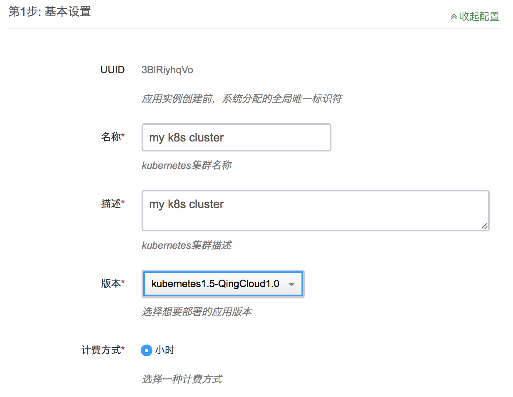
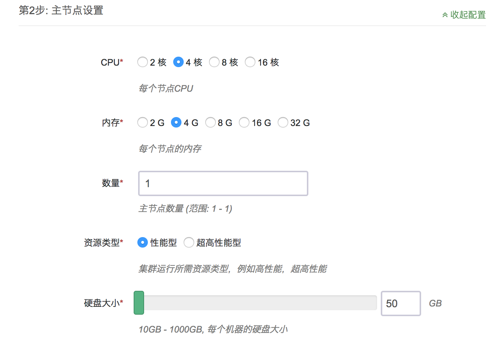
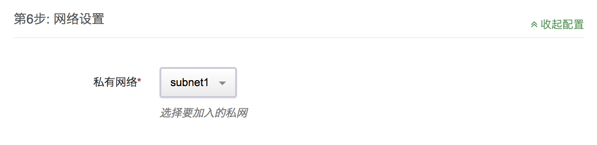
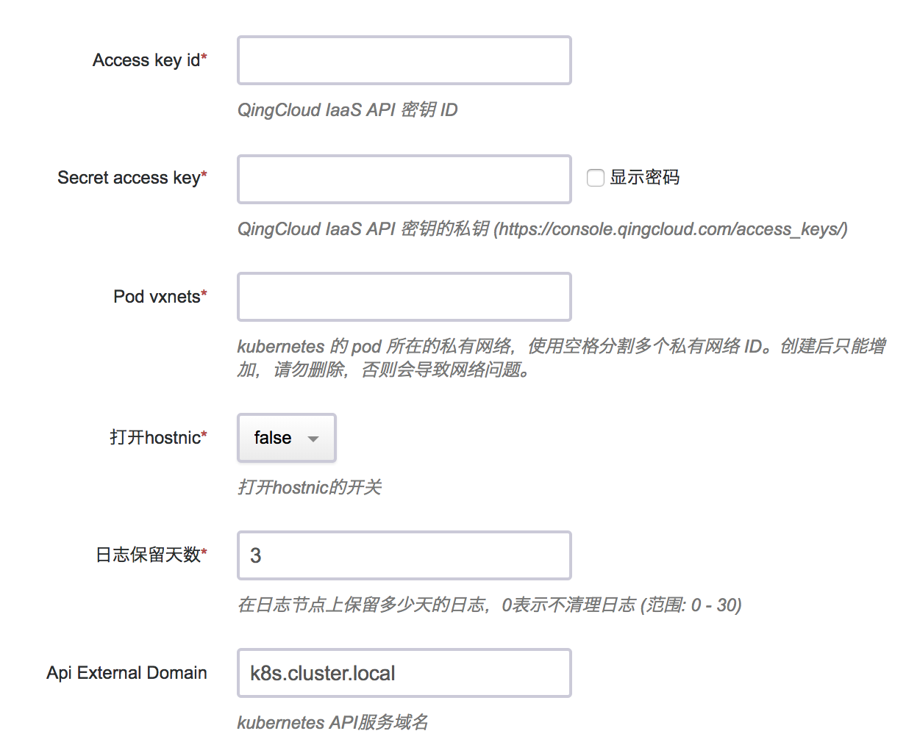
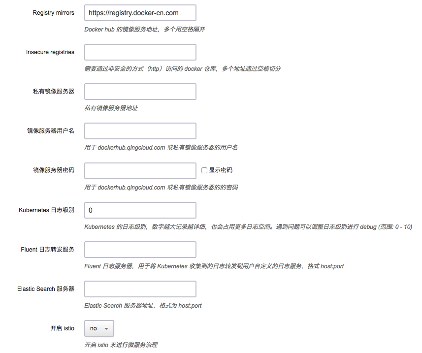
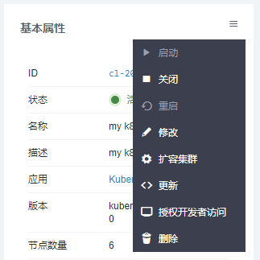

# Kubernetes on QingCloud AppCenter 用户指南

## 简介

Kubernetes 是一个开源的、用于管理云平台中多个主机上的容器化的应用的调度系统，是一个用于容器应用的自动化部署、弹性伸缩、应用升级以及运维等的开源平台。青云QingCloud Kubernetes 服务旨在方便用户在青云平台搭建 Kubernetes 集群。

## 创建 Kubernetes 集群

在青云上，您可以很方便的创建和管理一个 Kubernetes 集群。青云的 Kubernetes 集群支持横向在线伸缩，同时具有自我诊断功能，即当系统发现某节点坏死时在控制台显示状态。 另外我们还提供了监控告警等功能来帮助您更好的管理集群。集群将运行于私有网络内，结合青云提供的高性能硬盘，在保障高性能的同时兼顾您的数据安全。

> 为了保障数据安全， Kubernetes 集群需要运行在受管私有网络中。所以在创建一个 Kubernetes 集群之前，需要创建一个 VPC 和一个受管私有网络，受管私有网络需要加入 VPC，并开启 DHCP 服务（默认开启）。VPC 的地址范围请不要选择 172.17.0.0/16 这个段，因为这个 docker 默认使用这个段，使用这个段会导致网络问题。

### 第一步：选择基本配置

在创建的对话框中，您需要填写名称 (可选)，选择 Kubernetes 版本号以及选择计费方式

请根据需要选择 Kubernetes 主节点，节点和日志节点的 CPU、节点配置和数量、下图以主节点为例。所有节点的主机资源类型请保持一致，要么都是性能型，要么都是超高性能型

选择集群主机所在的私网，私网需要在创建集群前准备好。

填写 Kubernetes 应用所需参数


* 为了更好地与青云基础设施集成，Kubernetes应用需要使用您的API Token来创建资源。请在控制台生成[秘钥](https://console.qingcloud.com/access_keys/)

* Kubernetes 应用使用青云提供的 SDN2.0，创建的 Pod 都会绑定一个网卡，分配一个私网地址。这里可以设置所使用的私网 ID，私网需要预先准备好，如(vxnet-xxxxxxx)。建议给 Pod 设置专用的私网，每个私网可以容纳200多个 IP，如果您需要的容器数量较多，请填写多个，之间用空格切分。

* Kubernetes 应用内置了自定义日志监控功能，用户可以查询到所有 Kubernetes 管理的资源的日志。为了节省空间，日志会定期销毁。这里可以设置保存日志的天数

* 这里可以设置 Kubernetes API的域名，用于生成api server使用的ca证书



* Kubernetes 应用支持使用私有容器仓库，方便使用内部容器仓库的用户，青云提供了[harbor应用](https://appcenter.qingcloud.com/apps/app-2mhyb1ui)可以方便用户部署私有容器仓库

* Kubernetes 需要从 dockerhub.qingcloud.com 下载镜像包含青云定制的 Kubernetes 服务镜像，因此需要用户填写 docherhub.qingcloud.com 用户名和密码。系统已经内置了 guest 账号，可以拉取 dockerhub.qingcloud.com 上的公开仓库。如果需要创建和使用自己的仓库，请提交工单申请。

* 设置 Kubernetes 系统的日志级别，之后可以通过 kibana 查看

### 第二步：创建成功

当 Kubernetes 创建完成之后，您可以查看每个节点的运行状态。当节点的服务状态显示为“正常”状态，表示该节点启动正常。 当每个节点都启动正常后 Kubernetes 集群显示为“活跃”状态，表示您已经可以正常使用 Kubernetes 服务了。


## 测试 Kubernetes

### 使用客户端节点

Kubernetes 集群创建完成之后可以进行测试。找到客户端节点，点击 vnc 图标。

使用 root/k8s 登录。执行

```shell
kubectl get pods --all-namespaces
```

程序返回所有 pod 状态，整个集群工作正常。

```shell
kubectl get service --all-namespaces

NAMESPACE     NAME                    CLUSTER-IP      EXTERNAL-IP   PORT(S)         AGE
default       kubernetes              10.96.0.1       <none>        443/TCP         1m
kube-system   elasticsearch-logging   10.96.0.11      <none>        9200/TCP        1m
kube-system   fluentbit-logging       10.96.195.104   <none>        24224/TCP       1m
kube-system   heapster                10.96.132.130   <none>        80/TCP          1m
kube-system   kibana-logging          10.96.18.90     <none>        5601/TCP        1m
kube-system   kube-dns                10.96.0.10      <none>        53/UDP,53/TCP   1m
kube-system   kubernetes-dashboard    10.96.70.70     <none>        80/TCP          1m
```

程序返回所有 service 状态，可以通过 cluster-ip 或者 service name 来调用 service。

```shell
curl 10.96.0.11:9200/_cluster/health
curl elasticsearch-logging.kube-system:9200/_cluster/health
```

客户端节点默认的 dns search domain 是 "default.svc.cluster.local svc.cluster.local cluster.local"，所以非 default namespace 下的 service，调用的时候需要加上 namespace 后缀。关于 Kubernetes 的 dns 支持的更详细的文档请参看 [Kubernetes 官方文档 DNS Pods and Services](https://kubernetes.io/docs/concepts/services-networking/dns-pod-service/) 。

### 通过浏览器查看集群状态

Kubernetes 集群应用集成了官方的监控组件 heapster 和 dashboard。并提供了一个  elasticsearch kibana集群。方便用户查看监控和日志信息。

登录客户端节点后执行

```shell
nohup kubectl proxy --address='0.0.0.0' --accept-hosts='.*' --disable-filter=true &
```

连接客户端节点所在 vpc 的VPN后，使用浏览器访问 http://客户端节点ip:8001/ui，会自动跳转到dashboard应用。
例如：


同样，访问http://客户端节点ip:8001/api/v1/proxy/namespaces/kube-system/services/kibana-logging/ 会打开日志服务的kibana
如图


用户可以执行以下命令获得其他服务的proxy地址

```shell
kubectl cluster-info
```

用户需要导入以下index来获取所需数据。

* heapster-cpu-*
* heapster-memory-*
* heapster-filesystem-*
* heapster-network-*
* logstash-*

具体配置请参考[官方文档](https://www.elastic.co/guide/en/kibana/current/discover.html)

heapster的数据结构可以访问 http://客户端节点ip:8001/api/v1/proxy/namespaces/kube-system/services/elasticsearch-logging/_cat/indices 获得

我们提供了一些预置的模板，可以在[这里](screenshot/export.json)下载

主要的timelion查询如下

```Text
.es(index='heapster-cpu-*',q="MetricsTags.type:node",split='MetricsTags.host_id:10',timefield='CpuMetricsTimestamp',kibana=true,metric="max:Metrics.cpu/node_utilization.value")
```

heapster-cpu- 是 heapster-的别称。可以通过_type来加以区分。
MetricsTags.type:node是不同类型实体的标记（例如 pod， node等）
用户可以先将同一类型数据找出，然后按照需要构建查询。并绘出图表。

## 在线伸缩

### 增加节点

当 Kubernetes 需增加节点以应付应用逐步增多带来的压力，您可以在 Kubernetes 详细页点击“新增节点”按钮。添加成功详情页会显示服务状态为活跃。


### 删除节点

当客户端连接并不多的时候您也可以在 Kubernetes 详细页选中需要删除的节点，然后点“删除”按钮删除节点，以节省资源和费用。

### 垂直扩容

如果需要给节点增强配置或降低配置，可以使用扩容集群的功能。


可以在接下来的界面中调整不同角色的容量。


## Kubernetes 和 QingCloud IaaS 的整合

### 负载均衡器

Kubernetes on QingCloud 支持将 Kubernetes 内部的服务和 QingCloud IaaS 的负载均衡器关联起来，通过负载均衡器将服务暴露给集群外部调用。

Service 的 type 设置为 LoadBalancer，然后在 metadata 中增加以下 annotations:

1. service.beta.kubernetes.io/qingcloud-load-balancer-type ，负载均衡器的承载能力类型，和 [create_loadbalancer](https://docs.qingcloud.com/api/lb/create_loadbalancer.html) 接口中的 loadbalancer_type 取值范围相同。
2. service.beta.kubernetes.io/qingcloud-load-balancer-eip-ids ，负载均衡器上绑定的 eip ID，最多支持4个，这个 annotation 表示要创建的是 “公网” 类型的负载均衡器。 eip 必须是可用的 eip，系统会自动创建负载均衡器。
3. service.beta.kubernetes.io/qingcloud-load-balancer-vxnet-id ，负载均衡器要加入的私有网络 ID，表示要创建的是“私网” 类型负载均衡器。

qingcloud-load-balancer-eip-ids 和 qingcloud-load-balancer-vxnet-id 根据负载均衡器的"公网"或者"私网"二选一即可。

整体如下面的例子：

```yaml
apiVersion: v1
kind: Service
metadata:
  name: helloworld
  annotations:
    service.beta.kubernetes.io/qingcloud-load-balancer-eip-ids: "eip-xxxx"
    service.beta.kubernetes.io/qingcloud-load-balancer-type: "0"
spec:
  ports:
    - port: 80
      targetPort: 80
  selector:
    app: helloworld
  type: LoadBalancer
---
apiVersion: v1
kind: Service
metadata:
  name: helloworld-internal
  annotations:
    service.beta.kubernetes.io/qingcloud-load-balancer-vxnet-id: "vxnet-xxxx"
    service.beta.kubernetes.io/qingcloud-load-balancer-type: "0"
spec:
  ports:
    - port: 80
      targetPort: 80
  selector:
    app: helloworld
  type: LoadBalancer
```

通过 kubectl 可以查看 service 的状态：

```shell
kubectl get service

NAME                  CLUSTER-IP     EXTERNAL-IP     PORT(S)        AGE
helloworld            10.96.146.44   139.198.0.55    80:30760/TCP   3d
helloworld-internal   10.96.145.22   192.168.0.5     80:30221/TCP   3d
```

公网的负载均衡器的 EXTERNAL-IP 显示的是负载均衡器绑定的 eip 的 ip 地址，私网负载均衡器的 EXTERNAL-IP 显示的是均衡器的私网 ip。

### 存储

Kubernetes on QingCloud 支持将 QingCloud IaaS 上的硬盘直接挂载到 pod 上作为 PersistentVolume，当 pod 迁移时，硬盘会自动随着 pod 迁移到其他主机上。

定义 PersistentVolume 时，在 spec 中增加 qingCloudStore，有两个属性

1. volumeID 您在青云控制台上创建一块硬盘，然后将硬盘 ID 复制到 这里。
2. fsType 该硬盘挂载后的文件系统格式。

整体如下面的例子：

```yaml
kind: PersistentVolume
apiVersion: v1
metadata:
  name: qingcloud-pv
  labels:
    type: qingcloud
spec:
  capacity:
    storage: 10Gi
  accessModes:
    - ReadWriteOnce
  qingCloudStore:
        volumeID: vol-xxxxx
        fsType: ext4
```

在 pod 中使用的例子：

```yaml
apiVersion: v1
kind: Pod
metadata:
  name: test-pd
spec:
  containers:
  - image: dockerhub.qingcloud.com/docker/nginx
    name: test-container
    volumeMounts:
    - name: html-volume
      mountPath: "/usr/share/nginx/html"
  volumes:
  - name: html-volume
    qingCloudStore:
      volumeID: vol-xxxxx
      fsType: ext4
```

#### 使用 persistentVolumeClaim

通过上面的例子可以看出来，要使用 PersistentVolume 需要预先创建好硬盘，并且配置文件和具体的资源绑定了，不方便迁移。为了解决这个问题 Kubernetes 提供了 persistentVolumeClaim，只需要声明 persistentVolume 需求，创建和回收 volume 交给系统。

定义 StorageClass:

```yaml
kind: StorageClass
apiVersion: storage.k8s.io/v1beta1
metadata:
  name: qingcloud-storageclass
  labels:
      addonmanager.kubernetes.io/mode: EnsureExists
  annotations:
      storageclass.beta.kubernetes.io/is-default-class: "true"
provisioner: kubernetes.io/qingcloud-volume
```

定义 PersistentVolumeClaim

```yaml
kind: PersistentVolumeClaim
apiVersion: v1
metadata:
  name: qingcloud-pvc
  annotations:
    volume.beta.kubernetes.io/storage-class: qingcloud-storageclass
spec:
  accessModes:
    - ReadWriteOnce
  resources:
    requests:
      storage: 10Gi
```

qingcloud-storageclass 已经在 Kubernetes on QingCloud 内置，所以不需要用户自己配置，同时 qingcloud-storageclass 是默认的 storageclass，所以 PersistentVolumeClaim 中的 annotations volume.beta.kubernetes.io/storage-class: qingcloud-storageclass，也可以省略。更完整的例子参看 [wordpress 例子](https://github.com/QingCloudAppcenter/kubernetes/blob/master/sample/wordpress-deployment.yaml)。

默认的 qingcloud-storageclass 使用的是性能盘或者超高性能盘，取决于集群节点选择的主机的资源类型(性能型或者超高性能型)，系统会自动根据主机类型进行创建。所以有一个要求就是集群中的所有节点都必须选择一致的资源类型。

如果想使用容量盘，只需要指定 storage-class 为 qingcloud-storageclass-capacity。
可以通过

```shell
kubectl get storageclass

NAME                               TYPE
qingcloud-storageclass (default)   kubernetes.io/qingcloud-volume
qingcloud-storageclass-capacity    kubernetes.io/qingcloud-volume
```

命令查看系统中已有的 storageclass，也可以定义自己的 storageclass。

### 网络

Kubernetes on QingCloud 容器网络使用的是 SDN Passthrough 方案，每个 pod 分配的 ip 和主机是同一个 vpc 下的 ip。所以部署容器的时候，会在控制台看到挂载网卡的任务提示出现。这种网络方案让 pod 和主机使用同一层的网络，避免了性能损失，但也有一些限制需要了解：

1. 每个主机当前最多支持 64 个网卡，所以 Kubernetes on QingCloud 限制每个节点上最多 60 个pod。
2. 每个私有网络是一个 C 段地址，只能支持 200 多个 ip 地址，所以如果集群要支持更多的 pod，创建时需要添加多个私有网络 ID。

### 更多示例

在  [Kubernetes on QingCloud github 仓库](https://github.com/QingCloudAppcenter/kubernetes/tree/master/sample) 中包含更多使用青云磁盘，负载均衡器的配置文件。

    kubectl apply -f xxxx.yaml


## 注意事项

1. VPC 的地址范围请不要选择 172.17.0.0/16 这个段，因为这个 docker 默认使用这个段，使用这个段会导致网络问题。
2. 所有节点的主机资源类型请保持一致，要么都是性能型，要么都是超高性能型。
3. 节点监控界面中包含当前节点运行的 pod 数量和容器数量。
4. 由于需要从 dockerhub.qingcloud.com 下载镜像，请确保集群所在私网能够访问公网（vpc 绑定了公网 ip)。
5. 更多 Kubernetes 的使用方法请参考 [ Kubernetes 官方文档](https://kubernetes.io/docs/home/)。

## FAQ

### 如何在集群外部访问 Kubernetes 内的 service？

主要有两个方案：

1. 将 service 通过 LoadBalancer 暴露出来，如果只是私网内使用可以用私网的负载均衡器。这个方案比较通用，建议正式场景使用这个方案。
2. 设置一条路由，将发给 cluster-ip 的数据包都转发给集群的某个节点(包括 master)。这个相当于将该节点作为网关来转发给 cluster-ip 的数据包。如果还想通过域名访问，可以设置 dns。这个方案不建议作为正式的机制使用。

   ```shell
    	ip route add 10.96.0.0/16 via $cluster_node_ip
   ```

    ```reStructuredText
    	nameserver 10.96.0.10
    	search default.svc.cluster.local svc.cluster.local cluster.local
    ```

