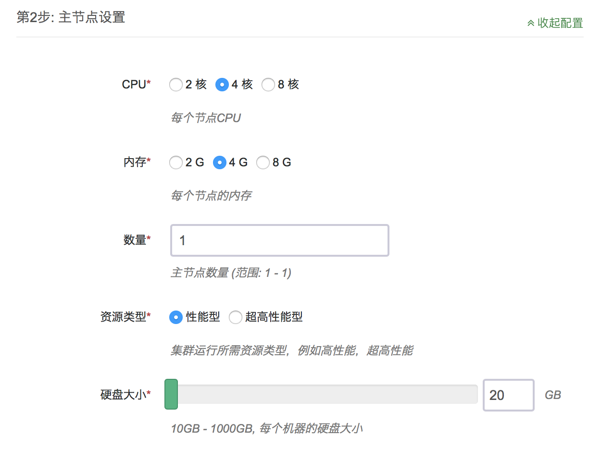

# Kubernetes on QingCloud AppCenter 用户指南

## 简介

Kubernetes 是一个开源的、用于管理云平台中多个主机上的容器化的应用的调度系统，是一个用于容器应用的自动化部署、弹性伸缩、应用升级以及运维等的开源平台。青云QingCloud Kubernetes 服务旨在方便用户在青云平台搭建 Kubernetes 集群。

## 创建 Kubernetes 集群

在青云上，您可以很方便的创建和管理一个 Kubernetes 集群。青云的 Kubernetes 集群支持横向在线伸缩，同时具有自我诊断功能，即当系统发现某节点坏死时在控制台显示状态。 另外我们还提供了监控告警等功能来帮助您更好的管理集群。集群将运行于私有网络内，结合青云提供的高性能硬盘，在保障高性能的同时兼顾您的数据安全。

> 为了保障数据安全, Kubernetes 集群需要运行在受管私有网络中。所以在创建一个 Kubernetes 集群之前，需要创建一个 VPC 和一个受管私有网络，受管私有网络需要加入 VPC，并开启 DHCP 服务（默认开启）。

### 第一步：选择基本配置

在创建的对话框中，您需要填写名称 (可选)，选择 Kubernetes 版本号以及选择计费方式

请根据需要选择Kubernetes 主节点，节点和日志节点的 CPU、节点配置和数量、下图以主节点为例

选择集群主机所在的私网,私网需要在创建集群前准备好．

填写Kubernetes应用所需参数

* 为了更好地与青云基础设施集成，Kubernetes应用需要使用您的API Token来创建资源。请在控制台生成[秘钥](https://console.qingcloud.com/access_keys/)

* kubernetes管理的服务都会有一个对应域名，这里可以设置域名的后缀

* k8s应用使用青云提供的SDN2.0,创建的Pod都会绑定一个网卡，分配一个私网地址。这里可以设置所使用的私网ID，私网需要预先准备好．如(vxnet-xxxxxxx)

* 这里可以设置k8s API对外暴露的域名。在集群内部可以使用这个域名访问k8s API


* k8s应用支持使用私有容器仓库，方便使用内部容器仓库的用户,青云提供了[harbor应用](https://appcenter.qingcloud.com/apps/app-2mhyb1ui)可以方便用户部署私有容器仓库．

* k8s需要从dockerhub.qingcloud.com下载镜像包含青云定制的k8s服务镜像，因此需要用户填写docherhub.qingcloud.com用户名和密码。这个账户请用户提交工单进行申请

* kubernetes 应用内置了自定义日志监控功能，用户可以查询到所有k8s管理的资源的日志。为了节省空间，日志会定期销毁。这里可以设置保存日志的天数

### 第二步：创建成功

当 Kubernetes 创建完成之后，您可以查看每个节点的运行状态。当节点的服务状态显示为“正常”状态，表示该节点启动正常。 当每个节点都启动正常后 Kubernetes 集群显示为“活跃”状态，表示您已经可以正常使用 Kubernetes 服务了。


## 测试 Kubernetes

### 使用跳板机

Kubernetes集群创建完成之后可以进行测试。找到跳板机节点，点击vnc图标。

使用root/k8s 登录。执行

```shell
kubectl get pods --all-namespaces
```
程序返回所有pod状态，整个集群工作正常。

### 查看集群状态

k8s集群应用集成了官方的监控组件heapster和dashboard.并提供了一个elasticsearch kibana集群．方便用户查看监控和日志信息．

登录跳板机后执行

```shell
nohup kubectl proxy --address='0.0.0.0' --accept-hosts='.*' --disable-filter=true &
```

登录跳板机所在vpc的VPN后，使用浏览器访问http://跳板机ip:8001/ui，会自动跳转到dashboard应用．
例如：


同样，访问http://跳板机ip:8001/api/v1/proxy/namespaces/kube-system/services/kibana-logging/ 会打开日志服务的kibana
如图


用户可以执行以下命令获得其他服务的proxy地址

```shell
kubectl cluster-info
```

用户需要导入以下index来获取所需数据．

* heapster-cpu-*
* heapster-memory-*
* heapster-filesystem-*
* heapster-network-*
* logstash-*

具体配置请参考[官方文档](https://www.elastic.co/guide/en/kibana/current/discover.html)

heapster的数据结构可以访问http://跳板机ip:8001/api/v1/proxy/namespaces/kube-system/services/elasticsearch-logging/_cat/indices 获得

我们提供了一些预置的模板,可以在[这里](screenshot/export.json)下载

主要的timelion查询如下

```
.es(index='heapster-cpu-*',q="MetricsTags.type:node",split='MetricsTags.host_id:10',timefield='CpuMetricsTimestamp',kibana=true,metric="max:Metrics.cpu/node_utilization.value")
```

heapster-cpu- 是 heapster-的别称．可以通过_type来加以区分．
MetricsTags.type:node是不同类型实体的标记（例如 pod, node等）
用户可以先将同一类型数据找出，然后按照需要构建查询．并绘出图表．


###　使用青云资源

在[github项目](https://github.com/QingCloudAppcenter/kubernetes/tree/master/sample/qingcloud)中包含使用青云磁盘，负载均衡器的实例脚本．
可以在跳板机的/opt/kubernetes目录中找到．可以使用kubectl 加载这些资源定义

```
kubectl apply -f xxxx.yaml
```
具体的配置参考[k8s官方文档](https://kubernetes.io/docs/concepts/)

## 在线伸缩

### 增加节点

当 Kubernetes 需增加节点以应付应用逐步增多带来的压力，您可以在 Kubernetes 详细页点击“新增节点”按钮。添加成功详情页会显示服务状态为活跃。


### 删除节点

当客户端连接并不多的时候您也可以在 Kubernetes 详细页选中需要删除的节点，然后点“删除”按钮删除节点，以节省资源和费用。

### 垂直扩容

如果需要给节点增强配置或降低配置，可以使用扩容集群的功能。

可以在接下来的界面中调整不同角色的容量。


## 注意事项

1. 节点监控界面中包含当前节点运行的pod数量和容器数量
1. 由于需要从dockerhub.qingcloud.com下载镜像．请确保集群所在私网能够访问公网．（vpc绑定了公网ip)
1. 具体使用方法请参考 [官方文档](https://kubernetes.io/docs/home/)
