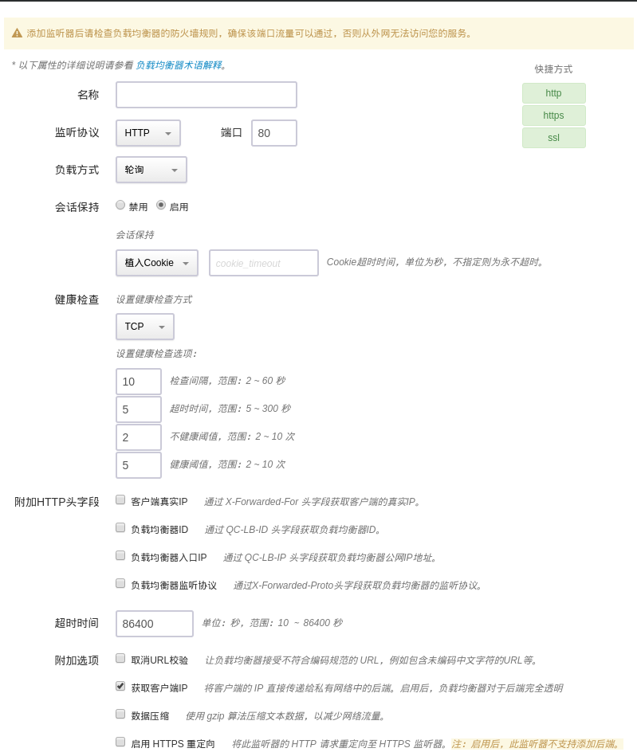

# Multi-nodes Docker on QingCloud AppCenter 用户手册

## 描述

[Docker](https://www.docker.com/) 是世界领先的软件容器平台，它为所有应用提供了统一的框架，一个标准的容器和工作流程，确保应用安全、敏捷、可移植。

`Multi-nodes Docker on QingCloud AppCenter` 将 Docker 运行环境通过云应用的形式在 QingCloud AppCenter 部署，具有如下特性：

- 基于 **Docker 17.06.0-ce, build 02c1d87** 社区版
- 利用青云 AppCenter 架构的优势，可以帮助用户快速，便利的搭建一个多节点 Docker 环境，用户无需了解 Docker Swarm、Kubernetes 等集群技术
- 每个主机节点运行独立的 Docker，前端通过青云负载均衡器完成请求转发
- 提供客户端节点统一保存各 Docker 节点日志，客户端节点运行 fluentd，可集成 ELK，同时可操控各个 Docker 节点
- 支持横向与纵向扩容与缩容

## 创建步骤

### 第1步: 基本设置

根据自己的需求填写 `名称` 和 `描述`，不影响多节点服务的功能，版本一般建议选择最新版本。

### 第2步: Docker 节点设置

Docker 多节点服务依赖于青云 QingCloud 提供的负载均衡器服务，我们需要提前创建资源并进行相应的设置：

#### 申请公网 IP

如果多节点服务需要在公网上提供服务，我们需要创建一个公网 IP。

如果该公网 IP 还需要绑定域名，还需要进行备案。

#### 创建负载均衡器

然后我们需要创建一个公网负载均衡器：

创建成功后在该负载均衡器下创建一个监听器，监听器端口需设置为80：

##### 注意

- 如果您的镜像是 web 应用，需要支持 session 同步，则监听器需开启会话保持

其它选项认根据实际业务需求填写。

#### 配置 Docker 节点

准备工作完成以后即可开始设置 Docker 节点：

分别选择自己之前创建的负载均衡器与监听器，转发策略保持为空即可。

CPU，内存，节点数量，实例类型和磁盘大小根据自己实际需求进行选择即可，例如：

- CPU: 1核
- 内存: 1G
- 节点数量: 3
- 实例类型: 超高性能型
- 磁盘大小: 100G

### 第3步: 客户端节点设置

创建 Docker 多节点服务的时候会默认创建一台主机用于收集各个 Docker 节点的日志，日志通过 fluentd 驱动直接发送给客户端节点，本地不保留以减少硬盘占用。

客户端节点提供 ssh 访问权限，默认用户名密码为 ubuntu/docker4you，用户登录后，可以通过命令 docker -H docker-node-ip xxx 查看和管理各个 docker 节点，同时可以在部署集群时指定 Elastic Search 服务器的 IP 地址和端口，如不指定，可以在客户端节点通过命令 docker logs 当前 fluentd 容器 ID 查看从各个节点收集来的日志或使用 /opt/docker/bin/print-all-logs.sh 和 /opt/docker/bin/follow-logs.sh 查看日志。  
客户端节点运行的是在 fluentd 官方镜像基础上集成了 Elastic Search 插件的镜像，配置文件为 /data/docker_data/fluentd.conf，用户可以根据自己所需定制，注意：由于此文件被青云 confd agent 监控，每次重启集群，会根据原始模版重新刷新，改动会消失。

### 第4步: 网络配置

选择需要加入的私有网络

**注意：如用户拉取的镜像在外网，则须为当前私网所在的 VPC 绑定一个公网 IP 以确保正常访问**。

### 第5步: 服务环境参数设置

#### 配置 Docker 环境参数

以上为 Docker 相关参数，填写完成后如果直接点击 `提交`，就会直接进入部署应用。

##### 配置说明

1. 如拉取（pull）的镜像（image）是公开的，则用户名密码不需要填写
1. 如使用的是非安全的（http）的镜像仓库，请将“用于拉取镜像的 URL 是否安全” 设为 ‘no’
1. 拉取的镜像需暴露相应的服务端口，此端口将和青云负载均衡器的监听器端口（必须为80）绑定
1. 对于没有定义 CMD 的镜像，则须配置“启动容器时运行的命令”
1. 使用过程中，如想更新镜像到新版本，可在配置参数中配置镜像升级的 URL，保存后通过集群控制菜单 “镜像升级” 选项完成升级。

#### 可选：配置 Elastic Search

指定 Elastic Search 服务器的 IP 地址和端口

### 第6步: 用户协议

阅读并同意青云 APP Center 用户协议之后即可开始部署应用。

## Docker 多节点服务使用

### 集群服务信息

在 Docker 集群创建完毕后，可以在控制台 `AppCenter -> 集群列表` 标签下看到目前已经创建的集群信息：

点击集群 ID 可以查看该集群的详细信息：

集群的详细信息下方是对应节点的监控信息：

### 添加节点

点击 `新增节点` 可以增加 Docker 节点。

同样的，点击 `删除` 可以删除节点。

等待负载均衡器更新完毕后，节点变更即可生效。

### 控制多节点服务

点击 `基本属性` 右侧的菜单按钮，可以查看能对当前集群进行的操作：

点击 `重启` ，可以在故障时重启所需节点：

点击 `扩容多节点服务` ，可以在集群性能不足时提高多节点服务的配置：

---
