# 基础网络配置

- [创建私有网络](#create_vxnet)
    - [SDN 2.0 - VPC](#create_vpc_vxnet)
    - [SDN 1.0 - 路由器](#create_router_vxnet)
- [配置端口转发响应公网请求](#config_portmapping)
    - [SDN 2.0 - VPC](#vpc_portmapping)
    - [SDN 1.0 - 路由器](#router_portmapping)
- [为AppCenter 应用配置公网负载均衡器](#public_loadbalancer)
- [示例: Wordpress 单机中文版](#wordpress)
- [示例: Tomcat Cluster on QingCloud](#tomcat_cluster)

**背景：** 使用 AppCenter 的应用需要让应用的节点加入到一个受管的私有网络当中。

## <a name = "create_vxnet">创建私有网络</a>

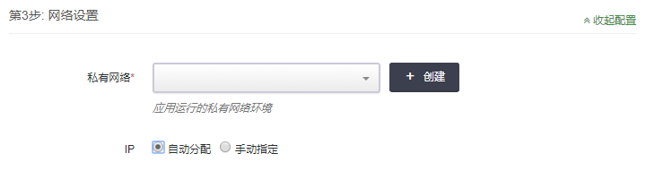

点击创建进行私有网络的创建。

**背景：** 在 SDN 2.0的区域当中，需要创建一个在 VPC 管理下的私有网络。

### <a name = "create_vpc_vxnet">SDN 2.0 - VPC</a>

在网络设置中点击创建后，会显示上图以帮助创建一个连接到VPC的私有网络。

#### 1. 创建VPC网络

点击操作进行创建VPC网络：

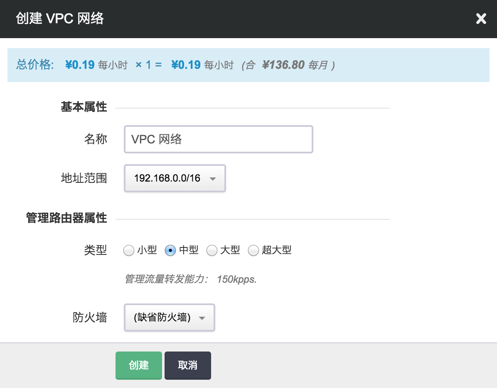其中：

**地址范围**: VPC 网络的地址范围域，通常是一个 B 段地址；为 VPC 网络划分子网的时候，子网必须在这个地址范围内。

**类型**: VPC 网络的管理路由器类型，不同类型可支持的管理流量转发能力不同，可根据自己的业务特点及需求进行选择，对于已创建好的 VPC 网络来说，也可以在关闭 VPC 网络之后进行修改。

**防火墙**: VPC 网络的管理路由器的防火墙；每个 VPC 网络有一个管理路由器，这个路由器提供端口转发、隧道服务( [GRE 隧道](https://docs.qingcloud.com/guide/compute_network/gre.html#guide-gre) 、[IPSec 隧道](https://docs.qingcloud.com/guide/compute_network/ipsec.html#guide-ipsec))、[VPN 服务](https://docs.qingcloud.com/guide/compute_network/vpn.html#guide-vpn) 等管理服务。当访问这些服务时，需要经过这个防火墙。

设置完成后点击“提交”，创建完成后可以在创建依赖资源面板看到已经创建成功：

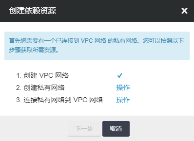

并且可以在VPC列表中看到VPC网络的属性：

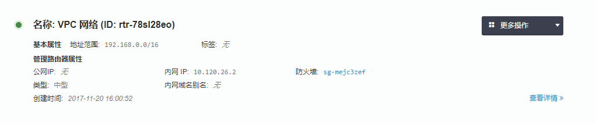

#### 2.创建私有网络

点击操作进行创建私有网络。

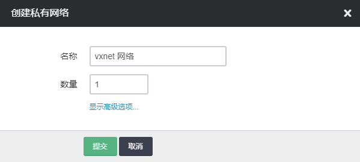

输入名称并点击提交完成创建私有网络。

#### 3.连接私有网络到 VPC 网络

点击操作进行连接私有网络到VPC网络：

选择之前创建的VPC网络并点击提交。

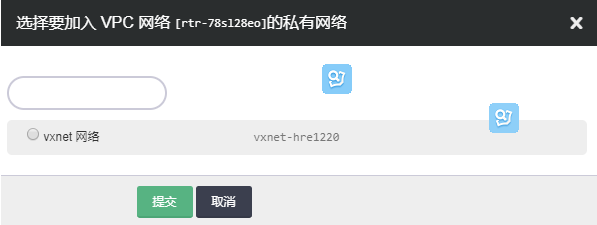

选择之前创建的私有网络并点击提交。

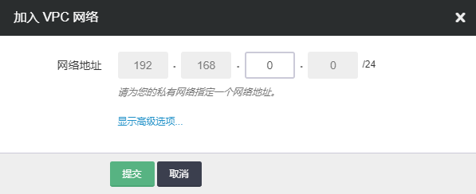

为私有网络选择一个网络地址，最终点击提交，完成私有网络加入VPC网络。

此时我们已经完成了"一个连接到VPC网络的私有网络"的创建。

**背景：**在SDN1.0的区域当中，需要创建一个在路由器管理下的私有网络。

### <a name = "create_router_vxnet">SDN 1.0 - 路由器</a>

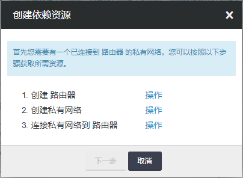

#### 1.创建路由器

点击操作进行创建路由器：

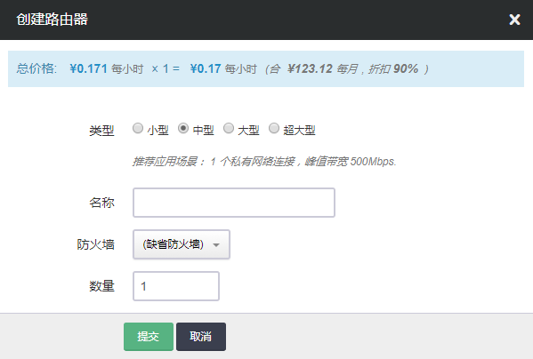

指定路由器的类型，并改变名称与防护墙等信息，完成后点击提交。

#### 2.创建私有网络

点击操作进行创建私有网络。

输入名称并点击提交完成创建私有网络。

#### 3.连接私有网络到路由器

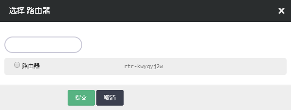

选择之前创建的路由器并点击提交。

选择之前创建的私有网络并点击提交。

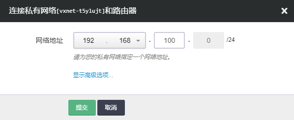

为私有网络选择一个网络地址，最终点击提交，完成私有网络加入路由器。

此时我们已经完成了"一个连接到路由器的私有网络"的创建。

## <a name = "config_portmapping">配置端口转发响应公网请求</a>

**背景** ：在SDN2.0的区域当中，应用需要被公网访问时，可以利用VPC的端口转发响应公网请求。

### <a name = "vpc_portmapping">SDN 2.0 - VPC</a>

#### 1.创建公网IP

首先在公网 IP 页面申请公网 IP ，根据自己的需要修改相关参数。

申请到的公网 IP 会出现在公网 IP 列表页中，这时可将该 IP 地址绑定到主机VPC网络

#### 2.绑定公网IP到VPC

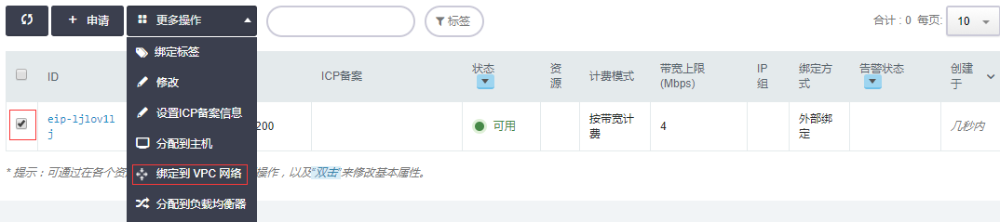

选中要绑定的eip，点击更多操作，选择绑定到VPC网络。

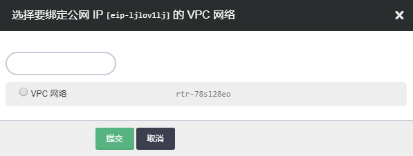

选择要绑定到的VPC网络，并点击提交完成绑定公网IP到VPC。

#### 3.为VPC设置端口转发策略

打开VPC的详情页并选择管理配置。

点击上图中的添加规则，为VPC网络添加一条端口转发规则。

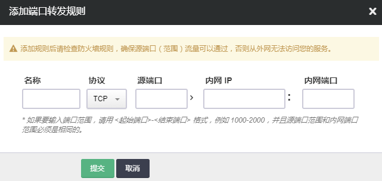

添加一条端口转发规则，其中源端口为路由器接收请求的端口。

内网IP为在此VPC管理下的私有网络的一个IP，内网端口则为使用这个私有网络IP的主机的端口。

点击提交进行端口转发规则的提交。

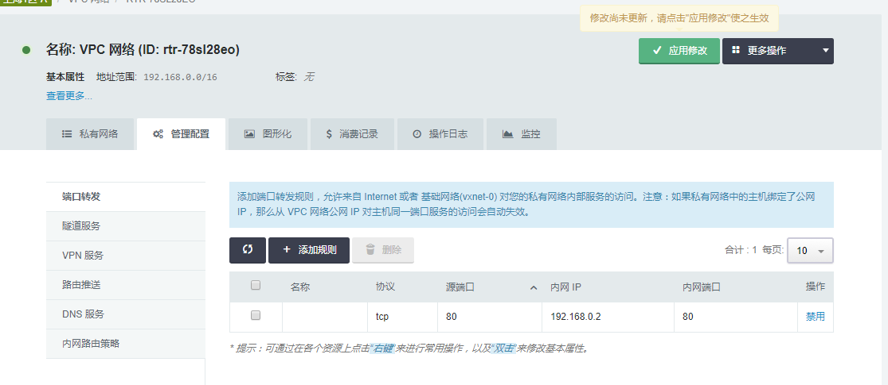

提交VPC的端口转发规则以后，还需要点击上图右上角的应用修改使端口转发规则生效。

至此我们就完成了VPC端口转发的配置。

#### 4.配置防火墙

默认情况下AppCenter集群的端口是全部打开的，所以我们只需要配置VPC网络的防火墙，确保源端口流量可以通过。

在防火墙的详情页面点击添加规则：

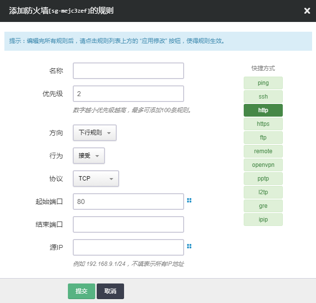

我们需要选择下行规则（从外部访问云资源）。

起始端口和结束端口可以帮助我们进行多个端口的设置，这里我们需要开一个端口，只需要在起始端口填入相应端口就可以。完成后点击提交。

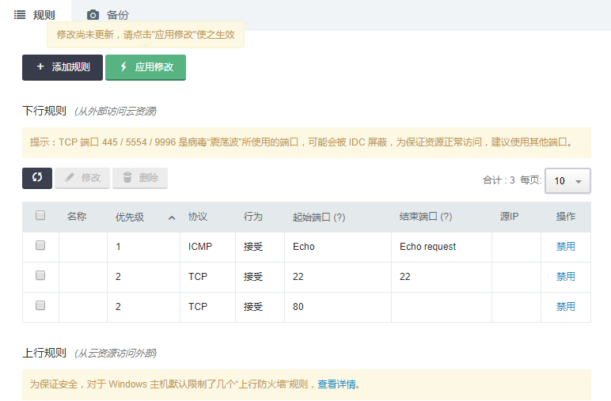

在完成了对防火墙规则的修改后，需要点击应用修改使防火墙规则生效。

**背景** ：在SDN1.0的区域当中，应用需要被公网访问时，可以利用VPC的端口转发响应公网请求。

### <a name = "router_portmapping">SDN 1.0 - 路由器</a>

#### 1.创建公网IP

首先在公网 IP 页面申请公网 IP ，根据自己的需要修改相关参数。

申请到的公网 IP 会出现在公网 IP 列表页中，这时可将该 IP 地址绑定到主机VPC网络

#### 2.绑定公网IP到路由器

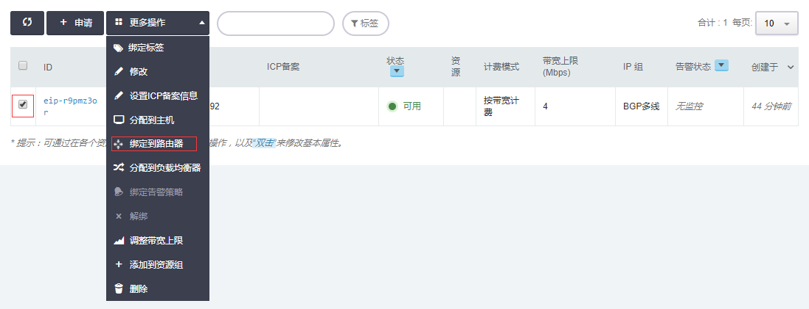

选中要绑定的eip，点击更多操作，选择绑定到路由器。

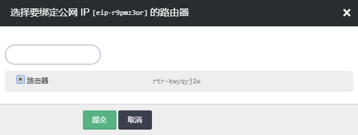

选择要绑定到的路由器，并点击提交完成绑定公网IP到路由器。

#### 3.为路由器设置端口转发策略

打开路由器的详情页并选择端口转发。

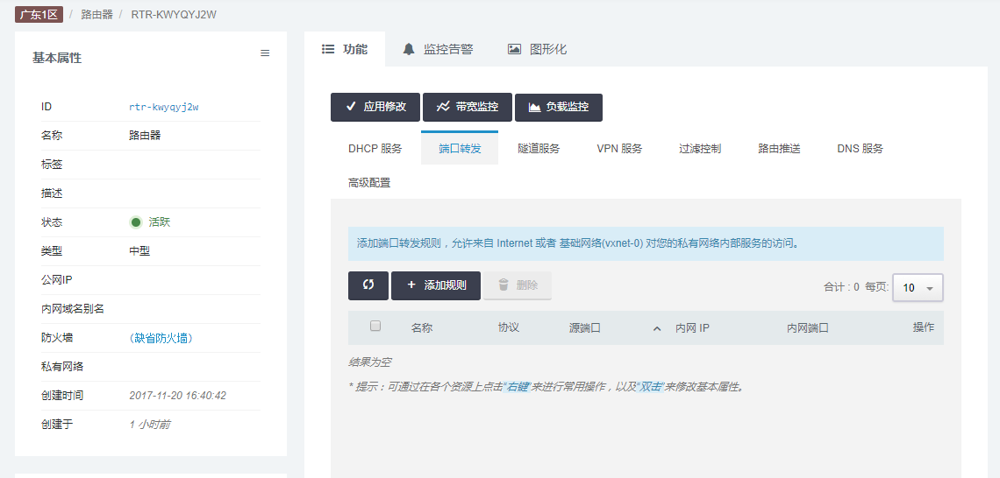

点击上图中的添加规则，为路由器添加一条端口转发规则。

添加一条端口转发规则，其中源端口为路由器接收请求的端口。

内网IP为在此路由器管理下的私有网络的一个IP，内网端口则为使用这个私有网络IP的主机的端口。

点击提交进行端口转发规则的提交。

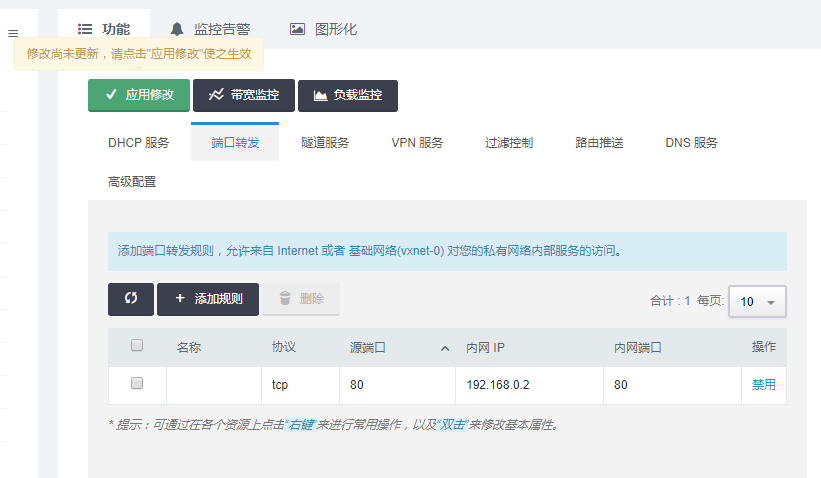

提交路由器的端口转发规则以后，还需要点击上图左上角的应用修改使端口转发规则生效。

至此我们就完成了路由器端口转发的配置。

#### 4.配置防火墙

默认情况下AppCenter集群的端口是全部打开的，所以我们只需要配置路由器的防火墙，确保源端口流量可以通过。

在防火墙的详情页面点击添加规则：

我们需要选择下行规则（从外部访问云资源）。

起始端口和结束端口可以帮助我们进行多个端口的设置，这里我们需要开一个端口，只需要在起始端口填入相应端口就可以。完成后点击提交。

在完成了对防火墙规则的修改后，需要点击应用修改使防火墙规则生效。

**背景** ：当App需要利用负载均衡器进行服务。（需要App支持配置负载均衡器）

## <a name = "public_loadbalancer">为AppCenter应用配置公网负载均衡器</a>

负载均衡器可以将来自多个公网地址的访问流量分发到多台主机上， 并支持自动检测并隔离不可用的主机，从而提高业务的服务能力和可用性。 同时，你还可以随时通过添加或删减主机来调整你的服务能力，而且这些操作不会影响业务的正常访问。 负载均衡器支持HTTP/HTTPS/TCP 三种监听模式，并支持透明代理，可以让后端主机不做任何更改，直接获取客户端真实IP。 另外，负载均衡器还支持灵活配置多种转发策略，实现高级的自定义转发控制功能。

不同应用要求的负载均衡器策略可能是不同的，这里我们以Tomcat Cluster on QingCloud为例进行配置。

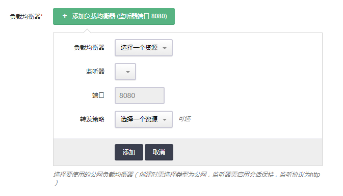

在上图显示了我们需要创建公网类型的负载均衡器，监听器启用回话保持，监听协议为http。

### 1.创建公网IP

首先在公网 IP 页面申请公网 IP ，根据自己的需要修改相关参数。

申请到的公网 IP 会出现在公网 IP 列表页中

### 2.创建公网负载均衡器

打开负载均衡器页面，点击创建，选择类型为公网并选择上面创建的公网ip，填写其他相关信息，点击提交进行创建。

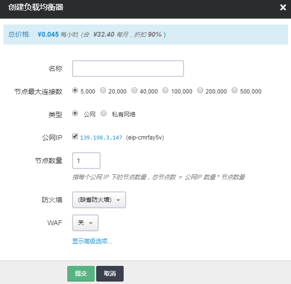

### 3.为负载均衡器添加监听器

在负载均衡器详情页面点击创建监听器：

选择监听协议为HTTP，并填写端口（暴露在公网上的端口）。

打开高级设置启用会话保持。

其他配置可自己视情况进行调整，修改完成后点击提交。

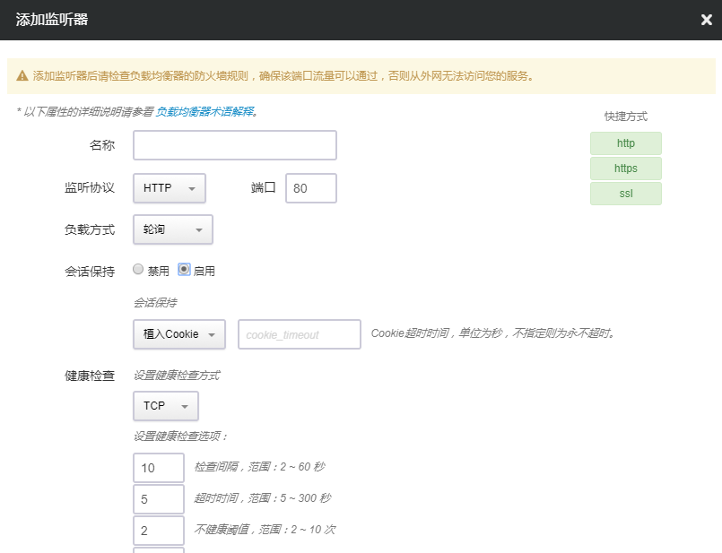

在创建完监听器以后，需要在负载均衡器详情页面点击应用修改使创建的监听器生效。

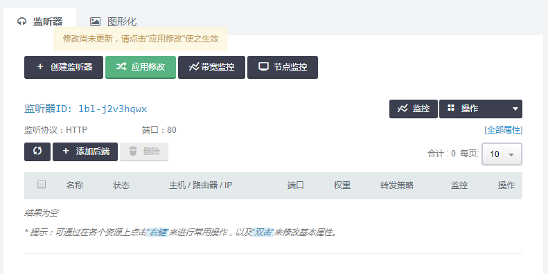

### 4.为Tomcat应用添加负载均衡器

在创建完负载均衡器及负载均衡器下的监听器后，我们回到Tomcat 集群配置页面。

选择上面创建的负载均衡器，以及负载均衡器下的监听器，点击添加。

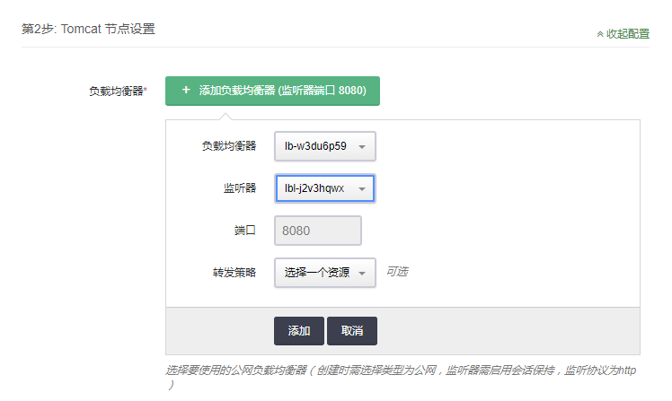

### 5.配置防火墙

默认情况下AppCenter集群的端口是全部打开的，所以我们只需要配置负载均衡器的防火墙，确保源端口流量可以通过。

在防火墙的详情页面点击添加规则：

我们需要选择下行规则（从外部访问云资源）。

起始端口和结束端口可以帮助我们进行多个端口的设置，这里我们需要开一个端口，只需要在起始端口填入相应端口就可以。完成后点击提交。

在完成了对防火墙规则的修改后，需要点击应用修改使防火墙规则生效。

## <a name = "wordpress">示例:Wordpress 单机中文版</a>

[应用链接](https://appcenter.qingcloud.com/apps/app-jbvdproy)

通过下面的步骤，我们可以创建一个wordpress单机版的App，并利用VPC网络的端口转发进行公网访问。

1.创建依赖资源-一个连接到VPC的私有网络（SDN2.0）

2.利用VPC的端口转发响应公网请求

## <a name = "tomcat_cluster">示例:Tomcat Cluster on QingCloud</a>

[应用链接](https://appcenter.qingcloud.com/apps/app-jwq1fzqo)

通过下面的步骤，我们可以创建一个Tomcat集群，并利用负载均衡器进行公网访问。

1.创建依赖资源-一个连接到VPC的私有网络（SDN2.0）

2.为AppCenter应用配置公网负载均衡器

同样也可以参考[Tomcat Cluster on QingCloud AppCenter 用户手册](https://github.com/QingCloudAppcenter/user-guide/tree/master/docs/tomcat)进行配置。

