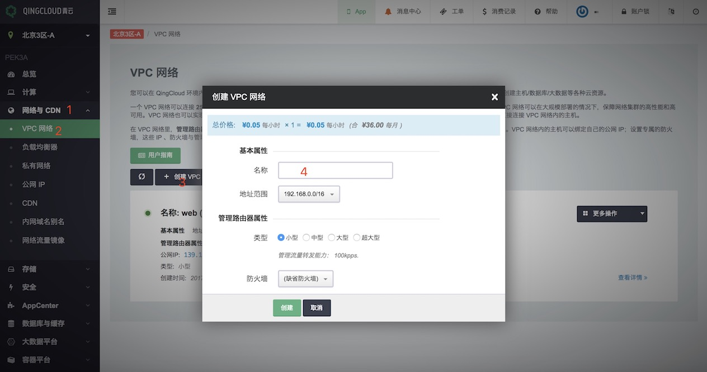
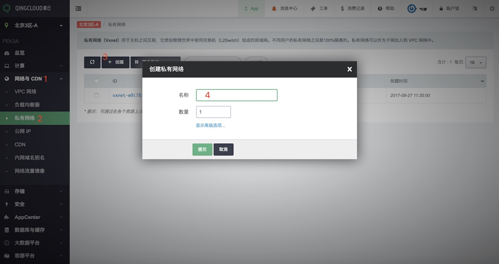
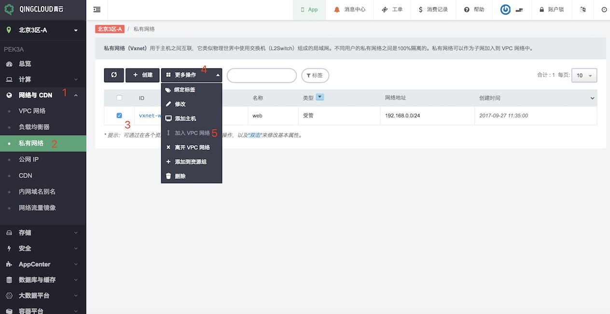
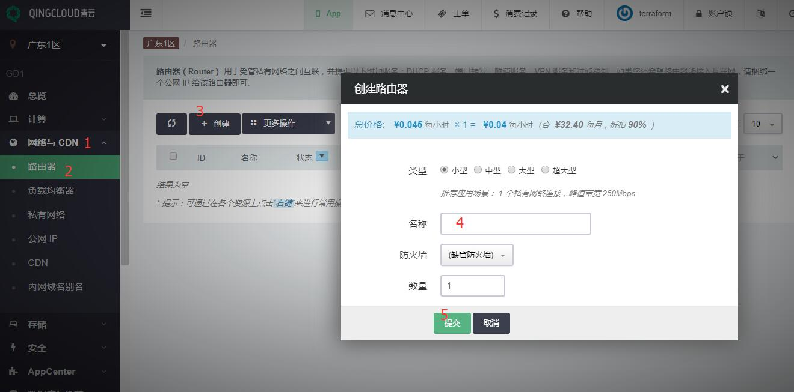
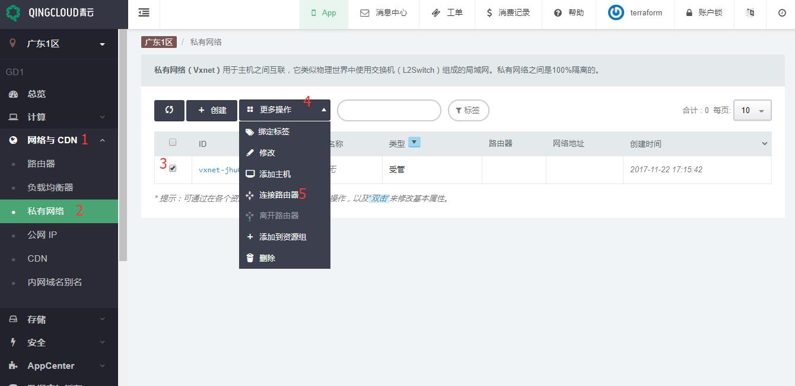

# 基础网络配置

<extoc></extoc>

用户在使用 AppCenter 的应用时通常需要部署到一个受管的私有网络当中，因此在部署之前需要创建一些基础的网络资源。

- [创建私有网络](#create_vxnet)
    - [SDN 2.0 - VPC](#create_vpc_vxnet)
    - [SDN 1.0 - 路由器](#create_router_vxnet)
- [配置端口转发响应公网请求](#config_portmapping)
    - [SDN 2.0 - VPC](#vpc_portmapping)
    - [SDN 1.0 - 路由器](#router_portmapping)
- [为 AppCenter 应用配置公网负载均衡器](#public_loadbalancer)
- [示例: Wordpress 单机中文版](#wordpress)
- [示例: Tomcat Cluster on QingCloud](#tomcat_cluster)

## <a name = "create_vxnet">创建私有网络</a>

青云公有云 SDN 1.0 旧区和 SDN 2.0 新区创建网络稍有区别，SDN 2.0 的 VPC 对应 SDN 1.0 的路由器，下面是详细的创建过程。

### <a name = "create_vpc_vxnet">SDN 2.0 - VPC</a>

#### 1. 创建 VPC 网络

在青云用户控制台按如下方法创建 VPC，网络与 CDN ‣ VPC 网络 ‣ 创建 VPC 网络 ‣ 填入 VPC 网络名称 ‣ 创建，见下图步骤:

其中：

**地址范围**: VPC 网络的地址范围域，通常是一个 B 段地址；为 VPC 网络划分子网的时候，子网必须在这个地址范围内。

**类型**: VPC 网络的管理路由器类型，不同类型可支持的管理流量转发能力不同，可根据自己的业务特点及需求进行选择，对于已创建好的 VPC 网络来说，也可以在关闭 VPC 网络之后进行修改。

**防火墙**: VPC 网络的管理路由器的防火墙；每个 VPC 网络有一个管理路由器，这个路由器提供端口转发、隧道服务( [GRE 隧道](https://docs.qingcloud.com/guide/compute_network/gre.html#guide-gre) 、[IPSec 隧道](https://docs.qingcloud.com/guide/compute_network/ipsec.html#guide-ipsec))、[VPN 服务](https://docs.qingcloud.com/guide/compute_network/vpn.html#guide-vpn) 等管理服务。当访问这些服务时，需要经过这个防火墙。

#### 2.创建私有网络

然后创建私有网络，网络与 CDN ‣ 私有网络 ‣ 创建 ‣ 填入私有网络名称 ‣ 提交，见下图步骤:

输入名称并点击提交完成创建私有网络。

#### 3.连接私有网络到 VPC 网络

最后把该私有网络加入 VPC 中，网络与 CDN ‣ 私有网络 ‣ 选中私有网络 ‣ 更多操作 ‣ 加入 VPC 网络 ，见下图步骤:

### <a name = "create_router_vxnet">SDN 1.0 - 路由器</a>

在 SDN 1.0 区，首先需要创建路由器，然后创建私有网络及加入私有网络到路由器中。

#### 1.创建路由器

在控制台上，网络与 CDN ‣ 路由器 ‣ 创建 ‣ 填入路由器名称 ‣ 提交，见下图步骤:

#### 2.创建私有网络

网络与 CDN ‣ 私有网络 ‣ 创建 ‣ 填入私有网络名称 ‣ 提交，见下图步骤:

#### 3.连接私有网络到路由器

网络与 CDN ‣ 私有网络 ‣ 选中私有网络 ‣ 更多操作 ‣ 连接路由器 ，见下图步骤:

## <a name = "config_portmapping">配置端口转发响应公网请求</a>

青云公有云 SDN 1.0 旧区和 SDN 2.0 新区创建网络稍有区别，SDN 2.0 的 VPC 对应 SDN 1.0 的路由器，因此配置端口转发也稍微有所区别。

### <a name = "vpc_portmapping">SDN 2.0 - VPC</a>

#### 1.申请公网IP

首先需申请公网 IP 地址，网络与 CDN ‣ 公网 IP ‣ 申请 ‣ 填入公网 IP 名称 ‣ 提交，见下图步骤：

#### 2.绑定公网 IP 到 VPC

网络与 CDN ‣ 公网 IP ‣ 选中公网 IP ‣ 绑定到 VPC 网络 ‣ 提交，见下图步骤：

#### 3.为 VPC 设置端口转发策略

网络与 CDN ‣ VPC 网络 ‣ 选中 VPC 网络 ‣ 进入详情页，见下图步骤：

管理配置‣ 添加规则 ‣ 填写端口转发规则 ‣ 提交 ‣ 应用修改， 见下图步骤：

#### 4.配置防火墙

默认情况下 AppCenter 集群的端口是全部打开的，所以我们只需要配置 VPC 网络的防火墙，确保源端口流量可以通过。

安全 ‣ 防火墙 ‣ 点击防火墙 ID ‣ 进入详情页， 见下图步骤：

添加规则 ‣ 填写信息 ‣ 提交 ‣ 应用修改， 见下图步骤：

### <a name = "router_portmapping">SDN 1.0 - 路由器</a>

#### 1.申请公网 IP

首先需申请公网 IP 地址，网络与 CDN ‣ 公网 IP ‣ 申请 ‣ 填入公网 IP 名称 ‣ 提交， 见下图步骤：

#### 2.绑定公网 IP 到路由器

网络与 CDN ‣ 公网 IP ‣ 选中公网 IP ‣ 绑定到路由器 ‣ 提交， 见下图步骤：

#### 3.为路由器设置端口转发策略

网络与 CDN ‣ 路由器 ‣ 点击路由器 ID ‣ 进入详情页， 见下图步骤：

端口转发‣ 添加规则 ‣ 填写端口转发规则 ‣ 提交 ‣ 应用修改， 见下图步骤：

#### 4.配置防火墙

默认情况下 AppCenter 集群的端口是全部打开的，所以我们只需要配置路由器网络的防火墙，确保源端口流量可以通过。

安全 ‣ 防火墙 ‣ 点击防火墙 ID ‣ 进入详情页， 见下图步骤：

添加规则 ‣ 填写信息 ‣ 提交 ‣ 应用修改， 见下图步骤：

## <a name = "public_loadbalancer">为 AppCenter 应用配置公网负载均衡器</a>

当 AppCenter 的应用需要利用负载均衡器进行服务，我们需要先创建负载均衡器资源。负载均衡器可以将来自多个公网地址的访问流量分发到多台主机上， 并支持自动检测并隔离不可用的主机，从而提高业务的服务能力和可用性。 同时，你还可以随时通过添加或删减主机来调整你的服务能力，而且这些操作不会影响业务的正常访问。 负载均衡器支持 HTTP/HTTPS/TCP 三种监听模式，并支持透明代理，可以让后端主机不做任何更改，直接获取客户端真实 IP。 另外，负载均衡器还支持灵活配置多种转发策略，实现高级的自定义转发控制功能。

不同应用要求的负载均衡器策略可能是不同的，这里我们以 [Tomcat Cluster on QingCloud](https://appcenter.qingcloud.com/apps/app-jwq1fzqo) 为例进行配置。

在上图显示了我们需要创建公网类型的负载均衡器，监听器启用回话保持，监听协议为 http。

### 1.申请公网 IP

通常情况 AppCenter 上的应用使用的是公网负载均衡器，按照如下方法创建，网络与 CDN ‣ 公网 IP ‣ 申请 ‣ 填入公网 IP 名称 ‣ 提交， 见下图步骤：

### 2.创建公网负载均衡器

网络与 CDN ‣ 负载均衡器 ‣ 创建 ‣ 填写信息 ‣ 提交， 见下图步骤：

### 3.为负载均衡器添加监听器

网络与 CDN ‣ 负载均衡器 ‣ 负载均衡器 ID ‣ 进入详情页， 见下图步骤：

创建监听器 ‣ 填写信息 ‣ 提交 ‣ 应用修改， 见下图步骤：

### 4.配置防火墙

默认情况下 AppCenter 集群的端口是全部打开的，所以我们只需要配置 VPC(SDN 2.0 区) 或路由器 (SDN 1.0 区) 网络的防火墙，确保源端口流量可以通过。

安全 ‣ 防火墙 ‣ 点击防火墙 ID ‣ 进入详情页， 见下图步骤：

添加规则 ‣ 填写信息 ‣ 提交 ‣ 应用修改， 见下图步骤：

## <a name = "wordpress">示例: Wordpress 单机中文版</a>

[应用链接](https://appcenter.qingcloud.com/apps/app-jbvdproy)

通过下面的步骤，我们可以创建一个 wordpress 单机版的 App，并利用 VPC 网络的端口转发进行公网访问。

1. [创建依赖资源](#create_vpc_vxnet) - 一个连接到 VPC 的私有网络（SDN 2.0）

2. 利用 [VPC 的端口转发](#vpc_portmapping)响应公网请求

## <a name = "tomcat_cluster">示例: Tomcat Cluster on QingCloud</a>

[应用链接](https://appcenter.qingcloud.com/apps/app-jwq1fzqo)

通过下面的步骤，我们可以创建一个 Tomcat 集群，并利用负载均衡器进行公网访问。

1. [创建依赖资源](#create_vpc_vxnet) - 一个连接到VPC的私有网络（SDN 2.0）

2. 为 AppCenter 应用[配置公网负载均衡器](#public_loadbalancer)

同样也可以参考[Tomcat Cluster on QingCloud AppCenter 用户手册](https://github.com/QingCloudAppcenter/user-guide/tree/master/docs/tomcat) 进行配置。

