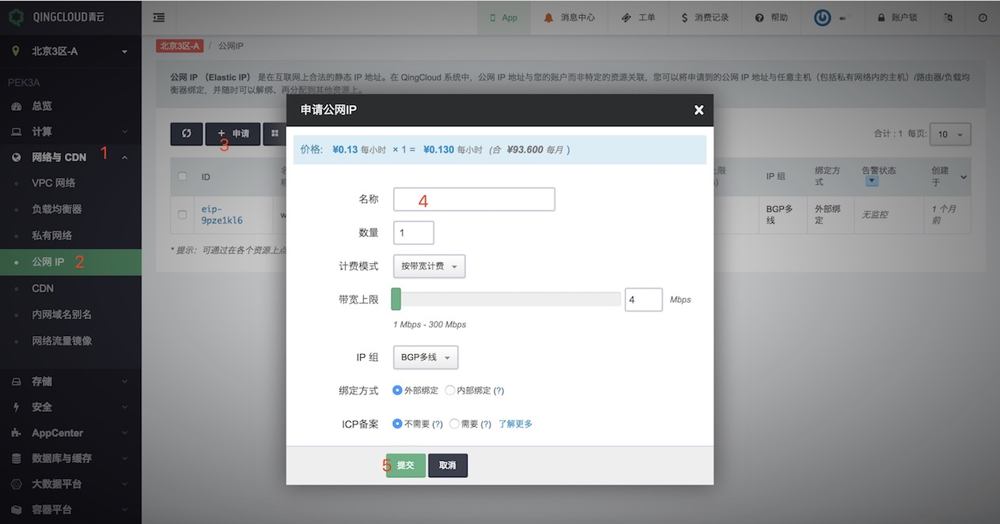
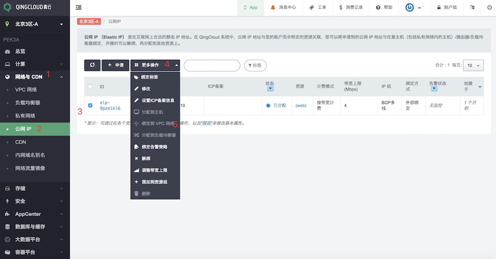
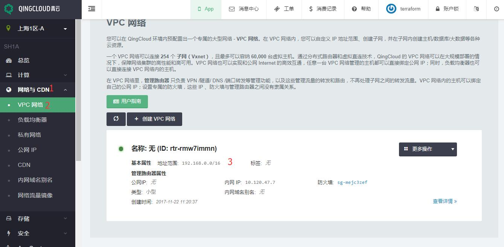
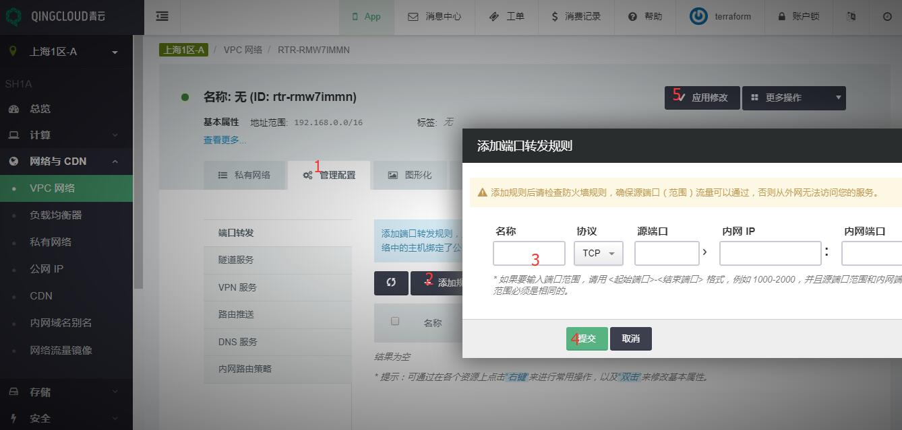
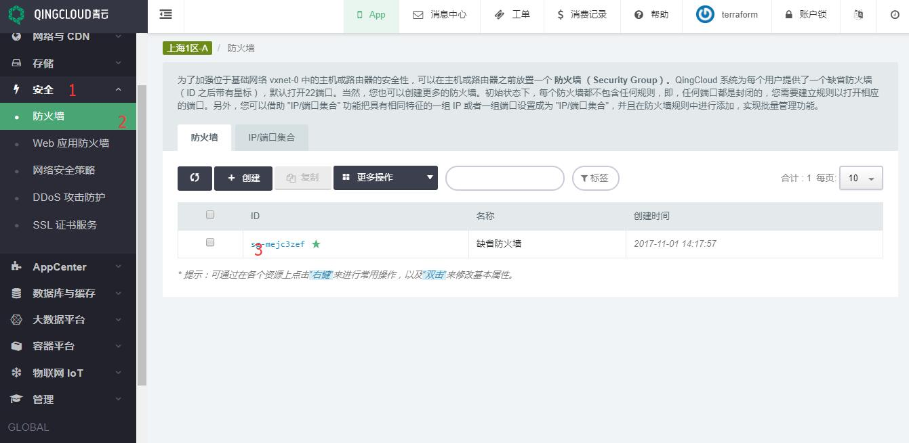
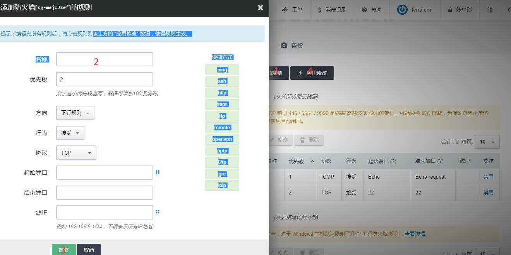
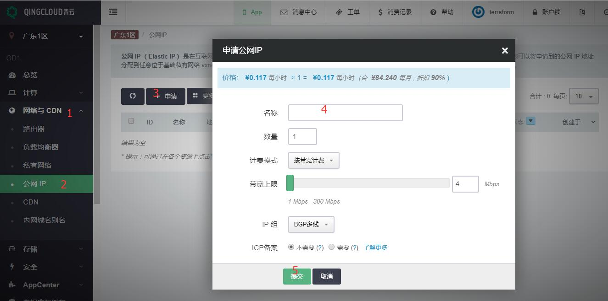
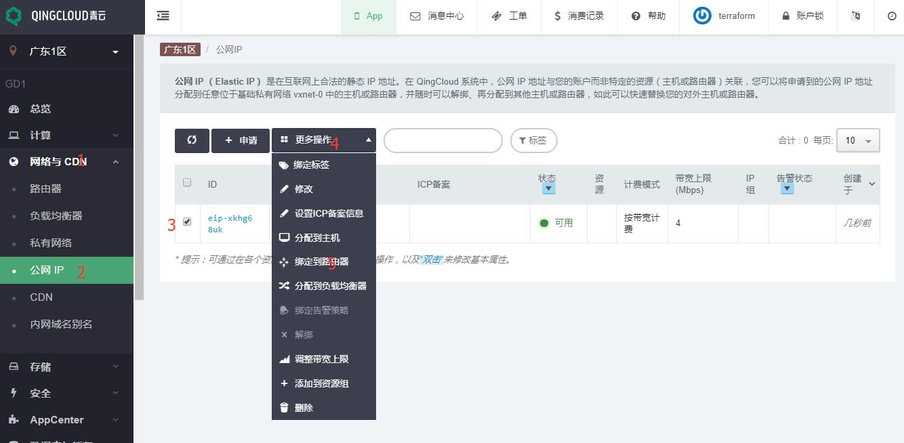
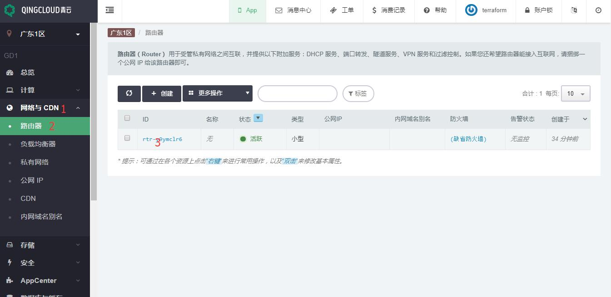
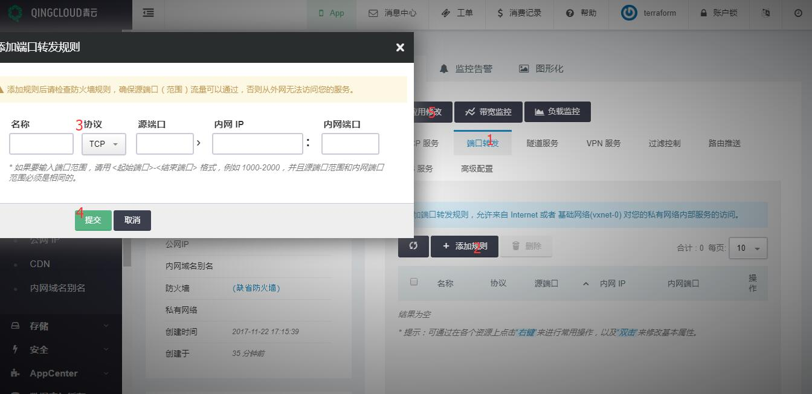

# 配置端口转发响应公网请求

青云公有云 SDN 1.0 旧区和 SDN 2.0 新区创建网络稍有区别，SDN 2.0 的 VPC 对应 SDN 1.0 的路由器，因此配置端口转发也稍微有所区别。

## SDN 2.0 - VPC

### 1.申请公网IP

首先需申请公网 IP 地址，网络与 CDN ‣ 公网 IP ‣ 申请 ‣ 填入公网 IP 名称 ‣ 提交，见下图步骤：

### 2.绑定公网 IP 到 VPC

网络与 CDN ‣ 公网 IP ‣ 选中公网 IP ‣ 绑定到 VPC 网络 ‣ 提交，见下图步骤：

### 3.为 VPC 设置端口转发策略

网络与 CDN ‣ VPC 网络 ‣ 选中 VPC 网络 ‣ 进入详情页，见下图步骤：

管理配置‣ 添加规则 ‣ 填写端口转发规则 ‣ 提交 ‣ 应用修改， 见下图步骤：

### 4.配置防火墙

默认情况下 AppCenter 集群的端口是全部打开的，所以我们只需要配置 VPC 网络的防火墙，确保源端口流量可以通过。

安全 ‣ 防火墙 ‣ 点击防火墙 ID ‣ 进入详情页， 见下图步骤：

添加规则 ‣ 填写信息 ‣ 提交 ‣ 应用修改， 见下图步骤：

## SDN 1.0 - 路由器

### 1.申请公网 IP

首先需申请公网 IP 地址，网络与 CDN ‣ 公网 IP ‣ 申请 ‣ 填入公网 IP 名称 ‣ 提交， 见下图步骤：

### 2.绑定公网 IP 到路由器

网络与 CDN ‣ 公网 IP ‣ 选中公网 IP ‣ 绑定到路由器 ‣ 提交， 见下图步骤：

### 3.为路由器设置端口转发策略

网络与 CDN ‣ 路由器 ‣ 点击路由器 ID ‣ 进入详情页， 见下图步骤：

端口转发‣ 添加规则 ‣ 填写端口转发规则 ‣ 提交 ‣ 应用修改， 见下图步骤：

### 4.配置防火墙

默认情况下 AppCenter 集群的端口是全部打开的，所以我们只需要配置路由器网络的防火墙，确保源端口流量可以通过。

安全 ‣ 防火墙 ‣ 点击防火墙 ID ‣ 进入详情页， 见下图步骤：

添加规则 ‣ 填写信息 ‣ 提交 ‣ 应用修改， 见下图步骤：

