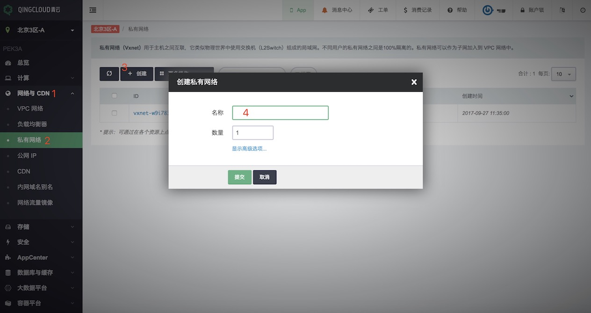
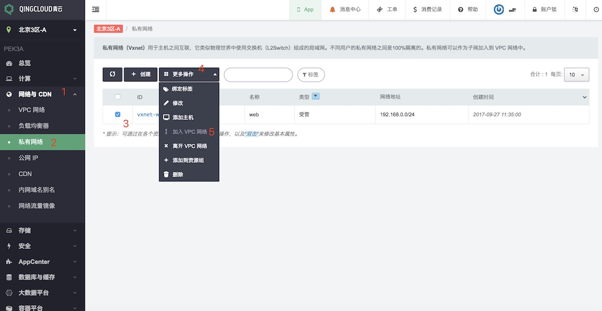
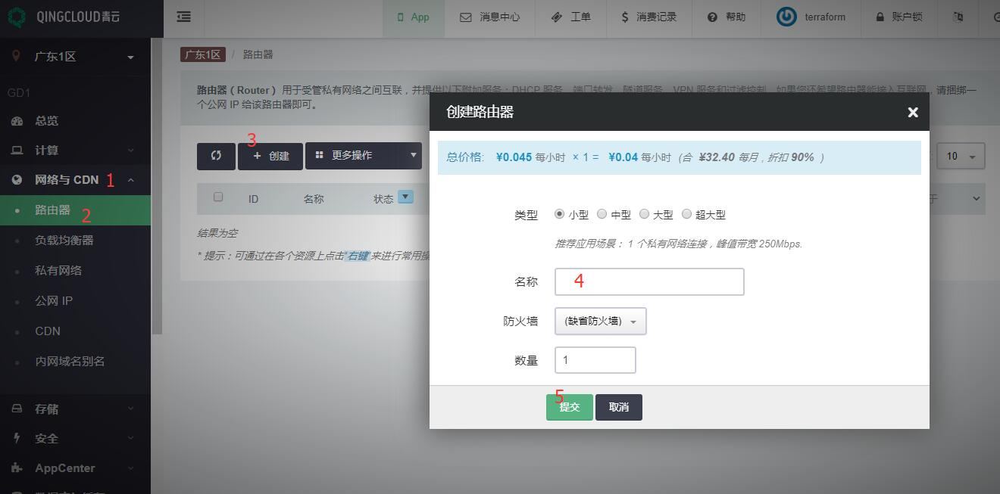
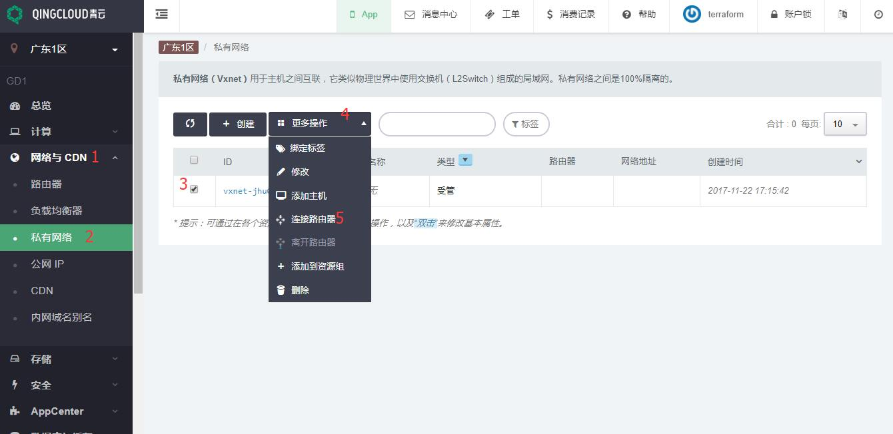

# 创建私有网络

<extoc></extoc>

青云公有云 SDN 1.0 旧区和 SDN 2.0 新区创建网络稍有区别，SDN 2.0 的 VPC 对应 SDN 1.0 的路由器，下面是详细的创建过程。

## SDN 2.0 - VPC

### 1. 创建 VPC 网络

在青云用户控制台按如下方法创建 VPC，网络与 CDN ‣ VPC 网络 ‣ 创建 VPC 网络 ‣ 填入 VPC 网络名称 ‣ 创建，见下图步骤:

其中：

**地址范围**: VPC 网络的地址范围域，通常是一个 B 段地址；为 VPC 网络划分子网的时候，子网必须在这个地址范围内。

**类型**: VPC 网络的管理路由器类型，不同类型可支持的管理流量转发能力不同，可根据自己的业务特点及需求进行选择，对于已创建好的 VPC 网络来说，也可以在关闭 VPC 网络之后进行修改。

**防火墙**: VPC 网络的管理路由器的防火墙；每个 VPC 网络有一个管理路由器，这个路由器提供端口转发、隧道服务( [GRE 隧道](https://docs.qingcloud.com/guide/compute_network/gre.html#guide-gre) 、[IPSec 隧道](https://docs.qingcloud.com/guide/compute_network/ipsec.html#guide-ipsec))、[VPN 服务](https://docs.qingcloud.com/guide/compute_network/vpn.html#guide-vpn) 等管理服务。当访问这些服务时，需要经过这个防火墙。

### 2.创建私有网络

然后创建私有网络，网络与 CDN ‣ 私有网络 ‣ 创建 ‣ 填入私有网络名称 ‣ 提交，见下图步骤:

输入名称并点击提交完成创建私有网络。

### 3.连接私有网络到 VPC 网络

最后把该私有网络加入 VPC 中，网络与 CDN ‣ 私有网络 ‣ 选中私有网络 ‣ 更多操作 ‣ 加入 VPC 网络 ，见下图步骤:

## SDN 1.0 - 路由器

在 SDN 1.0 区，首先需要创建路由器，然后创建私有网络及加入私有网络到路由器中。

### 1.创建路由器

在控制台上，网络与 CDN ‣ 路由器 ‣ 创建 ‣ 填入路由器名称 ‣ 提交，见下图步骤:

### 2.创建私有网络

网络与 CDN ‣ 私有网络 ‣ 创建 ‣ 填入私有网络名称 ‣ 提交，见下图步骤:

### 3.连接私有网络到路由器

网络与 CDN ‣ 私有网络 ‣ 选中私有网络 ‣ 更多操作 ‣ 连接路由器 ，见下图步骤:

