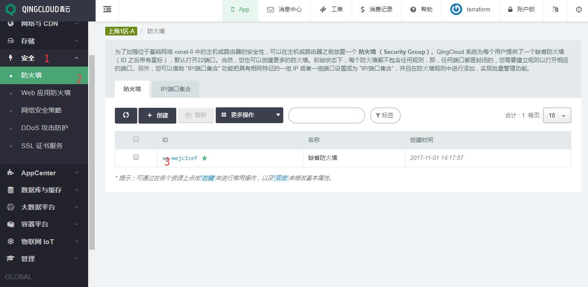

# 为 AppCenter 应用配置公网负载均衡器

<extoc></extoc>

当 AppCenter 的应用需要利用负载均衡器进行服务，我们需要先创建负载均衡器资源。负载均衡器可以将来自多个公网地址的访问流量分发到多台主机上， 并支持自动检测并隔离不可用的主机，从而提高业务的服务能力和可用性。 同时，你还可以随时通过添加或删减主机来调整你的服务能力，而且这些操作不会影响业务的正常访问。 负载均衡器支持 HTTP/HTTPS/TCP 三种监听模式，并支持透明代理，可以让后端主机不做任何更改，直接获取客户端真实 IP。 另外，负载均衡器还支持灵活配置多种转发策略，实现高级的自定义转发控制功能。

不同应用要求的负载均衡器策略可能是不同的，这里我们以 [Tomcat Cluster on QingCloud](https://appcenter.qingcloud.com/apps/app-jwq1fzqo) 为例进行配置。

在上图显示了我们需要创建公网类型的负载均衡器，监听器启用回话保持，监听协议为 http。

## 1.申请公网 IP

通常情况 AppCenter 上的应用使用的是公网负载均衡器，按照如下方法创建，网络与 CDN ‣ 公网 IP ‣ 申请 ‣ 填入公网 IP 名称 ‣ 提交， 见下图步骤：

## 2.创建公网负载均衡器

网络与 CDN ‣ 负载均衡器 ‣ 创建 ‣ 填写信息 ‣ 提交， 见下图步骤：

## 3.为负载均衡器添加监听器

网络与 CDN ‣ 负载均衡器 ‣ 负载均衡器 ID ‣ 进入详情页， 见下图步骤：

创建监听器 ‣ 填写信息 ‣ 提交 ‣ 应用修改， 见下图步骤：

## 4.配置防火墙

默认情况下 AppCenter 集群的端口是全部打开的，所以我们只需要配置 VPC(SDN 2.0 区) 或路由器 (SDN 1.0 区) 网络的防火墙，确保源端口流量可以通过。

安全 ‣ 防火墙 ‣ 点击防火墙 ID ‣ 进入详情页， 见下图步骤：

添加规则 ‣ 填写信息 ‣ 提交 ‣ 应用修改， 见下图步骤：

