# Nextcloud on QingCloud AppCenter 用户手册

## 描述

[Nextcloud](https://nextcloud.com/) 是一个开源的企业级私有云存储解决方案。

`Nextcloud on QingCloud AppCenter` 将 Nextcloud 通过云应用的形式在 QingCloud AppCenter 部署，具有如下特性：

- 后端存储基于 QingStor —— 通用的海量非结构化数据存储服务，由青云 QingCloud 提供，具有安全可靠、简单易用、高性能、低成本等特点。
- 支持横向与纵向扩容
- 系统自动运维，降低企业使用成本

## 创建步骤

### 第1步: 基本设置

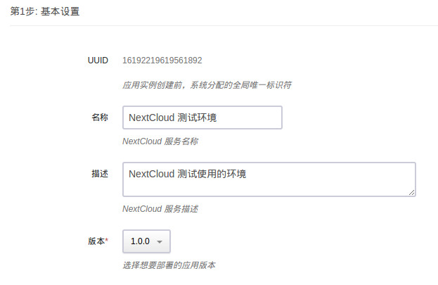

根据自己的需求填写 `名称` 和 `描述`，不影响集群的功能，版本一般建议选择最新版本。

### 第2步: Nextcloud 节点设置

Nextcloud 节点依赖于青云 QingCloud 提供的负载均衡器服务，我们需要创建资源并进行相应的设置：

#### 申请公网 IP

如果集群需要在公网上提供服务，我们需要创建一个公网 IP。

如果该公网 IP 还需要绑定域名，还需要进行备案。

#### 创建负载均衡器

然后我们需要创建一个公网负载均衡器：

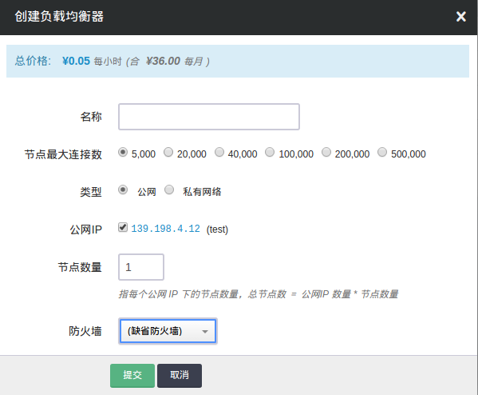

创建成功后在该负载均衡器下创建一个监听器：

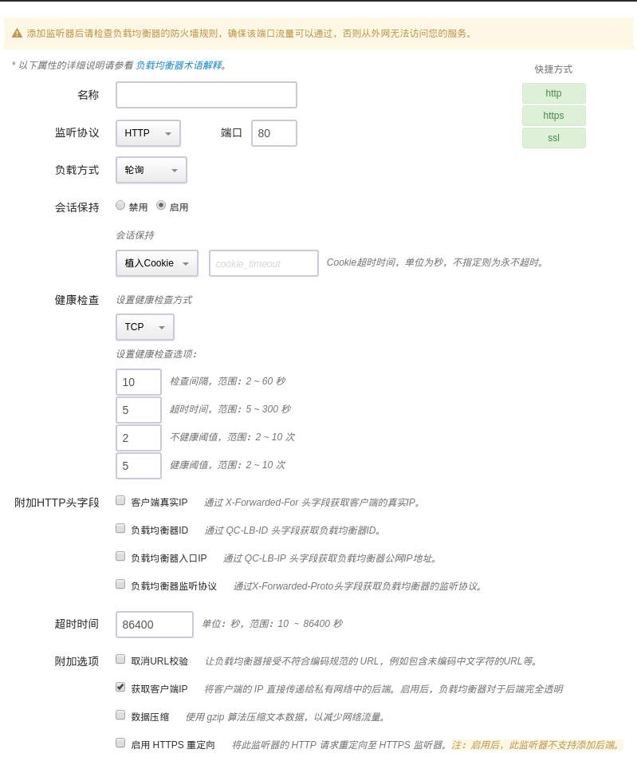

需要注意以下几点：

- 监听器需开启会话保持
- 监听器的超时时间需设置为 86400 秒

其它选项保持默认即可。

#### 配置 Nextcloud 节点

准备工作完成以后即可开始设置 Nextcloud 节点：

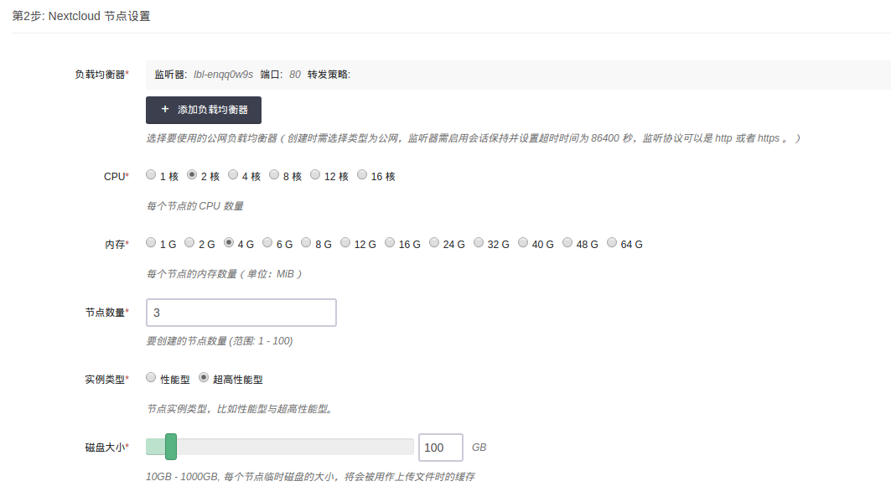

分别选择自己之前创建的负载均衡器与监听器，转发策略保持为空即可。

CPU，内存，节点数量，实例类型和磁盘大小根据自己实际需求进行选择即可，生产环境建议使用如下配置：

- CPU: 2核
- 内存: 4G
- 节点数量: 3
- 实例类型: 超高性能型
- 磁盘大小: 100G

### 第3步: 数据库设置

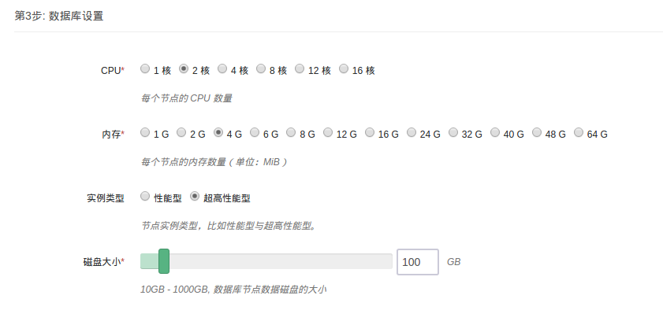

根据自己实际的需求选取数据库节点的配置，生产环境建议使用如下配置：

- CPU: 2核
- 内存: 4G
- 实例类型: 超高性能型
- 磁盘大小: 100G

### 第4步: 缓存设置

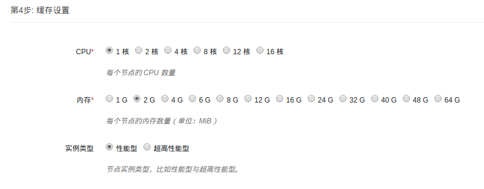

根据自己实际的需求选取缓存节点的配置，生产环境建议使用如下配置：

- CPU: 1核
- 内存: 4G
- 实例类型: 超高性能型

### 第5步: 网络设置

出于安全考虑，所有的集群都需要部署在私有网络中，下面我们需要创建一个 VPC 并创建一个私有网络：

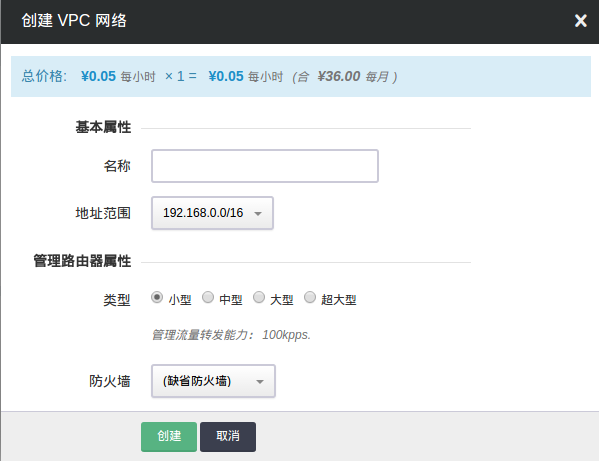

点击加号创建一个私有网络：

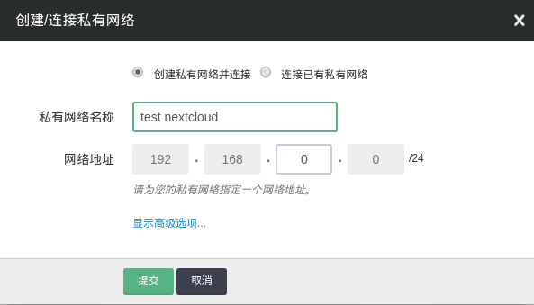

等到 VPC 更新完毕后，就可以选择我们需要的私有网络了。

### 第6步: 服务环境参数设置

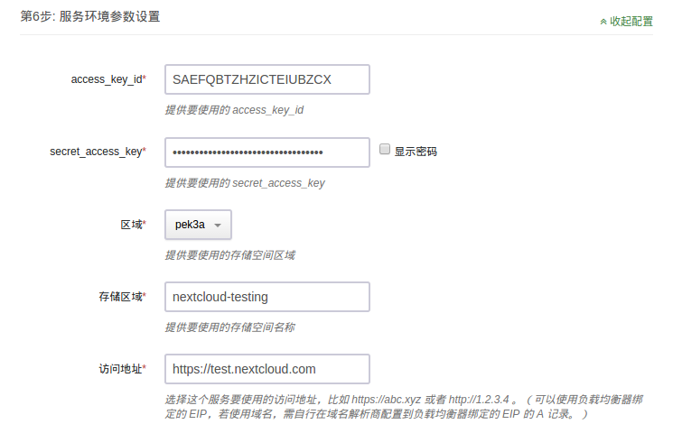

`access_key_id` 和 `secret_access_key` 是青云提供给用户的授权密钥，可以在 [`API密钥`](https://console.qingcloud.com/access_keys/) 中创建， Nextcloud 应用将会使用这个密钥与 QingStor 对象存储服务进行交互，如果设置不正确可能导致文件无法正常上传和下载。

目前可选的区域有 `pek3a` 和 `sh1a`，选择不同区域也可使用，但是需要收取额外的公网流量费用。存储区域需要提前创建好，只需要填写 Bucket 名称即可。这两项如果设置不正确，同样会导致文件无法正常上传和下载。

访问地址是你用来访问这个集群的地址，可以是负载均衡器绑定的公网 IP，也可以是已经设置好 DNS 解析的域名，比如 `https://abc.xyz` 或者 `http://1.2.3.4` 。

### 第7步: 用户协议

阅读并同意青云 APP Center 用户协议之后即可开始部署应用。

## 集群使用

### 集群信息

在集群创建完毕后，可以在控制台 `Appcenter -> 云应用` 标签下看到目前已经创建的集群信息：

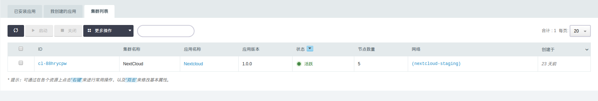

点击集群 ID 可以查看该集群的详细信息：

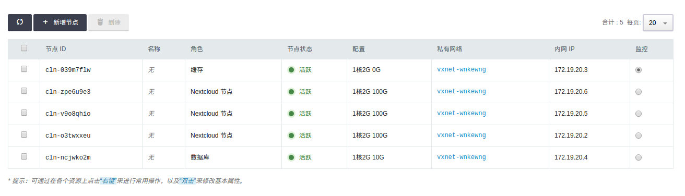

集群的详细信息下方是对应节点的监控信息：

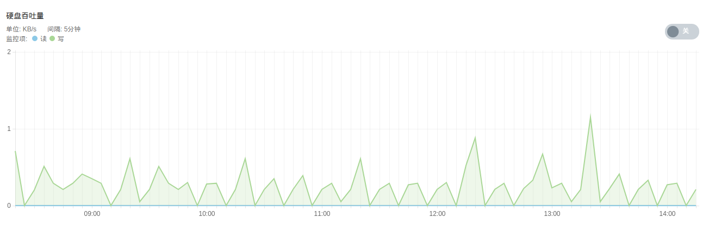

### 配置参数

点击 `配置参数` 可以修改 `access_key_id`， `secret_access_key` 以及 `访问地址`。

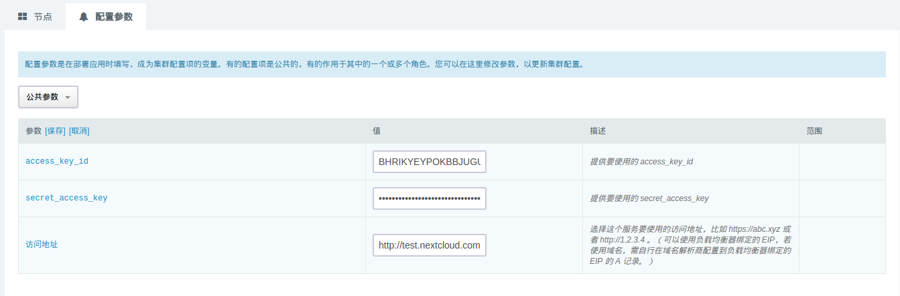

### 添加节点

点击 `新增节点` 可以增加对应的角色的节点，当前只支持增加 Nextcloud 节点。

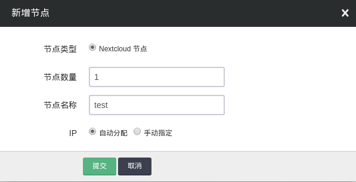

同样的，点击 `删除` 可以删除对应角色的节点。

等待负载均衡器更新完毕后，节点变更即可生效。

### 控制集群

点击 `基本属性` 右侧的菜单按钮，可以查看能对当前集群进行的操作：

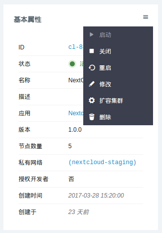

点击 `重启` ，可以在集群故障时重启指定的角色：

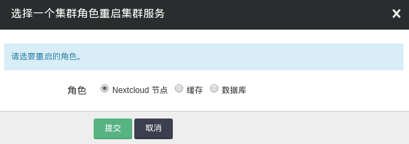

点击 `扩容集群` ， 可以在集群性能不足时提高集群的配置：

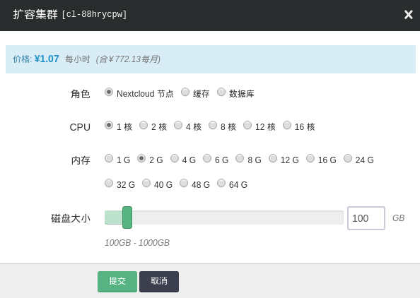

### 升级集群

关闭集群后可以点击 `基本属性` 右侧的菜单中的升级以升级集群。升级完毕后所有数据不会丢失，升级失败的话会回滚到正常的版本。集群升级成功后首次访问会进入到维护界面并提示需要升级，点击页面上的升级按钮即可。

### 配置 Office 文档在线预览

首先按照上文的指引将集群升级至最新版本： v1.1.0 ，集群升级完毕后访问应用界面并启用 `Collabora Online` 。

然后参考 [Collabora Office](https://appcenter-docs.qingcloud.com/user-guide/apps/docs/collabora-office/) 来部署 Collabora Office 服务。

然后在 NextCloud `设置 —— 在线协作` 中配置 Collabora Office 服务的地址并附上其对应的监听器所监听的端口。

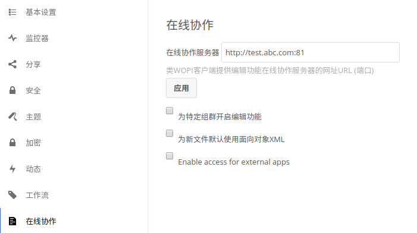

之后就可以使用 Office 文档在线预览功能了。

---

至此，`Nextcloud on QingCloud AppCenter` 的介绍到这里就告一个段落了。

在使用过程中如果遇到问题可以通过 `提交工单` 来获取帮助，我们将竭诚为您服务。

Have a nice day on QingCloud AppCenter !
