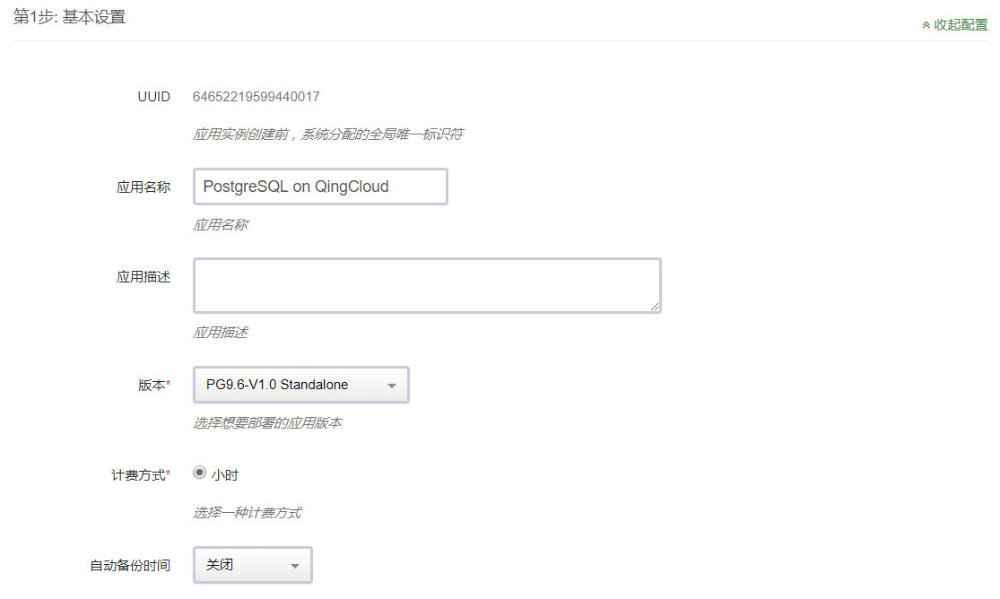
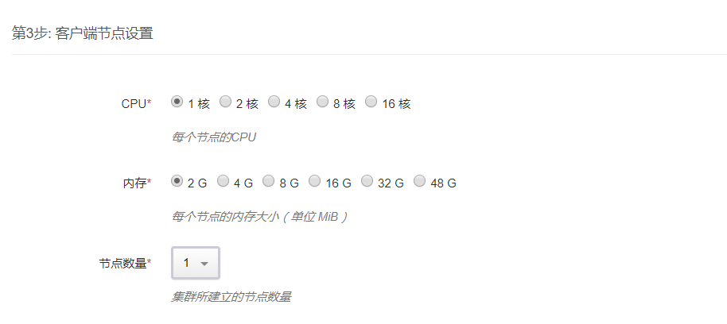
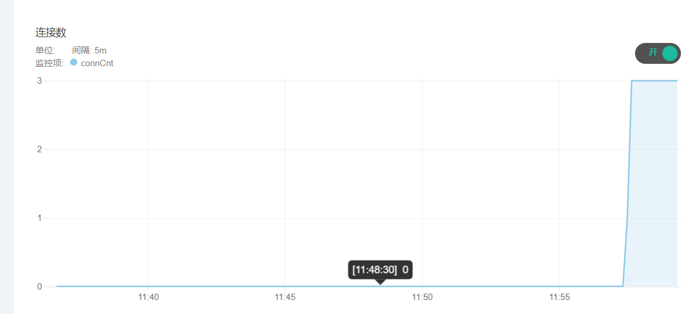
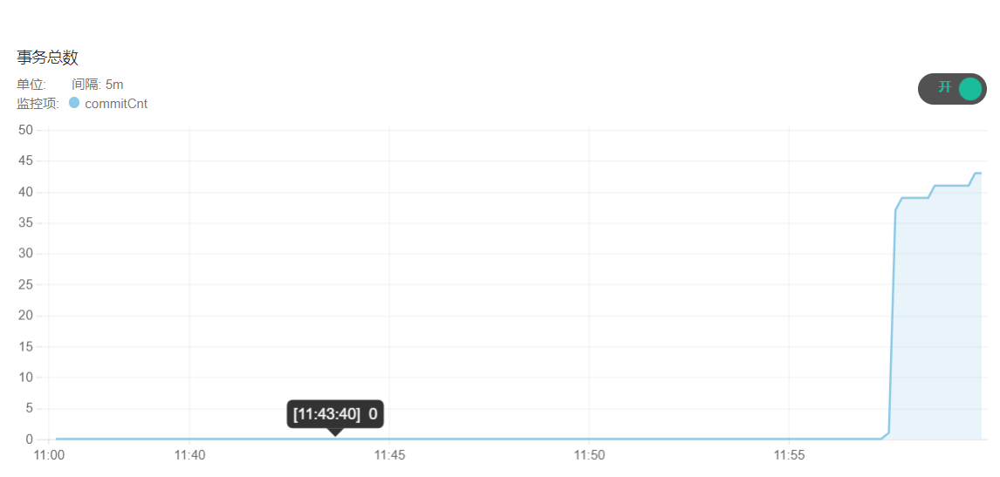
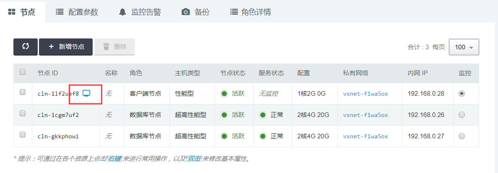
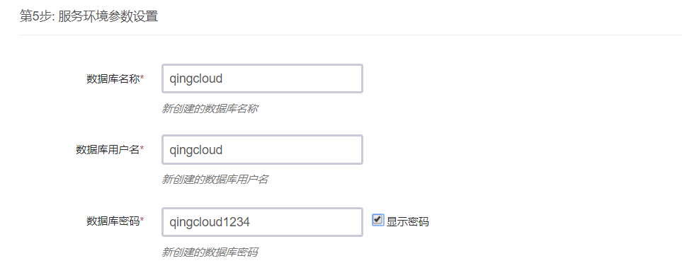
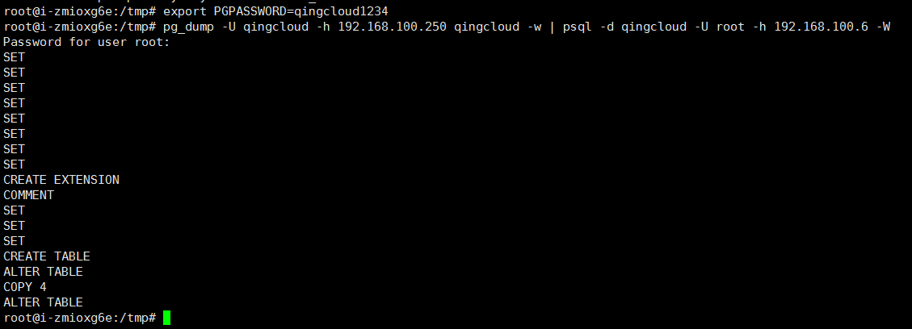
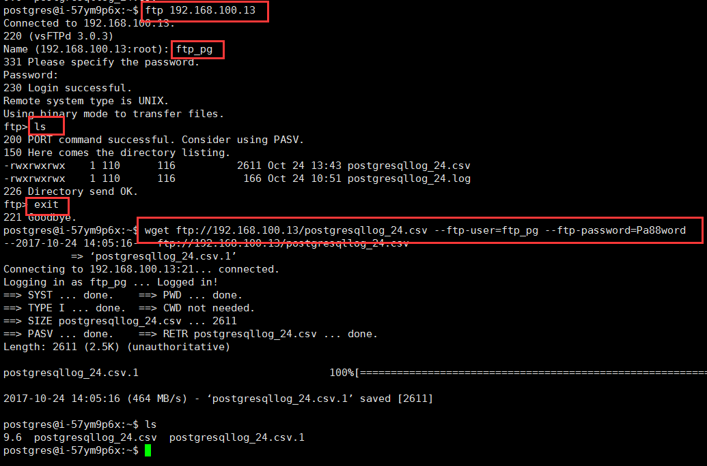
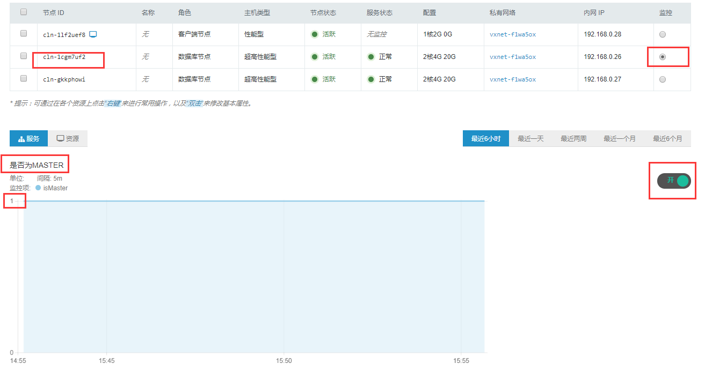

# PostgreSQL on QingCloud 用户手册  

## 描述  

`PostgreSQL on QingCloud`将 Postgresql 通过云应用的形式在 QingCloud AppCenter 部署，具有如下特性：
- 目前提供单节点版和主从双节点2个版本，分别满足开发测试和生产环境下的数据库需求。
- 主从双节点版本提供主从节点，主节点提供读写服务，从节点提供读服务，实现读写分离功能。 
- 主从双节点版本支持自动failover功能，提供HA功能。
- 主从双节点版本支持remoteapply模式选项，实现主从同步复制，保证读写分离的读一致性。
- 支持postgis插件，为 PostgreSQL提供了存储、查询和修改空间关系的能力。
- 提供实时监控、健康检查、日志自动清理等功能，提供客户端节点，方便用户运维。

 >注意：PostgreSQL on QingCloud支持PostgreSQL9.6.3版本，PostGIS插件的版本是PostGIS 2.3。


## 简介  

[PostgreSQL](https://www.postgresql.org/)是一个功能强大的开源数据库系统。经过长达15年以上的积极开发和不断改进，PostgreSQL已在可靠性、稳定性、数据一致性等获得了业内极高的声誉。作为一种企业级数据库，PostgreSQL以它所具有的各种高级功能而自豪，像多版本并发控制(MVCC)、按时间点恢复(PITR)、表空间、异步复制、嵌套事务、在线热备、复杂查询的规划和优化以及为容错而进行的预写日志等。它支持国际字符集、多字节编码并支持使用当地语言进行排序、大小写处理和格式化等操作。它也在所能管理的大数据量和所允许的大用户量并发访问时间具有完全的高伸缩性。 

## `PostgreSQL on QingCloud`的具体使用 

### 1.创建步骤  

目前提供单节点版和主从双节点版本2个版本：
- 单节点版本号为PG9.6StandaloneV1.0
- 主从双节点版本号为PG9.6SimpleClusterV2.0

>单节点版建议用于测试或者开发环境下，该版本内置自动备份，每周备份一次，保留2个备份。   
>主从双节点版本能满足一般生产环境下数据库的需求，主从节点可以通过修改配置参数设置同步或者异步流复制模式。

两个版本的创建步骤类似，以下以单节点版为例具体说明创建步骤。 

#### 第一步：基本设置  


根据自己的需求填写 `应用名称` 和 `应用描述`，选择`版本`为单节点版（Version 1-PG9.6Standalone）。

#### 第二步：PG 节点设置  


CPU，内存，实例类型，磁盘类型大小根据自己实际需求进行选择即可，生产环境建议磁盘使用超高性能型。
>注意：主从双节点版本在这一步会有主从2个PG节点的设置。

#### 第三步：PG Client节点设置  


Client节点提供postgresql客户端功能，方便用户管理postgresql数据库，建议采用默认配置即可。

#### 第四步：网络设置  


出于安全考虑，所有的集群都需要部署在私有网络中，选择自己创建的网络中。

#### 第五步：参数设置  

 
界面提供的参数大部分和Postgresql性能相关，如果需要调整相关参数，可以按照自己的实际需求配置和调整 postgresql 参数，修改参数postgresql service会重启。 
 
在配置主从双节点版本参数时，会比单节点版本的设置多出最后2个如下的参数。
 

>这2个参数的配置可以设置主从复制的方式，具体配置请参考如下2种方式。  
>- 当前默认参数值如下：  
synchronous_standby_names=''  
synchronous_commit='on'  
该设置表示当这个参数被设置为on时，直到来自于当前同步的后备服务器的一个回复指示该后备服务器已经收到了事务的提交记录并将其刷入了磁盘，主服务器上的事务才会提交。    
>
>- 如果想保证主节点上任何的修改都及时在从节点上apply，需要将这2个参数设置成remote_apply模式。  
synchronous_standby_names= '* '    
synchronous_commit='remote_apply'    
该设置表示Master节点等待事务作用到远端节点，而不仅仅是写入磁盘， 这会比通常的复制模式慢一些,但不会慢很多，它会确保所有的“提交数据”在slave 节点已经生效。   

#### 第六步: 用户协议  

阅读并同意青云 APP Center 用户协议之后即可开始部署应用。

 >注意：`PostgreSQL on QingCloud`在初始化的时候，会根据服务器参数中用户输入的数据库名称，数据库用户，和数据库密码。  
 同时，为了方便用户维护postgresql database，会自动创建数据库超级用户root（superuser），密码和用户在服务器参数中设置的数据库密码相同。    

### 2.集群操作  

### 2.1 查看集群信息  

在集群创建完毕后，可以在控制台 `Appcenter -> 集群列表` 标签下看到目前已经创建的集群信息：

 集群列表


 点击集群 ID 可以查看该集群的详细信息：


 集群基础资源监控信息：
  

 集群节点监控信息：



### 2.2 修改配置参数  

  点击 `配置参数` 可以修改 `postgresql 参数`，修改参数postgresql服务将会重启。
  

### 2.3 扩容集群  

  点击 `扩容集群` ， 可以在集群性能不足时提高集群的配置：
  

### 3.数据库基本操作  

### 3.1登录PG client节点  

`PostgreSQL on QingCloud` 提供客户端节点开放user access，用户可以通过VNC登录client节点。  
pgclient节点VNC登录的用户名是postgres，密码是pg1314.qy, 登录后请自行修改该节点的登录密码。
  


### 3.2 登录postgresql DB

在pg client节点上，通过psql的方式，用建集群步骤中定义的用户名和密码，连接到新创建的自定义的postgresql database。  
输入命令：`psql -U pgqingcloud -h 192.168.100.11 -d pgqingcloud`  
-U 参数值是上图的服务器参数：数据库用户名，  
-h 参数值是pgstandalone节点的IP，  
-d 参数值可以是上图服务器参数:数据库名称。    
然后输入的密码是上图服务器参数：数据库密码  

     
输入命令：`\l`， 可以查看当前postgresql server上的数据库信息。  
    

除了用psql命令行客户端连接数据库之外，还可以使用自己熟悉的其他图形化的数据库客户端连接到postgres DB上，方便做数据库操作以及数据库开发等工作。
例如：pgAdmin、DbVisualizer、DBeaver等。

### 3.3 postgresql 数据导出和导入  

**数据导出**  
命令：`pg_dump -U root -h 需要导出数据的DB的IP  (-t 表名)  数据库名(缺省时同用户名)  > 路径/文件名.sql`  
例如：`pg_dump -U pgqingcloud -h 192.168.100.7 pgqingcloud  > /tmp/pgdatabk.sql`
  

**数据导入**    
方式一：从文件导入数据    
命令：  
`psql -d databaename(数据库名) -U username(用户名) (-h 需要导入数据的DB的IP) -f < 路径/文件名.sql`  
注意这里导入的时候请使用root用户，以防止权限不够导入数据有问题。     
如果有需要，导入数据时先创建数据库再用psql导入：    
`createdb newdatabase;`  
这里直接导入用户在创建集群时创建的数据库名称pgqingcloud  
例如：  
`psql -d pgqingcloud -U root -h 192.168.100.11 -f /tmp/pgdatabk.sql`  


方式二：在线导入数据  
pg_dump和psql读写管道的能力使得直接从一个服务器转储一个数据库到另一个服务器成为可能。   
命令：  
 `pg_dump -h host1 dbname | psql -h host2 dbname `  
例如：

```bash
export PGPASSWORD=pgqingcloud1234  #PGPASSWORD为用户新建集群设置的数据库密码
pg_dump -U pgqingcloud -h 192.168.100.21 pgqingcloud -w | psql -d pgqingcloud -U root -h 192.168.100.23 -W
```



**数据check**  
导入完成后可以使用select语句进行检查。  
例如：`select * from t_user; `


### 3.4 查看/清理postgresql运行日志  

**查看日志**    
为了方便用户查看`PostgreSQL on QingCloud`的运行日志，可以直接登录pg client节点（pgclient节点登录的默认用户名和密码是postgres/PG1314!qy），postgresql日志通过文件共享的方式从postgresql server实时传递到路径/opt/pg_log下。  
对于一主一从，该目录下有2个文件夹pg1log,pg2log，分别存放主从节点的日志。


>注意:  
>postgresql的日志默认保存30天，每天会自动保存一个日志文件,系统会自动清理。  
>pgscripts.log文件记录节点初始化和启动相关的日志，默认保存2周。  
>pghealth.log文件记录节点出现问题时记录的相关日志.  

**清理日志**  
日志目录给用户开放的权限是读写权限，用户除了查看日志之外还可以根据自己的需要手动清理日志。      
直接登录Client节点进入/opt/pg_log目录，使用rm命令删除日志文件即可。

### 3.5 postgis插件的使用  

以2.2 登录postgresql DB后，输入以下命令即可做相关操作。  
**查看postgis插件信息**  
`SELECT name, default_version,installed_version
FROM pg_available_extensions WHERE name LIKE 'postgis%' or name LIKE 'address%';`


**查看PostGIS的版本信息**  
`select postgis_full_version();`


**新建基于postgis的Database my_spatial_db**  

```bash
sudo su postgres
createdb template_postgis  
--create template based on postgis  
psql -d template_postgis -c "CREATE EXTENSION postgis;"  
psql -d template_postgis -c "CREATE EXTENSION postgis_topology;"    
psql -d template_postgis -c "CREATE EXTENSION postgis_sfcgal;"  
psql -d template_postgis -c "UPDATE pg_database SET datistemplate = 'true' WHERE datname = 'template_postgis';"  

--create your database based on postgis template  
createdb -T template_postgis my_spatial_db  
```

### 3.6 主从双节点数据复制的Data check  

以2.2 登录postgresql DB后，在主节点上执行以下sql，新建test table并插入数据。

```sql
create table t_user (id int primary key,val varchar(30));
insert into t_user  values(1,'Raito');  
insert into t_user  values(2,'Emily');
select * from t_user;
```

以2.2 登录postgresql DB后，在从节点上执行以下sql，查看该表数据，查看数据是否和主节点一致。

```sql
select * from t_user;
```

### 3.7 查看从节点DB的readonly功能  

以2.2 登录postgresql DB后，在从节点上执行写操作，查看是否能执行成功。

```sql
create table t_user1 (id int primary key,val varchar(30));
insert into t_user1  values(1,'Raito');
```


数据库会返回如下错误，表示从节点只提供读服务。


### 3.8 查看当前主节点  

因为主从双节点版本提供出现故障的情况下从节点能自动failover成为新的主节点，集群中的主从节点是变化的，从监控页面可以查看到哪个节点是当前的主节点。  
选中集群中某个节点的监控按钮，将监控信息的实时数据开关打开，将会出现如下监控信息。  

如果`是否为MASTER`这个监控项实时数据显示为1的话，该节点则为当前的主节点，否则是从节点。

关于`PostgreSQL on QingCloud`的介绍就到这里
，希望您在Qingcloud上使用愉快！
