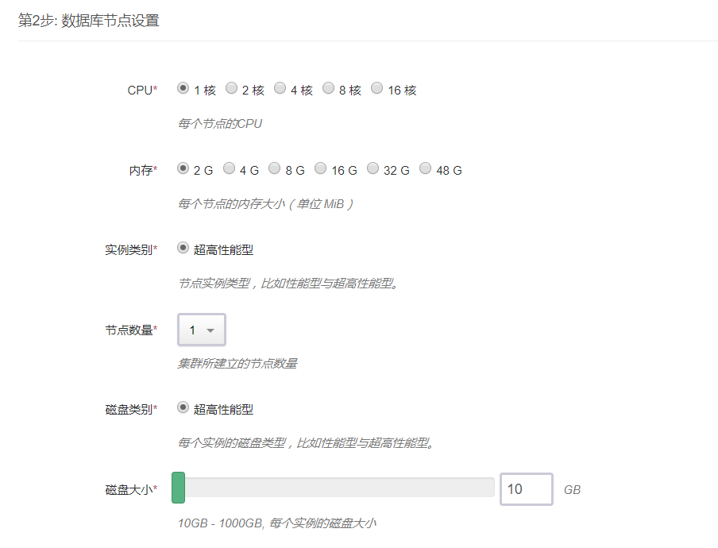
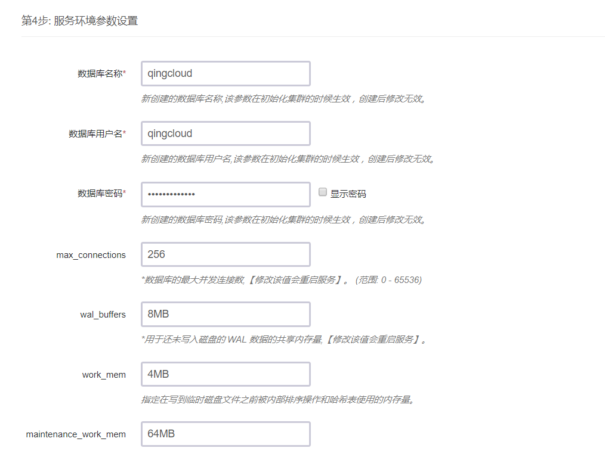
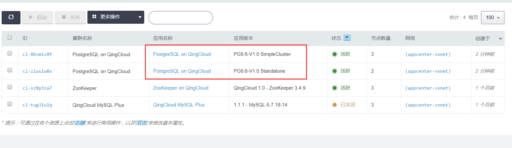
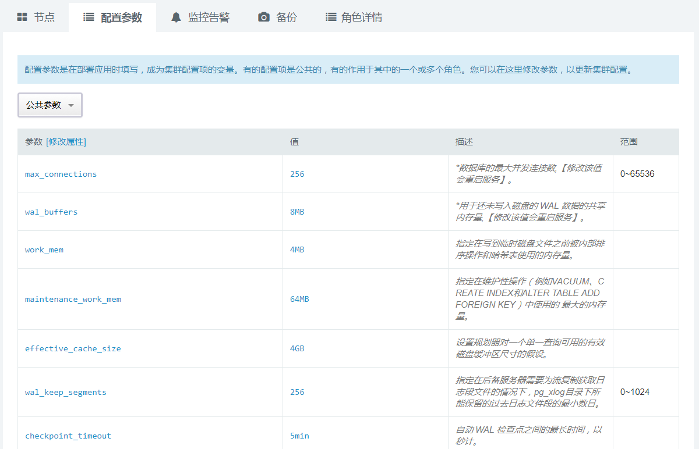
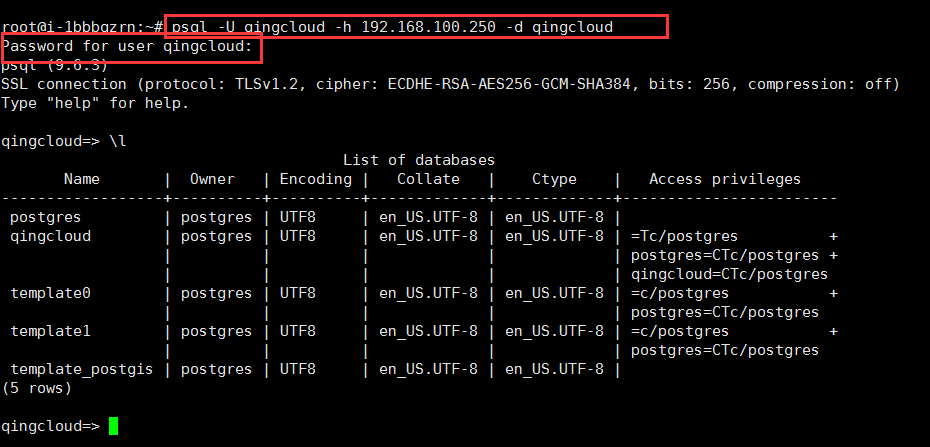
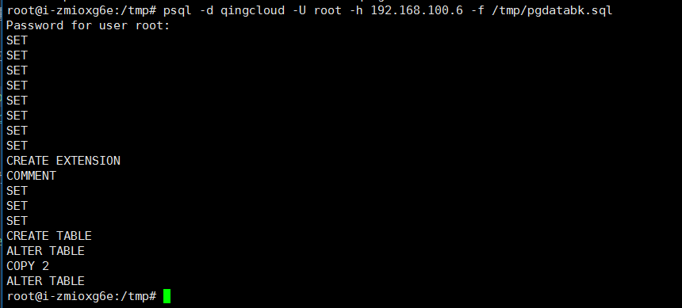
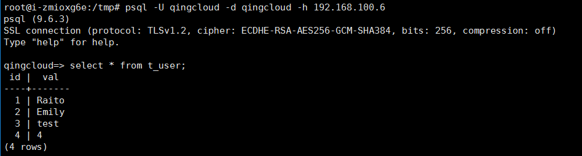
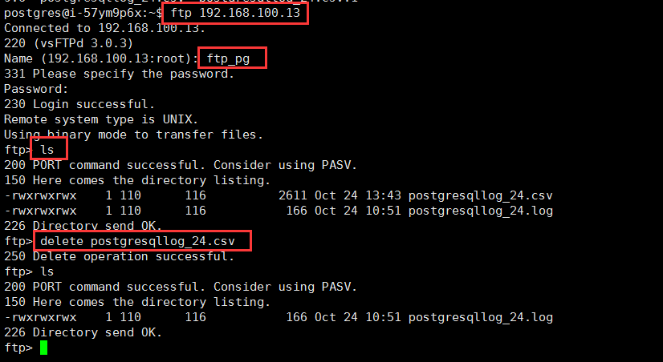
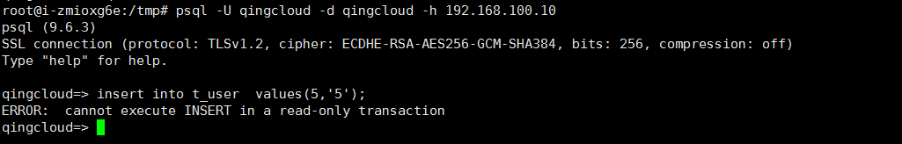
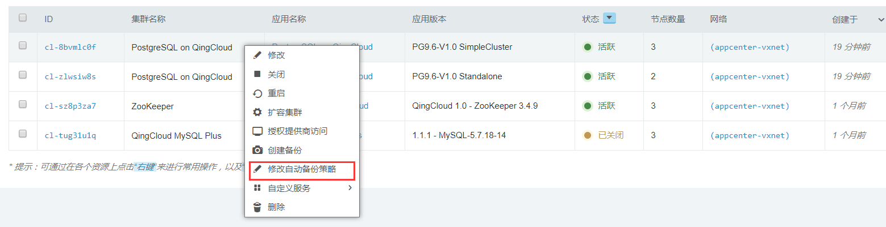

# PostgreSQL on QingCloud 用户手册  

## 描述  

`PostgreSQL on QingCloud` 将 Postgresql 通过云应用的形式在 QingCloud AppCenter 部署，具有如下特性：

- 目前提供单节点版和主从双节点2个版本，分别满足开发测试和生产环境下的数据库需求。
- 主从双节点版本提供主从节点，主节点提供读写服务，从节点提供读服务。
- 主从双节点版本支持自动 failover 功能，提供 HA 功能。
- 提供 PostgreSQL 大部分常用参数修改接口，方便调整参数。
- 支持 PostGIS 插件，为 PostgreSQL 提供了存储、查询和修改空间关系的能力。
- 提供实时监控、健康检查、日志自动清理等功能，方便用户运维。
- 一键部署，开箱即用。
 >注意：PostgreSQL on QingCloud 支持 PostgreSQL 9.6.3版本，PostGIS 插件的版本是 PostGIS 2.3。


## 简介  

[PostgreSQL](https://www.postgresql.org/) 是一个功能强大的开源数据库系统。经过长达 15 年以上的积极开发和不断改进，PostgreSQL 已在可靠性、稳定性、数据一致性等获得了业内极高的声誉。作为一种企业级数据库，PostgreSQL 以它所具有的各种高级功能而自豪，像多版本并发控制 (MVCC)、按时间点恢复 (PITR)、表空间、异步复制、嵌套事务、在线热备、复杂查询的规划和优化以及为容错而进行的预写日志等。它支持国际字符集、多字节编码并支持使用当地语言进行排序、大小写处理和格式化等操作。它也在所能管理的大数据量和所允许的大用户量并发访问时间具有完全的高伸缩性。

## `PostgreSQL on QingCloud` 的具体使用

### 1.创建步骤  

目前提供单节点版和主从双节点版本 2 个版本：

- 单节点版本号为：PG9.6-V1.0 Standalone
- 主从双节点版本号为：PG9.6-V1.0 SimpleCluster

>单节点版建议用于测试或者开发环境下，该版本内置自动备份，每周备份一次，保留 2 个备份。   
>主从双节点版本能满足生产环境下非大规模读负载均衡条件下的数据库的需求，主从节点可以通过修改配置参数设置同步流复制或者异步流复制模式。

两个版本的创建步骤类似，以下以单节点版为例具体说明创建步骤。

#### 第一步：基本设置  


根据自己的需求填写 `应用名称` 和 `应用描述`，选择`版本`为单节点版（PG9.6-V1.0 Standalone）。

#### 第二步：数据库节点设置  


CPU，内存，实例类型，磁盘类型大小根据自己实际需求进行选择即可，生产环境建议磁盘使用超高性能型。

#### 第三步：网络设置  


出于安全考虑，所有的集群都需要部署在私有网络中，选择自己创建的网络中。

#### 第四步：参数设置  


界面提供的参数大部分和 PostgreSQL 性能相关，如果需要调整相关参数，可以按照自己的实际需求配置和调整相关参数，修改部分参数会导致 PostgreSQL 服务重启，具体可以参考参数说明。

在配置主从双节点版本参数时，会比单节点版本的设置多出如下一个参数。  
该参数用于设置主从复制模式是同步流复制还是异步流复制，默认是异步流复制。


#### 第五步: 用户协议  

阅读并同意青云 AppCenter 用户协议之后即可开始部署应用。

 >注意：  
 `PostgreSQL on QingCloud` 在初始化的时候，会根据服务器参数中用户输入的数据库名称，数据库用户，和数据库密码。同时，为了方便用户维护，会自动创建数据库超级用户 (superuser) root，密码和用户在服务器参数中设置的数据库密码相同。    

### 2.集群操作  

### 2.1 查看集群信息  

在集群创建完毕后，可以在控制台 `Appcenter -> 集群列表` 标签下看到目前已经创建的集群信息。

 集群列表


 点击集群 ID 可以查看该集群的详细信息


 集群基础资源监控信息
  

 集群节点监控信息


### 2.2 修改配置参数  

  点击`配置参数`可以修改 `postgresql 参数` ，修改部分参数会导致 PostgreSQL 服务重启，具体可以参考参数说明。
  

### 2.3 扩容集群  

  点击 `扩容集群` ， 可以在集群性能不足时提高集群的配置：
  


### 2.4 查看当前主节点  

  因为主从双节点版本提供出现故障的情况下从节点能自动 failover 成为新的主节点，集群中的主从节点是变化的。  
  点开集群的`角色详情` tab 页即可查看。
  

### 2.5 重建从节点

  当出现主从节点数据不一致的情况下，可以通过重建从节点修复。
  在集群列表中选中集群，右键自定义服务-->重建从节点。
  

### 2.6 自动 failover

  主从双节点集群具备自动 failover 的功能，当主节点上的 PostgreSQL 出现问题的时候，从节点会自动升级为新的主节点，同时 down 了的主节点会尝试自动重启，并自动以从节点的身份加入集群。可以通过观察`角色详情`的 tab 页来查看 failover 变化的情况。  

  自动 failover 之前：
  

  自动 failover 之后：
  

  >注意：  
  主从集群发生故障自动切换成功到集群可用状态时间大概为15s左右。

### 3.数据库基本操作  

### 3.1 登录 PostgreSQL DB  

对于主从双节点版本，集群提供一个对外的读写 VIP ，在保证高可用性的同时，无需手动切换主节点 IP 地址。
     

通过 psql 命令行客户端 ，用新建集群步骤中定义的数据库用户名和密码，连接到新创建的自定义的 PostgreSQL database 。  
输入命令：`psql -U qingcloud -h 192.168.100.250 -d qingcloud`  
>-U 参数值是上图的服务器参数：数据库用户名，  
-h 参数值是postgresql节点的IP或者是双节点集群的VIP，  
-d 参数值可以是上图服务器参数:数据库名称。    
然后输入的密码是上图服务器参数：数据库密码。  

输入命令：`\l`， 可以查看当前 PostgreSQL server 上的数据库信息。  
    

除了用 psql 命令行客户端连接数据库之外，还可以使用自己熟悉的其他图形化的数据库客户端连接到 PostgreSQL DB 上，方便做数据库操作以及数据库开发等工作。  
例如：pgAdmin 、DbVisualizer 、DBeaver 等。

### 3.2 PostgreSQL 数据导出和导入  

#### 数据导出

命令：  
`pg_dump -U root -h 需要导出数据的 DB 的 IP  (-t 表名)  数据库名(缺省时同用户名)  > 路径/文件名.sql`  
例如：`pg_dump -U qingcloud -h 192.168.100.250 qingcloud  > /tmp/pgdatabk.sql`
  

#### 数据导入

##### 方式一：从文件导入数据   

命令：  
`psql -d databaename(数据库名) -U username(用户名) (-h 需要导入数据的DB的IP) -f < 路径/文件名.sql`   
>注意这里导入的时候请使用root用户，以防止权限不够导入数据有问题,数据库root用户的密码与新建数据库时的用户命名相同。     
如果有需要，导入数据时先创建数据库再用psql导入：    
`createdb newdatabase;`  
这里直接导入用户在创建集群时创建的数据库名称为qingcloud   

例如：  
`psql -d qingcloud -U root -h 192.168.100.6 -f /tmp/pgdatabk.sql`  


##### 方式二：在线导入数据  

pg_dump 和 psql 读写管道的能力使得直接从一个服务器转储一个数据库到另一个服务器成为可能。  
命令：  
`pg_dump -h host1 dbname | psql -h host2 dbname `  
例如：

```bash
export PGPASSWORD=qingcloud1234
#PGPASSWORD为用户新建集群设置的数据库密码
pg_dump -U qingcloud -h 192.168.100.250 qingcloud -w | psql -d qingcloud -U root -h 192.168.100.6 -W
```


#### 数据 check  

导入完成后可以使用 select 语句进行检查。   
例如：`select * from t_user; `


### 3.3 查看/清理 PostgreSQL 运行日志   

#### 查看日志

为了方便用户获取 PostgreSQL 的运行日志， `PostgreSQL on QingCloud` 默认开启了 FTP 服务，您可以通过 FTP 来获取 PostgreSQL 的日志，用户名为 ftp_pg ，默认密码为 Pa88word。  
在任何一台装有 ftp 客户端的 host 上，通过以下 ftp 命令可以获取到日志，其中 IP 对应 PostgreSQL 节点所在的 IP 地址。

```bash
ftp 192.168.100.13
ls
exit
wget ftp://192.168.100.13/postgresqllog_24.csv --ftp-user=ftp_pg --ftp-password=Pa88word
```


>注意:    
>PostgreSQL 的日志默认保存30天，每天会自动保存一个日志文件,系统会自动清理。日志的命名规则为postgresqllog_30.csv，数字表示当前日期在当月的第多少天。

#### 清理日志

日志目录给用户开放的 ftp 权限是读写权限，用户除了查看日志之外还可以根据自己的需要手动清理日志。  
输入如下命令登录和删除日志文件,参数 IP 地址为 PostgreSQL 节点 IP 。

```sh   
ftp 192.168.100.13
ls
delete postgresqllog_24.csv
```



### 3.4 PostGIS 插件的使用   

#### 查看 PostGIS 插件信息

登录 PostgreSQL DB后，输入以下命令即可查看 PostGIS 插件信息。   

```sql
SELECT name, default_version,installed_version
FROM pg_available_extensions WHERE name LIKE 'postgis%' or name LIKE 'address%';
```


#### 新建 PostGIS Database

以数据库的 root 用户和新建 PostgreSQL DB 时设置的密码登录数据库服务器上的 PostgreSQL 数据库，可以采用任意的 PostgreSQL 客户端登录到数据库服务器。  
之后，根据以下脚本创建属于自己的 PostGIS database 。   

例如：登录数据库   
`psql -U root -h 192.168.100.250 -d postgres`  
其中-h参数值的 ip 地址为 PostgreSQL DB 主节点服务器地址或者是主从双节点集群的 VIP 地址。  
连接 DB 之后，执行以下 sql 创建自己的 PostGIS Database，数据库名为 demo 。

```sql  
create database demo;
\c demo
CREATE EXTENSION postgis;
CREATE EXTENSION postgis_topology;
CREATE EXTENSION postgis_sfcgal;
CREATE EXTENSION fuzzystrmatch;
CREATE EXTENSION address_standardizer;
CREATE EXTENSION address_standardizer_data_us;
CREATE EXTENSION postgis_tiger_geocoder;
CREATE  EXTENSION pgrouting;
```   

>注意：
启用 PostGIS 必须使用超级用户 root 才有权限执行。

#### 查看 PostGIS 的版本信息

连接到新建好的PostGis数据库demo之后，执行以下sql查看版本信息。

```sql
select postgis_full_version();
```


### 3.6 主从双节点数据复制的 Datacheck  

登录 PostgreSQL DB 后，在主节点上执行以下 sql ，新建 test table 并插入数据。

```sql
create table t_user (id int primary key,val varchar(30));
insert into t_user  values(1,'Raito');  
insert into t_user  values(2,'Emily');
select * from t_user;
```

登录 PostgreSQL DB 后，在从节点上执行以下 sql ，查看该表数据，查看数据是否和主节点一致。

```sql
select * from t_user;
```

### 3.7 查看从节点 DB 的 readonly 功能  

登录 PostgreSQL DB 后，在从节点上执行写 DB 操作，查看是否能执行成功。

```sql
create table t_user1 (id int primary key,val varchar(30));
insert into t_user1  values(1,'Raito');
```

数据库会返回如下错误，表示从节点只提供读服务。


### 3.8 数据备份和恢复功能

提供数据备份和恢复功能，可选手工备份和自动备份。

#### 手工备份


#### 自动备份



#### 恢复数据

从备份中选择要恢复的版本恢复数据。  


### 3.9 基准测试

测试模型：TPC-C

我们采用满足 TPC-C 基准测试规范的 PostgreSQL 测试工具 BenchmarkSQL 做了基准测试， 在2核4G规格的数据库下，5个仓库，每个仓库10个销售端，tpmC 测试结果为44184
，详情见下图：


关于 `PostgreSQL on QingCloud` 的介绍就到这里
，希望您在 Qingcloud 上使用愉快！
