# RabbitMQ on QingCloud AppCenter 用户手册

## 简介

[RabbitMQ](https://www.rabbitmq.com/) 实现了 AMQP 协议，具有可靠性、灵活的路由、事务、高可用的队列、消息排序、可视化管理工具等功能，服务器端用 Erlang 语言编写，天生具备高可用和高并发的特性。

`RabbitMQ on QingCloud AppCenter` 将 RabbitMQ 通过云应用的形式在 QingCloud AppCenter 部署，具有如下特性:

- 支持横向与纵向在线伸缩
- 系统自动运维，降低企业使用成本
- 提供了监控告警功能，更好地管理集群
- 与 Haproxy+Keepalived 集成，具备高可用负载均衡特性
- 开箱即用，支持 AMQP、MQTT、STOMP、WebSockets 等多种丰富协议

## 创建 RabbitMQ

创建 RabbitMQ 集群前，您需要先创建一个 VPC 网络。

> 为了保障数据安全, RabbitMQ 集群需要运行在受管私有网络中。所以在创建一个 RabbitMQ 集群之前，需要创建一个 VPC 和一个受管私有网络，受管私有网络需要加入 VPC，并开启 DHCP 服务（默认开启）。

### 第一步：基本设置

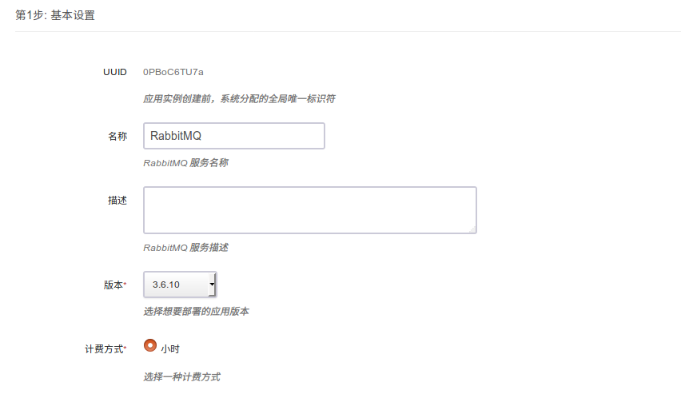

根据自己的需求填写 `名称` 和 `描述`，不影响集群的功能，版本一般建议选择最新版本。

### 第二步：RabbitMQ 磁盘节点设置

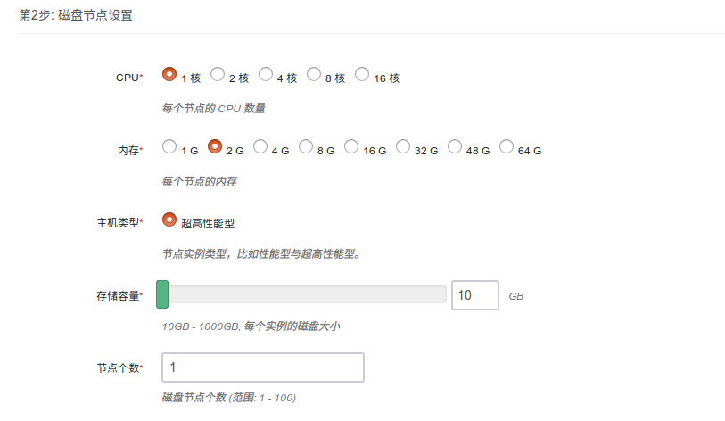

CPU，内存，节点数量，主机类型和磁盘大小根据自己实际需求进行选择即可，RabbitMQ 集群内至少需要1个磁盘节点。

### 第三步：RabbitMQ 内存节点设置

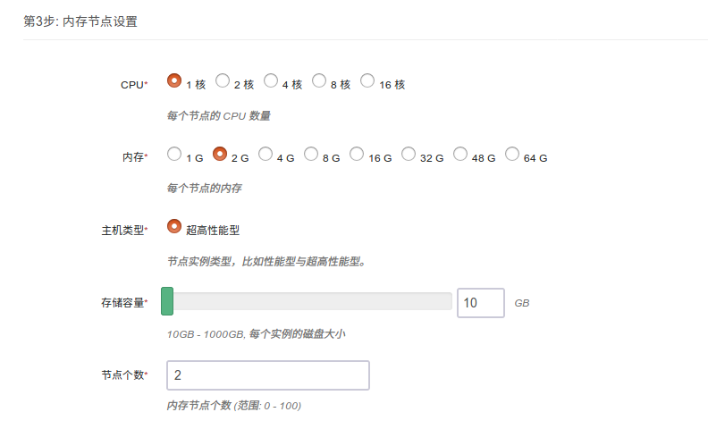

CPU，内存，节点数量，主机类型和磁盘大小根据自己实际需求进行选择即可，生产环境如果有比较高性能需求可以选择性使用内存节点，但是注意数据的持久化。

### 第四步：RabbitMQ client 节点设置

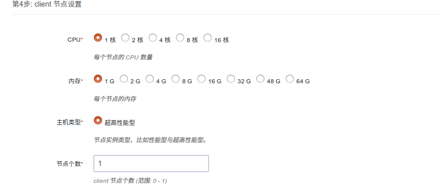

### 第五步：Haproxy+Keepalived 节点设置

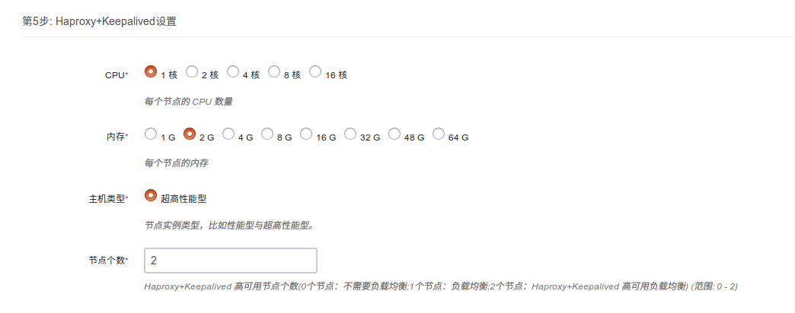

0个节点代表不需要负载均衡，1个节点为使用 Haproxy 的负载均衡模式，2个节点为负载均衡 HA 模式，HA 模式下建议使用 vip 连接，vip 地址在集群详细页面左侧。

### 第六步：网络设置

出于安全考虑，所有的集群都需要部署在私有网络中，选择自己创建的网络中。

### 第七步：参数设置

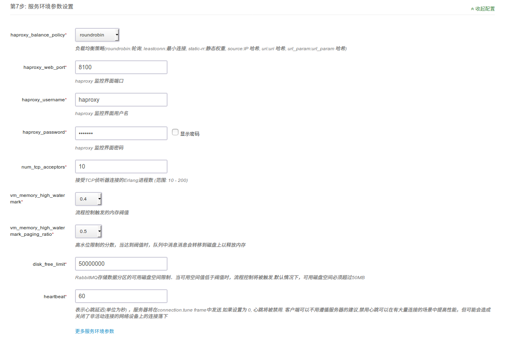

按照自己的实际需求配置 Haproxy 负载均衡策略和参数，配置 RabbitMQ 集群参数，一般情况下 RabbitMQ 使用默认参数即可。

### 第八步: 用户协议

阅读并同意青云 APP Center 用户协议之后即可开始部署应用。

## 集群使用

### 使用 RabbitMQ 和 Haproxy web 监控管理工具可以很方便管理集群

- RabbitMQ 每个节点都安装好了 rabbitmq_management 插件，登录方式：http://节点ip:15672， 登录帐号：guest/guest， 该角色为超级管理员，另外青云内部会创建一个 monitor 用户用于监控，请勿删除与修改 monitor 用户（如果创建了 Haproxy 节点，建议使用 http://vip:15672 或者使用 http://haproxy节点ip:15672 登录管理集群）
- 默认Haproxy+Keepalived 节点创建后，监控管理界面默认端口为8100，登录方式：http://vip:8100 或者使用 http://haproxy节点ip:8100， 登录帐号为：haproxy/haproxy， 可以通过配置参数修改端口和用户
- RabbitMQ client 节点登录帐号为: root/rabbitmq

### 集群信息

在集群创建完毕后，可以在控制台 `Appcenter -> 集群列表` 标签下看到目前已经创建的集群信息：

 集群列表

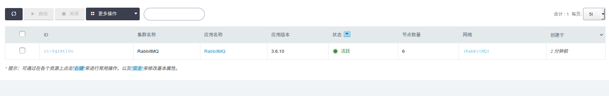

 点击集群 ID 可以查看该集群的详细信息：

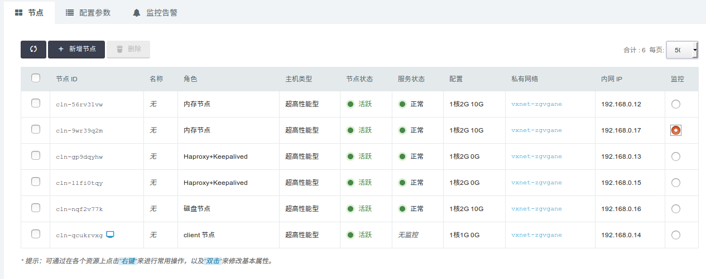

 集群基础资源监控信息：

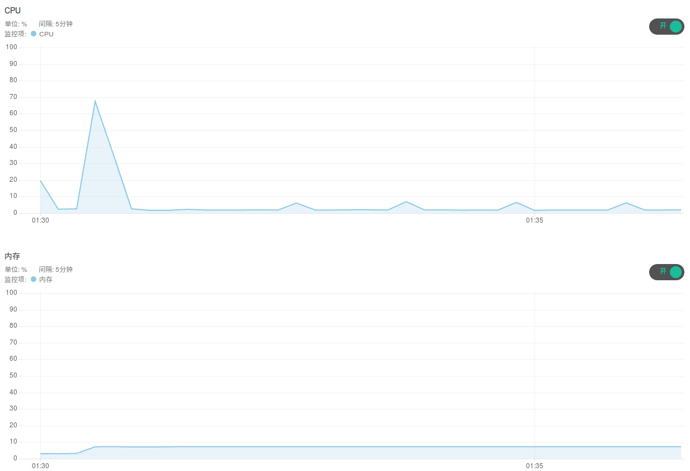  

 集群节点监控信息：

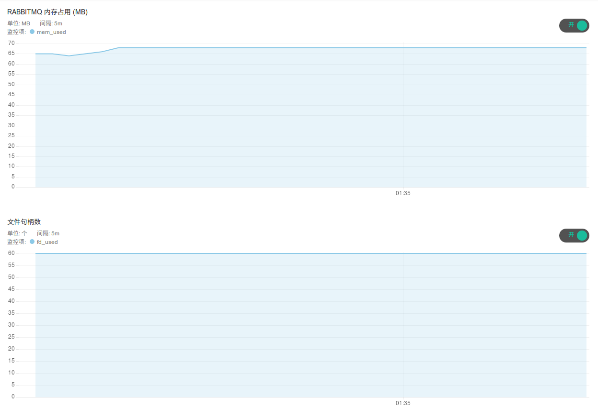

推荐使用自带的 web 管理工具监控RabbitMQ 集群：

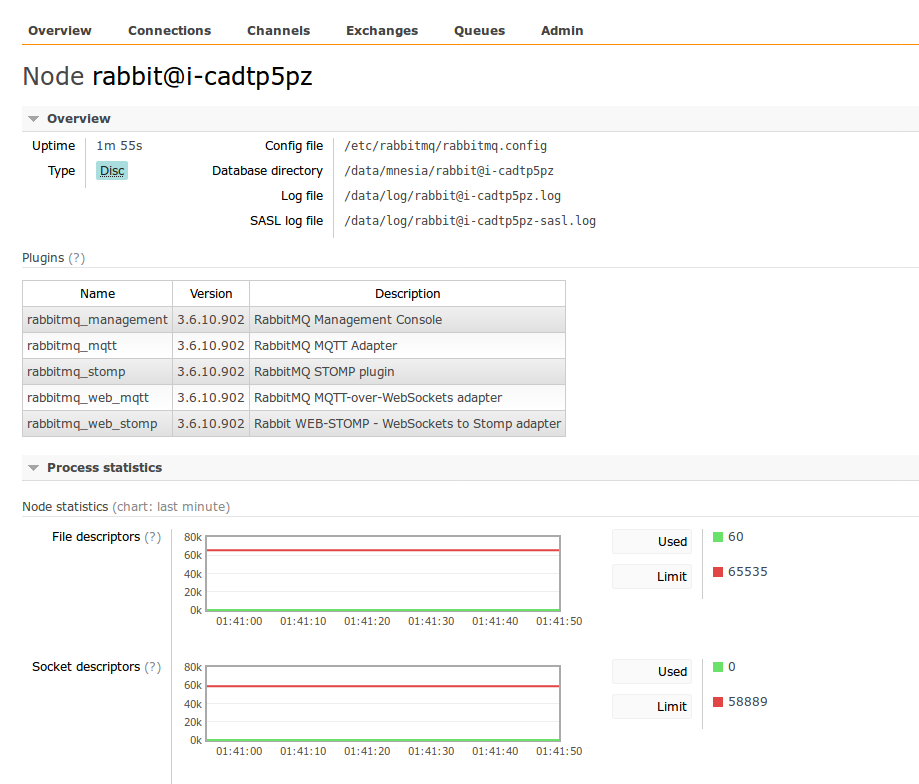

Haproxy 节点监控管理：

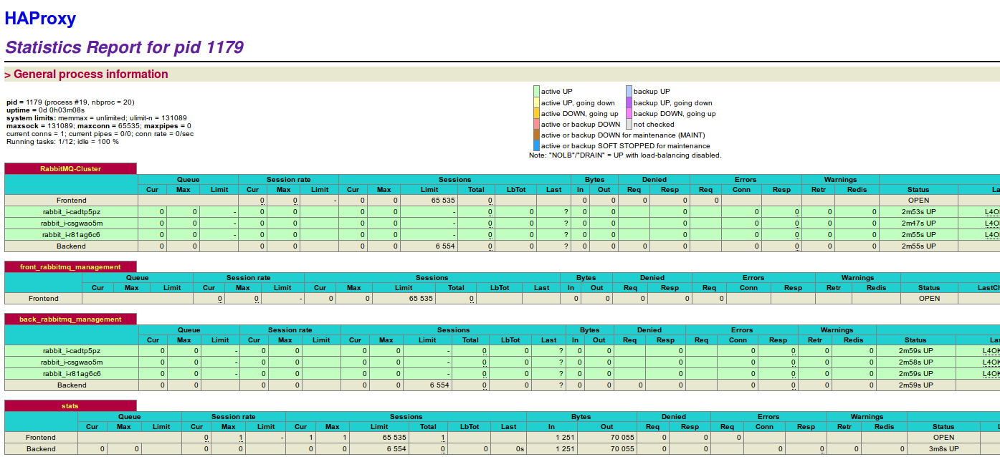

### 配置参数

  点击 `配置参数` 可以修改 `Haproxy 参数`， `RabbitMQ 参数`。

  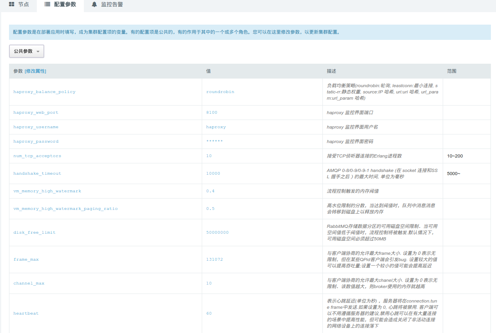

### 扩容集群

  点击 `扩容集群` ， 可以在集群性能不足时提高集群的配置：

  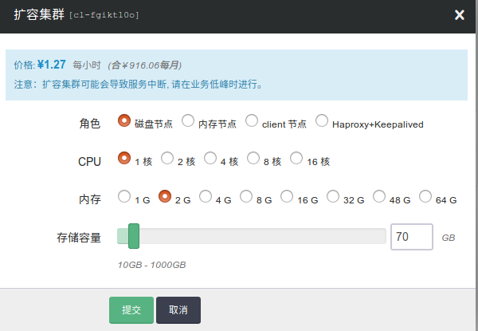

## rabbitmq_management 使用示例简介

### 创建一个队列

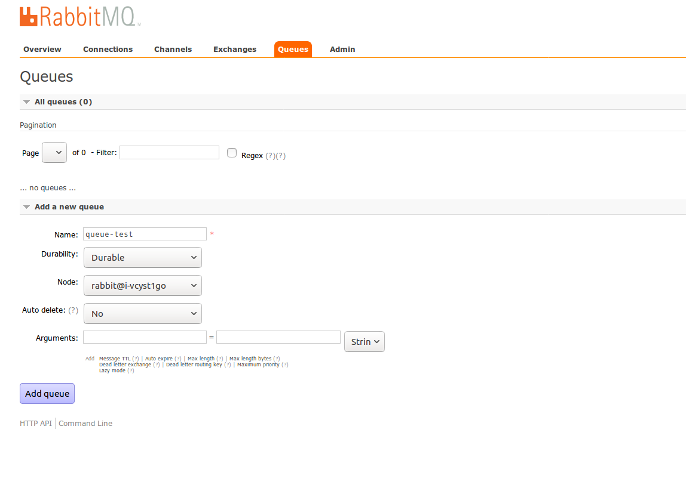

>创建一个队列，指定队列所在的节点，设置队列是否持久化，如果未设置持久化，集群重启会导致队列消失

### 投递消息

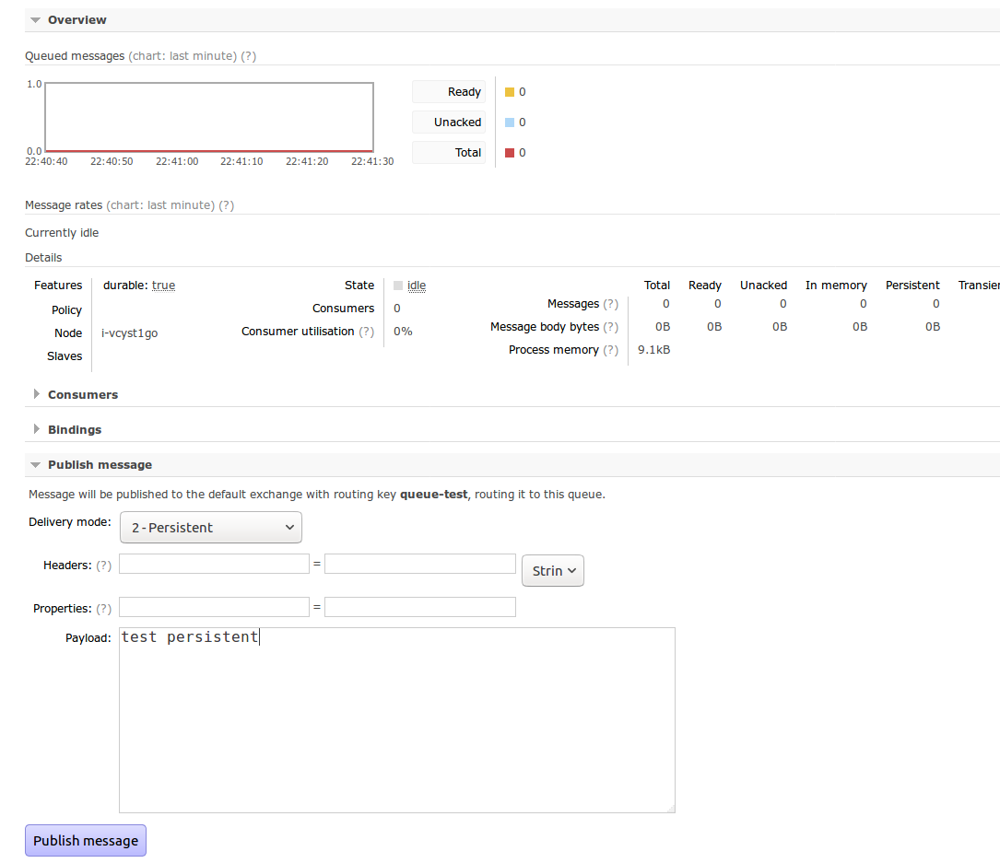

>投递消息，设置消息是否持久化，设置为2时候代表持久化，默认不持久化，如果未设置持久化，集群重启消息消失

### 消费消息

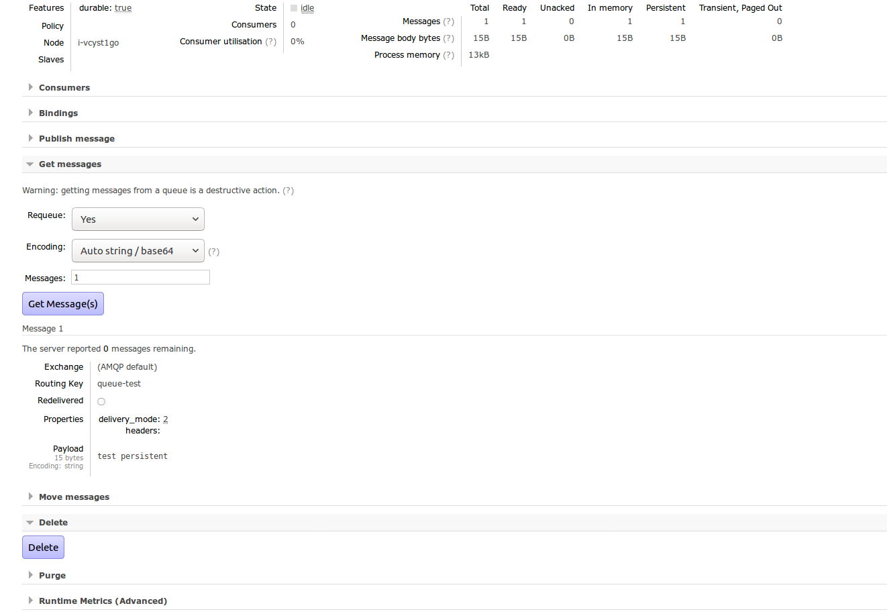

>获取消息，并设置队列消息是否可以重复获取，是否需要 base64 编码

## rabbitmqcli 命令示例简介

官网参考地址：https://www.rabbitmq.com/man/rabbitmqctl.1.man.html
>注意：使用 root/rabbitmq 登录 client 节点，请勿随便使用集群管理命令去管理集群。client 使用 -n nodename 连接集群中的节点，nodename 格式为 rabbit@hostname ，可以在 client节点 /etc/hosts 下看到有哪些 host ，也可以在 rabbitmq 的 web 界面直接看到 nodename。

### 添加用户

>rabbitmqctl -n rabbit@i-1zo2scr7 add_user username password

### 删除用户

>rabbitmqctl -n rabbit@i-1zo2scr7  delete_user username

### 创建 vhost

>rabbitmqctl -n rabbit@i-1zo2scr7 add_vhost vhostpath

### 清空队列

>rabbitmqctl -n rabbit@i-1zo2scr7 reset

### 停止应用

>rabbitmqctl -n rabbit@i-1zo2scr7 stop_app

### 开启应用

>rabbitmqctl -n rabbit@i-1zo2scr7 start_app

### 更改节点类型

>rabbitmqctl -n rabbit@i-1zo2scr7 change_cluster_node_type ram
>
注意：更改节点类型需要先关闭 app 后执行，然后再启动 app，正常运行时不建议做集群和节点管理的操作

### 设置镜像队列 HA

>rabbitmqctl -n rabbit@i-1zo2scr7 set_policy ha-all "^ha\." '{"ha-mode":"all"}'
>
>注意：镜像队列会对性能有影响，但是可以实现队列的高可靠，根据需求设置需要高可用的队列。详细请参考：https://www.rabbitmq.com/ha.html

## rabbitmqadmin 命令行客户端工具示例简介

   官网参考地址：http://www.rabbitmq.com/management-cli.html

### 在 RabbitMQ 管理界面下载

## client 节点上自带 rabbitmqadmin 工具

> 注意：rabbitmqadmin 工具已经在 client 节点上配置好了，可以直接使用，若修改了guest 用户，需要自己修改 default_options 中用户名和密码配置。

## 自己下载或者自定义配置 rabbitmqadmin 工具方法

> 注意：可以选择任意 RabbitMQ 节点 或者 Haproxy 节点 ip 或者  Keepalived vip 操作 使用。

- 例如 Keepalived VIP 为 192.168.0.253 (也可以是任意 RabbitMQ 节点 或者 Haproxy 节点 ip)
- wget http://192.168.0.253:15672/cli/rabbitmqadmin
- file rabbitmqadmin
- chmod +x rabbitmqadmin
- 修改 rabbitmqadmin文件 default_options 中的 hostname 为 任意 RabbitMQ 节点 或者 Haproxy 节点 ip 或者 Keepalived vip，若修改了guest 用户，还需要修改 default_options 中用户名和密码配置。

### 定义一个 queue（durable=true 仅仅表示该队列持久化，并不表示队列中的消息已经持久化）

> ./rabbitmqadmin declare queue name=test  durable=true

### 查看 queues

> ./rabbitmqadmin  list queues

### 查看 channels

> ./rabbitmqadmin  list channels

### 查看 consumers

> ./rabbitmqadmin  list consumers

### 发送一条消息

>./rabbitmqadmin publish routing_key=test payload="just for test"

### 消费一条消息

>./rabbitmqadmin get queue=test requeue=true

## rabbitmq web http 命令示例简介

   官网参考地址：https://cdn.rawgit.com/rabbitmq/rabbitmq-management/rabbitmq_v3_6_10/priv/www/api/index.html

### 检查集群健康状态

>curl -i -u guest:guest http://192.168.0.253:15672/api/healthchecks/node

### 创建 vhost

>curl -i -u guest:guest -H "content-type:application/json" -XPUT http://192.168.0.253:15672/api/vhosts/foo

### 授权用户访问 vhost

>curl  -i  -u guest:guest -H "content-type:application/json" -XPUT http://192.168.0.253:15672/api/permissions/foo/guest -d  '{"configure":".\*","write":".\*","read":".\*"}'

### 创建一个 queue ，发送消息，并消费消息

>curl -i -u guest:guest http://192.168.0.253:15672/api/aliveness-test/foo

## 设置镜像队列 HA

   官网参考地址：https://www.rabbitmq.com/ha.html

- 推荐使用 web 界面来设置，比较方便
- 熟悉的话,也可以使用 HTTP API

## 注意事项说明

>RabbitMQ 作为传统消息队列，在消息未持久化的情况下，如果您重启或者关闭消息所在节点，会造成消息丢失。如果设置了持久化的策略，未设置 HA 镜像队列模式，就删除消息所在的单节点，会造成数据丢失。当您有非常重要的队列消息需要存储的时候，建议持久化并设置镜像队列 HA，删除节点的时候避免消息丢失，请不要把消息所在节点都删除了。

RabbitMQ 支持消息的持久化，也就是数据写在磁盘上，为了数据安全考虑，大多数用户可能都会选择持久化。消息队列持久化包括3个部分：

- exchange 持久化，在声明时指定 durable => 1 （true）
- queue 持久化，在声明时指定 durable => 1     (true)
- 消息持久化，在投递时指定 delivery_mode => 2（1 是非持久化）

如果 exchange 和 queue 都是持久化的，那么它们之间的 binding 也是持久化的。如果exchange 和 queue 两者之间有一个持久化，一个非持久化，就不允许建立绑定。即使设置了持久化，也不能百分百保证消息不会丢失。有很小的概率在 RabbitMQ 接受到消息后，还没来得及写到磁盘，就发生重启了，所以写消息的时候尽量不要重启节点，例如：新增减少磁盘节点、修改参数、扩容伸缩集群都会导致集群的重启。如果需要加强的安全保证，可以把发布消息的代码封装在事务里。
如果您的消息需要持久化，请务必保证 queue 是持久化的，并在投递消息的时候设置 delivery_mode =2。

至此，`RabbitMQ on QingCloud AppCenter` 的介绍到这里就告一个段落了。

在使用过程中如果遇到问题可以通过 `提交工单` 来获取帮助，我们将竭诚为您服务。

Have a nice day on QingCloud AppCenter !
