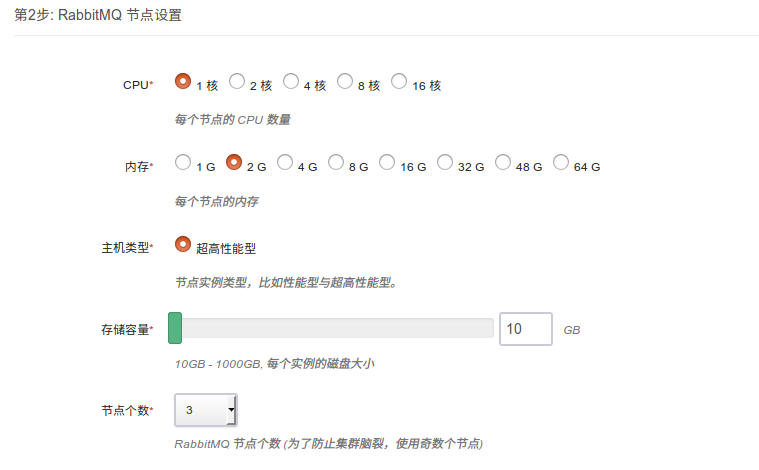
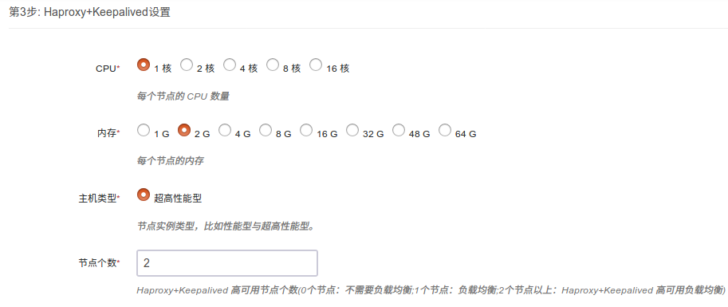
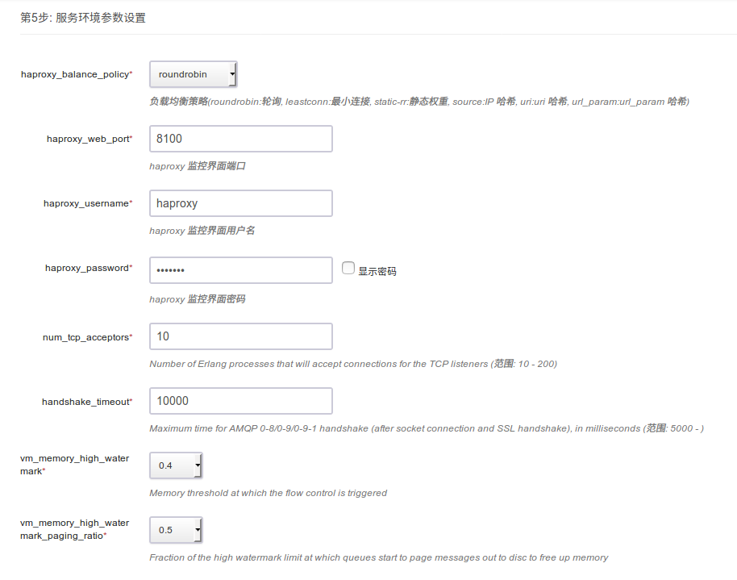
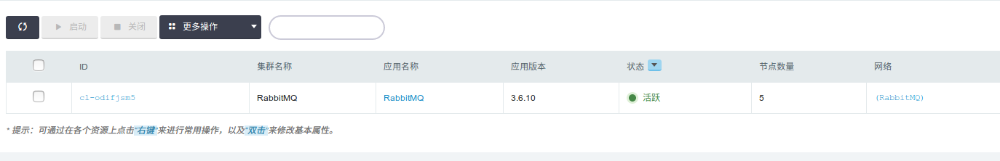
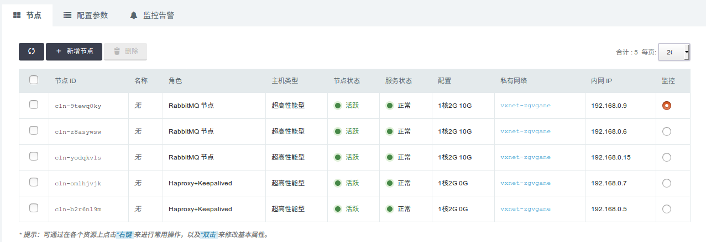
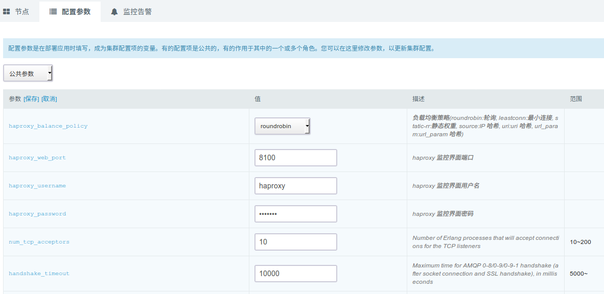
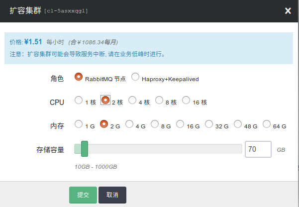

# RabbitMQ on QingCloud AppCenter 用户手册

## 简介

[RabbitMQ](https://www.rabbitmq.com/) 是实现 AMQP 的消息中间件的一种,提供了一个具有可靠性、灵活的路由、事务、高可用的队列、消息排序、可视化管理工具等功能的一个强大队列软件,服务器端用 Erlang 语言编写,天生具备高并发高可用。

`RabbitMQ on QingCloud AppCenter` 将 RabbitMQ 通过云应用的形式在 QingCloud AppCenter 部署，具有如下特性:

- 支持横向与纵向在线伸缩
- 系统自动运维，降低企业使用成本
- 提供了监控告警功能更好的管理集群
- 与 Haproxy+Keepalived 集成，具备高可用负载均衡特性
- 开箱即用，支持 AMQP、MQTT、STOMP、WebSockets 等多种丰富协议

>注意：青云 RabbitMQ 集群为了防止脑裂，使用 pause_minority 模式 ，保证 CP，总节点数为奇数个。集群创建后，默认监控管理界面登录帐号：guest/guuest 为管理员，另外青云内部会创建一个 monitor 用户用于监控，请勿删除与修改 monitor 用户，Haproxy+Keepalived 节点 创建后监控管理界面登录帐号为：haproxy/haproxy 可以通过配置参数修改 。

## 创建 RabbitMQ

创建 RabbitMQ 集群前，您需要先创建一个 VPC 网络。

> 为了保障数据安全, RabbitMQ 集群需要运行在受管私有网络中。所以在创建一个 RabbitMQ 集群之前，需要创建一个 VPC 和一个受管私有网络，受管私有网络需要加入 VPC，并开启 DHCP 服务（默认开启）。

### 第一步：基本设置

根据自己的需求填写 `名称` 和 `描述`，不影响集群的功能，版本一般建议选择最新版本。

### 第二步：RabbitMQ 节点设置

CPU，内存，节点数量，主机类型和磁盘大小根据自己实际需求进行选择即可，生产环境建议使用至少3个节点。

### 第三步：Haproxy+Keepalived 节点设置

CPU，内存，节点数量，主机类型根据自己实际需求进行选择即可，0个节点代表不需要负载均衡，
1个节点为使用 Haproxy 的负载均衡模式，2个节点以及2个节点以上为负载均衡 HA 模式，HA 模式下建议使用 VIP 。

### 第四步：网络设置

出于安全考虑，所有的集群都需要部署在私有网络中，选择自己创建的网络中。

### 第五步：参数设置

按照自己的实际需求配置 Haproxy 负载均衡策略和参数，配置 RabbitMQ 集群参数，一般情况下 RabbitMQ 使用默认参数即可。

### 第六步: 用户协议

阅读并同意青云 APP Center 用户协议之后即可开始部署应用。

## 集群使用

### 集群信息

在集群创建完毕后，可以在控制台 `Appcenter -> 集群列表` 标签下看到目前已经创建的集群信息：

 集群列表

 点击集群 ID 可以查看该集群的详细信息：

 集群基础资源监控信息：

  

 集群节点监控信息：

RabbitMQ 集群监控管理：

Haproxy 节点监控管理：

### 配置参数

  点击 `配置参数` 可以修改 `Haproxy 参数`， `RabbitMQ 参数`。

  

### 扩容集群

  点击 `扩容集群` ， 可以在集群性能不足时提高集群的配置：

  

## 推荐使用 RabbitMQ web 管理界面管理与监控集群

    每个节点都安装好了此插件，ip:15672，登录后查看，管理与设置起来都很容易操作

## rabbitmqadmin 命令行客户端工具示例简介

   官网参考地址：http://www.rabbitmq.com/management-cli.html

### 在 RabbitMQ 管理界面下载

- 例如 Keepalived VIP 为 192.168.0.253
- wget http://192.168.0.253:15672/cli/rabbitmqadmin
- file rabbitmqadmin
- chmod +x rabbitmqadmin
- 修改 localhost 为192.168.0.253

### 定义一个 queue

> ./rabbitmqadmin declare queue name=test  durable=true

### 查看 queues

> ./rabbitmqadmin  list queues

### 查看 channels

> ./rabbitmqadmin  list channels

### 查看 consumers

> ./rabbitmqadmin  list consumers

### 发送一条消息

>./rabbitmqadmin publish routing_key=test payload="just for test"

### 消费一条消息

>./rabbitmqadmin get queue=test requeue=true

## rabbitmq web http 命令示例简介

   官网参考地址：https://cdn.rawgit.com/rabbitmq/rabbitmq-management/rabbitmq_v3_6_10/priv/www/api/index.html

### 检查集群健康状态

>curl -i -u guest:guest http://192.168.0.253:15672/api/healthchecks/node

### 创建 vhost

>curl -i -u guest:guest -H "content-type:application/json" -XPUT http://192.168.0.253:15672/api/vhosts/foo

### 授权用户访问 vhost

>curl  -i  -u guest:guest -H "content-type:application/json" -XPUT http://192.168.0.253:15672/api/permissions/foo/guest -d  {"configure":".*","write":".*","read":".*"}

### 创建一个 queue ，发送消息，并消费消息

>curl -i -u guest:guest http://192.168.0.253:15672/api/aliveness-test/foo

## 设置镜像队列 HA

   官网参考地址：https://www.rabbitmq.com/ha.html

- 推荐使用 web 界面来设置，比较方便
- 熟悉的话,也可以使用 HTTP API

至此，`RabbitMQ on QingCloud AppCenter` 的介绍到这里就告一个段落了。

在使用过程中如果遇到问题可以通过 `提交工单` 来获取帮助，我们将竭诚为您服务。

Have a nice day on QingCloud AppCenter !
