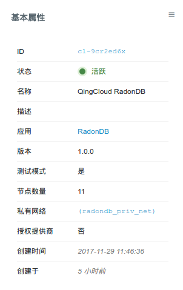
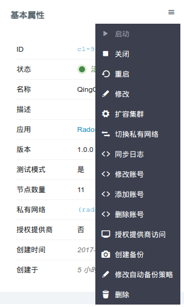
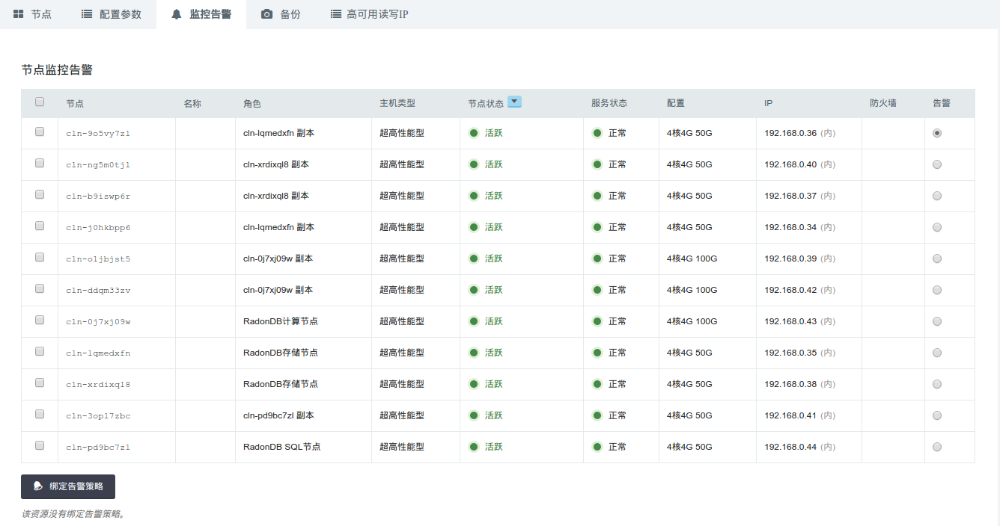
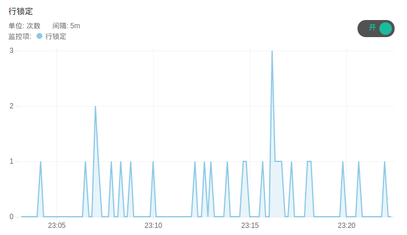

# 用户手册

## 描述

RadonDB是一款基于MySQL研发的新一代分布式关系型数据库(MyNewSQL)。

向用户提供具备金融级高可用、强一致、超大容量的数据库服务，高度兼容MySQL语法，自动水平分表，智能化扩容。

**RadonDB的优势:**

* 自动水平分表，一键即可开启智能化扩容，扩容过程业务不中断。
* 数据多副本并可跨数据中心部署，率先使用GTID并行复制+Raft一致性协议确保副本间数据强一致、零丢失。
* 主副本故障自动秒级切换，实现自动化运维，无需人工干预。
* 存储副本使用MySQL(5.7.19)存储，稳定可靠的存储能力与强大的计算能力并存。
* 提供分布式事务能力，保证跨节点操作的数据一致性。
* 同时支持OLTP(高并发事务需求)和OLAP(复杂分析需求)。
* 高度兼容MySQL语法，数据可快速导入、导出，简单易用。

## 创建步骤

### 1. 基本设置

这里可以填写集群的描述等信息。


### 2. 节点设置

RadonDB包含三种类型的节点：SQL节点、存储节点、计算节点。SQL节点、计算节点的数量固定为1，存储节点数量可选，每个节点都有副本节点。具体说明如下表：

| 节点类型 | 节点数量范围 | 副本节点数量范围 |
| - | :-: | -: |
| SQL节点 | 1        | 1-4，默认为1 |
| 存储节点   | 2-60，默认为2 | 2 |
| 计算节点   | 1           | 2 |

每种类型的节点都可设置CPU、内存、磁盘类型、磁盘大小。磁盘类型可选择性能型或者超高性能型。磁盘大小决定了数据库最大容量，您的数据和日志会共享这块磁盘。


**注解**：按上述设置，集群会有11个主机，包括：SQL节点1组，每组包括1主1副本；存储节点2组，每组包含1主2副本；计算节点1组，每组包含1主2副本。

### 3. 网络设置

数据库集群服务只能加入已连接路由器的私有网络，并确保该私有网络的 DHCP 处于『打开』状态。 使用一个数据库独享的私有网络的好处是方便您对其做『过滤控制』，同时也不影响其它私有网络的设置。


### 4. 服务环境参数设置

在这一步可以创建初始的数据库帐号，并设置数据库服务的配置参数。


## 集群信息

### 基本属性

这里显示了集群的基本信息。




### 高可用读写IP信息

集群提供两个高可用的读写IP，分别对应于数据的读和写。

* 读IP：可将请求在多个SQL从节点之间进行负载分担，提高读取性能，消除单点故障。

* 写IP：始终指向SQL主节点。


**注解**: 必须使用高可用的读写IP来访问集群。

### 服务功能

点开基本属性旁边的下拉按钮，可以看到提供的服务功能。




### 节点列表

这里列出节点及其IP，可以使用这里列出的IP来下载同步的日志。同时显示了每个节点的服务状态。


**注解**：这里的IP仅供查询和下载同步的日志使用，不能做写入使用。


### 配置参数

这里列出了可以修改并持久化的配置参数。没有标注会重启服务的参数，都可以运行时修改，对服务没有影响。


**注解**：会自动重启服务的参数已经在描述中说明，请在业务低峰时进行修改。


### 监控告警

可以对集群节点配置告警策略，及时掌握集群的资源和服务状况。




### 备份恢复

可以对集群进行手动备份，也可以在集群列表页面右键选择备份时间进行自动备份。


如果需要从备份创建出一个独立于原有数据库服务的新数据库服务， 可以在详情页的『备份』标签下右键相应的备份点，再选择『从备份创建集群』即可。


**注解**：恢复集群时会保留原集群的数据库帐号密码，恢复时需要指定新的账户密码，也可以在创建后修改。


## 服务功能概述

### 添加帐号

要创建新帐号时，需要指定帐号密码。


### 删除帐号

这里填写要删除的帐号名。


### 修改帐号

这里填写要修改的帐号名及新密码。


### 增删节点

可以根据需要增加SQL节点的副本或存储节点。增加SQL节点的副本只会增加一个主机，而增加存储节点则会增加3个主机，即1主2副本。


### 扩容集群

可以对一个运行中的数据库服务进行在线扩容，调整CPU/内存/磁盘空间大小。每次扩容只能选择一种角色。


**注解**：扩容需要在开机状态下进行，扩容SQL节点时链接会有短暂中断，请在业务低峰时进行。

### 同步日志

同步日志可以将审计日志拷贝到系统的FTP目录，可以在内网下载到本地进行分析。


**注解**：审计日志只记录最近一个小时的SQL记录。默认情况下不开启审计日志，可在初始化集群时或配置参数里设置开启。

### 监控

这里为每个节点都提供了资源监控，并对存储、计算节点提供了服务监控。服务监控统计了SHOW GLOBAL STATUS中的信息，可用于定位分析数据库的性能。部分监控项示例如下：





## 性能测试

### 硬件环境

```plain
RadonDB:
1组SQL节点(16C64G超高性能主机)
4组存储节点(16C64G超高性能主机)
sync_binlog=1
innodb_flush_log_at_trx_commit=1

RDB:
RDB(16C64G超高性能主机)
sync_binlog=1
innodb_flush_log_at_trx_commit=1
```

### 测试模型

  sysbench: 16表, 512线程，随机写，5000万条数据。

### 测试结果

| Item      |    Transaction Per Second (TPS) | Response Time(ms) |
| :-------- | --------:| :--: |
| RadonDB(4组存储节点)  | 26589 |  20   |
| 单机MySQL(QingCloud RDB)    |  9346 |  73  |

可以看到RadonDB的延迟是单机MySQL的1/3，但性能几乎是单机的３倍，这要得益于RadonDB对大表进行切分后，用户的写操作在这些小表上可并发式执行。

### 如何压测RadonDB

RadonDB支持[sysbench](https://github.com/akopytov/sysbench)和[benchyou](http://github.com/XeLabs/benchyou)性能压测软件。
注意：压测前需要修改建表语句指定分区键(PARTITION BY HASH(分区键))
