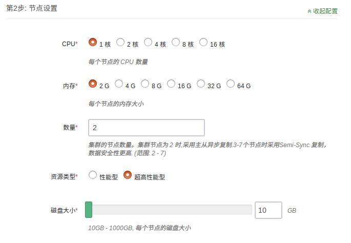
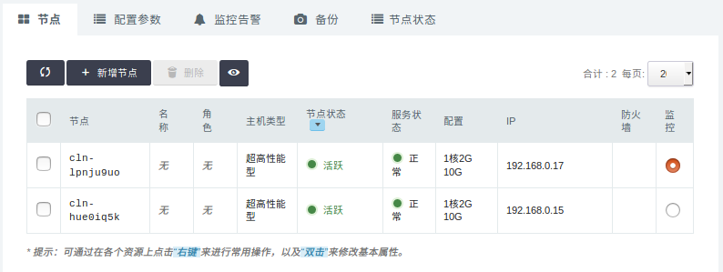
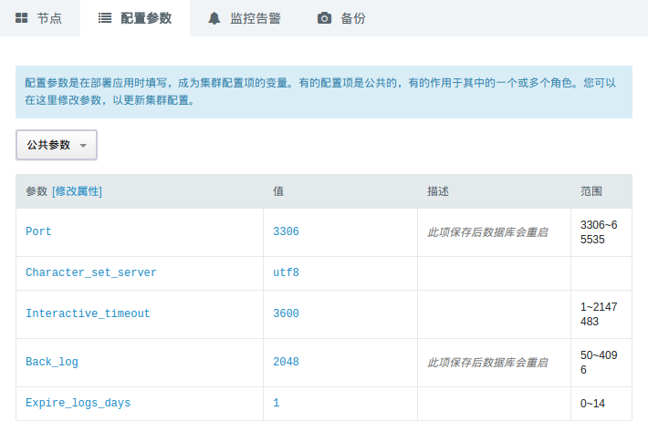
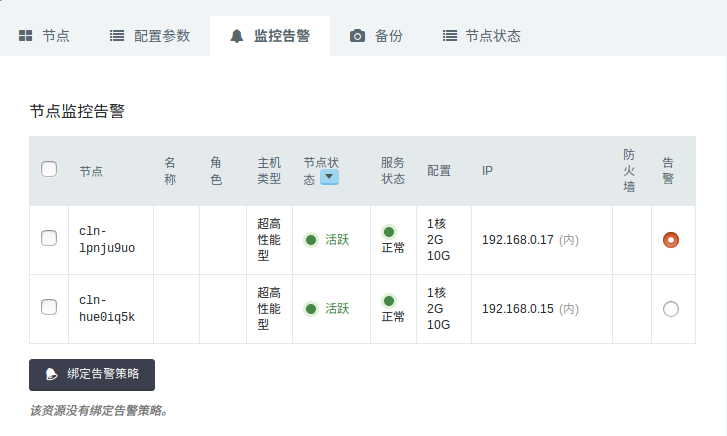
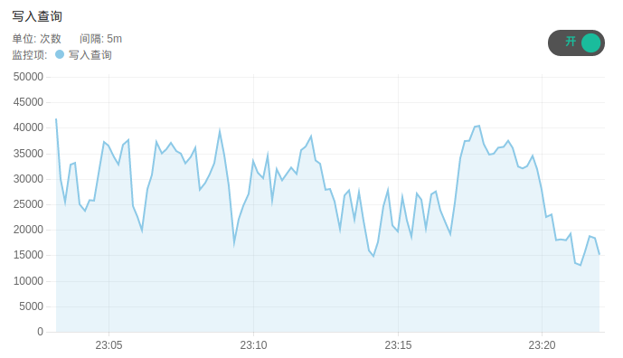
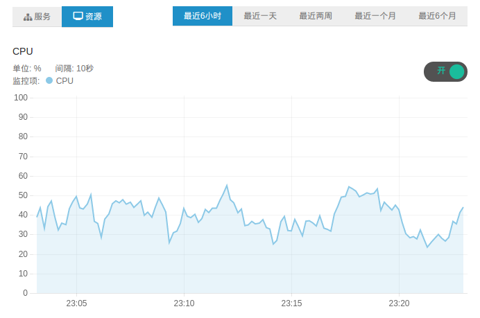

# QingCloud MySQL Plus用户手册

<extoc></extoc>

## 描述

「QingCloud MySQL Plus」是一款具备金融级强一致性、主从秒级切换，集 InnoDB + TokuDB 双存储引擎支持的增强型 MySQL 集群应用。

- 多副本同步复制，确保金融级强一致性

「QingCloud MySQL Plus」采用一主两从的初始节点架构设计，并通过 MySQL 5.7 版本中的 semi-sync 特性实现数据的多副本同步复制，确保至少一个从节点与主节点始终保持数据的完全一致，提供金融级数据强一致性。多个从节点的设置将极大的屏蔽掉单点故障带来的影响，确保集群内始终有从节点保有全量数据。 

- 主从秒级切换，确保业务高可用

节点之间使用 Raft 协议进行管理，当主节点出现故障不可用时，集群会秒级响应并选出新的主节点（与主节点数据完全同步的从节点），立即接管读写请求，确保业务的连续高可用。这一过程，用户完全无需关心后端集群中各节点的角色如何设置，一切由系统自动管理。


集群中最多可以添加 6 个从节点，主节点可读可写，从节点设置为只读。 同时，集群提供两个高可用读写 IP， 分别对应数据的读和写。 读 IP 可将请求在所有节点之间进行负载分担，提供读取性能的同时，也消除了单点故障的影响，提供业务可靠性。写 IP 则始终指向主节点 （master）。


- 支持双存储引擎，优化存储成本

在支持原有 InnoDB 引擎的同时，「QingCloud MySQL Plus」同时支持 TokuDB 存储引擎。TokuDB 采用更先进的索引算法（Fractal Tree Indexing），实现更高的压缩比，帮助用户提升存储空间的利用率，从而降低存储成本。同样规模的数据量如果采用 TokuDB，相比 InnoDB，存储空间将降低大约一半。TokuDB 更适合用于需要大规模存储空间，但没有超大规模并发读取压力的使用场景，如大数据分析等。


- 系统自动运维，优化系统空间使用效率

用户可以对 binlog 日志的保留周期进行1到14天的自由配置。同时，主节点会自动定期清理掉不再使用的 binlog 日志(其他从节点已复制完毕)，提高系统的空间利用率。

**注解**：当前系统默认的日志保留时间为1天，可在**参数配置**页面通过`expire_logs_days`来修改


## 创建步骤

### 基本设置

这里可以填写集群的描述等信息。


### 节点设置

  可以选择性能型或者超高性能型数据库，以及数据库的配置、磁盘大小。磁盘大小决定了数据库最大容量，您的数据和日志会共享这块磁盘。



**注解**：当节点总数为2时，将采用异步复制，而节点总数大于2时，将采用Semi-Sync复制，数据安全性更高。

### 网络设置

数据库集群服务只能加入已连接路由器的私有网络，并确保该私有网络的 DHCP 处于『打开』状态。 使用一个数据库独享的私有网络的好处是方便您对其做『过滤控制』，同时也不影响其它私有网络的设置。


### 服务环境参数设置

在这一步可以创建初始的数据库帐号，并设置数据库服务的配置参数。


**注解**：这里创建的账户没有SUPER权限


## 集群信息

### 基本属性

这里显示了集群的基本信息。


### 服务端口信息

集群提供两个高可用的读写IP，分别对应于数据的读和写。 

- 读IP：可将请求在所有节点之间进行负载分担，提高读取性能，消除单点故障。 

- 写IP：始终指向master节点。


**注解**: 必须使用高可用的读写IP来访问集群

### 服务功能

点开基本属性旁边的下拉按钮，可以看到提供的服务功能。


### 节点列表

这里列出节点及其IP，可以使用这里列出的IP来下载同步的日志。同时显示了每个节点的服务状态。




**注解**：这里的IP仅供查询和下载同步的日志使用，不能做写入使用


### 配置参数

这里列出了可以修改并持久化的配置参数。没有标注会重启服务的参数，都可以运行时修改，对服务没有影响。




**注解**：会自动重启服务的参数已经在描述中说明，请在业务低峰时进行修改


### 监控告警

可以对集群节点配置告警策略，及时掌握集群的资源和服务状况。




### 备份恢复

可以对集群进行手动备份，也可以在集群列表页面右键选择备份时间进行自动备份。


如果需要从备份创建出一个独立于原有数据库服务的新数据库服务， 可以在详情页的『备份』标签下右键相应的备份点，再选择『从备份创建集群』即可。


**注解**：恢复集群时会保留原集群的数据库帐号密码，恢复时需要指定新的账户密码，也可以在创建后修改


## 服务功能概述

### 添加帐号

要创建新帐号时，需要指定帐号密码和授权访问的数据库。帐号权限一栏可以填写授权的帐号列表，以分号间隔。目前支持的权限列表为:

| Privilege             | Column                 
|:----------            |:----------            
|ALTER                  |Alter_priv              
|ALTER ROUTINE          |Alter_routine_priv      
|CREATE                 |Create_priv             
|CREATE ROUTINE         |Create_routine_priv 
|CREATE TEMPORARY TABLES|Create_tmp_table_priv
|CREATE VIEW            |Create_view_priv     
|DELETE                 |Delete_priv         
|DROP                   |Drop_priv           
|EXECUTE                |Execute_priv        
|INDEX                  |Index_priv          
|INSERT                 |Insert_priv         
|LOCK TABLES            |Lock_tables_priv    
|PROCESS                |Process_priv        
|REFERENCES             |References_priv     
|RELOAD                 |Reload_priv         
|SELECT                 |Select_priv         
|SHOW DATABASES         |Show_db_priv        
|SHOW VIEW              |Show_view_priv      
|TRIGGER                |Trigger_priv        
|UPDATE                 |Update_priv         


**注解**：这里只能创建普通权限的帐号。系统保留root帐号和repl帐号来进行自动化运维和数据同步，请勿删除这两个帐号，以免破坏系统的运行

### 删除帐号

这里填写要删除的帐号名。


### 增删节点

可以根据需要增加集群节点，增加的节点数必需为偶数。添加节点的任务执行时间跟集群的数据量有关系，数据量大时，任务执行时间会久一些，添加节点不影响集群的读写。删除节点的数量也必须为偶数个。


**注解**：删除节点时，如果当前节点是master节点则不能删除，需要重新选择节点删除


### 扩容集群

可以对一个运行中的数据库服务进行在线扩容，调整CPU/内存/磁盘空间大小。


**注解**：扩容需要在开机状态下进行，扩容时链接会有短暂中断，请在业务低峰时进行


### 清理日志

点击 **清理日志** 按钮，可以将慢查询日志mysql-slow清理掉。


### 同步日志

同步日志可以将mysql-slow.log和mysql-error.log拷贝到系统的FTP目录，可以在内网下载到本地进行分析。


### 重启节点

可以根据需要重启指定节，需要填写指定节点的节点ID。


**注解**：系统监控会自动修复异常节点，所以通常无需自行重启节点


### 重建节点

当系统无法自动修复异常节点时，可以通过重建功能来重新构建节点和数据，需要填写指定节点的节点ID。


**注解**：重建节点不会影响其他节点的运行，重建时间跟数据量有关


### 监控

这里提供了资源监控和服务监控。服务监控统计了SHOW GLOBAL STATUS中的信息，可用于定位分析数据库的性能。








## 数据迁移

「QingCloud MySQL Plus」的MySQL版本为5.7.18，且开启了GTID复制模式，因此从其他MySQL迁移数据时，需要通过导数据的方式来进行。

### 数据导出

在源数据库端使用 mysqldump 将需要的内容导出到 dump.sql 文件，导出数据需要排除mysql.user表，且不导出GTID标识。
这里假设源数据库的IP地址为192.168.0.100，导出语句为：

```bash
mysqldump --all-databases --single-transaction --triggers --routines --events  --host=192.168.0.100 --port=3306 --user=mysql_dev -p --ignore-table=mysql.user --set-gtid-purged=OFF > dump.sql
```

这里是导出了全部的数据，也可以选择导出部分数据库，更多详细使用方法请参考 [mysqldump](https://dev.mysql.com/doc/refman/5.7/en/mysqldump.html)。

### 数据导入

将上一步导出的 dump.sql 文件复制到一台能连接「QingCloud MySQL Plus」的主机后执行该 .sql 文件。
需要使用「QingCloud MySQL Plus」的高可用写IP来进行链接。假设高可用的写IP地址为 192.168.0.250，导入语句为：

```bash
mysql -umysql_dev -p -h192.168.0.250 < dump.sql
```

## 基准测试

为了模拟出产品环境真实的 OLTP 业务场景和压力， 我们采用了
[TPC-C](http://www.tpc.org/tpcc/)  这个专门针对 OLTP 系统的基准测试规范， 使用的 TPC-C 工具是 
[Percona tpcc-mysql](https://www.percona.com/blog/2013/07/01/tpcc-mysql-simple-usage-steps-and-how-to-build-graphs-with-gnuplot/) ， 关于 TPC-C 规范的数据模型和测试运行方式可以参考
[TPC-C The OLTP Benchmark](http://www.tpc.org/information/sessions/sigmod/sld002.htm)

8核16G超高性能规格的数据库，50个 TPC-C 仓库，测试不同并发下的结果为：

| 100并发   | 200并发   | 300并发   | 400并发   |
|:---------:|:---------:|:---------:|:---------:|
| 27856.850 | 25413.051 | 23329.551 | 22488.449 |

其它规格数据库的基准测试建议您自己来做，以获得对测试数据最真实的第一手资料。
