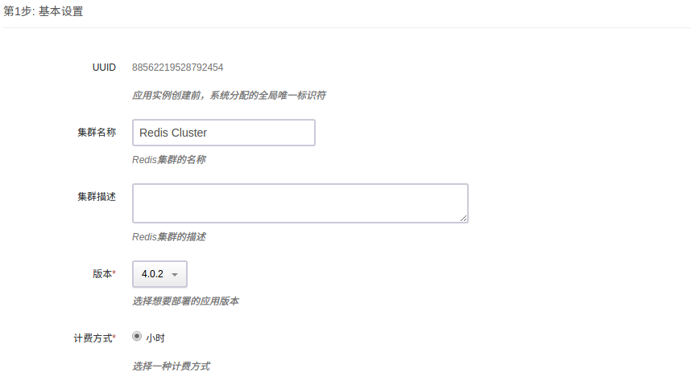

# Redis Cluster on QingCloud AppCenter

<extoc></extoc>

Redis 是一个使用ANSI C编写的开源、支持网络、基于内存、可选持久性的键值对存储数据库。

Redis cluster on QingCloud AppCenter 基于原生的 Redis 提供了 Redis cluster 的 App，能够在 AppCenter 进行一键部署，有如下特性：

- 支持一主多从以及多主多从，每个主所在分片 (shard) 平均分摊 16384 个 slots， 增加或删除主节点系统会自动平衡 slots 
- 集群支持 HA, 即当某个主节点异常，它的从节点会自动切换成主节点
- 支持集群的横向及纵向伸缩
- 一键部署
- 基于最新的 Redis 4.0.6 稳定版构建

## 创建 Redis cluster App

### 准备

在部署 App 之前，您需要创建一个 VPC 网络和关联一个 Vxnet 私有网络，详情见 ([VPC 指南](https://docs.qingcloud.com/guide/vpc.html))

### 1) 选择基本配置

填写集群的名称，描述，选择应用的版本。



### 2) 节点配置

配置 Redis 节点，包括 CPU，内存等信息。


### 3) 网络配置

选择服务部署的私有网络，可以选择之前创建的任意网络。


### 4) 环境参数配置


### 创建成功

当 Redis cluster 服务创建完成之后，我们可以查看 Redis cluster 中各节点的运行状态。 


### 配置参数

可以在此修改环境参数，参数修改完成保存后，集群将重启以应用新的参数配置，所以请在服务压力相对较小的时候修改参数。


### 监控告警

可以在此为节点配置告警信息，随时监控您的服务。


## 测试

当缓存服务创建完成之后，我们可以进行连接测试。

### 1）检查集群状态

在同一私网中创建一台 Linux 主机，您可能需要先装一些依赖包 (如 Ubuntu 下 apt-get install tcl ruby　和　gem install redis)， 然后请 [下载 Redis 4.x](http://download.redis.io/releases/redis-4.0.6.tar.gz), 解压后进入 Redis src 目录，执行以下命令　（假设 Redis cluster 其中一个节点的 IP 为 192.168.100.13, 端口为 6379)。

```shell
./redis-trib.rb check 192.168.100.13:6379
```

然后您能看到如下的集群信息

```shell
Connecting to node 192.168.100.13:6379: OK
Connecting to node 192.168.100.11:6379: OK
Connecting to node 192.168.100.10:6379: OK
Connecting to node 192.168.100.14:6379: OK
Connecting to node 192.168.100.12:6379: OK
Connecting to node 192.168.100.15:6379: OK
>>> Performing Cluster Check (using node 192.168.100.13:6379)
S: f6092dbdb25b6d80416232e50ccd2022860086b0 192.168.100.13:6379
   slots: (0 slots) slave
   replicates b2d75900b6427f6fbf8ec1a61ee301a2c8f73a6d
M: d3377079e01391b9d16ea699c79453e15f5aa132 192.168.100.11:6379
   slots:0-5460 (5461 slots) master
   1 additional replica(s)
M: b2d75900b6427f6fbf8ec1a61ee301a2c8f73a6d 192.168.100.10:6379
   slots:5461-10922 (5462 slots) master
   1 additional replica(s)
S: 9774f5ff6477eaecb6794395ed726d0f06257c60 192.168.100.14:6379
   slots: (0 slots) slave
   replicates d3377079e01391b9d16ea699c79453e15f5aa132
M: 704514eb7fa135dd003533568ae9f7babda9464e 192.168.100.12:6379
   slots:10923-16383 (5461 slots) master
   1 additional replica(s)
S: 22b3f49a6b87403faeeb1219881e63096802eb6a 192.168.100.15:6379
   slots: (0 slots) slave
   replicates 704514eb7fa135dd003533568ae9f7babda9464e
[OK] All nodes agree about slots configuration.
>>> Check for open slots...
>>> Check slots coverage...
[OK] All 16384 slots covered.
```

如果发现集群出现异常，比如出现 [ERR] Nodes don’t agree about configuration! 可以尝试用如下命令修复

```shell
./redis-trib.rb fix 192.168.100.13:6379
```

如果发现各分片的 slots 分配不平均，也可以用如下命令平衡一下 (从两个分片迁移 1000 个 slots 到第三个分片里)

```shell
./redis-trib.rb reshard --from d3377079e01391b9d16ea699c79453e15f5aa132,b2d75900b6427f6fbf8ec1a61ee301a2c8f73a6d
--to 704514eb7fa135dd003533568ae9f7babda9464e --slots 1000 --yes 192.168.100.13:6379
```

### 2）Java 客户端读写数据示例

首先 [下载 Jedis 库和 Apache Commons Pool 依赖库](https://github.com/xetorthio/jedis/wiki/Getting-started)。 把下载下来的 commons-pool2-2.5.0.jar 和 jedis-2.9.0.jar 放到同一目录下如 lib/， 创建 TestRedisCluster.java，内容如下。 然后编译、执行该 Java 程序（假设一个分片的主从节点分别是 192.168.100.10， 192.168.100.13， 端口均为 6379）。

```shell
javac -cp :./lib/* TestRedisCluster.java
java -cp :./lib/* TestRedisCluster 192.168.100.10, 192.168.100.13 6379
```

```java
import java.util.Set;
import java.util.HashSet;
import redis.clients.jedis.JedisCluster;
import redis.clients.jedis.HostAndPort;

public class TestRedisCluster {
    public static void main(String[] args) throws Exception {
        Set<HostAndPort> jedisClusterNodes = new HashSet<HostAndPort>();
        //Jedis Cluster will attempt to discover cluster nodes automatically
        jedisClusterNodes.add(new HostAndPort(args[0], Integer.valueOf(args[2])));
        jedisClusterNodes.add(new HostAndPort(args[1], Integer.valueOf(args[2])));
        JedisCluster jc = new JedisCluster(jedisClusterNodes);

        String str = "abcdefghijklmnopqrstuvwxyzABCDEFGHIJKLMNOPQRSTUVWXYZ1234567890";
        int len = str.length();
        int loop = 0;
        while (loop <= 100) {
            loop += 1;
            for (int i = 1; i < len; i++) {
                int end = len - i;
                for (int j = 0; j < end; j++) {
                    for (int k = j+1; k < end; k++) {
                        String key = str.substring(j, j+1) +
                                     str.substring(k, k+i) + "_" +
                                     str.substring(i, i+1);
                        String value = key + "_value";
                        jc.set(key, value);
                        String v = jc.get(key);
                        if (!value.equals(v)) {
                            System.out.println("Not equal: key[" + key + "], value[" +
                                               value + "], v[" + v + "]");
                        }
                        System.out.println(key + "," + value);
                    }
                }
            }
        }

        jc.close();
    }
}
```

>这是示例代码，不承担任何责任。更多的 Redis 客户端请见 [Redis 官方网站](http://redis.io/clients)。

### 3） Hash Tags Keys

Redis 集群采用 CRC16 算法对 key 值哈希到 16384 个 slots 中的一个，因此不同的 key 可能分散到不同的节点中，对于想固定一类 key 值到某一个节点，如按业务分类，可以采用 Hash Tags，下面是从 [Redis 文档](http://redis-documentasion-japanese.readthedocs.org/en/latest/topics/cluster-spec.html) 摘录的解释。


In order to implement hash tags, the hash slot is computed in a different way. Basically if the key contains a “{...}” pattern only the substring between { and } is hashed in order to obtain the hash slot. However since it is possible that there are multiple occurrences of { or } the algorithm is well specified by the following rules:

- If the key contains a **{** character
- There is a **}** character on the right of **{**
- There are one or more characters between the first occurrence of **{** and the first occurrence of **}** after the first occurrence of **{**.

Then instead of hashing the key, only what is between the first occurrence of **{** and the first occurrence of **}** on its right are hashed.

Examples:

- The two keys **{user1000}.following** and **{user1000}.followers** will hash to the same hash slot since only the substring **user1000** will be hashed in order to compute the hash slot.
- For the key **foo{}{bar}** the whole key will be hashed as usually since the first occurrence of **{** is followed by **}** on the right without characters in the middle.
- For the key **foo{{bar}}zap** the substring **{bar** will be hashed, because it is the substring between the first occurrence of **{** and the first occurrence of **}** on its right.
- For the key **foo{bar}{zap}** the substring bar will be hashed, since the algorithm stops at the first valid or invalid (without bytes inside) match of **{** and **}**.
- What follows from the algorithm is that if the key starts with **{}**, it is guaranteed to be hashes as a whole. This is useful when using binary data as key names.

## 在线伸缩

在缓存服务运行过程中，会出现服务能力不足或者容量不够的情况，可以通过扩容来解决，或者服务能力过剩时可以删除节点。在纵向扩容中， 服务需要重启，所以这个时候业务需要停止。在横向伸缩中，数据会发生迁移，但并不影响业务的正常运行。

### 1）增加集群分片 (shard)

Redis 集群服务每个主节点写的能力与容量都有上限，当写的能力不满足业务需求或达到容量上限时，您可以通过增加节点组即缓存分片来提升写性能以及容量。 每增加一个节点组时将创建一个主节点和其它主节点同样的从节点数。Redis 集群会自动平衡各分片之间的 slots，即会发生 数据迁移，因此增加节点组的时间会有点长。如果事先知道需要增加的分片数建议一次性完成，这样比一次只加一个分片效率更高。 


### 2）增加集群从节点

Redis 集群服务每个主节点可以支持多个从节点。当读的能力不足时，您可以通过增加缓存从节点来提升读性能。 


### 3）删除集群分片 (shard)

如果写服务能力或容量过剩，也可以删除多余的节点组，即删除主节点和它的所有从节点，删除的过程中系统会自动迁移数据到其它节点中，因此时间会稍长一点。

### 4）删除集群从节点

如果读服务能力过剩，您也可以删除多余的从节点。删除的时候需要从每个主节点下选择同样数目的从节点，从而保证整个集群不会是一个“畸形”。

### 5）增加缓存容量

当缓存容量不足时，您可以通过纵向扩容来提升缓存容量，右键点击集群，选择扩容。


>存储容量只能扩容，不支持减少存储容量。在线扩容期间，缓存服务会被重启。

## 迁移

迁移数据既包括 Redis standalone 之间也包括从 Redis Standalone 到 Redis Cluster。

### 从 Redis standalone 迁移数据到 Redis cluster

Redis 4.x　提供了一个从 Redis standalone (包括旧版本 2.8.17) 迁移数据到 Redis cluster　的工具 redis-trib.rb, 请 下载 [Redis 4.x](http://download.redis.io/releases/redis-4.0.6.tar.gz), 解压后进入 Redis src目录， 执行以下命令:　
(假设 Redis standalone 的主节点 IP 为 192.168.100.11，端口为 6379, Redis cluster 其中一个 节点的 IP 为 192.168.100.20, 端口为 6379)。

```shell
./redis-trib.rb import --from 192.168.100.11:6379　192.168.100.20:6379
```

>在做迁移之前建议对原 Redis standalone 做备份，因为上述操作是对数据进行迁移而不是拷贝。

## 其他

为了更好的管理 Redis 服务，我们默认禁用一些 Redis 的命令，禁用的命令列表如下：

- BGREWRITEAOF
- BGSAVE
- DEBUG
- CONFIG
- SAVE
- SHUTDOWN
- SLAVEOF

您可以通过参数配置页打开 CONFIG 和 SAVE 命令，但我们强烈不推荐您这么做。错误地使用 CONFIG 命令可能会导致服务的不可用，我们建议您在生产环境上使用默认设置来禁用这两个命令。 当您需要打开命令时，设置'打开config和save命令'为１，保存配置，服务会自动重启以生效。


## 注意

目前 appcenter 还不支持节点角色动态变更，因此如果网络发生 partition 或者其他情况导致主从切换，在网页上是无法得到反馈的。这一功能会在近期开发完成，Redis cluster 应用也会及时跟进发布一个新的版本来支持这个功能。


