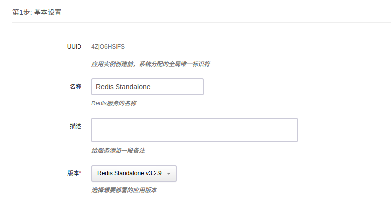

## Redis standalone on QingCloud AppCenter 用户手册

### 描述

   **[Redis](https://redis.io/)**是一个使用ANSI C编写的开源、支持网络、基于内存、可选持久性的键值对存储数据库。

**Redis standalone on QingCloud** 将 **Redis** 封装成 App， 支持在 AppCenter 上一键部署，在原生 **Redis** 的基础上增加了其易用性、高可用的特性，免去您维护的烦恼。细致说来，具有如下特性：

- 高可用性。

  **Redis standalone on QingCloud** 集成 **[Redis Sentinel](https://redis.io/topics/sentinel)** 机制，支持秒级主从切换，并提供一个对外的读写 vip, 在保证高可用性的同时，无需手动切换主节点 IP 地址。

- 支持节点的纵向和横向扩容。

  **Redis standalone on QingCloud** 支持单节点和三节点两种部署方式，只有三节点部署形式包含主从自动切换的功能。可以从单节点扩容到三节点，而无需暂停当前 **Redis** 服务。也可以从三节点缩小到单节点，此时会导致服务的短暂不可用。

- 一键部署。 

  无需额外配置，可以立即部署一个 **Redis** 服务


### 部署 **Redis standalone** 服务

> 为了您的数据安全，目前 **Redis standalone on QingCloud** 需要部署在私有网络内。请您在部署服务之前，先创建一个私有网络。


#### 一. 选择基本配置

​      填写集群的名称，描述，选择应用的版本 _Redis_standalone_v3.2.8_



#### 二. 配置节点

​        配置单个节点，根据业务需要选择节点CPU/内存/类型，建议选择默认配置，您可以在随后根据业务需要扩容您的节点。选择节点个数，包含单节点和三节点两个版本，但只有三个节点版本才包含主从切换的功能。您可以从单节点增加到三节点。


#### 三. 选择私有网络

​     在此选择您在开始创建好的私有网络。


#### 四. 配置 Redis 环境参数

​       **Redis Standalone on QingCloud** 提供了 **Redis** 大部分配置参数，您可以在此根据需要修改相应的参数。


- _requirepass_ : 如果您想为您的 **Redis** 服务设置密码，请在此填写，注意密码长度以保证安全


#### 五. 部署

​       阅读并同意青云 AppCenter 用户协议之后即可马上部署您的应用。


### 应用详情

​	部署完成后您将看到如下信息


- 服务端口信息

  **Redis standalone on QingCloud** 提供一个读写IP，此IP始终指向主节点。当发生主从切换时，此IP将指向新的主节点，无需手动更改主节点IP

#### 伸缩节点

​	您可以从三个节点减少到一个节点，任意删除两个节点即可。由于您可能删除主节点，会造成服务的短暂不可用(约5s)，所以请在服务压力较小的情况下减少节点，剩下的节点就会一主节点继续提供服务。

​	您也可以从一个几点增加到三节点，增加节点的过程中服务不会断开，为在线升级方式。从单节点增加到三节点后，集群将自动拥有主从切换的能力，无需任何额外操作。


#### 测试服务

​	集群创建完成后，您可以使用 redis-cli 来测试服务是否正常运行


#### 参数修改

​	可以在此修改环境参数，参数修改完成保存后，集群将重启以应用新的参数配置，所以请在服务压力相对较小的时候修改参数。


#### 监控告警

​	可以在此为节点配置告警信息，随时监控您的服务


#### 迁移现有数据

​	如果您目前有 **Redis( >= 2.6.0)** 数据库数据想迁移到 **Redis on QingCloud** 上来，可以使用下面的脚本来拷贝数据，根据您的服务器配置来修改下列脚本的参数。

```shell
#!/bin/bash

######
###	Migrates the keys responding to the pattern specified on the command line, using DUMP/RESTORE, supports authentication differently from MIGRATE
######

KEYS_MATCHER=$1
SOURCE_HOST=localhost
SOURCE_PASSWORD=foobared
SOURCE_PORT=6379
SOURCE_SCHEMA=0
TARGET_HOST=localhost
TARGET_PASSWORD=foobared
TARGET_PORT=6379
TARGET_SCHEMA=0
LOG_FILE="redis-migrate.log"

if [[ -z "$KEYS_MATCHER" ]]; then
	echo -e "Please provide a KEYS matcher, like *~cache"
	exit 1
fi

echo "***	Migrating keys matching $KEYS_MATCHER"

redis-cli -h $SOURCE_HOST -a $SOURCE_PASSWORD -p $SOURCE_PORT keys $KEYS_MATCHER | while read key; do
	# Preparing TTL
	key_ttl=`redis-cli -h $SOURCE_HOST -a $SOURCE_PASSWORD -p $SOURCE_PORT ttl "$key"`
	if [[ $key_ttl -lt 1 ]]; then
		key_ttl=0
	fi

	echo "Dump/Restore \"$key\", ttl $key_ttl" &>> $LOG_FILE

	key_ttl+="000" # TTL must be in milliseconds when specifying it
	redis-cli --raw -h $SOURCE_HOST -p $SOURCE_PORT -n $SOURCE_SCHEMA -a $SOURCE_PASSWORD DUMP "$key" | head -c -1 | redis-cli -x -h $TARGET_HOST -p $TARGET_PORT -n $TARGET_SCHEMA -a $TARGET_PASSWORD RESTORE "$key" $key_ttl &>> $LOG_FILE
done
```


#### 获取日志

​	获取 **Redis** 日志，**Redis on QingCloud Standalone** 默认开启了 FTP 服务，您可以通过 FTP 来获取 **Redis** 的日志，用户名为 _ubuntu_ ， 与系统上 ubuntu 用户的密码相同，默认密码为 _p12cHANgepwD_。


#### 其他

为了更好的管理 Redis 服务，我们默认禁用一些 Redis 的命令，禁用的命令列表如下：

- **BGREWRITEAOF**
- **BGSAVE**
- **DEBUG**
- **CONFIG**
- **SAVE**
- **SHUTDOWN**
- **SLAVEOF**

