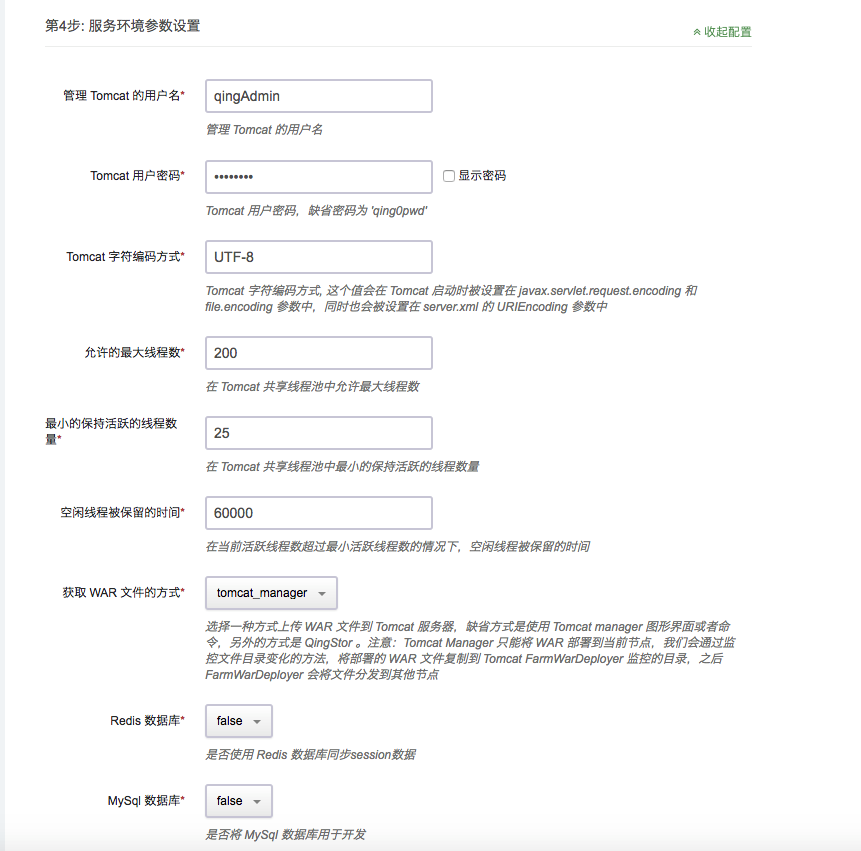
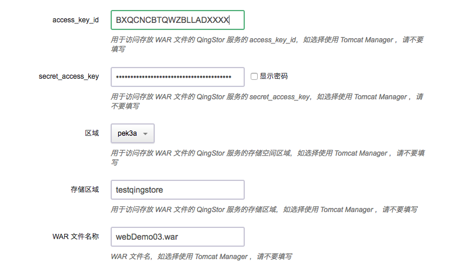
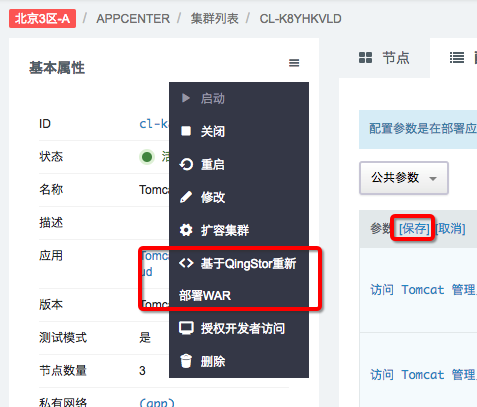
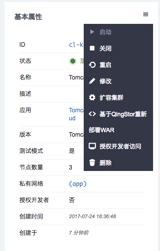
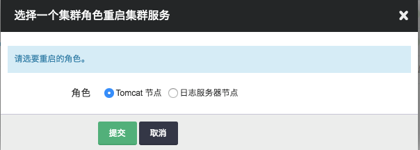
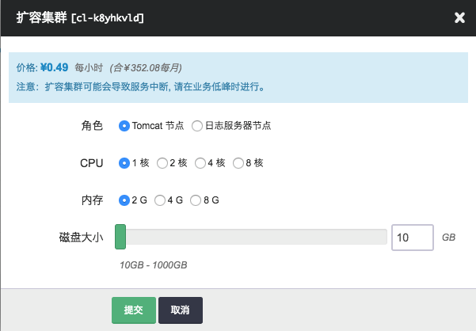

# Tomcat Cluster on QingCloud AppCenter 用户手册

## 描述

[Apache Tomcat](http://tomcat.apache.org/) 是一个开源的轻量级应用服务器。

`Tomcat Cluster on QingCloud AppCenter` 将 Tomcat 通过云应用的形式在 QingCloud AppCenter 部署，具有如下特性：

- 基于 Tomcat 7.0.78 稳定版本，具体特性可参见 <http://tomcat.apache.org/tomcat-7.0-doc/index.html>
- 使用 Tomcat DeltaManger 实现多对多（all-to-all）会话复制(session replication)，支持随 Tomcat 发布的 **SimpleTcpCluster**，通过内存（in-memory）实现 session replicaton，同时也支持通过***单节点*** Redis 数据库存储 session 数据
- 可选择配置连接 MySql 数据库来存储业务数据 
- 集成 Tomcat Manager，通过配置 Tomcat 管理员用户名／密码，访问 Tomcat Manager Console 或者 URL 方式完成 WAR 文件部署、启停等动作 <http://tomcat.apache.org/tomcat-7.0-doc/manager-howto.html>，WAR 文件通过 **FarmWarDeployer** 分发到各个节点
- 对于公有云用户，可使用 QingStor 存储 WAR 文件，在 Tomcat 集群创建时配置相应 QingStor 访问参数，集群启动时自动下载并完成 WAR 文件部署，也可通过集群管理页面菜单多次部署不同 WAR 文件
- 支持横向与纵向扩容
- 系统自动运维，降低企业使用成本

## 创建步骤

### 第1步: 基本设置

根据自己的需求填写 `名称` 和 `描述`，不影响集群的功能，版本一般建议选择最新版本。

### 第2步: Tomcat 节点设置

Tomcat 节点依赖于青云 QingCloud 提供的负载均衡器服务，我们需要提前创建资源并进行相应的设置：

#### 申请公网 IP

如果集群需要在公网上提供服务，我们需要创建一个公网 IP。

如果该公网 IP 还需要绑定域名，还需要进行备案。

#### 创建负载均衡器

然后我们需要创建一个公网负载均衡器：

创建成功后在该负载均衡器下创建一个监听器：

##### 注意

- 监听器需开启会话保持

其它选项认根据实际业务需求填写。

#### 配置 Tomcat 节点

准备工作完成以后即可开始设置 Tomcat 节点：

分别选择自己之前创建的负载均衡器与监听器，转发策略保持为空即可。

CPU，内存，节点数量，实例类型和磁盘大小根据自己实际需求进行选择即可，生产环境建议使用如下配置：

- CPU: 2核
- 内存: 4G
- 节点数量: 3
- 实例类型: 超高性能型
- 磁盘大小: 100G

### 第3步: 服务环境参数设置

以上为 Tomcat 集群的环境参数必填项，也可选择使用青云提供的缺省值，缺省密码为 `qing0pwd`，用于访问 Tomcat Manager 服务。填写完成后如果直接点击 `提交`，就会直接进入第四步部署应用。这种情况下会使用 Tomcat 自带的 **SimpleTcpCluster** 模块，通过内存同步 Session 数据，并且没有部署任何第三方 WAR 文件。

        配置说明
		1. Tomcat 字符编码方式的配置会被分别设置在 JAVA_OPTS （-Djavax.servlet.request.encoding=UTF-8 -Dfile.encoding=UTF-8） 以及 server.xml 中，前者会作为环境变量被 Tomcat 的启动脚本使用。
		2. 本集群使用 Tomcat 共享线程池。
		3. 如果 WAR 文件的获取方式选择了 tomcat_manager，可以通过通过负载均衡器的地址访问 Tomcat Manager <http://load-balancer-address:8080> ，这时访问的是某一节点的 Tomcat Manager ，输入用户名和密码，上传 WAR 文件完成部署，注意，Tomcat Manger 并不支持集群分发部署，也就是说这个 WAR 现在只是在当前节点部署成功，之后青云提供的监控脚本会发现这个新部署的文件夹，并复制到 Tomcat FarmWarDeployer 监控的目录中，这样 FarmWarDeployer 会通知其他节点，实现分发部署。
         另外，您也可以选择青云合作伙伴提供的 Jenkins 应用服务 <https://appcenter.qingcloud.com/apps/app-jbffg31u> ，运行之后访问 Jenkins 控制台，下载并配置 Jenkins 的 “Deploy to container” 插件，实现分发部署。
		4. 我们会根据您设置的节点物理内存大小自动配置 Java 虚拟机的最小和最大堆栈大小，分别为四分之一和二分之一内存大小，也就是说如果选择单节点 4G 内存，则 xms 为 1G，xmx为 2G。

#### 可选：配置 JAVA_OPTS

如果您对 Java 虚拟机有自身的配置要求，比如上面提到的最小和最大堆栈大小，可以直接配置 JAVA_OPTS 参数，例如：
-Djavax.servlet.request.encoding=UTF-8 -Dfile.encoding=UTF-8 -Xms512m -Xmx1024m -XX:NewRatio=1 -XX:ReservedCodeCacheSize=128m

##### 注意

您需自己预先校验参数的有效性，如果一旦某些参数无效，可能会导致集群启动失败，另外，JAVA_OPTS 的配置会覆盖环境变量中某些配置，包括字符编码 （javax.servlet.request.encoding 和 file.encoding）以及预分配的 xms 和 xms。

#### 可选：Redis 数据库实现 Session 复制

将 `Redis 数据库` 选项设置为 `true`，并填写 Redis 数据库的配置信息

Redis 数据库的创建可以在控制台中创建

`Appcenter -> 数据库与缓存 -> 缓存`

##### 注意

- 当前 Tomcat 集群应用只支持 Redis 单节点

#### 可选：MySql 数据库用于存储业务数据

将 `MySql 数据库` 选项设置为 `true`，并填写 MySql 数据库的配置信息

同时需要配置 jdbc 连接池

MySql 数据库的创建可以在控制台中创建

`Appcenter -> 数据库与缓存 -> 缓存`

#### 可选：使用 QingStor 存放 WAR 文件

如果 WAR 文件的获取方式选择了 qingstor，请填写了 QingStor 配置信息，这时会认定为选择对象存储服务为 Tomcat 集群上传所需 WAR 文件

`access_key_id` 和 `secret_access_key` 是青云提供给用户的授权密钥，可以在 [`API密钥`](https://console.qingcloud.com/access_keys/) 中创建， Tomcat 应用将会使用这个密钥与 QingStor 对象存储服务进行交互，如果设置不正确可能导致文件无法正常下载。

目前可选的区域有 `pek3a` 和 `sh1a`，选择不同区域也可使用，但是需要收取额外的公网流量费用。

存储区域需要提前创建好，只需要填写 Bucket 名称即可。这两项如果设置不正确，同样会导致文件无法正常下载。

WAR 文件名为存储在 QingStor 上的文件名称，带文件类型后缀。

集群启动初始化的时候，后台会自动访问 QingStor 服务，下载对应的 WAR 文件并部署在 Tomcat 各个节点，之后用户如果更新了 WAR 文件，或者有新的 WAR 文件需要部署，可以通过集群参数配置页面修改相应参数，保存后选择集群控制菜单中的 `重新部署 WAR`。

##### 注意

部署在集群中的 web 应用，应在 `web.xml` 中添加以下标签以支持集群。
`<distributable/>`

同时可加入 `<absolute-ordering />` 以加速 WAR 文件部署。例如：

### 第4步: 用户协议

阅读并同意青云 APP Center 用户协议之后即可开始部署应用。

## 集群使用

### 集群信息

在集群创建完毕后，可以在控制台 `Appcenter -> 云应用` 标签下看到目前已经创建的集群信息：

点击集群 ID 可以查看该集群的详细信息：

集群的详细信息下方是对应节点的监控信息：

### 添加节点

点击 `新增节点` 可以增加 Tomcat 节点。

同样的，点击 `删除` 可以删除节点。

等待负载均衡器更新完毕后，节点变更即可生效。

### 控制集群

点击 `基本属性` 右侧的菜单按钮，可以查看能对当前集群进行的操作：

点击 `重启` ，可以在集群故障时重启集群：

点击 `扩容集群` ， 可以在集群性能不足时提高集群的配置：

---

至此，`Tomcat Cluster on QingCloud AppCenter` 的介绍到这里就告一个段落了。

在使用过程中如果遇到问题可以通过 `提交工单` 来获取帮助，我们将竭诚为您服务。

Have a nice day on QingCloud AppCenter !
