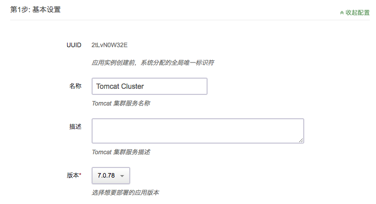
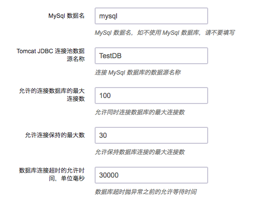
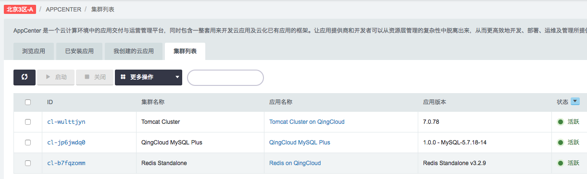
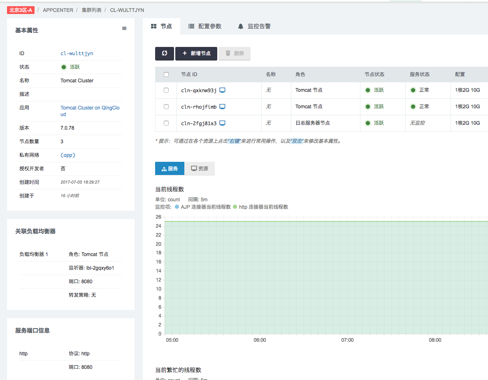

# Tomcat Cluster on QingCloud AppCenter 用户手册

## 描述

[Apache Tomcat](http://tomcat.apache.org/) 是一个开源的，使用极为广泛的轻量级应用服务器之一。

`Tomcat Cluster on QingCloud AppCenter` 将 Tomcat 通过云应用的形式在 QingCloud AppCenter 部署，具有如下特性：

- 基于 **Tomcat 7.0.78** 稳定版本，具体特性可参见 <http://tomcat.apache.org/tomcat-7.0-doc/index.html>
- 使用 Tomcat DeltaManger 实现多对多（all-to-all）会话复制(session replication)，支持随 Tomcat 发布的 **SimpleTcpCluster**，通过内存（in-memory）实现 session replicaton，同时也可选择通过Redis（***Standalone***）数据库存储 session 数据
- 可选择配置连接 MySql 数据库来存储业务数据 
- 集成 Tomcat Manager，通过配置 Tomcat 管理员用户名／密码，访问 Tomcat Manager Console 或者 URL 方式完成 WAR 文件部署、启停等动作 <http://tomcat.apache.org/tomcat-7.0-doc/manager-howto.html>，WAR 文件通过 **FarmWarDeployer** 分发到各个节点
- 对于公有云用户，可使用 QingStor 存储 WAR 文件，在 Tomcat 集群创建时配置相应 QingStor 访问参数，集群启动时自动下载并完成 WAR 文件部署，也可通过集群管理页面菜单多次部署不同 WAR 文件
- 提供日志节点统一保存各 Tomcat 节点日志
- 支持横向与纵向扩容与缩容
- 系统自动运维，降低企业使用成本
- 运行环境使用 **OpenJDK 1.8.0_131，log4j 1.2.17**

## 创建步骤

### 第1步: 基本设置

根据自己的需求填写 `名称` 和 `描述`，不影响集群的功能，版本一般建议选择最新版本。

### 第2步: Tomcat 节点设置

Tomcat 节点依赖于青云 QingCloud 提供的负载均衡器服务，我们需要提前创建资源并进行相应的设置：

#### 申请公网 IP

如果集群需要在公网上提供服务，我们需要创建一个公网 IP。

如果该公网 IP 还需要绑定域名，还需要进行备案。

#### 创建负载均衡器

然后我们需要创建一个公网负载均衡器：

创建成功后在该负载均衡器下创建一个监听器：

##### 注意

- 监听器需开启会话保持

其它选项认根据实际业务需求填写。

#### 配置 Tomcat 节点

准备工作完成以后即可开始设置 Tomcat 节点：

分别选择自己之前创建的负载均衡器与监听器，转发策略保持为空即可。

CPU，内存，节点数量，实例类型和磁盘大小根据自己实际需求进行选择即可，例如：

- CPU: 2核
- 内存: 4G
- 节点数量: 3
- 实例类型: 超高性能型
- 磁盘大小: 100G

### 第3步: 日志收集节点设置

创建 Tomcat 集群的时候会默认创建一台主机用于收集各个 Tomcat 节点的日志，日志通过 rsyslog 方式发送，Tomcat 基于 log4j-1.2.17 产生日志，直接发送给日志服务器，本地不保留以减少硬盘占用，除 Tomcat 运行环境默认开启的日志，此应用另外开启了 Access 日志以及 Garbage Collection 日志。

日志文件按照主机名统一保存在 /opt/TomcatLogData 目录下，rsyslog 配置文件为 /etc/rsyslog.conf，同时节点提供 ssh 访问权限，用户可根据自身需求调整 rsyslog 的配置，默认用户名密码为 root/zhu1241jie，集群创建后请及时更改密码。

### 第4步: 网络配置

选择需要加入的私有网络

### 第5步: 依赖服务设置

Tomcat 集群可以选择依赖的 Redis（Standalone） 和 MySql 服务实现 Session 复制及业务数据存储，通过依赖服务可以实现参数自动获取，服务变化感知等功能。

#### 可选：Redis 数据库实现 Session 复制

点击放大镜按钮，弹出窗口会将**当前私有网络**下运行的集群列出，选择预先部署的 Redis 集群，相关 Redis 参数会自动获取，比如 IP 地址，端口等，用户只需在第六步环境参数中输入数据库库号即可。

Redis 数据库应用可以在 AppCenter 控制台中创建

`AppCenter -> 浏览应用 -> Redis On QingCloud -> 部署到 QingCloud`，之后选择区域及填写所需参数提交即可。

##### 注意

- 此版本 Tomcat 集群应用只支持 Redis Standalone.

#### 可选：MySql 数据库用于存储业务数据

点击放大镜按钮，弹出窗口会将**当前私有网络**下运行的集群列出，选择预先部署的 MySql 集群，相关 MySql 参数会自动获取，比如 IP 地址，端口等，用户只需在第六步环境参数中输入数据库名称，以及 jdbc 连接池配置即可。

##### 注意

- MySql 应用提供了两个高可用的读写访问地址，分别对应于数据的读写操作，当前 Tomcat 集群默认使用写 IP 地址，用户也可在环境参数中下拉选择读 IP。

MySql 数据库应用可以在 AppCenter 控制台中创建

`AppCenter -> 浏览应用 -> QingCloud MySql Plus -> 部署到 QingCloud`，之后选择区域及填写所需参数提交即可。

### 第6步: 服务环境参数设置

#### 配置 Tomcat 环境参数

以上为 Tomcat 相关参数，填写完成后如果直接点击 `提交`，就会直接进入部署应用。如依赖服务中没有选择 Redis，会使用 Tomcat 自带的 **SimpleTcpCluster** 模块，通过内存同步 Session 数据，并且没有部署任何第三方 WAR 文件。

##### 配置说明

1. Tomcat 用户名密码用于访问 Tomcat Manager 服务，缺省密码为 qing0pwd ，已存在的角色包括 standard，manager-gui，manager-script。
1. Tomcat 字符编码方式的配置会被分别设置在 JAVA_OPTS （-Djavax.servlet.request.encoding=UTF-8 -Dfile.encoding=UTF-8） 以及 server.xml 中，前者会作为环境变量被 Tomcat 的启动脚本使用。
1. Tomcat 基于 log4j 1.2.17，默认日志级别为 INFO，用户可下拉选择更改。
1. 本集群使用 Tomcat 共享线程池。
1. 如果 WAR 文件的获取方式选择了 tomcat_manager，可以通过通过负载均衡器的地址访问 Tomcat Manager <http://load-balancer-address> ，这时访问的是某一节点的 Tomcat Manager ，输入用户名和密码，上传 WAR 文件完成部署。注意，Tomcat Manager 并不支持集群分发部署，也就是说这个 WAR 现在只是在当前节点部署成功，之后青云提供的监控脚本会发现这个新部署的文件夹，并复制到 Tomcat FarmWarDeployer 监控的目录中，这样 FarmWarDeployer 会通知其他节点，实现分发部署。为避免陷入各节点循环复制部署，脚本需比较 WAR 目录下 META-INFO／MANIFEST.MF 文件中的 Manifest-Version，所以请确保使用的 WAR 文件中包含此文件及所需参数。  
    另外，Tomcat 已添加 manager-script 角色，所以用户也可以选择青云合作伙伴提供的 Jenkins 应用服务 <https://appcenter.qingcloud.com/apps/app-jbffg31u> 。运行之后访问 Jenkins 控制台，下载并配置 Jenkins 的 “Deploy to container” 插件，实现分发部署。  
1. 我们会根据您设置的节点物理内存大小自动配置 Java 虚拟机的最小和最大堆栈大小，分别为四分之一和二分之一内存大小，也就是说如果选择单节点 4G 内存，则 xms 为 1G，xmx为 2G。
1. Tomcat 使用 OpenJDK 1.8.0_131，默认打开 Garbage Collection，其配置于 Tomcat 启动脚本 catalina.sh 中，配置为 CATALINA_OPTS="-XX:+PrintGCDateStamps -Xloggc:/Users/calvin/Qing/apache-tomcat-7.0.78/logs/tomcat_gc.log -XX:+UseGCLogFileRotation -XX:NumberOfGCLogFiles=1 -XX:GCLogFileSize=100M" ，日志同样会被转发至日志服务器统一保存。
1. Tomcat 节点提供 ssh 访问权限，默认用户名密码为 root/zhu1241jie，集群创建后请及时更改密码，同时不应直接修改 Tomcat 目录下的配置文件，而应修改 /etc/confd/templates 下对应配置文件的模版文件，否则集群启动后，Tomcat 目录下修改会被刷新覆盖。

#### 可选：配置定制包日志及 JAVA_OPTS

Tomcat 节点日志覆盖范围默认使用原生 Tomcat 配置，唯一区别是使用 log4j 收集及转发至日志服务器，用户可添加自身需要的包路径，各个包之间以逗号分隔，例如： `log4j.logger.org.apache.catalina.core.ContainerBase.[Catalina].[localhost],log4j.logger.org.apache.catalina.session`

如果您对 Java 虚拟机有自身的配置要求，比如上面提到的最小和最大堆栈大小，可以直接配置 JAVA_OPTS 参数，例如：
`-Djavax.servlet.request.encoding=UTF-8 -Dfile.encoding=UTF-8 -Xms512m -Xmx1024m -XX:NewRatio=1 -XX:ReservedCodeCacheSize=128m`

##### 注意

用户务必预先校验参数的有效性，如果一旦某些参数无效，可能会导致集群启动失败，另外，JAVA_OPTS 的配置会覆盖环境变量中某些配置，包括字符编码 （javax.servlet.request.encoding 和 file.encoding）以及预分配的 xms 和 xms。

#### 可选：使用 QingStor 存放 WAR 文件

如果 WAR 文件的获取方式选择了 qingstor，请填写了 QingStor 配置信息，这时会认定为选择对象存储服务为 Tomcat 集群上传所需 WAR 文件

`access_key_id` 和 `secret_access_key` 是青云提供给用户的授权密钥，可以在 [`API密钥`](https://console.qingcloud.com/access_keys/) 中创建， Tomcat 应用将会使用这个密钥与 QingStor 对象存储服务进行交互，如果设置不正确可能导致文件无法正常下载。

目前可选的区域有 `pek3a` 和 `sh1a`，选择不同区域也可使用，但是需要收取额外的公网流量费用。

存储区域需要提前创建好，只需要填写 Bucket 名称即可。这两项如果设置不正确，同样会导致文件无法正常下载。

WAR 文件名为存储在 QingStor 上的文件名称，带文件类型后缀。

集群启动初始化的时候，后台会自动访问 QingStor 服务，下载对应的 WAR 文件并部署在 Tomcat 各个节点，之后用户如果更新了 WAR 文件，或者有新的 WAR 文件需要部署，可以通过集群参数配置页面修改相应参数，保存后选择集群控制菜单中的 `重新部署 WAR`。

##### 注意

部署在集群中的 web 应用，应在 `web.xml` 中添加以下标签以支持集群。
`<distributable/>`

同时可加入 `<absolute-ordering />` 以加速 WAR 文件部署。例如：

### 第7步: 用户协议

阅读并同意青云 APP Center 用户协议之后即可开始部署应用。

## 集群使用

### 集群信息

在集群创建完毕后，可以在控制台 `AppCenter -> 集群列表` 标签下看到目前已经创建的集群信息：

点击集群 ID 可以查看该集群的详细信息：

集群的详细信息下方是对应节点的监控信息：

### 添加节点

点击 `新增节点` 可以增加 Tomcat 节点。

同样的，点击 `删除` 可以删除节点。

等待负载均衡器更新完毕后，节点变更即可生效。

### 控制集群

点击 `基本属性` 右侧的菜单按钮，可以查看能对当前集群进行的操作：

点击 `重启` ，可以在集群故障时重启集群：

点击 `扩容集群` ， 可以在集群性能不足时提高集群的配置：

## 已知问题

Tomcat 7 及以上版本依赖于 SecureRandom 类为 session id 提供随机数值，使用不同的 JRE 会在服务器启动及运行时造成不同程度的延时，用户可在 JAVA_OPTS 参数中加入如下配置来提高性能：
`-Djava.security.egd=file:/dev/./urandom`  
但这同时会带来安全性降低的风险，请根据自身情况酌情选择，具体可参考 <https://wiki.apache.org/tomcat/HowTo/FasterStartUp>

---

至此，`Tomcat Cluster on QingCloud AppCenter` 的介绍到这里就告一个段落了。

在使用过程中如果遇到问题可以通过 `提交工单` 来获取帮助，我们将竭诚为您服务。

Have a nice day on QingCloud AppCenter !
